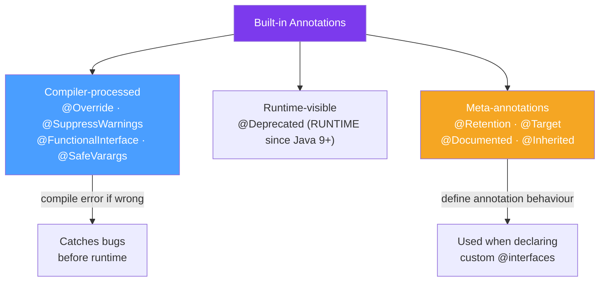

# 📎 Built-in Java Annotations

> [!abstract] TL;DR
> Java provides several standard annotations in `java.lang` and `java.lang.annotation`. The most important: **`@Override`** (tell compiler you're overriding — catches typos), **`@Deprecated`** (marks obsolete API), **`@SuppressWarnings`** (silence specific compiler warnings), **`@FunctionalInterface`** (ensure interface has exactly one abstract method), and **`@SafeVarargs`** (suppress heap pollution warnings on trusted varargs).

## Intuition — Annotations as Compiler/Framework Hints

Annotations are like **sticky notes attached to code** — they don't change what the code does, but they communicate intent to the compiler, tools, and frameworks. `@Override` tells the compiler "this method must override something — if it doesn't, something is wrong." `@Deprecated` tells IDEs to visually strike through the method name wherever it's used.

---

## How It Works



## Key Concepts / Details

### `@Override` — The Most Important Annotation

```java
public class Animal {
    public String sound() { return "..."; }
}

public class Dog extends Animal {

    @Override
    public String sound() {  // OK — overrides Animal.sound()
        return "Woof";
    }

    @Override
    public String toString() {  // OK — overrides Object.toString()
        return "Dog";
    }

    // Without @Override, this silently creates a NEW method (typo!)
    // With @Override, the compiler catches it:
    @Override
    public String Sounds() {  // COMPILE ERROR — no matching method in superclass
        return "Woof";
    }
}

// Always use @Override — it costs nothing and prevents subtle bugs
// Interfaces too:
public class MyComparator implements Comparator<String> {
    @Override
    public int compare(String a, String b) {  // verified against interface
        return a.compareToIgnoreCase(b);
    }
}
```

### `@Deprecated` — Marking Obsolete API

```java
public class LegacyService {

    // Simple deprecation
    @Deprecated
    public void oldMethod() {
        doWork();
    }

    // Java 9+ — with since and forRemoval
    @Deprecated(since = "2.0", forRemoval = true)
    public void veryOldMethod() {
        // This will be removed in a future version
        doLegacyWork();
    }

    // Recommended replacement
    public void newMethod() {
        doWork();
    }
}

// Usage — IDE shows strikethrough: ~~oldMethod()~~
service.oldMethod();      // Compiler warning: "deprecated"
service.veryOldMethod();  // Stronger warning: "marked for removal"
service.newMethod();      // No warning
```

### `@SuppressWarnings` — Silencing Specific Warnings

```java
public class SuppressDemo {

    // Suppress specific warnings — be as specific as possible
    @SuppressWarnings("unchecked")  // for unchecked casts
    public <T> List<T> getFromCache(String key) {
        return (List<T>) cache.get(key);  // unchecked — suppressed
    }

    @SuppressWarnings("deprecation")  // using deprecated API intentionally
    public void callLegacy() {
        legacyService.oldMethod();  // deprecation warning — suppressed
    }

    @SuppressWarnings({"unchecked", "rawtypes"})  // multiple warnings
    public void multipleSuppress() {
        List rawList = new ArrayList();  // rawtypes
        List<String> typed = (List<String>) rawList;  // unchecked
    }

    // Common warning keys:
    // "unchecked"  — unchecked generic casts
    // "rawtypes"   — using raw generic types
    // "deprecation" — using deprecated API
    // "unused"     — unused variables/methods
    // "serial"     — missing serialVersionUID
    // "all"        — suppress everything (avoid this)
}
```

### `@FunctionalInterface` — Lambda-Safe Interfaces

```java
// Marks an interface as having exactly one abstract method (SAM — Single Abstract Method)
@FunctionalInterface
public interface Transformer<T, R> {
    R transform(T input);  // the one abstract method

    // Default and static methods are allowed
    default Transformer<T, R> andThen(Function<R, R> after) {
        return input -> after.apply(this.transform(input));
    }

    static <T> Transformer<T, T> identity() {
        return x -> x;
    }
}

// @FunctionalInterface makes the compiler verify single abstract method
@FunctionalInterface
public interface BrokenFunctional {
    void method1();
    void method2();  // COMPILE ERROR — two abstract methods
}

// Usage
Transformer<String, Integer> lengthOf = String::length;  // method reference
Transformer<String, Integer> doubled = s -> s.length() * 2;  // lambda
```

### `@SafeVarargs` — Trusted Varargs

```java
// Applied to methods/constructors with varargs generic parameters
// Tells compiler: "I promise this doesn't cause heap pollution"
@SafeVarargs
public static <T> List<T> combine(List<T>... lists) {
    List<T> result = new ArrayList<>();
    for (List<T> list : lists) {
        result.addAll(list);  // safe — only reading from lists
    }
    return result;
}

// Without @SafeVarargs: "Unchecked or unsafe operations" warning at every call site
// With @SafeVarargs: warning suppressed at declaration site only

// Can only be applied to:
// - final/static/private methods (can't be overridden with unsafe version)
// - Constructors
```

### Meta-Annotations — Configuring Custom Annotations

```java
import java.lang.annotation.*;

// @Retention — where is the annotation available?
@Retention(RetentionPolicy.SOURCE)   // only in source, discarded by compiler
@Retention(RetentionPolicy.CLASS)    // kept in .class file, not at runtime (default)
@Retention(RetentionPolicy.RUNTIME)  // available at runtime via reflection

// @Target — which code elements can be annotated?
@Target(ElementType.METHOD)
@Target(ElementType.FIELD)
@Target(ElementType.TYPE)       // class, interface, enum
@Target(ElementType.PARAMETER)
@Target({ElementType.METHOD, ElementType.FIELD})  // multiple targets

// @Documented — include in Javadoc
@Documented

// @Inherited — subclasses inherit the annotation on the superclass
// NOTE: only applies to class-level annotations, NOT method annotations
@Inherited
```

### Built-in Annotations Summary

| Annotation | Retention | Purpose |
|-----------|-----------|---------|
| `@Override` | SOURCE | Verify override/implementation at compile time |
| `@Deprecated` | RUNTIME | Mark API as obsolete, IDE shows strikethrough |
| `@SuppressWarnings` | SOURCE | Silence specific compiler warnings |
| `@FunctionalInterface` | RUNTIME | Verify SAM constraint for lambda compatibility |
| `@SafeVarargs` | RUNTIME | Suppress heap pollution warning on varargs |
| `@Retention` | RUNTIME | Meta — controls annotation retention |
| `@Target` | RUNTIME | Meta — restricts where annotation can appear |
| `@Documented` | RUNTIME | Meta — include in Javadoc |
| `@Inherited` | RUNTIME | Meta — subclasses inherit class-level annotation |
| `@Repeatable` | RUNTIME | Meta — allow annotation to appear multiple times |

## Real-World Notes

- **Always use `@Override`** — it's zero cost and prevents the entire class of "I accidentally overloaded instead of overriding" bugs. This is the most universally recommended annotation.
- **`@Deprecated` without Javadoc `@deprecated` tag is incomplete** — always pair `@Deprecated` with a Javadoc comment explaining the reason and alternative: `/** @deprecated Use {@link #newMethod()} instead */`.
- **`@SuppressWarnings("all")` is a code smell** — it suppresses everything including warnings you should care about. Always specify the exact warning key.
- **`@FunctionalInterface` enables lambdas** — any interface with `@FunctionalInterface` can be used as a lambda or method reference target. This is how Comparator, Runnable, Callable work.

## Common Pitfalls

- **Using `@Override` on methods not in the supertype** — valid only for overriding, not for completely new methods. If no matching signature exists in parent, compile error (which is the point).
- **Forgetting `@FunctionalInterface` prevents accidents** — without it, someone can add a second method later and break all lambda usages. Add `@FunctionalInterface` to any interface intended for lambdas.
- **`@Inherited` doesn't work for interface annotations or method annotations** — only class-level annotations on classes propagate to subclasses. Very commonly misunderstood.
- **Over-suppressing warnings** — each suppressed warning should have a comment explaining why it's safe. Blind suppression hides real bugs.

## Related Concepts
- [[Custom_Annotations]] — creating your own annotations with meta-annotations
- [[Runtime_Annotations]] — reading `@Deprecated`, `@Override` etc. via reflection
- [[Spring_Annotations]] — Spring's extensive annotation catalog built on the same system

## Review Questions
1. Why does `@Override` catch bugs that would otherwise compile silently?
2. What is the difference between `@Deprecated(forRemoval=true)` and plain `@Deprecated`?
3. Why can `@SafeVarargs` only be applied to `final`, `static`, or `private` methods?

#java #annotations #override #deprecated #suppress-warnings #functional-interface
