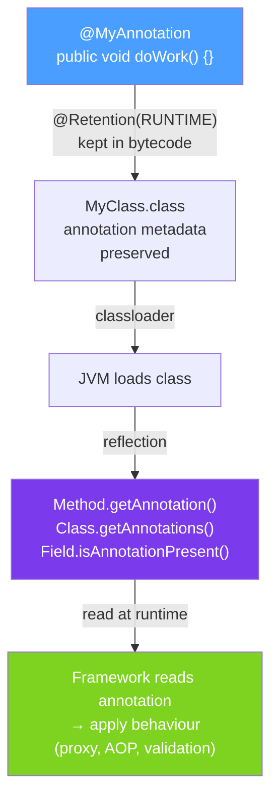

# 🔍 Runtime Annotations

> [!abstract] TL;DR
> Annotations with `@Retention(RetentionPolicy.RUNTIME)` can be read via the **Reflection API** at runtime. You call `element.getAnnotation(MyAnnotation.class)` or `element.isAnnotationPresent(MyAnnotation.class)` on `Class`, `Method`, `Field`, or `Constructor` objects. This is how Spring reads `@Transactional`, `@Autowired`, and `@RequestMapping` — it scans the classpath at startup and processes these annotations.

## Intuition — Reading the Sticky Notes at Runtime

Compile-time annotation processing (APT) reads annotations like a proofreader before a document is published. Runtime annotation reading is like a **customer reading instructions on a product at the moment they use it**. The annotation stays on the code, and every time a framework needs to know "does this method have @Transactional?", it checks the annotation — at runtime.

---

## How It Works



## Key Concepts / Details

### Reading Annotations from Class, Method, Field

```java
import java.lang.reflect.*;
import java.util.Arrays;

// Your annotation
@Retention(RetentionPolicy.RUNTIME)
@Target({ElementType.TYPE, ElementType.METHOD, ElementType.FIELD})
public @interface Audit {
    String action();
    String level() default "INFO";
}

// Annotated class
@Audit(action = "ORDER_MANAGEMENT")
public class OrderService {

    @Audit(action = "CREATE_ORDER", level = "WARN")
    public Order createOrder(OrderRequest req) {
        return null;
    }

    @Audit(action = "DELETE_ORDER", level = "ERROR")
    public void deleteOrder(Long id) {}

    public Order findOrder(Long id) {  // no annotation
        return null;
    }
}

// Reading annotations at runtime
public class AnnotationReader {

    public static void main(String[] args) throws Exception {
        Class<?> clazz = OrderService.class;

        // Class-level annotation
        Audit classAudit = clazz.getAnnotation(Audit.class);
        System.out.println("Class: " + classAudit.action());  // ORDER_MANAGEMENT

        // Method-level annotations
        for (Method method : clazz.getDeclaredMethods()) {
            Audit methodAudit = method.getAnnotation(Audit.class);
            if (methodAudit != null) {
                System.out.printf("Method %s: action=%s level=%s%n",
                    method.getName(), methodAudit.action(), methodAudit.level());
            }
        }
        // Method createOrder: action=CREATE_ORDER level=WARN
        // Method deleteOrder: action=DELETE_ORDER level=ERROR

        // Check annotation presence
        Method findMethod = clazz.getMethod("findOrder", Long.class);
        boolean hasAudit = findMethod.isAnnotationPresent(Audit.class);
        System.out.println("findOrder has @Audit: " + hasAudit);  // false

        // Get ALL annotations on an element
        Annotation[] allAnnotations = clazz.getDeclaredAnnotations();
        Arrays.stream(allAnnotations).forEach(a ->
            System.out.println(a.annotationType().getSimpleName())
        );
    }
}
```

### AOP-Style: Reading Annotations in Spring

```java
// This is exactly how Spring processes custom annotations
@Aspect
@Component
public class AuditAspect {

    // Intercept methods annotated with @Audit
    @Around("@annotation(audit)")  // "audit" binds to the annotation instance
    public Object logAudit(ProceedingJoinPoint joinPoint, Audit audit) throws Throwable {
        String action = audit.action();
        String level = audit.level();

        // Pre-execution
        log.info("[AUDIT] Before {}: action={}, level={}", joinPoint.getSignature(), action, level);

        try {
            Object result = joinPoint.proceed();
            log.info("[AUDIT] After {}: SUCCESS", joinPoint.getSignature());
            return result;
        } catch (Exception e) {
            log.error("[AUDIT] After {}: FAILED — {}", joinPoint.getSignature(), e.getMessage());
            throw e;
        }
    }

    // Class-level annotation — apply to all methods in annotated class
    @Around("@within(audit)")  // "@within" for class-level annotations
    public Object logClassAudit(ProceedingJoinPoint joinPoint, Audit audit) throws Throwable {
        log.info("[CLASS AUDIT] Executing {} in audited class", joinPoint.getSignature());
        return joinPoint.proceed();
    }
}
```

### Classpath Scanning — Finding Annotated Classes

```java
// Manual classpath scanning (simplified — Spring does this on startup)
public class AnnotationScanner {

    public static Set<Class<?>> findAnnotatedClasses(
            String packageName, Class<? extends Annotation> annotationType) {

        Set<Class<?>> result = new HashSet<>();
        String path = packageName.replace('.', '/');

        // In practice, use Spring's ClassPathScanningCandidateComponentProvider
        // or Reflections library (org.reflections:reflections)
        try {
            URL packageURL = Thread.currentThread()
                .getContextClassLoader().getResource(path);

            // Walk classpath entries — simplified; real impl handles JARs, modules
            File directory = new File(packageURL.toURI());
            for (File file : directory.listFiles()) {
                if (file.getName().endsWith(".class")) {
                    String className = packageName + "." +
                        file.getName().replace(".class", "");
                    Class<?> clazz = Class.forName(className);
                    if (clazz.isAnnotationPresent(annotationType)) {
                        result.add(clazz);
                    }
                }
            }
        } catch (Exception e) {
            throw new RuntimeException(e);
        }
        return result;
    }
}

// Using the Reflections library (much simpler)
// <dependency>org.reflections:reflections:0.10.2</dependency>
Reflections reflections = new Reflections("com.myapp");
Set<Class<?>> services = reflections.getTypesAnnotatedWith(Service.class);
Set<Method> auditedMethods = reflections.getMethodsAnnotatedWith(Audit.class);
```

### Reading Annotations on Parameters and Return Types

```java
public class ParameterAnnotationReader {

    @Retention(RetentionPolicy.RUNTIME)
    @Target(ElementType.PARAMETER)
    public @interface Validated {}

    @Retention(RetentionPolicy.RUNTIME)
    @Target(ElementType.PARAMETER)
    public @interface NotNull {}

    // Method with annotated parameters
    public Order createOrder(@Validated @NotNull OrderRequest request, @NotNull Long userId) {
        return null;
    }

    public static void main(String[] args) throws Exception {
        Method method = ParameterAnnotationReader.class.getMethod("createOrder",
            OrderRequest.class, Long.class);

        // Parameter annotations are a 2D array: [paramIndex][annotationIndex]
        Annotation[][] paramAnnotations = method.getParameterAnnotations();
        Parameter[] params = method.getParameters();

        for (int i = 0; i < params.length; i++) {
            System.out.println("Parameter: " + params[i].getName());
            for (Annotation annotation : paramAnnotations[i]) {
                System.out.println("  @" + annotation.annotationType().getSimpleName());
            }
        }
        // Parameter: request → @Validated, @NotNull
        // Parameter: userId  → @NotNull
    }
}
```

### Reading Annotations on Fields

```java
// Simple ORM mapper — read @Column annotations to map fields to DB columns
@Retention(RetentionPolicy.RUNTIME)
@Target(ElementType.FIELD)
public @interface Column {
    String name() default "";
    boolean nullable() default true;
}

public class Order {
    @Column(name = "order_id", nullable = false)
    private Long id;

    @Column(name = "customer_email")
    private String customerEmail;

    private String internalNote;  // no @Column — not mapped
}

// Reading field annotations
public Map<String, String> getColumnMapping(Class<?> entityClass) {
    Map<String, String> mapping = new LinkedHashMap<>();
    for (Field field : entityClass.getDeclaredFields()) {
        Column column = field.getAnnotation(Column.class);
        if (column != null) {
            String columnName = column.name().isEmpty()
                ? field.getName()  // default: field name
                : column.name();
            mapping.put(field.getName(), columnName);
        }
    }
    return mapping;
}
// {id → order_id, customerEmail → customer_email}
```

### Performance Considerations

```java
// Reflection is slower than direct calls — cache annotation lookups
public class AnnotationCache {
    private static final Map<Method, Audit> cache = new ConcurrentHashMap<>();

    public static Optional<Audit> getAudit(Method method) {
        return Optional.ofNullable(
            cache.computeIfAbsent(method, m -> m.getAnnotation(Audit.class))
        );
        // Returns null if no @Audit — stored in cache to avoid repeated reflection
    }
}

// Spring does this: scans once at startup, caches in BeanDefinition metadata
// Never scan annotations in hot paths (per-request code)
```

## Real-World Notes

- **Spring scans annotations once at startup** — `ClassPathScanningCandidateComponentProvider` finds all `@Component`, `@Service`, `@Repository` classes and caches them. Subsequent bean creation uses cached metadata.
- **Annotation processors (APT) vs reflection** — use APT (Lombok/MapStruct) when you need zero runtime overhead. Use reflection (Spring) when you need runtime dynamism (e.g., different beans per environment).
- **JVM methods cache reflective lookups** — Java's reflection has improved significantly since Java 9 (using MethodHandles internally). Still slower than direct calls, but caching eliminates repeated overhead.
- **Use `getDeclaredAnnotations()` not `getAnnotations()`** — `getAnnotations()` includes inherited annotations (from superclass via `@Inherited`). `getDeclaredAnnotations()` only returns directly present annotations.

## Common Pitfalls

- **Forgetting `@Retention(RUNTIME)`** — with `CLASS` retention (the default), `getAnnotation()` returns `null` at runtime. Always add `@Retention(RetentionPolicy.RUNTIME)` for annotations you read reflectively.
- **Scanning in hot paths** — reflection scanning per request is too slow. Always cache results at startup or in a `ConcurrentHashMap`.
- **Missing `setAccessible(true)` for private fields** — `field.get(obj)` on a private field throws `IllegalAccessException`. Call `field.setAccessible(true)` first (or use a `MethodHandle`). This may require opening the module in Java 9+.
- **Assuming class hierarchy works** — method annotations are NOT inherited through `@Inherited`. Interface default methods' annotations are not visible on implementing class methods. Always check the concrete class first.

## Related Concepts
- [[Custom_Annotations]] — declaring the annotations you read at runtime
- [[Annotation_Processing]] — compile-time alternative
- [[Reflection_API]] — the broader reflection API used for reading annotations

## Review Questions
1. What `@Retention` policy is required to read annotations at runtime, and what is the default?
2. How does Spring use runtime annotation reading to implement `@Transactional`?
3. Why should annotation lookup results be cached rather than re-read per request?

#java #annotations #reflection #runtime #classpath-scanning
