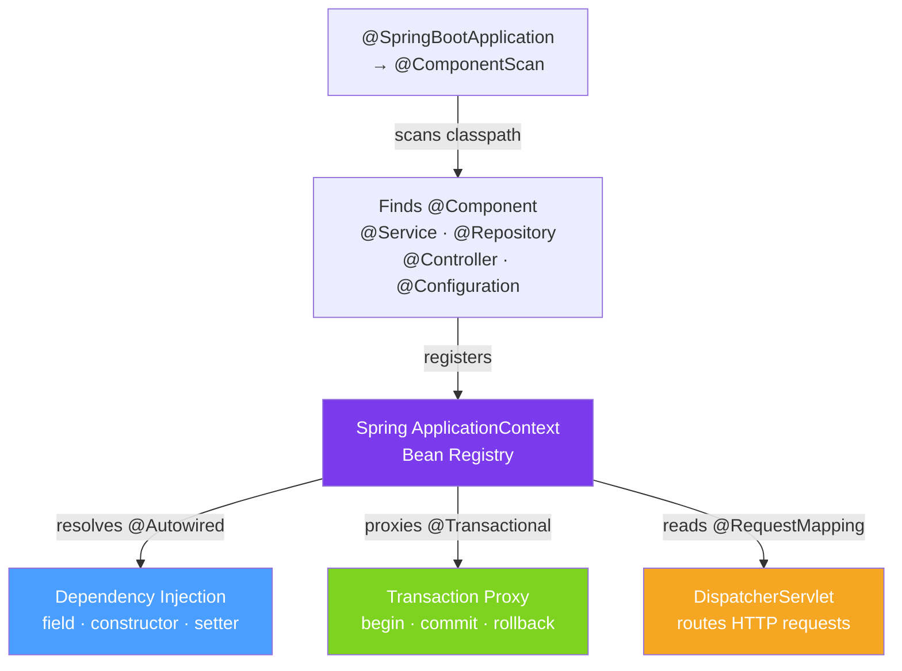

# 🌱 Spring Annotations Catalogue

> [!abstract] TL;DR
> Spring Boot is built almost entirely on annotations read at startup via classpath scanning and reflection. The core groups: **stereotype** (`@Component`, `@Service`, `@Repository`), **injection** (`@Autowired`, `@Value`, `@Qualifier`), **configuration** (`@Bean`, `@Configuration`, `@Profile`), **web MVC** (`@RestController`, `@GetMapping`, `@RequestBody`), **data/JPA** (`@Entity`, `@Transactional`), and **AOP/security** (`@PreAuthorize`, `@Aspect`).

## Intuition — Annotations as the Spring "Language"

Spring annotations are the vocabulary for telling the framework what you want. `@Service` means "register this as a Spring bean". `@Autowired` means "inject a matching bean here". `@Transactional` means "wrap this method in a database transaction". You're giving Spring configuration instructions in-line with your code, eliminating the old XML configuration files.

---

## How It Works



## Key Concepts / Details

### Stereotype Annotations — Component Registration

```java
// @Component: generic Spring bean
@Component
public class EmailValidator {
    public boolean isValid(String email) { /* ... */ return true; }
}

// @Service: business logic layer (same as @Component, semantic only)
@Service
public class OrderService {
    // ...
}

// @Repository: data access layer — adds exception translation (SQLEx → DataAccessEx)
@Repository
public class OrderRepository {
    // ...
}

// @Controller: Spring MVC controller (returns views)
@Controller
public class HomeController {
    @GetMapping("/")
    public String home(Model model) { return "home"; }
}

// @RestController: @Controller + @ResponseBody (returns JSON/XML)
@RestController
@RequestMapping("/api/orders")
public class OrderController {
    // ...
}

// @Configuration: @Component + defines @Bean methods
@Configuration
public class AppConfig {
    @Bean
    public ObjectMapper objectMapper() {
        return new ObjectMapper()
            .configure(DeserializationFeature.FAIL_ON_UNKNOWN_PROPERTIES, false);
    }
}
```

### Dependency Injection Annotations

```java
@Service
public class OrderService {

    // Constructor injection (PREFERRED — testable without Spring)
    private final OrderRepository repo;
    private final NotificationService notifier;

    @Autowired  // optional since Spring 4.3 if only one constructor
    public OrderService(OrderRepository repo, NotificationService notifier) {
        this.repo = repo;
        this.notifier = notifier;
    }

    // @Qualifier — resolve ambiguity when multiple beans of same type exist
    @Autowired
    @Qualifier("primaryCache")  // inject bean named "primaryCache"
    private CacheService cache;

    // @Value — inject property values
    @Value("${app.order.max-retries:3}")  // property with default 3
    private int maxRetries;

    @Value("${app.feature.notification-enabled}")
    private boolean notificationEnabled;

    // @Lazy — delay bean creation until first use
    @Autowired @Lazy
    private ExpensiveService expensiveService;
}
```

### Configuration and Conditional Annotations

```java
@Configuration
public class DataSourceConfig {

    // @Bean: define a bean — method name = bean name by default
    @Bean("primaryDataSource")
    @Primary  // default when multiple DataSource beans exist
    @Profile("prod")  // only active in "prod" profile
    public DataSource prodDataSource(
            @Value("${spring.datasource.url}") String url) {
        HikariDataSource ds = new HikariDataSource();
        ds.setJdbcUrl(url);
        return ds;
    }

    @Bean
    @Profile("!prod")  // active in all profiles except prod
    public DataSource h2DataSource() {
        return new EmbeddedDatabaseBuilder()
            .setType(EmbeddedDatabaseType.H2)
            .build();
    }

    // @ConditionalOn* — conditional bean registration
    @Bean
    @ConditionalOnProperty(name = "cache.enabled", havingValue = "true", matchIfMissing = false)
    public CacheManager cacheManager() {
        return new CaffeineCacheManager();
    }

    @Bean
    @ConditionalOnClass(name = "com.example.premium.PremiumModule")
    public PremiumService premiumService() {
        return new PremiumServiceImpl();
    }
}

// @ConfigurationProperties — bind a prefix of properties to a POJO
@ConfigurationProperties(prefix = "app.order")
@Validated
public class OrderProperties {
    @NotNull private Duration timeout = Duration.ofSeconds(30);
    @Min(1) private int maxRetries = 3;
    private List<String> allowedStatuses = List.of("PENDING", "CONFIRMED");
    // getters and setters
}
```

### Spring MVC Annotations

```java
@RestController
@RequestMapping("/api/orders")
public class OrderController {

    // HTTP method mappings
    @GetMapping("/{id}")
    public ResponseEntity<Order> getOrder(@PathVariable Long id) {
        return orderService.findById(id)
            .map(ResponseEntity::ok)
            .orElse(ResponseEntity.notFound().build());
    }

    @PostMapping
    @ResponseStatus(HttpStatus.CREATED)
    public Order createOrder(@RequestBody @Valid CreateOrderRequest request,
                              @RequestHeader("X-Request-ID") String requestId) {
        return orderService.create(request);
    }

    @PutMapping("/{id}/status")
    public Order updateStatus(@PathVariable Long id,
                               @RequestParam OrderStatus status) {
        return orderService.updateStatus(id, status);
    }

    @DeleteMapping("/{id}")
    @ResponseStatus(HttpStatus.NO_CONTENT)
    public void deleteOrder(@PathVariable Long id) {
        orderService.delete(id);
    }

    // Exception handling within this controller (or globally in @ControllerAdvice)
    @ExceptionHandler(OrderNotFoundException.class)
    @ResponseStatus(HttpStatus.NOT_FOUND)
    public ErrorResponse handleNotFound(OrderNotFoundException ex) {
        return new ErrorResponse(ex.getMessage());
    }
}

// Global exception handler
@RestControllerAdvice
public class GlobalExceptionHandler {
    @ExceptionHandler(MethodArgumentNotValidException.class)
    @ResponseStatus(HttpStatus.BAD_REQUEST)
    public ErrorResponse handleValidation(MethodArgumentNotValidException ex) {
        String message = ex.getBindingResult().getFieldErrors().stream()
            .map(e -> e.getField() + ": " + e.getDefaultMessage())
            .collect(Collectors.joining(", "));
        return new ErrorResponse(message);
    }
}
```

### Spring Data / JPA Annotations

```java
@Entity
@Table(name = "orders")
public class Order {
    @Id
    @GeneratedValue(strategy = GenerationType.IDENTITY)
    private Long id;

    @Column(name = "customer_email", nullable = false)
    private String customerEmail;

    @Enumerated(EnumType.STRING)
    private OrderStatus status;

    @OneToMany(mappedBy = "order", cascade = CascadeType.ALL, fetch = FetchType.LAZY)
    private List<OrderItem> items = new ArrayList<>();

    @CreationTimestamp
    private Instant createdAt;

    @UpdateTimestamp
    private Instant updatedAt;
}

// Spring Data repository — annotations on query methods
public interface OrderRepository extends JpaRepository<Order, Long> {

    // @Query: custom JPQL or native SQL
    @Query("SELECT o FROM Order o WHERE o.status = :status AND o.createdAt > :since")
    List<Order> findActiveOrders(@Param("status") OrderStatus status,
                                 @Param("since") Instant since);

    @Query(value = "SELECT * FROM orders WHERE JSON_EXTRACT(metadata, '$.source') = ?1",
           nativeQuery = true)
    List<Order> findBySource(String source);

    @Modifying
    @Transactional
    @Query("UPDATE Order o SET o.status = :status WHERE o.id = :id")
    int updateStatus(@Param("id") Long id, @Param("status") OrderStatus status);
}
```

### Transaction and AOP Annotations

```java
@Service
public class OrderService {

    // @Transactional — most important Spring annotation for data integrity
    @Transactional                           // default: REQUIRED propagation, default isolation
    public Order createOrder(CreateOrderRequest req) {
        Order order = repo.save(new Order(req));
        inventoryService.reserve(req.getProductId(), req.getQuantity());  // same transaction
        return order;
    }

    @Transactional(readOnly = true)          // optimisation: no dirty checking
    public Optional<Order> findById(Long id) {
        return repo.findById(id);
    }

    @Transactional(propagation = Propagation.REQUIRES_NEW)  // always new transaction
    public void auditLog(String event) {
        auditRepo.save(new AuditLog(event));  // committed even if outer tx rolls back
    }
}

// @Scheduled — scheduled tasks
@Component
public class OrderCleanup {
    @Scheduled(cron = "0 0 2 * * *")            // 2 AM daily
    @Scheduled(fixedDelay = 60_000)              // 60s after previous completion
    @Scheduled(fixedRate = 300_000)              // every 5 minutes
    public void cleanExpiredOrders() { /* ... */ }
}

// @Async — execute in a separate thread pool
@Service
public class EmailService {
    @Async  // returns immediately, runs in Spring's task executor
    public CompletableFuture<Void> sendEmail(String to, String subject) {
        // runs in thread pool
        return CompletableFuture.completedFuture(null);
    }
}
```

### Spring Security Annotations

```java
// Method security — enable with @EnableMethodSecurity on @Configuration
@Service
public class OrderService {

    @PreAuthorize("hasRole('ADMIN')")
    public void deleteOrder(Long id) { /* ... */ }

    @PreAuthorize("hasRole('USER') and @orderSecurity.isOwner(#id, authentication)")
    public Order getOrder(Long id) { return repo.findById(id).orElseThrow(); }

    @PostAuthorize("returnObject.userId == authentication.principal.id")
    public Order createOrder(CreateOrderRequest req) { /* ... */ }

    @Secured({"ROLE_ADMIN", "ROLE_MANAGER"})  // OR semantics
    public List<Order> getAllOrders() { /* ... */ }
}

// Custom security component referenced by SpEL
@Component("orderSecurity")
public class OrderSecurity {
    public boolean isOwner(Long orderId, Authentication auth) {
        Order order = orderRepo.findById(orderId).orElse(null);
        return order != null && order.getUserId().equals(auth.getName());
    }
}
```

### Spring Annotation Cheat Sheet

| Category | Annotation | Purpose |
|----------|-----------|---------|
| Stereotype | `@Component`, `@Service`, `@Repository`, `@Controller` | Register as Spring bean |
| Injection | `@Autowired`, `@Value`, `@Qualifier`, `@Primary` | Dependency injection |
| Config | `@Bean`, `@Configuration`, `@Profile`, `@Conditional*` | Define and condition beans |
| Web MVC | `@RestController`, `@Get/Post/Put/Delete/PatchMapping` | HTTP endpoint routing |
| Web params | `@PathVariable`, `@RequestParam`, `@RequestBody`, `@RequestHeader` | Bind HTTP data |
| Data | `@Entity`, `@Id`, `@Column`, `@Query`, `@Transactional` | Persistence |
| AOP | `@Aspect`, `@Before`, `@After`, `@Around`, `@Pointcut` | Cross-cutting concerns |
| Security | `@PreAuthorize`, `@PostAuthorize`, `@Secured` | Method-level security |
| Async | `@Async`, `@Scheduled`, `@EnableAsync`, `@EnableScheduling` | Background execution |
| Testing | `@SpringBootTest`, `@MockBean`, `@TestConfiguration` | Test context |

## Real-World Notes

- **Constructor injection is the Spring team's recommendation** — field injection (`@Autowired` on fields) makes unit testing harder (can't inject mocks without Spring). Constructor injection makes dependencies explicit and testable.
- **`@Transactional` only works on public methods via proxy** — calling a `@Transactional` method from within the same class bypasses the proxy (self-invocation problem). See [[Transaction_Management]].
- **`@Profile` controls environment-specific beans** — use profiles (`dev`, `prod`, `test`) to swap implementations without code changes. `application-prod.yml` is loaded only in `prod` profile.
- **Composed annotations are common in Spring** — `@SpringBootApplication` = `@Configuration + @EnableAutoConfiguration + @ComponentScan`. `@RestController` = `@Controller + @ResponseBody`.

## Common Pitfalls

- **Circular dependency with field injection** — `@Autowired` field injection can create circular dependencies that Spring resolves with `@Lazy` (deferred initialization). Constructor injection fails fast with a clear error — better.
- **`@Async` requires `@EnableAsync`** — without `@EnableAsync` on a `@Configuration` class, `@Async` annotations are silently ignored. Same pattern for `@EnableScheduling`.
- **`@Transactional(readOnly=true)` doesn't prevent writes** — it's a hint to the persistence provider (Hibernate skips dirty checking). Writes still work but may behave differently per provider.
- **@MockBean replaces the whole bean in the context** — in `@SpringBootTest`, `@MockBean` removes the real bean and replaces it with a Mockito mock. The Spring context restarts between tests that use different `@MockBean` combinations — this slows tests significantly.

## Related Concepts
- [[Custom_Annotations]] — Spring annotations are just custom annotations with Spring-provided processors
- [[Runtime_Annotations]] — Spring reads all its annotations at startup via reflection
- [[Transaction_Management]] — deep dive into `@Transactional` behaviour

## Review Questions
1. What is the difference between `@Component`, `@Service`, and `@Repository` in practice?
2. Why is constructor injection preferred over field injection for testability?
3. What is the self-invocation problem with `@Transactional` and how does the proxy mechanism cause it?

#java #spring #spring-boot #annotations #autowired #transactional #requestmapping
