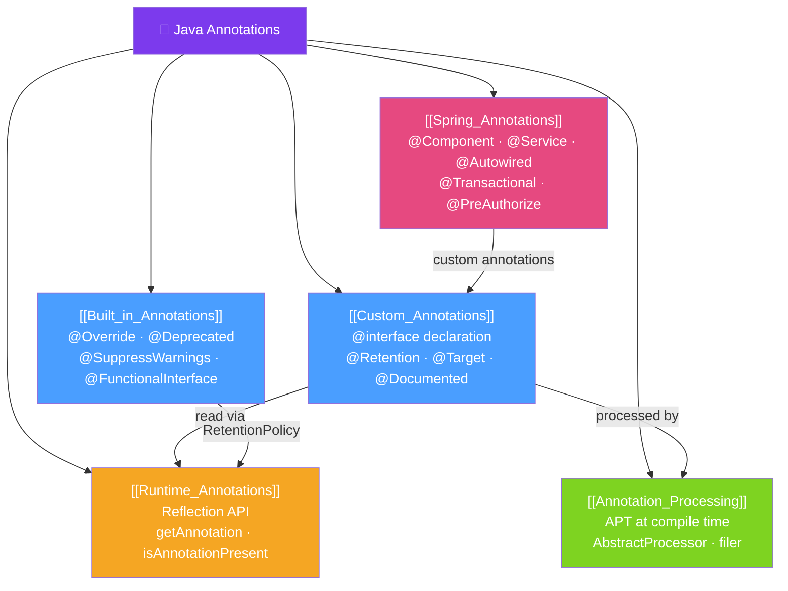

# 📎 Java Annotations — Map of Content

> [!abstract] What This Section Covers
> Java annotations are metadata added to code that can be read by the compiler, build tools, frameworks, or at runtime via reflection. This section covers the built-in Java annotations (`@Override`, `@Deprecated`, `@SuppressWarnings`), creating custom annotations, processing annotations at build time (APT/annotation processors), using annotations at runtime via reflection, and the massive role annotations play in Spring (dependency injection, transaction management, security, etc.).

## Concept Map

## Learning Path
1. [[Built_in_Annotations]] — Know what Java provides out of the box.
2. [[Custom_Annotations]] — Declare your own `@interface` with meta-annotations.
3. [[Annotation_Processing]] — Process annotations at compile time with APT.
4. [[Runtime_Annotations]] — Read annotations at runtime with reflection.
5. [[Spring_Annotations]] — The annotation ecosystem of Spring Boot.

## All Notes at a Glance
| Note | Difficulty | What You'll Learn |
|------|------------|-------------------|
| [[Built_in_Annotations]] | Beginner | @Override, @Deprecated, @SuppressWarnings, @FunctionalInterface, @SafeVarargs |
| [[Custom_Annotations]] | Intermediate | @interface, @Retention, @Target, @Inherited, @Repeatable, annotation elements |
| [[Annotation_Processing]] | Advanced | APT, AbstractProcessor, generating code at compile time (Lombok, MapStruct style) |
| [[Runtime_Annotations]] | Intermediate | Reflection, getAnnotation(), isAnnotationPresent(), scanning classpath |
| [[Spring_Annotations]] | Intermediate | Core Spring, Spring MVC, Spring Data, Spring Security annotation catalogue |

## Key Questions This Section Answers
- What is the difference between `@Retention(SOURCE)`, `CLASS`, and `RUNTIME`?
- How does Lombok use annotation processing to generate code without reflection?
- How do you read a custom annotation from a method at runtime?
- What does `@Inherited` do and when does it NOT work?
- How does Spring's `@Transactional` work under the hood (proxy + reflection)?

## Related Sections
- [[_MOC_Java_Master|↑ Java Master MOC]]
- [[33_Java_Generics/_MOC_Java_Generics|← Java Generics]]
- [[35_Java_Networking/_MOC_Java_Networking|→ Java Networking]]

#MOC #java #annotations #reflection #apt #spring
