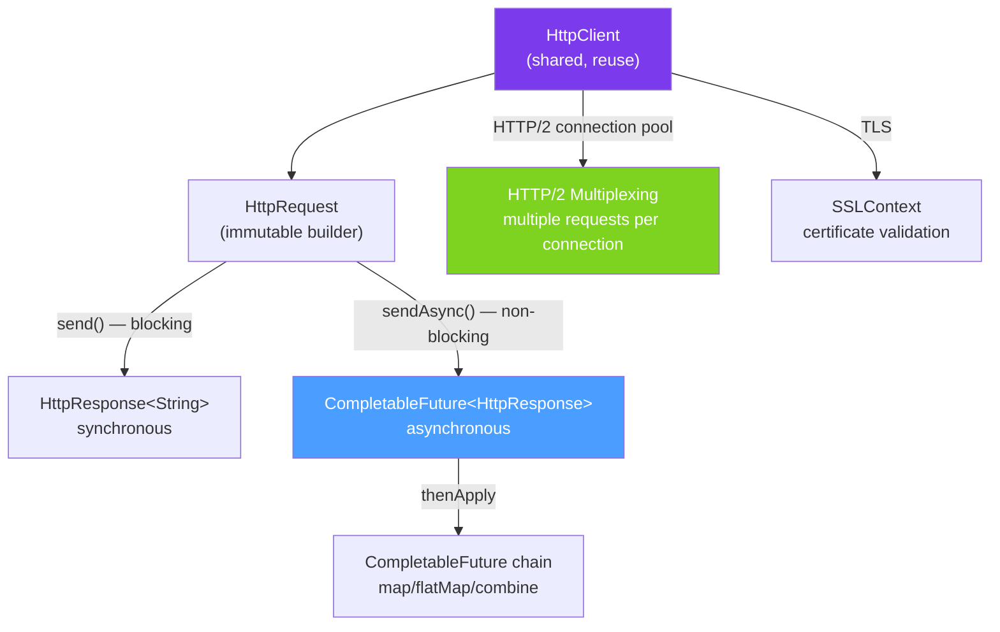

# 🌐 HTTP Client (Java 11+)

> [!abstract] TL;DR
> Java 11 introduced `java.net.http.HttpClient` — a modern, built-in HTTP client supporting HTTP/1.1, HTTP/2, WebSocket, and async operations via `CompletableFuture`. It replaces the old `HttpURLConnection` and eliminates the need for Apache HttpClient in many cases. Key classes: `HttpClient` (shared, reuse it), `HttpRequest` (immutable, built with builder), `HttpResponse` (typed body handlers: string, JSON, stream, file).

## Intuition — A Typed, Composable HTTP Client

The old `HttpURLConnection` was like a **manual typewriter** — functional but tedious. Java 11's `HttpClient` is like a **modern word processor** — the same result, with auto-correction, formatting, and async workflows. You compose `HttpRequest` objects, send them via a shared `HttpClient`, and get typed `HttpResponse<T>` objects back.

---

## How It Works



## Key Concepts / Details

### Creating `HttpClient` — Shared Instance

```java
import java.net.http.*;
import java.net.URI;
import java.time.Duration;

// HttpClient is thread-safe — create ONCE and share
HttpClient client = HttpClient.newBuilder()
    .version(HttpClient.Version.HTTP_2)           // prefer HTTP/2 (falls back to 1.1)
    .connectTimeout(Duration.ofSeconds(10))        // connection timeout
    .followRedirects(HttpClient.Redirect.NORMAL)   // follow 301/302 redirects
    .build();

// Or simpler for most cases
HttpClient client = HttpClient.newHttpClient();    // HTTP/2, no timeout, follow redirects

// Spring Bean — create once, inject everywhere
@Bean
public HttpClient httpClient() {
    return HttpClient.newBuilder()
        .connectTimeout(Duration.ofSeconds(5))
        .version(HttpClient.Version.HTTP_2)
        .build();
}
```

### Synchronous GET

```java
// Simple GET — synchronous (blocks until response)
HttpRequest request = HttpRequest.newBuilder()
    .uri(URI.create("https://api.example.com/orders/123"))
    .GET()
    .header("Authorization", "Bearer " + token)
    .header("Accept", "application/json")
    .timeout(Duration.ofSeconds(30))          // per-request timeout
    .build();

HttpResponse<String> response = client.send(request, HttpResponse.BodyHandlers.ofString());

System.out.println("Status: " + response.statusCode());
System.out.println("Body: " + response.body());
System.out.println("Content-Type: " + response.headers().firstValue("content-type"));

if (response.statusCode() == 200) {
    Order order = objectMapper.readValue(response.body(), Order.class);
}
```

### POST with JSON Body

```java
// Serialize request object to JSON
String requestBody = objectMapper.writeValueAsString(new CreateOrderRequest("user123", 49.99));

HttpRequest postRequest = HttpRequest.newBuilder()
    .uri(URI.create("https://api.example.com/orders"))
    .POST(HttpRequest.BodyPublishers.ofString(requestBody))
    .header("Content-Type", "application/json")
    .header("Authorization", "Bearer " + token)
    .timeout(Duration.ofSeconds(30))
    .build();

HttpResponse<String> postResponse = client.send(postRequest, HttpResponse.BodyHandlers.ofString());

if (postResponse.statusCode() == 201) {
    Order created = objectMapper.readValue(postResponse.body(), Order.class);
    System.out.println("Created order: " + created.getId());
}
```

### Asynchronous Requests — `sendAsync()`

```java
// sendAsync returns CompletableFuture — non-blocking
CompletableFuture<Order> orderFuture = client
    .sendAsync(request, HttpResponse.BodyHandlers.ofString())
    .thenApply(response -> {
        if (response.statusCode() != 200) {
            throw new RuntimeException("HTTP " + response.statusCode());
        }
        return response.body();
    })
    .thenApply(json -> {
        try {
            return objectMapper.readValue(json, Order.class);
        } catch (JsonProcessingException e) {
            throw new RuntimeException(e);
        }
    })
    .exceptionally(ex -> {
        log.error("Order fetch failed: {}", ex.getMessage());
        return null;
    });

// Continue doing other work here — the request is executing in the background
doOtherWork();

// Block only when you need the result
Order order = orderFuture.join();
```

### Parallel Requests — Scatter-Gather

```java
// Fetch multiple orders in parallel
List<Long> orderIds = List.of(1L, 2L, 3L, 4L, 5L);

List<CompletableFuture<Order>> futures = orderIds.stream()
    .map(id -> {
        HttpRequest req = HttpRequest.newBuilder()
            .uri(URI.create("https://api.example.com/orders/" + id))
            .GET().build();

        return client.sendAsync(req, HttpResponse.BodyHandlers.ofString())
            .thenApply(HttpResponse::body)
            .thenApply(json -> parseOrder(json));
    })
    .collect(Collectors.toList());

// Wait for all to complete
CompletableFuture<Void> allDone = CompletableFuture.allOf(
    futures.toArray(new CompletableFuture[0])
);

List<Order> orders = allDone.thenApply(v ->
    futures.stream()
        .map(CompletableFuture::join)
        .collect(Collectors.toList())
).join();

System.out.println("Fetched " + orders.size() + " orders");
```

### Reactive Body Handlers

```java
// Stream response body line by line (large responses)
HttpRequest streamRequest = HttpRequest.newBuilder()
    .uri(URI.create("https://api.example.com/events"))
    .GET().build();

// Stream lines without buffering entire response
HttpResponse<Stream<String>> streamResponse = client.send(
    streamRequest,
    HttpResponse.BodyHandlers.ofLines()
);

try (Stream<String> lines = streamResponse.body()) {
    lines.filter(line -> !line.isEmpty())
         .map(this::parseEvent)
         .forEach(this::processEvent);
}

// Download file directly to disk
HttpResponse<Path> fileResponse = client.send(
    HttpRequest.newBuilder().uri(URI.create("https://example.com/file.zip")).GET().build(),
    HttpResponse.BodyHandlers.ofFile(Path.of("/tmp/download.zip"))
);
System.out.println("Downloaded to: " + fileResponse.body());

// Get as byte array
HttpResponse<byte[]> bytesResponse = client.send(
    request,
    HttpResponse.BodyHandlers.ofByteArray()
);
```

### HTTP/2 Push Promises

```java
// HTTP/2 push — server can push resources proactively
HttpClient h2Client = HttpClient.newBuilder()
    .version(HttpClient.Version.HTTP_2)
    .build();

Map<HttpRequest, CompletableFuture<HttpResponse<String>>> pushResults = new ConcurrentHashMap<>();

HttpResponse<String> mainResponse = h2Client.send(
    request,
    HttpResponse.BodyHandlers.ofString(),
    // Push handler — called for each server-pushed resource
    (initiating, push) -> {
        CompletableFuture<HttpResponse<String>> pushFuture =
            push.accept(HttpResponse.BodyHandlers.ofString());
        pushResults.put(push.request(), pushFuture);
        return pushFuture;
    }
);
```

### Body Publishers — Sending Data

```java
// String body
BodyPublishers.ofString("plain text body");

// JSON string
BodyPublishers.ofString(objectMapper.writeValueAsString(requestObj));

// Byte array
BodyPublishers.ofByteArray(bytes);

// File upload
BodyPublishers.ofFile(Path.of("/path/to/file.pdf"));

// Input stream
BodyPublishers.ofInputStream(() -> new FileInputStream("data.csv"));

// No body (GET requests)
BodyPublishers.noBody();

// Multipart form — no built-in support, use a helper
// (or Apache HttpClient for multipart)
```

### Common Response Handlers

| Handler | Method | Returns |
|---------|--------|---------|
| String | `ofString()` | `HttpResponse<String>` |
| Byte array | `ofByteArray()` | `HttpResponse<byte[]>` |
| File | `ofFile(Path)` | `HttpResponse<Path>` |
| Stream of lines | `ofLines()` | `HttpResponse<Stream<String>>` |
| Discarding | `discarding()` | `HttpResponse<Void>` |
| Input stream | `ofInputStream()` | `HttpResponse<InputStream>` |

## Real-World Notes

- **Reuse `HttpClient` — it's thread-safe** — `HttpClient` maintains HTTP/2 connection pools internally. Creating a new client per request wastes the connection pool and HTTP/2 multiplexing benefits.
- **HTTP/2 multiplexes multiple requests per TCP connection** — 10 simultaneous async requests over HTTP/2 use 1 TCP connection. Over HTTP/1.1, they need 10 separate connections.
- **Set both `connectTimeout` and per-request `timeout`** — `connectTimeout` controls TCP handshake; `request.timeout()` controls total request time. Without both, you can block indefinitely.
- **For complex scenarios, still consider Apache HttpClient or OkHttp** — multipart forms, proxy authentication, cookie management, and detailed connection pool metrics are still easier with mature libraries.

## Common Pitfalls

- **Creating `HttpClient` per request** — wastes connection pools and kills HTTP/2 performance. Create once and share.
- **Not handling non-2xx status codes** — `send()` doesn't throw on HTTP 404 or 500. Always check `response.statusCode()`.
- **Forgetting `try-with-resources` for streaming responses** — `ofLines()` and `ofInputStream()` return open streams. Always wrap in try-with-resources to close the underlying connection.
- **`join()` on async chain without timeout** — `future.join()` blocks indefinitely if the server hangs. Use `future.get(30, TimeUnit.SECONDS)` instead.

## Related Concepts
- [[Java_Sockets]] — HttpClient is built on top of sockets
- [[SSL_TLS_Java]] — configure SSLContext for HTTPS
- [[NIO_and_Netty]] — Java's HttpClient uses NIO internally for async

## Review Questions
1. Why should `HttpClient` be created once and shared rather than created per request?
2. What is the advantage of HTTP/2 multiplexing over HTTP/1.1 for parallel requests?
3. How do you stream a large response body without buffering the entire response in memory?

#java #networking #http-client #http2 #async #completable-future
