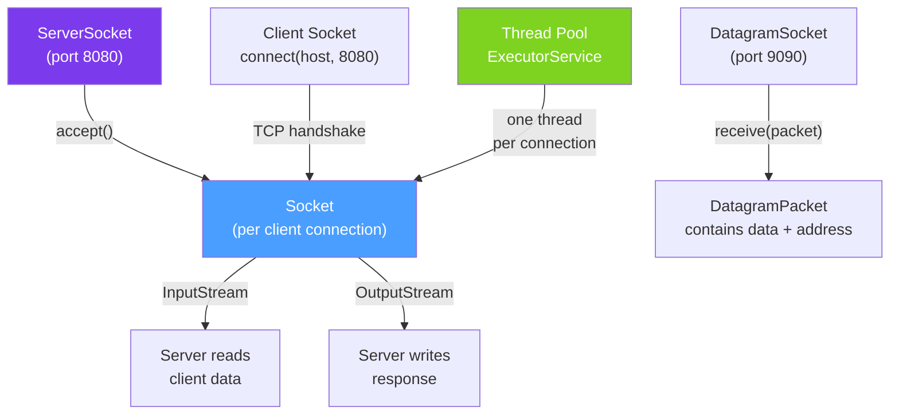

# 🔌 Java Sockets

> [!abstract] TL;DR
> Java's `Socket` and `ServerSocket` provide **blocking TCP communication**. The server binds to a port, accepts connections in a loop, and handles each client (typically in a new thread or thread pool). `DatagramSocket` provides UDP (connectionless, no guarantees). Sockets are the foundation of all Java networking — HTTP, WebSocket, and database drivers are built on sockets.

## Intuition — Sockets as Phone Calls

A TCP connection is like a **phone call**:
- `ServerSocket.accept()` = waiting for the phone to ring
- `Socket.connect()` = dialing the number
- The established socket = an open phone line (bidirectional)
- `InputStream/OutputStream` = what you hear/say
- `socket.close()` = hanging up

UDP is like **mailing postcards** — fast, but no guarantee they arrive, no guarantee of order, and no acknowledgment.

---

## How It Works



## Key Concepts / Details

### TCP Server — `ServerSocket`

```java
import java.net.*;
import java.io.*;
import java.util.concurrent.*;

public class EchoServer {

    private static final int PORT = 8080;
    private final ExecutorService threadPool = Executors.newFixedThreadPool(10);

    public void start() throws IOException {
        try (ServerSocket serverSocket = new ServerSocket(PORT)) {
            serverSocket.setReuseAddress(true);  // allow restart without TIME_WAIT delay
            System.out.println("Server listening on port " + PORT);

            while (!Thread.currentThread().isInterrupted()) {
                Socket clientSocket = serverSocket.accept();  // blocks until client connects
                threadPool.submit(() -> handleClient(clientSocket));  // handle in thread pool
            }
        }
    }

    private void handleClient(Socket socket) {
        try (socket;
             BufferedReader in = new BufferedReader(
                 new InputStreamReader(socket.getInputStream()));
             PrintWriter out = new PrintWriter(socket.getOutputStream(), true)) {

            socket.setSoTimeout(30_000);  // 30s read timeout — prevent hanging connections
            String line;
            while ((line = in.readLine()) != null) {
                System.out.println("Received: " + line);
                out.println("Echo: " + line);  // autoFlush=true — sends immediately
            }
        } catch (SocketTimeoutException e) {
            System.err.println("Client timed out");
        } catch (IOException e) {
            System.err.println("Client error: " + e.getMessage());
        }
    }
}
```

### TCP Client — `Socket`

```java
public class EchoClient {

    public static void main(String[] args) throws IOException {
        try (Socket socket = new Socket()) {
            // Connect with timeout — don't block indefinitely
            socket.connect(new InetSocketAddress("localhost", 8080), 5000);  // 5s connect timeout
            socket.setSoTimeout(10_000);  // 10s read timeout

            try (BufferedReader in = new BufferedReader(
                     new InputStreamReader(socket.getInputStream()));
                 PrintWriter out = new PrintWriter(socket.getOutputStream(), true)) {

                // Send message
                out.println("Hello, Server!");
                String response = in.readLine();
                System.out.println("Server said: " + response);  // Echo: Hello, Server!

                out.println("How are you?");
                System.out.println(in.readLine());  // Echo: How are you?
            }
        }
    }
}
```

### Socket Options — Important Knobs

```java
Socket socket = new Socket();
socket.connect(new InetSocketAddress("example.com", 80), 5000);

// SO_TIMEOUT: read timeout — prevent blocking forever on receive
socket.setSoTimeout(30_000);  // 30 seconds

// TCP_NODELAY: disable Nagle's algorithm — send small packets immediately
// Default: Nagle is ON (buffers small packets). Turn off for low-latency protocols.
socket.setTcpNoDelay(true);

// SO_KEEPALIVE: OS sends keepalive probes if connection is idle
// Default: OS-level (often 2 hours). For application-level keepalive, implement yourself.
socket.setKeepAlive(true);

// SO_LINGER: wait for data to flush before close
socket.setSoLinger(true, 10);  // wait up to 10 seconds

// SO_RCVBUF / SO_SNDBUF: socket buffer sizes
socket.setReceiveBufferSize(65536);  // 64KB receive buffer
socket.setSendBufferSize(65536);

// REUSEADDR on server — allow binding port immediately after server restart
ServerSocket ss = new ServerSocket();
ss.setReuseAddress(true);
ss.bind(new InetSocketAddress(8080));
```

### UDP — `DatagramSocket`

```java
// UDP Server — receive packets
public class UdpServer {
    public void start() throws IOException {
        try (DatagramSocket socket = new DatagramSocket(9090)) {
            byte[] buffer = new byte[1024];
            System.out.println("UDP server listening on 9090");

            while (true) {
                DatagramPacket packet = new DatagramPacket(buffer, buffer.length);
                socket.receive(packet);  // blocks until packet arrives

                String message = new String(packet.getData(), 0, packet.getLength());
                System.out.println("Received from " + packet.getAddress() + ": " + message);

                // Send response back to sender
                byte[] response = ("ACK: " + message).getBytes();
                DatagramPacket responsePacket = new DatagramPacket(
                    response, response.length,
                    packet.getAddress(), packet.getPort()
                );
                socket.send(responsePacket);
            }
        }
    }
}

// UDP Client
public class UdpClient {
    public void send(String message) throws IOException {
        try (DatagramSocket socket = new DatagramSocket()) {
            byte[] data = message.getBytes();
            InetAddress address = InetAddress.getByName("localhost");
            DatagramPacket packet = new DatagramPacket(data, data.length, address, 9090);
            socket.send(packet);

            // Receive response
            byte[] buffer = new byte[1024];
            DatagramPacket response = new DatagramPacket(buffer, buffer.length);
            socket.setSoTimeout(2000);  // 2s timeout for response
            socket.receive(response);
            System.out.println("Response: " + new String(response.getData(), 0, response.getLength()));
        }
    }
}
```

### Multi-Client Server Patterns

| Pattern | Threads | Use Case | Limitation |
|---------|---------|---------|------------|
| **Thread per connection** | N threads | Simple servers, low concurrency | Thread overhead with 1000+ connections |
| **Thread pool** | Fixed pool | Most servers — balance resources | Queue overflow under extreme load |
| **Virtual threads (Java 21)** | JVM virtual threads | High-concurrency I/O-bound servers | Requires Java 21+ |
| **NIO Selector** | 1-2 threads | Custom high-performance servers | Complex code |
| **Netty** | Small event loop | Framework-quality high performance | Learning curve |

```java
// Java 21: Virtual threads — thread-per-connection but cheap
ExecutorService executor = Executors.newVirtualThreadPerTaskExecutor();
try (ServerSocket server = new ServerSocket(8080)) {
    while (true) {
        Socket client = server.accept();
        executor.submit(() -> handleClient(client));  // virtual thread — ~1KB stack
    }
}
```

## Real-World Notes

- **TCP Nagle's algorithm causes latency** — for protocols that send many small messages (like game servers or trading systems), disable Nagle with `setTcpNoDelay(true)`. HTTP/1.1 clients typically disable it too.
- **Always set socket timeouts** — without `setSoTimeout()`, a `read()` blocks forever if the other end crashes without sending FIN. This leaks threads in a server.
- **`close()` flushes and sends FIN** — closing a socket sends TCP FIN to the other end. The other side's `readLine()` returns null (stream ended). Always close in try-with-resources.
- **Connection pooling for client sockets** — creating a new `Socket` for every request (3-way handshake) is expensive. Use a connection pool (Apache HttpClient does this automatically) or keep connections alive.

## Common Pitfalls

- **Not setting read timeout** — if the client sends half a request and stops, the server's `readLine()` blocks until the socket timeout fires. Without a timeout, threads accumulate and the server runs out of threads.
- **Ignoring `IOException` on accept** — a client connecting and immediately disconnecting can cause `accept()` to throw `IOException`. Catch it and continue the accept loop.
- **UDP packet size limit** — UDP payloads are limited to 65,507 bytes (IP max - UDP header). Larger data must be fragmented at the application level.
- **Half-closed connections** — `socket.shutdownOutput()` sends FIN for writes but keeps reads open. This is the half-close pattern used in HTTP/1.0. Most developers don't need this; always fully close sockets.

## Related Concepts
- [[NIO_and_Netty]] — non-blocking I/O for high-throughput socket servers
- [[SSL_TLS_Java]] — wrapping sockets with TLS using SSLSocket
- [[HTTP_Client_Java11]] — high-level HTTP built on top of sockets

## Review Questions
1. Why should `setSoTimeout()` always be set on server-accepted sockets?
2. What is TCP Nagle's algorithm and when should you disable it?
3. What is the main limitation of the "thread per connection" model and how do virtual threads address it?

#java #networking #sockets #tcp #udp #server-socket
