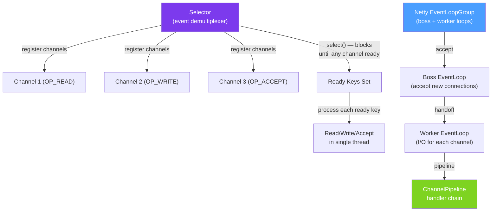

# ⚡ NIO and Netty

> [!abstract] TL;DR
> Java NIO (`java.nio`) provides **non-blocking I/O** with `Channel`, `Selector`, and `ByteBuffer`. A single thread can monitor many channels via a `Selector`, making it possible to handle thousands of connections with few threads. **Netty** is a high-performance async network framework built on NIO — it provides event-driven `ChannelHandler` pipelines, managed buffer pools, codec support, and a production-ready event loop model. Netty powers Netty-based HTTP servers (Vertx, Micronaut, Spring WebFlux on Netty).

## Intuition — Blocking vs Non-Blocking I/O

Blocking I/O (traditional sockets): a thread sits and **waits** for data, like a cashier serving one customer at a time and waiting for them to finish rummaging their bag.

Non-blocking I/O (NIO): one thread monitors **all customers** and serves whichever one is ready, moving immediately to the next. With 1000 connections, blocking needs 1000 threads (expensive); non-blocking needs 1–4 threads (scalable).

---

## How It Works



## Key Concepts / Details

### Java NIO — Core Concepts

```java
// ByteBuffer — the buffer for NIO reads/writes
ByteBuffer buffer = ByteBuffer.allocate(1024);  // heap buffer
ByteBuffer direct = ByteBuffer.allocateDirect(1024);  // direct (off-heap, faster for I/O)

// Buffer modes: write mode (position moves up), flip to read mode
buffer.put("Hello".getBytes());  // write: position=5, limit=1024
buffer.flip();                   // switch to read: position=0, limit=5
byte[] data = new byte[buffer.remaining()];
buffer.get(data);                // read: position=5
buffer.clear();                  // reset for next write: position=0, limit=1024

// Channel — like a stream but non-blocking and two-way
SocketChannel channel = SocketChannel.open();
channel.configureBlocking(false);  // CRUCIAL: non-blocking mode
channel.connect(new InetSocketAddress("example.com", 80));
```

### NIO Selector — Multiplexing

```java
public class NioServer {

    public void start() throws IOException {
        // Open server channel and bind
        ServerSocketChannel serverChannel = ServerSocketChannel.open();
        serverChannel.configureBlocking(false);  // must be non-blocking for Selector
        serverChannel.bind(new InetSocketAddress(8080));

        // Selector monitors multiple channels
        Selector selector = Selector.open();
        serverChannel.register(selector, SelectionKey.OP_ACCEPT);  // interested in new connections

        ByteBuffer buffer = ByteBuffer.allocate(1024);

        while (true) {
            selector.select();  // blocks until at least one channel is ready

            Set<SelectionKey> readyKeys = selector.selectedKeys();
            Iterator<SelectionKey> iter = readyKeys.iterator();

            while (iter.hasNext()) {
                SelectionKey key = iter.next();
                iter.remove();  // IMPORTANT: remove processed key

                if (key.isAcceptable()) {
                    // New connection — accept and register for reading
                    SocketChannel client = serverChannel.accept();
                    client.configureBlocking(false);
                    client.register(selector, SelectionKey.OP_READ);
                    System.out.println("Accepted connection from " + client.getRemoteAddress());

                } else if (key.isReadable()) {
                    // Data available — read it
                    SocketChannel client = (SocketChannel) key.channel();
                    buffer.clear();
                    int bytesRead = client.read(buffer);

                    if (bytesRead == -1) {
                        // Client closed connection
                        client.close();
                        key.cancel();
                    } else {
                        buffer.flip();
                        // Echo back
                        client.write(buffer);
                        // Register for write if buffer not fully written:
                        // key.interestOps(SelectionKey.OP_WRITE);
                    }

                } else if (key.isWritable()) {
                    // Ready to write buffered data
                    SocketChannel client = (SocketChannel) key.channel();
                    // Write pending data, then switch back to read interest
                    key.interestOps(SelectionKey.OP_READ);
                }
            }
        }
    }
}
```

### Netty — High-Level Non-Blocking Framework

```java
// Dependencies
// io.netty:netty-all:4.1.x

public class NettyEchoServer {

    private final int port;

    public void start() throws InterruptedException {
        // Boss: accepts new connections; Worker: handles I/O
        EventLoopGroup bossGroup = new NioEventLoopGroup(1);     // 1 boss thread
        EventLoopGroup workerGroup = new NioEventLoopGroup();     // #CPU threads

        try {
            ServerBootstrap bootstrap = new ServerBootstrap()
                .group(bossGroup, workerGroup)
                .channel(NioServerSocketChannel.class)             // NIO server channel
                .childHandler(new ChannelInitializer<SocketChannel>() {
                    @Override
                    protected void initChannel(SocketChannel ch) {
                        // Pipeline: add handlers in order (read: left→right, write: right→left)
                        ch.pipeline()
                            .addLast(new LineBasedFrameDecoder(1024))  // split by newline
                            .addLast(new StringDecoder(CharsetUtil.UTF_8))
                            .addLast(new StringEncoder(CharsetUtil.UTF_8))
                            .addLast(new EchoServerHandler());          // business logic
                    }
                })
                .option(ChannelOption.SO_BACKLOG, 128)             // accept queue size
                .childOption(ChannelOption.SO_KEEPALIVE, true)
                .childOption(ChannelOption.TCP_NODELAY, true);

            ChannelFuture future = bootstrap.bind(port).sync();    // bind and start
            System.out.println("Server started on port " + port);
            future.channel().closeFuture().sync();                 // block until server closes
        } finally {
            bossGroup.shutdownGracefully();
            workerGroup.shutdownGracefully();
        }
    }
}
```

### Netty `ChannelHandler` — Business Logic

```java
// ChannelInboundHandlerAdapter: handles incoming events (read, connect, error)
@ChannelHandler.Sharable  // stateless — can be shared across channels
public class EchoServerHandler extends SimpleChannelInboundHandler<String> {

    @Override
    protected void channelRead0(ChannelHandlerContext ctx, String msg) {
        System.out.println("Received: " + msg);
        ctx.writeAndFlush("Echo: " + msg + "\n");  // write reply, flush immediately
    }

    @Override
    public void channelActive(ChannelHandlerContext ctx) {
        System.out.println("Client connected: " + ctx.channel().remoteAddress());
        ctx.writeAndFlush("Welcome!\n");
    }

    @Override
    public void channelInactive(ChannelHandlerContext ctx) {
        System.out.println("Client disconnected: " + ctx.channel().remoteAddress());
    }

    @Override
    public void exceptionCaught(ChannelHandlerContext ctx, Throwable cause) {
        log.error("Error in channel: {}", cause.getMessage());
        ctx.close();  // close the connection on error
    }
}
```

### Netty HTTP Server — Protocol Codec

```java
// Netty HTTP server with built-in HTTP codecs
bootstrap.childHandler(new ChannelInitializer<SocketChannel>() {
    @Override
    protected void initChannel(SocketChannel ch) {
        ch.pipeline()
            // Decode HTTP requests, encode HTTP responses
            .addLast(new HttpServerCodec())
            // Aggregate chunked HTTP requests into FullHttpRequest
            .addLast(new HttpObjectAggregator(65536))
            // Compression support
            .addLast(new HttpContentCompressor())
            // Your business logic
            .addLast(new HttpServerHandler());
    }
});

public class HttpServerHandler extends SimpleChannelInboundHandler<FullHttpRequest> {
    @Override
    protected void channelRead0(ChannelHandlerContext ctx, FullHttpRequest request) {
        String path = request.uri();
        String body = request.content().toString(CharsetUtil.UTF_8);

        // Build response
        FullHttpResponse response = new DefaultFullHttpResponse(
            HttpVersion.HTTP_1_1,
            HttpResponseStatus.OK,
            Unpooled.copiedBuffer("{\"status\":\"ok\"}", CharsetUtil.UTF_8)
        );
        response.headers()
            .set(HttpHeaderNames.CONTENT_TYPE, "application/json")
            .setInt(HttpHeaderNames.CONTENT_LENGTH, response.content().readableBytes());

        ctx.writeAndFlush(response).addListener(ChannelFutureListener.CLOSE);
    }
}
```

### NIO vs Traditional Blocking vs Netty

| Aspect | Blocking Sockets | Java NIO | Netty |
|--------|-----------------|----------|-------|
| **Thread model** | 1 thread/connection | 1-4 threads, Selector | Boss + Worker EventLoopGroups |
| **Max connections** | ~10K (limited by threads) | 100K+ | 100K+ (battle-tested) |
| **Code complexity** | Simple | Complex | Medium (framework abstracts NIO) |
| **Buffer management** | JVM heap | ByteBuffer | PooledByteBufAllocator (zero-copy) |
| **Protocols** | Custom | Custom | Rich codec library |
| **Use when** | Low concurrency, simple protocol | Greenfield high-perf | Production high-perf server |

## Real-World Notes

- **Netty powers major frameworks** — Spring WebFlux (on Netty), Micronaut, Vert.x, gRPC Java server, and Cassandra Java driver all use Netty under the hood.
- **Direct `ByteBuffer` for I/O performance** — `ByteBuffer.allocateDirect()` uses off-heap memory mapped directly to OS buffers, avoiding one copy per read/write compared to heap buffers.
- **Netty's `PooledByteBufAllocator` prevents GC pressure** — Netty pools `ByteBuf` objects. Without pooling, heavy I/O creates millions of short-lived byte arrays that stress the GC.
- **Java 21 virtual threads may replace NIO for many use cases** — with virtual threads, blocking I/O is cheap (thousands of virtual threads per OS thread). For most applications, virtual threads + blocking sockets is simpler than NIO/Netty.

## Common Pitfalls

- **Modifying `ByteBuffer` without `flip()`** — writing then reading without `flip()` reads from the end of written data (position), not the beginning. Always `flip()` before reading.
- **Not removing `SelectionKey` from `selectedKeys()`** — `selector.selectedKeys()` doesn't auto-clear. If you forget `iter.remove()`, the same ready key is processed on every `select()` iteration.
- **`@Sharable` on stateful handlers** — if a `ChannelHandler` maintains per-connection state, it cannot be `@Sharable` (shared across channels). Create a new handler per channel in `initChannel()`.
- **Not releasing Netty `ByteBuf`** — Netty uses reference-counted buffers. If you don't call `release()` (or extend `SimpleChannelInboundHandler` which auto-releases), you get memory leaks.

## Related Concepts
- [[Java_Sockets]] — blocking I/O that NIO improves upon
- [[HTTP_Client_Java11]] — Java's HTTP client uses NIO internally
- [[SSL_TLS_Java]] — Netty has `SslHandler` for TLS in the pipeline

## Review Questions
1. What is the role of a `Selector` in Java NIO, and how does it allow one thread to handle many connections?
2. What are the Boss and Worker event loop groups in Netty, and what does each do?
3. Why must `@Sharable` Netty handlers be stateless?

#java #networking #nio #netty #non-blocking #channel #selector #event-loop
