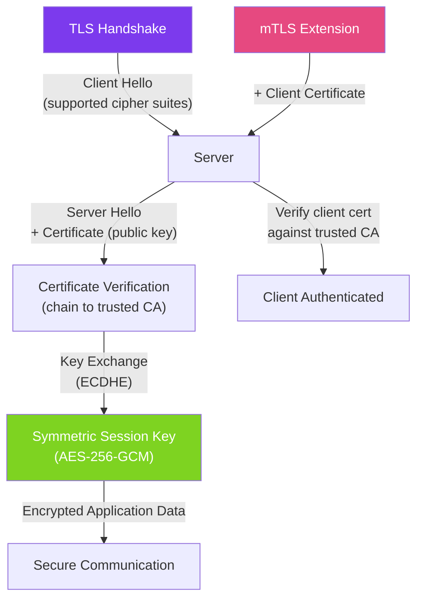

# 🔐 SSL/TLS in Java

> [!abstract] TL;DR
> Java's **JSSE (Java Secure Socket Extension)** provides TLS via `SSLContext`, `SSLSocket`, and `SSLEngine`. For most applications, the default JDK truststore (bundled CA certs) handles standard HTTPS automatically. You need custom `SSLContext` for: self-signed certificates, mutual TLS (mTLS), certificate pinning, or custom trust policies. Spring Boot configures TLS via `application.yml` properties; the underlying `SSLContext` is the same mechanism.

## Intuition — TLS as a Secure Envelope

Plain TCP is a **postcard** — anyone who handles it can read the message. TLS is a **sealed envelope with a wax seal (certificate)** — the wax seal proves the sender's identity, and the sealed envelope prevents reading in transit. Mutual TLS (mTLS) is like both parties showing ID before exchanging sealed envelopes — client and server both authenticate.

---

## How It Works



## Key Concepts / Details

### Default HTTPS — No Custom Config Needed

```java
// Java bundles CA certificates in $JAVA_HOME/lib/security/cacerts
// For standard HTTPS to public sites, just use HttpClient — TLS is automatic

HttpClient client = HttpClient.newHttpClient();
HttpResponse<String> response = client.send(
    HttpRequest.newBuilder().uri(URI.create("https://api.github.com/users/octocat")).GET().build(),
    HttpResponse.BodyHandlers.ofString()
);
// Works out of the box — Java validates the GitHub certificate against bundled CAs

// Similarly, URLConnection:
URL url = new URL("https://api.example.com/data");
HttpsURLConnection conn = (HttpsURLConnection) url.openConnection();
// TLS handled automatically
```

### Custom `SSLContext` — Self-Signed Certificates

```java
import javax.net.ssl.*;
import java.security.*;
import java.security.cert.X509Certificate;
import java.io.FileInputStream;

// Load a custom truststore (contains trusted CA certs)
public SSLContext createSSLContext(String truststorePath, String truststorePassword) throws Exception {
    // Load the truststore
    KeyStore trustStore = KeyStore.getInstance("JKS");  // or "PKCS12"
    try (FileInputStream fis = new FileInputStream(truststorePath)) {
        trustStore.load(fis, truststorePassword.toCharArray());
    }

    // Initialize TrustManagerFactory with our truststore
    TrustManagerFactory tmf = TrustManagerFactory.getInstance(
        TrustManagerFactory.getDefaultAlgorithm()  // "PKIX"
    );
    tmf.init(trustStore);

    // Build SSLContext
    SSLContext sslContext = SSLContext.getInstance("TLSv1.3");
    sslContext.init(null, tmf.getTrustManagers(), new SecureRandom());
    return sslContext;
}

// Use in HttpClient
SSLContext sslContext = createSSLContext("/app/truststore.jks", "changeit");
HttpClient client = HttpClient.newBuilder()
    .sslContext(sslContext)
    .build();
```

### Mutual TLS (mTLS) — Client Authentication

```java
// mTLS: server trusts specific client certificates; client authenticates itself
public SSLContext createMtlsContext(
        String keystorePath,     // client certificate + private key
        String keystorePassword,
        String truststorePath,   // trusted CA for server verification
        String truststorePassword) throws Exception {

    // 1. Load KeyStore with client certificate and private key
    KeyStore keyStore = KeyStore.getInstance("PKCS12");
    try (FileInputStream fis = new FileInputStream(keystorePath)) {
        keyStore.load(fis, keystorePassword.toCharArray());
    }

    KeyManagerFactory kmf = KeyManagerFactory.getInstance(
        KeyManagerFactory.getDefaultAlgorithm()  // "SunX509"
    );
    kmf.init(keyStore, keystorePassword.toCharArray());

    // 2. Load TrustStore for server validation
    KeyStore trustStore = KeyStore.getInstance("JKS");
    try (FileInputStream fis = new FileInputStream(truststorePath)) {
        trustStore.load(fis, truststorePassword.toCharArray());
    }

    TrustManagerFactory tmf = TrustManagerFactory.getInstance(
        TrustManagerFactory.getDefaultAlgorithm()
    );
    tmf.init(trustStore);

    // 3. Combine into SSLContext
    SSLContext sslContext = SSLContext.getInstance("TLSv1.3");
    sslContext.init(kmf.getKeyManagers(), tmf.getTrustManagers(), new SecureRandom());
    return sslContext;
}

// Use in HttpClient for mTLS
HttpClient mtlsClient = HttpClient.newBuilder()
    .sslContext(createMtlsContext("client.p12", "password", "server-ca.jks", "password"))
    .build();
```

### Spring Boot TLS Configuration

```yaml
# application.yml — Spring Boot TLS server config
server:
  port: 8443
  ssl:
    enabled: true
    key-store: classpath:keystore.p12
    key-store-password: ${SSL_KEYSTORE_PASSWORD}
    key-store-type: PKCS12
    key-alias: server

    # mTLS — require client certificates
    client-auth: need  # "need" = required, "want" = optional, "none" = disabled
    trust-store: classpath:truststore.jks
    trust-store-password: ${SSL_TRUSTSTORE_PASSWORD}

    # Restrict to TLS 1.2+
    protocol: TLS
    enabled-protocols: TLSv1.2,TLSv1.3

    # Strong cipher suites only (disable weak ones)
    ciphers: TLS_AES_256_GCM_SHA384,TLS_AES_128_GCM_SHA256,TLS_CHACHA20_POLY1305_SHA256
```

```java
// Spring Boot programmatic SSL customization (if YAML isn't flexible enough)
@Bean
public WebServerFactoryCustomizer<TomcatServletWebServerFactory> tlsCustomizer() {
    return factory -> {
        factory.addConnectorCustomizers(connector -> {
            connector.setScheme("https");
            connector.setSecure(true);
            connector.setPort(8443);
        });
    };
}
```

### Certificate Pinning — Extra Validation

```java
// Certificate pinning: reject certificates not matching specific public key hash
// Prevents MITM even if a CA is compromised
public X509TrustManager createPinningTrustManager(String expectedPinBase64) {
    return new X509TrustManager() {
        @Override
        public void checkServerTrusted(X509Certificate[] chain, String authType)
                throws CertificateException {
            // Standard chain validation first
            try {
                TrustManagerFactory tmf = TrustManagerFactory.getInstance(
                    TrustManagerFactory.getDefaultAlgorithm());
                tmf.init((KeyStore) null);
                for (TrustManager tm : tmf.getTrustManagers()) {
                    if (tm instanceof X509TrustManager xtm) {
                        xtm.checkServerTrusted(chain, authType);
                    }
                }
            } catch (Exception e) {
                throw new CertificateException("Standard validation failed", e);
            }

            // Pin check: verify leaf certificate's public key
            X509Certificate leaf = chain[0];
            MessageDigest digest;
            try {
                digest = MessageDigest.getInstance("SHA-256");
            } catch (NoSuchAlgorithmException e) {
                throw new CertificateException(e);
            }
            byte[] actualPin = digest.digest(leaf.getPublicKey().getEncoded());
            String actualPinBase64 = Base64.getEncoder().encodeToString(actualPin);

            if (!expectedPinBase64.equals(actualPinBase64)) {
                throw new CertificateException(
                    "Certificate pin mismatch. Expected: " + expectedPinBase64);
            }
        }

        @Override
        public void checkClientTrusted(X509Certificate[] chain, String authType) {}

        @Override
        public X509Certificate[] getAcceptedIssuers() { return new X509Certificate[0]; }
    };
}
```

### TLS Socket — Wrapping Plain Sockets

```java
// Upgrade a plain socket to TLS
SSLContext sslContext = SSLContext.getInstance("TLSv1.3");
sslContext.init(null, null, null);  // use default truststore

SSLSocketFactory factory = sslContext.getSocketFactory();
SSLSocket sslSocket = (SSLSocket) factory.createSocket("api.example.com", 443);

// Configure protocols and cipher suites
sslSocket.setEnabledProtocols(new String[]{"TLSv1.2", "TLSv1.3"});
sslSocket.setEnabledCipherSuites(sslSocket.getSupportedCipherSuites());

// Initiate TLS handshake
sslSocket.startHandshake();

// Now use like a regular socket
try (BufferedWriter out = new BufferedWriter(
        new OutputStreamWriter(sslSocket.getOutputStream()));
     BufferedReader in = new BufferedReader(
        new InputStreamReader(sslSocket.getInputStream()))) {
    out.write("GET / HTTP/1.1\r\nHost: api.example.com\r\n\r\n");
    out.flush();
    System.out.println(in.readLine());
}
```

### TLS Concepts Summary

| Concept | Description |
|---------|-------------|
| **TLS Handshake** | Establishes session: agree on version, cipher suite, exchange keys |
| **X.509 Certificate** | Contains public key + identity, signed by a CA |
| **CA (Certificate Authority)** | Trusted entity that signs certificates (Let's Encrypt, DigiCert) |
| **KeyStore** | Container for private keys + certificates (your identity) |
| **TrustStore** | Container for trusted CA certificates (who you trust) |
| **mTLS** | Both client and server authenticate with certificates |
| **Certificate Pinning** | Hard-code expected cert/public key hash to prevent CA compromise |
| **SNI (Server Name Indication)** | Allows multiple TLS certs on one IP (TLS extension) |
| **OCSP Stapling** | Server includes certificate revocation status in handshake |

## Real-World Notes

- **Use Let's Encrypt for free, auto-renewing certificates** — Spring Boot + Certbot or cert-manager in Kubernetes. Certificates expire every 90 days — automate renewal.
- **Never disable certificate validation in production** — `new X509TrustManager() { checkServerTrusted() {} }` (empty) disables TLS verification — you're vulnerable to MITM. This is acceptable only in CI/integration tests with self-signed certs, NEVER in production.
- **`PKCS12` is the modern standard over `JKS`** — Java 9+ defaults to PKCS12. JKS is proprietary and deprecated. Always use `PKCS12` for new keystores.
- **TLS 1.0 and 1.1 are deprecated** — disabled by default in JDK 11+. Only enable TLS 1.2 and 1.3. TLS 1.3 is significantly faster (1 RTT handshake vs 2 RTT for TLS 1.2).

## Common Pitfalls

- **Hardcoded passwords for keystores** — `"changeit"` is the default JKS password and is widely known. Always pass keystore passwords via environment variables or secret management.
- **Using JKS in production** — JKS doesn't support modern algorithms well. Migrate to PKCS12.
- **`SSLHandshakeException: No appropriate protocol`** — server requires TLS 1.3 but client doesn't support it (old JDK), or cipher suites don't overlap. Check TLS version compatibility.
- **Forgetting to trust the intermediate CA chain** — self-signed CA roots need only the root in the truststore. For public CAs, intermediate certificates are typically sent in the TLS handshake (server must configure this).

## Related Concepts
- [[Java_Sockets]] — SSLSocket wraps a plain Socket
- [[HTTP_Client_Java11]] — configure SSLContext on HttpClient for HTTPS customization
- [[Cryptography_Java]] — AES, RSA, hashing algorithms underlying TLS
- [[NIO_and_Netty]] — Netty uses `SslHandler` for TLS in its pipeline

## Review Questions
1. What is the difference between a `KeyStore` and a `TrustStore` in Java TLS?
2. What is mutual TLS (mTLS) and what security guarantee does it add beyond standard TLS?
3. Why is `TrustManager.checkServerTrusted()` implemented as empty a critical security vulnerability?

#java #networking #tls #ssl #jsse #mtls #certificate-pinning #keystore
