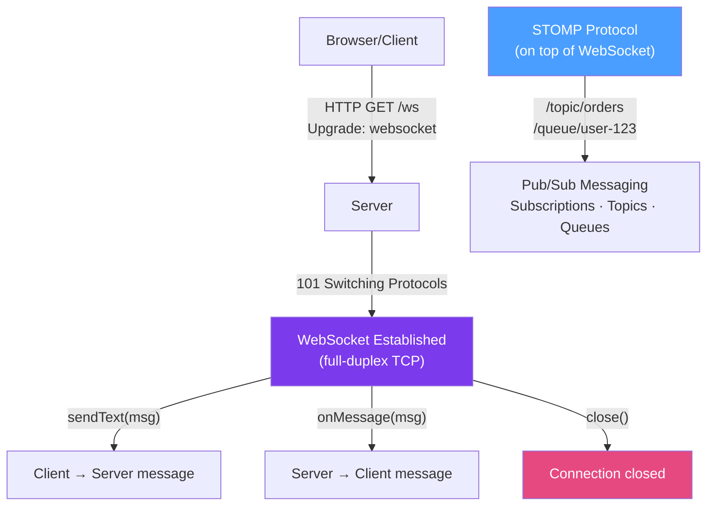

# 🔄 WebSocket in Java

> [!abstract] TL;DR
> WebSocket is a protocol (RFC 6455) that establishes a persistent, full-duplex connection over TCP, starting with an HTTP upgrade handshake. Java supports WebSockets via **JSR 356** (`javax.websocket`) for standalone servers and **Spring WebSocket** (with optional STOMP sub-protocol) for Spring Boot. Use WebSockets for real-time features: live dashboards, chat, notifications, collaborative editing. Use **SSE** (Server-Sent Events) for server-to-client-only streams (simpler).

## Intuition — WebSocket vs Polling vs SSE

Imagine a stock ticker:
- **HTTP polling** = calling the broker every 5 seconds to ask "any price changes?" — wasteful
- **SSE (Server-Sent Events)** = broker sends you updates on an open radio channel — server → client only
- **WebSocket** = a phone call with the broker — both sides can talk anytime, full-duplex, low latency

---

## How It Works



## Key Concepts / Details

### JSR 356 — Raw WebSocket Server

```java
import javax.websocket.*;
import javax.websocket.server.ServerEndpoint;
import java.io.IOException;
import java.util.concurrent.CopyOnWriteArraySet;

// @ServerEndpoint maps WebSocket connections to URI path
@ServerEndpoint("/ws/chat")
public class ChatEndpoint {

    // Thread-safe set of all connected sessions
    private static final Set<Session> sessions = new CopyOnWriteArraySet<>();

    @OnOpen
    public void onOpen(Session session) {
        sessions.add(session);
        System.out.println("Client connected: " + session.getId());
        // Optionally get URL parameters
        // Map<String, List<String>> params = session.getRequestParameterMap();
    }

    @OnMessage
    public void onMessage(String message, Session session) throws IOException {
        System.out.println("Received from " + session.getId() + ": " + message);
        // Broadcast to all connected clients
        for (Session other : sessions) {
            if (other.isOpen()) {
                other.getBasicRemote().sendText("[" + session.getId() + "]: " + message);
            }
        }
    }

    @OnClose
    public void onClose(Session session, CloseReason reason) {
        sessions.remove(session);
        System.out.println("Client disconnected: " + session.getId() +
            " — reason: " + reason.getCloseCode());
    }

    @OnError
    public void onError(Session session, Throwable error) {
        System.err.println("Error for " + session.getId() + ": " + error.getMessage());
        sessions.remove(session);
    }
}

// Binary message handler
@OnMessage
public void onBinaryMessage(byte[] data, Session session) throws IOException {
    // Handle binary data (images, files, binary protocol)
    session.getBasicRemote().sendBinary(ByteBuffer.wrap(processData(data)));
}
```

### JSR 356 — WebSocket Client

```java
@ClientEndpoint
public class WebSocketClient {

    private Session session;

    @OnOpen
    public void onOpen(Session session) {
        this.session = session;
        System.out.println("Connected to server");
    }

    @OnMessage
    public void onMessage(String message) {
        System.out.println("Received: " + message);
    }

    public void send(String message) throws IOException {
        if (session != null && session.isOpen()) {
            session.getBasicRemote().sendText(message);
        }
    }

    public void close() throws IOException {
        if (session != null) {
            session.close();
        }
    }

    public static void main(String[] args) throws Exception {
        WebSocketContainer container = ContainerProvider.getWebSocketContainer();
        URI uri = URI.create("ws://localhost:8080/ws/chat");
        WebSocketClient client = new WebSocketClient();
        container.connectToServer(client, uri);
        client.send("Hello from client!");
        Thread.sleep(2000);
        client.close();
    }
}
```

### Spring WebSocket — Simple Handler

```java
// Simple WebSocket handler (no STOMP)
@Component
public class OrderStatusHandler extends TextWebSocketHandler {

    private final Map<String, WebSocketSession> sessions = new ConcurrentHashMap<>();

    @Override
    public void afterConnectionEstablished(WebSocketSession session) {
        sessions.put(session.getId(), session);
        log.info("WebSocket connected: {}", session.getId());
    }

    @Override
    protected void handleTextMessage(WebSocketSession session, TextMessage message) throws Exception {
        String payload = message.getPayload();
        log.info("Received: {} from {}", payload, session.getId());
        session.sendMessage(new TextMessage("ACK: " + payload));
    }

    @Override
    public void afterConnectionClosed(WebSocketSession session, CloseStatus status) {
        sessions.remove(session.getId());
    }

    // Push update to a specific session from business logic
    public void sendOrderUpdate(String sessionId, OrderUpdate update) throws IOException {
        WebSocketSession session = sessions.get(sessionId);
        if (session != null && session.isOpen()) {
            session.sendMessage(new TextMessage(objectMapper.writeValueAsString(update)));
        }
    }
}

// Register the handler
@Configuration
@EnableWebSocket
public class WebSocketConfig implements WebSocketConfigurer {
    @Autowired OrderStatusHandler handler;

    @Override
    public void registerWebSocketHandlers(WebSocketHandlerRegistry registry) {
        registry.addHandler(handler, "/ws/orders")
            .setAllowedOrigins("https://app.example.com");
    }
}
```

### Spring WebSocket with STOMP — Pub/Sub

```java
// STOMP (Simple Text Oriented Messaging Protocol) over WebSocket
// Provides subscriptions, topics, and message routing

// Configuration
@Configuration
@EnableWebSocketMessageBroker
public class StompConfig implements WebSocketMessageBrokerConfigurer {

    @Override
    public void registerStompEndpoints(StompEndpointRegistry registry) {
        registry.addEndpoint("/ws")
            .setAllowedOriginPatterns("*")
            .withSockJS();  // SockJS fallback for clients that don't support WebSocket
    }

    @Override
    public void configureMessageBroker(MessageBrokerRegistry registry) {
        registry.enableSimpleBroker("/topic", "/queue");  // in-memory broker
        registry.setApplicationDestinationPrefixes("/app");  // prefix for @MessageMapping
        registry.setUserDestinationPrefix("/user");  // user-specific destinations
        // For production: use RabbitMQ/ActiveMQ as broker
        // registry.enableStompBrokerRelay("/topic", "/queue").setRelayHost("localhost");
    }
}

// Controller: handles STOMP messages
@Controller
public class OrderWebSocketController {

    @Autowired SimpMessagingTemplate messagingTemplate;

    // Client sends to /app/order.create → this method handles it
    @MessageMapping("/order.create")
    @SendTo("/topic/orders")  // broadcast to all subscribers of /topic/orders
    public OrderUpdate createOrder(CreateOrderRequest request, Principal user) {
        Order order = orderService.create(request);
        return new OrderUpdate(order.getId(), "CREATED", user.getName());
    }

    // Send to specific user's private channel
    @MessageMapping("/order.status")
    public void getStatus(OrderStatusRequest req, Principal user) {
        Order order = orderService.findById(req.getOrderId());
        // Send only to this specific user
        messagingTemplate.convertAndSendToUser(
            user.getName(),
            "/queue/order-status",  // user sees: /user/{username}/queue/order-status
            new OrderStatusResponse(order.getStatus())
        );
    }

    // Push from server side (e.g., from @EventListener)
    @EventListener
    public void onOrderStatusChanged(OrderStatusChangedEvent event) {
        messagingTemplate.convertAndSend(
            "/topic/orders/" + event.getOrderId(),
            new OrderUpdate(event.getOrderId(), event.getNewStatus())
        );
    }
}
```

### SSE vs WebSocket vs Polling

| Feature | HTTP Polling | SSE | WebSocket |
|---------|-------------|-----|-----------|
| **Direction** | Bidirectional (req/resp) | Server → Client only | Full duplex |
| **Protocol** | HTTP | HTTP | WebSocket (RFC 6455) |
| **Connection** | Per-request | Persistent | Persistent |
| **Overhead** | HTTP headers per poll | Low | Very low |
| **Complexity** | Low | Low | Medium |
| **Proxy/firewall** | Excellent | Good | Sometimes blocked |
| **Best for** | Simple, infrequent updates | Live feeds, notifications | Chat, gaming, collaborative |

```java
// SSE in Spring — simpler than WebSocket for server-push only
@GetMapping(value = "/events", produces = MediaType.TEXT_EVENT_STREAM_VALUE)
public SseEmitter streamEvents() {
    SseEmitter emitter = new SseEmitter(Long.MAX_VALUE);
    emitters.add(emitter);
    emitter.onCompletion(() -> emitters.remove(emitter));
    emitter.onTimeout(() -> emitters.remove(emitter));
    return emitter;
}

public void pushEvent(OrderEvent event) {
    List<SseEmitter> dead = new ArrayList<>();
    for (SseEmitter emitter : emitters) {
        try {
            emitter.send(SseEmitter.event()
                .name("order-update")
                .data(objectMapper.writeValueAsString(event)));
        } catch (IOException e) {
            dead.add(emitter);
        }
    }
    emitters.removeAll(dead);
}
```

## Real-World Notes

- **STOMP with an external broker (RabbitMQ) scales better** — the in-memory STOMP broker is lost on restart and doesn't scale across nodes. In production, use `enableStompBrokerRelay` pointing to RabbitMQ.
- **Handle connection loss and reconnect on the client** — WebSocket connections drop (network issues, load balancer timeouts, server restarts). Browser clients should implement exponential backoff reconnect. SockJS handles this automatically.
- **Load balancer session affinity** — WebSocket connections are persistent; load balancers must route the same client to the same server, OR you need a shared broker (RabbitMQ) to handle messages across instances.
- **Heartbeats prevent connection drops** — configure STOMP heartbeats: `registry.configureBroker().setHeartbeatValue(new long[]{10000, 10000})` to detect dead connections within 10s.

## Common Pitfalls

- **Storing `WebSocketSession` in a static field** — sessions are not serializable and die when the server restarts. Use session ID as the key and accept that connections must reconnect.
- **Sending from a non-WebSocket thread without synchronization** — `session.sendMessage()` is NOT thread-safe in the JSR 356 spec. Use `getAsyncRemote().sendText()` for non-blocking sends from multiple threads.
- **Large message buffering** — WebSocket has a default max text message buffer (8KB in Tomcat). Configure `setMaxTextMessageBufferSize()` or split large messages.
- **Using WebSocket for HTTP-like request/reply** — if you're doing request/reply semantics over WebSocket, consider whether HTTP with SSE for push is simpler. WebSocket shines for truly bidirectional, event-driven communication.

## Related Concepts
- [[Java_Sockets]] — WebSocket is built on top of a TCP socket with an HTTP upgrade handshake
- [[HTTP_Client_Java11]] — Java's HttpClient also supports WebSocket via `HttpClient.newWebSocketBuilder()`
- [[NIO_and_Netty]] — high-performance WebSocket servers often use Netty under the hood

## Review Questions
1. How does a WebSocket connection start, and what HTTP mechanism initiates the upgrade?
2. What is STOMP and what does it add on top of raw WebSocket?
3. When should you choose SSE over WebSocket for a server-push scenario?

#java #networking #websocket #stomp #spring-websocket #real-time #sse
