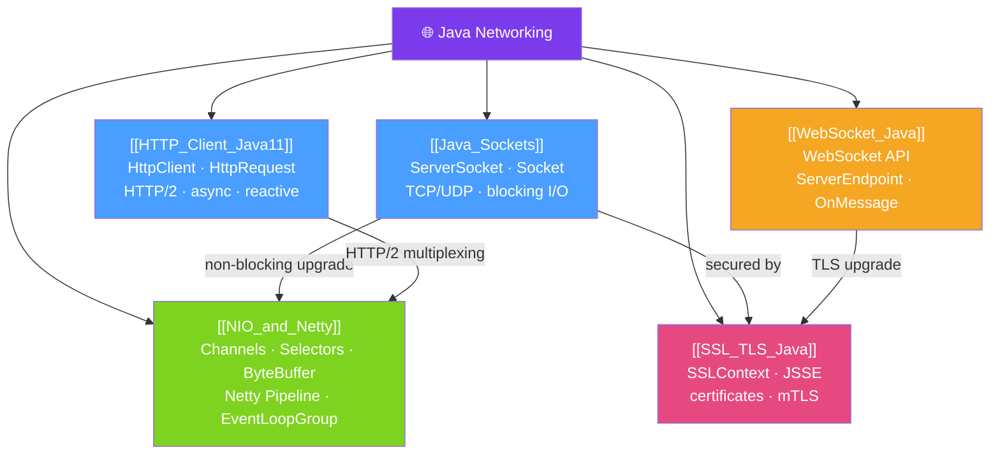

# 🌐 Java Networking — Map of Content

> [!abstract] What This Section Covers
> Java's networking stack spans raw TCP sockets, the modern HTTP/2 client (`java.net.http`), WebSockets for real-time communication, non-blocking I/O with NIO/Netty for high throughput, and TLS/SSL for secure channels. Understanding this stack lets you build anything from a custom protocol server to a high-performance API client.

## Concept Map

## Learning Path
1. [[Java_Sockets]] — The foundation: TCP/UDP sockets and blocking I/O.
2. [[HTTP_Client_Java11]] — The modern Java 11 HTTP client for REST/HTTP/2.
3. [[WebSocket_Java]] — Real-time bidirectional communication with WebSockets.
4. [[NIO_and_Netty]] — Non-blocking I/O for high-concurrency servers.
5. [[SSL_TLS_Java]] — Securing connections with TLS and mutual authentication.

## All Notes at a Glance
| Note | Difficulty | What You'll Learn |
|------|------------|-------------------|
| [[Java_Sockets]] | Beginner | ServerSocket, Socket, DatagramSocket, multi-threaded echo server |
| [[HTTP_Client_Java11]] | Intermediate | HttpClient, HttpRequest, sync/async, reactive body publishers, HTTP/2 |
| [[WebSocket_Java]] | Intermediate | JSR 356 @ServerEndpoint, Spring WebSocket, STOMP, session management |
| [[NIO_and_Netty]] | Advanced | Channels, Selectors, ByteBuffer, Netty ChannelHandler, pipeline |
| [[SSL_TLS_Java]] | Advanced | SSLContext, TrustManager, KeyManager, certificate pinning, mTLS |

## Key Questions This Section Answers
- When should you use NIO vs traditional blocking sockets?
- How does the Java 11 `HttpClient` handle HTTP/2 multiplexing?
- What is the difference between WebSocket and SSE (Server-Sent Events)?
- How does Netty's event loop model achieve high concurrency?
- How do you implement mutual TLS (mTLS) in Java?

## Related Sections
- [[_MOC_Java_Master|↑ Java Master MOC]]
- [[34_Java_Annotations/_MOC_Java_Annotations|← Java Annotations]]
- [[36_Functional_Java/_MOC_Functional_Java|→ Functional Java]]

#MOC #java #networking #sockets #http #websocket #nio #tls
