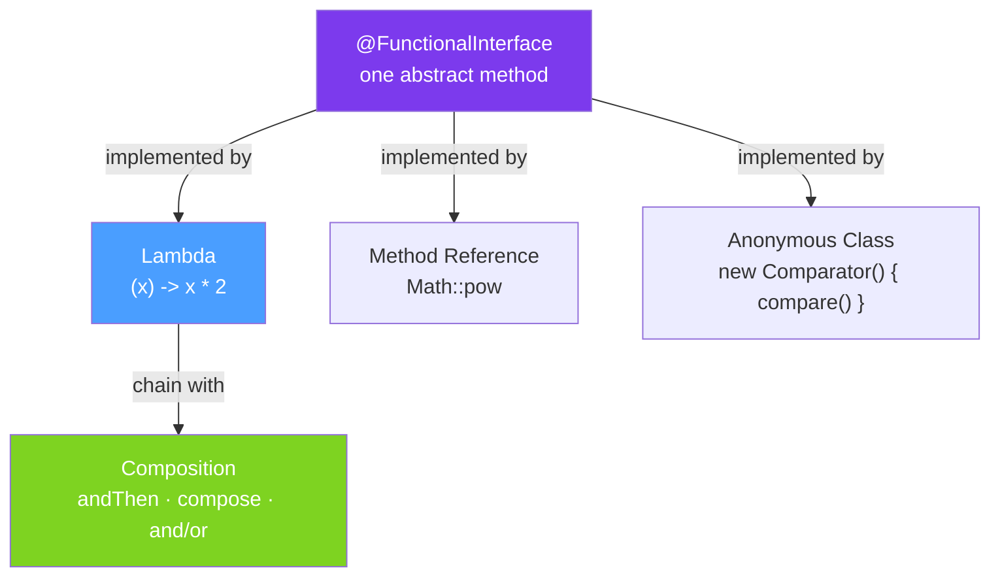

# 🔷 Functional Interfaces

> [!abstract] TL;DR
> A **functional interface** has exactly one abstract method (SAM — Single Abstract Method). Lambdas and method references are syntactic sugar for implementing functional interfaces. `java.util.function` provides the core set: **`Function<T,R>`** (transform), **`Predicate<T>`** (test), **`Consumer<T>`** (consume), **`Supplier<T>`** (produce), and their variants (`BiFunction`, `UnaryOperator`, `BinaryOperator`). Composition methods (`andThen`, `compose`, `and`, `or`, `negate`) let you chain these.

## Intuition — Pluggable Behaviour

Functional interfaces are **slots for behaviour** — method parameters that accept a chunk of logic. `List.sort(Comparator<T>)` accepts a comparison function as a parameter; before lambdas you'd create an anonymous class, now you write `list.sort((a, b) -> a.length() - b.length())`.

---

## How It Works



## Key Concepts / Details

### The Big 4 Functional Interfaces

```java
import java.util.function.*;

// 1. Function<T, R> — transform T into R
Function<String, Integer> length = s -> s.length();
Function<String, String> upper = String::toUpperCase;

// Apply
System.out.println(length.apply("hello"));  // 5
System.out.println(upper.apply("hello"));   // "HELLO"

// Compose: g.compose(f) = g(f(x)) — f runs first
Function<Integer, Integer> times2 = x -> x * 2;
Function<Integer, Integer> plus3 = x -> x + 3;
Function<Integer, Integer> times2ThenPlus3 = times2.andThen(plus3);  // +3 after *2
System.out.println(times2ThenPlus3.apply(5));  // (5*2)+3 = 13

// 2. Predicate<T> — boolean test on T
Predicate<String> isEmpty = String::isEmpty;
Predicate<String> isLong = s -> s.length() > 10;
Predicate<Integer> isEven = n -> n % 2 == 0;

// Compose predicates
Predicate<String> isNotEmptyAndLong = isEmpty.negate().and(isLong);
Predicate<String> isEmptyOrLong = isEmpty.or(isLong);

System.out.println(isEven.test(4));          // true
System.out.println(isNotEmptyAndLong.test("hello world!"));  // true

// 3. Consumer<T> — consume T, return nothing
Consumer<String> print = System.out::println;
Consumer<String> log = s -> logger.info("Processing: {}", s);
Consumer<String> printAndLog = print.andThen(log);  // chain consumers

printAndLog.accept("order-123");

// 4. Supplier<T> — produce T, take nothing
Supplier<List<String>> listFactory = ArrayList::new;
Supplier<UUID> idGenerator = UUID::randomUUID;
Supplier<LocalDateTime> now = LocalDateTime::now;

List<String> newList = listFactory.get();
UUID id = idGenerator.get();
```

### Bi-variants (Two Input Parameters)

```java
// BiFunction<T, U, R> — takes T and U, returns R
BiFunction<String, Integer, String> repeat = (s, n) -> s.repeat(n);
System.out.println(repeat.apply("ab", 3));  // "ababab"

// BiConsumer<T, U> — takes T and U, returns void
BiConsumer<String, Integer> indexPrint = (s, i) -> System.out.println(i + ": " + s);
indexPrint.accept("hello", 1);  // "1: hello"

// BiPredicate<T, U>
BiPredicate<String, Integer> longerThan = (s, n) -> s.length() > n;
System.out.println(longerThan.test("hello", 3));  // true

// BinaryOperator<T> — BiFunction where T, U, R are all same type
BinaryOperator<Integer> add = Integer::sum;
BinaryOperator<String> concat = String::concat;
System.out.println(add.apply(3, 4));  // 7
```

### Unary and Binary Operators

```java
// UnaryOperator<T> — Function<T, T> — same input and output type
UnaryOperator<String> trim = String::trim;
UnaryOperator<Integer> negate = x -> -x;
UnaryOperator<List<String>> sort = list -> { Collections.sort(list); return list; };

// BinaryOperator<T> — BiFunction<T, T, T> — same types for both inputs and output
BinaryOperator<Integer> max = Integer::max;
BinaryOperator<String> concat = (a, b) -> a + b;

// Used in Stream.reduce()
List<Integer> numbers = List.of(1, 2, 3, 4, 5);
Optional<Integer> sum = numbers.stream().reduce(BinaryOperator.identity());
// BinaryOperator.identity() returns a BinaryOperator that returns its first argument
```

### Primitive Specialisations — Performance

```java
// Boxing avoidance: IntFunction, LongFunction, DoubleFunction
// ToIntFunction<T>, ToLongFunction<T>, ToDoubleFunction<T>
// IntUnaryOperator, LongUnaryOperator, DoubleUnaryOperator

// IntFunction<R> vs Function<Integer, R> — avoids Integer autoboxing
IntFunction<String> intToStr = Integer::toString;
System.out.println(intToStr.apply(42));  // "42" — no boxing

// ToIntFunction<T> — returns primitive int, not Integer
ToIntFunction<String> strLen = String::length;
int len = strLen.applyAsInt("hello");  // primitive int, no boxing

// IntPredicate, LongPredicate, DoublePredicate
IntPredicate isPositive = n -> n > 0;
System.out.println(isPositive.test(5));  // true (primitive int)

// For performance-critical code processing millions of numbers, prefer primitive variants
LongStream.range(0, 1_000_000)
    .filter(n -> n % 2 == 0)  // LongPredicate — no boxing
    .sum();
```

### Custom Functional Interfaces

```java
// Sometimes you need a functional interface that throws checked exceptions
@FunctionalInterface
public interface ThrowingSupplier<T> {
    T get() throws Exception;

    // Wrapper to adapt to standard Supplier
    static <T> Supplier<T> wrap(ThrowingSupplier<T> supplier) {
        return () -> {
            try {
                return supplier.get();
            } catch (Exception e) {
                throw new RuntimeException(e);
            }
        };
    }
}

// Usage
Supplier<Connection> dbConn = ThrowingSupplier.wrap(() -> dataSource.getConnection());
```

### Core `java.util.function` Interfaces

| Interface | Signature | Method | Use |
|-----------|-----------|--------|-----|
| `Function<T,R>` | `T → R` | `apply(T)` | Transform, map |
| `Predicate<T>` | `T → boolean` | `test(T)` | Filter, test condition |
| `Consumer<T>` | `T → void` | `accept(T)` | Side effects, print, save |
| `Supplier<T>` | `() → T` | `get()` | Factory, lazy init |
| `BiFunction<T,U,R>` | `T,U → R` | `apply(T,U)` | Two-arg transform |
| `UnaryOperator<T>` | `T → T` | `apply(T)` | Transform same type |
| `BinaryOperator<T>` | `T,T → T` | `apply(T,T)` | Combine two of same type |
| `Comparator<T>` | `T,T → int` | `compare(T,T)` | Comparison |

## Real-World Notes

- **`Comparator` is a functional interface** — `Comparator.comparing(Order::getCreatedAt)` creates a `Comparator<Order>` as a lambda. Chain with `.thenComparing()` for multi-field sorting.
- **Composition is the key to reuse** — build complex behaviour by composing simple `Predicate` and `Function` values: `activeUsers.and(premiumUsers).and(notBanned)`.
- **`Predicate.not()` (Java 11)** — `Predicate.not(String::isEmpty)` is cleaner than `s -> !s.isEmpty()` for method references of negated conditions.
- **Functional interfaces are the basis of the Stream API** — every `stream.filter()`, `.map()`, `.forEach()` takes a functional interface. Understanding them makes Streams click.

## Common Pitfalls

- **Capturing mutable variables in lambdas** — lambdas capture variables from their scope; those variables must be effectively final. Mutating a captured variable is a compile error — and for good reason (thread safety).
- **Ignoring checked exceptions** — standard functional interfaces don't declare checked exceptions. Wrap checked code with `try-catch` inside the lambda or use a custom `ThrowingSupplier`-style wrapper.
- **Boxing overhead in tight loops** — `Function<Integer, Integer>` boxes every int. Use `IntUnaryOperator` for performance-critical code.
- **`Consumer.andThen()` vs direct chaining** — `consumer1.andThen(consumer2)` creates a new `Consumer` that runs both. This is how you compose side effects.

## Related Concepts
- [[Lambda_Expressions]] — lambda syntax that implements these interfaces
- [[Method_References]] — `Class::method` shorthand for lambdas
- [[Stream_API]] — uses functional interfaces for all operations

## Review Questions
1. What is the difference between `Function<T,R>` and `UnaryOperator<T>`?
2. Why does `Predicate.and(other)` implement AND logic while `Predicate.or(other)` implements OR?
3. What is the performance advantage of `IntPredicate` over `Predicate<Integer>`?

#java #functional #functional-interface #predicate #function #consumer #supplier
