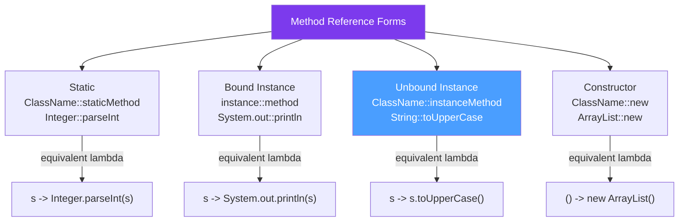

# 🔗 Method References

> [!abstract] TL;DR
> Method references (`::`) are shorthand lambdas that delegate to an **existing method**. Four forms: `ClassName::staticMethod`, `instance::instanceMethod`, `ClassName::instanceMethod` (instance method on first parameter), `ClassName::new` (constructor). They improve readability when the lambda does nothing but call a method. `String::toUpperCase` vs `s -> s.toUpperCase()` — same thing, shorter form.

## Intuition — Lambda as a Link to Existing Code

A method reference is like a **shortcut icon on your desktop** — it doesn't define new behaviour, it points to existing behaviour. `System.out::println` is an icon that opens `PrintStream.println`. Instead of writing `s -> System.out.println(s)`, you create a shortcut to the method itself.

---

## How It Works



## Key Concepts / Details

### Form 1: Static Method Reference

```java
// ClassName::staticMethod
// The lambda's parameters match the static method's parameters

// Integer.parseInt(String) → Function<String, Integer>
Function<String, Integer> parse = Integer::parseInt;
System.out.println(parse.apply("42"));  // 42

// Math.abs(int) → IntUnaryOperator
IntUnaryOperator abs = Math::abs;
System.out.println(abs.applyAsInt(-5));  // 5

// Objects.requireNonNull(T, String) → BiFunction<T, String, T>
BiFunction<String, String, String> nonNull = Objects::requireNonNull;

// String.valueOf(Object) → Function<Object, String>
Function<Object, String> stringify = String::valueOf;

// In streams
List<String> numStrings = List.of("1", "2", "3");
List<Integer> ints = numStrings.stream()
    .map(Integer::parseInt)   // s -> Integer.parseInt(s)
    .collect(Collectors.toList());
```

### Form 2: Bound Instance Method Reference

```java
// A specific instance's method
// instance::method — the instance is "bound" (captured)

PrintStream out = System.out;
Consumer<String> printer = out::println;  // = s -> out.println(s)
printer.accept("Hello!");  // "Hello!"

// String instance — bound to a specific string
String prefix = "Hello, ";
Function<String, String> greet = prefix::concat;  // = s -> prefix.concat(s)
System.out.println(greet.apply("World"));  // "Hello, World"

// Custom instance
List<String> names = new ArrayList<>(List.of("Charlie", "Alice"));
Consumer<String> addToList = names::add;  // = s -> names.add(s)
addToList.accept("Bob");
System.out.println(names);  // [Charlie, Alice, Bob]
```

### Form 3: Unbound Instance Method Reference

```java
// ClassName::instanceMethod — instance is NOT captured
// The first lambda parameter becomes the receiver (the object to call the method on)

// String::toUpperCase → Function<String, String>
// = s -> s.toUpperCase()
Function<String, String> upper = String::toUpperCase;
System.out.println(upper.apply("hello"));  // "HELLO"

// String::length → Function<String, Integer>
Function<String, Integer> len = String::length;
System.out.println(len.apply("hello"));  // 5

// String::startsWith → BiFunction<String, String, Boolean>
// First param = receiver, second param = argument to startsWith
BiFunction<String, String, Boolean> starts = String::startsWith;
System.out.println(starts.apply("hello", "hel"));  // true

// Most common in streams:
List<String> words = List.of("hello", "world", "java");
List<Integer> lengths = words.stream()
    .map(String::length)           // w -> w.length()
    .collect(Collectors.toList()); // [5, 5, 4]

List<String> upper2 = words.stream()
    .map(String::toUpperCase)      // w -> w.toUpperCase()
    .collect(Collectors.toList()); // [HELLO, WORLD, JAVA]

// Sorting with unbound method reference
List<String> sorted = words.stream()
    .sorted(String::compareTo)     // (a, b) -> a.compareTo(b)
    .collect(Collectors.toList());
```

### Form 4: Constructor Reference

```java
// ClassName::new → creates new instances

// No-arg constructor → Supplier<T>
Supplier<ArrayList<String>> listFactory = ArrayList::new;
ArrayList<String> list = listFactory.get();

Supplier<StringBuilder> sbFactory = StringBuilder::new;
StringBuilder sb = sbFactory.get();

// Single-arg constructor → Function<ArgType, T>
Function<Integer, ArrayList<String>> sizedList = ArrayList::new;  // new ArrayList<>(capacity)
ArrayList<String> sized = sizedList.apply(100);

Function<String, Integer> parseConstructor = Integer::new;  // new Integer(String) — deprecated but valid

// In Collectors.toCollection:
List<String> names = List.of("b", "a", "c");
TreeSet<String> sortedSet = names.stream()
    .collect(Collectors.toCollection(TreeSet::new));  // Supplier: () -> new TreeSet<>()

// In Stream.generate:
Stream<List<String>> lists = Stream.generate(ArrayList::new);  // infinite stream of new ArrayLists
```

### Choosing Between Lambda and Method Reference

```java
// Use method reference when: lambda body is ONLY a method call
// Use lambda when: there's extra logic, parameters need transformation, or clarity suffers

// Prefer method reference — cleaner
list.forEach(System.out::println);             // vs list.forEach(s -> System.out.println(s))
list.stream().map(String::trim).collect(...);  // vs .map(s -> s.trim())
list.sort(Comparator.naturalOrder());          // Comparator.naturalOrder() IS a reference

// Use lambda — method reference would be confusing
list.stream().filter(s -> s.length() > 3);    // s -> s.length() > 3 — clearer than lambda combination
list.stream().map(s -> s.substring(0, 3));    // argument transformation — no method ref for "first 3 chars"

// Ambiguous overload — method reference won't compile
// list.stream().forEach(System.out::println);  // works
// list.stream().map(String::valueOf);          // String.valueOf(Object), not String.valueOf(int)
// Be explicit when overloads cause ambiguity

// Negated predicate — use Predicate.not() in Java 11+
list.stream().filter(Predicate.not(String::isEmpty));  // cleaner than s -> !s.isEmpty()
```

### Method References in Sorting and Comparators

```java
// Comparator.comparing takes a key extractor function
List<Order> orders = getOrders();

// Sort by amount (ascending)
orders.sort(Comparator.comparing(Order::getAmount));

// Sort by created date (descending)
orders.sort(Comparator.comparing(Order::getCreatedAt).reversed());

// Sort by status, then by amount
orders.sort(Comparator.comparing(Order::getStatus)
    .thenComparing(Order::getAmount));

// Custom comparator with method reference
orders.sort(Comparator.comparing(Order::getCustomerId, String::compareToIgnoreCase));
```

## Real-World Notes

- **Method references are especially powerful in Stream chains** — a stream chain of `filter(Objects::nonNull).map(String::trim).map(String::toUpperCase)` reads like a description of what's happening, not how.
- **`Objects::nonNull` and `Objects::isNull`** — for filtering nulls, these are cleaner than `s -> s != null`. Combined with `Predicate.not()`: `Predicate.not(Objects::isNull)`.
- **Constructor references in Collectors** — `Collectors.toCollection(TreeSet::new)` is the idiomatic way to collect into specific collection types.
- **`Comparator.comparing()` accepts method references** — `comparing(Order::getCreatedAt)` automatically creates a `Comparator<Order>` from the key extractor. This is the primary use of unbound instance method references.

## Common Pitfalls

- **Ambiguous method references with overloaded methods** — `System.out::println` has 10 overloads. Java usually resolves correctly from context, but with ambiguous contexts you may need to add an explicit cast or use a lambda instead.
- **Static vs instance method reference confusion** — `Integer::parseInt` is STATIC. `String::toUpperCase` is INSTANCE (unbound). They look the same but one is `s -> Integer.parseInt(s)` and the other is `s -> s.toUpperCase()`.
- **Using method reference when lambda is clearer** — `s -> userService.findByEmail(s.trim().toLowerCase())` is clearer as a lambda than trying to force a method reference with multiple chained calls.
- **Generic method references** — `Collections::<String>sort` can be explicit about type parameters when inference fails, though this is rarely needed.

## Related Concepts
- [[Lambda_Expressions]] — method references are shorthand for lambdas
- [[Functional_Interfaces]] — method references implement the same interfaces as lambdas
- [[Stream_API]] — primary context where method references are used

## Review Questions
1. What are the four forms of method references and when is each used?
2. What is the difference between a bound and unbound instance method reference?
3. When should you prefer a lambda over a method reference?

#java #functional #method-references #lambda #comparator #stream
