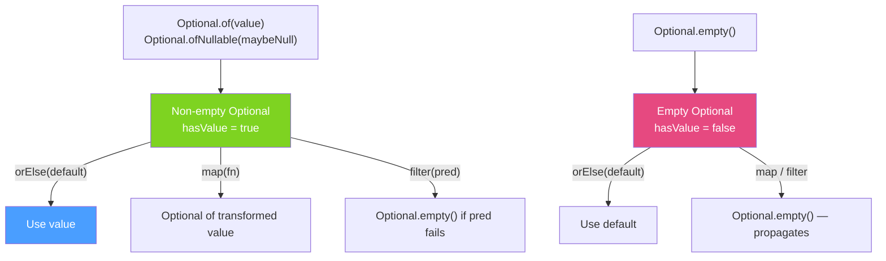

# 🎁 Optional Class

> [!abstract] TL;DR
> `Optional<T>` is a container that either holds a non-null value or is empty — replacing `null` returns to indicate "no value". Use it for **method return types** where "no result" is a valid outcome. Key methods: `of(val)` / `ofNullable(val)` / `empty()` to create; `isPresent()` / `isEmpty()` to check; `get()` / `orElse(default)` / `orElseThrow()` to retrieve; `map()` / `flatMap()` / `filter()` to transform; `ifPresent(consumer)` to consume. Anti-patterns: `if (optional.isPresent()) optional.get()` and `Optional` in fields/parameters.

## Intuition — A Box That May or May Not Contain Something

Optional is like a **package that may or may not have contents**. Instead of returning `null` (meaning: "there's no gift, and oh by the way, opening the box will throw NullPointerException"), you return an Optional (meaning: "here's the box — it might be empty, check before using the contents").

The traditional `null` forces every caller to remember to check. Optional **makes the absence explicit in the type system** — the compiler won't let you accidentally use the value without acknowledging it might be absent.

---

## How It Works



## Key Concepts / Details

### Creating Optionals

```java
// Optional.of(value) — value must be non-null (throws NullPointerException if null)
Optional<String> name = Optional.of("Alice");

// Optional.ofNullable(value) — safe: handles null
String maybeNull = getUserName(userId);  // might return null
Optional<String> safeName = Optional.ofNullable(maybeNull);

// Optional.empty() — explicitly empty
Optional<Order> noOrder = Optional.empty();

// Practical: method that might not find a result
public Optional<Order> findById(Long id) {
    return orderRepository.findById(id);  // Spring Data returns Optional<Order>
}

public Optional<User> findByEmail(String email) {
    User user = db.query("SELECT * FROM users WHERE email = ?", email);
    return Optional.ofNullable(user);  // null → empty Optional
}
```

### Retrieving Values — Safe Patterns

```java
Optional<Order> optOrder = findById(123L);

// 1. orElse — provide a default value (always evaluated)
Order order = optOrder.orElse(Order.defaultOrder());

// 2. orElseGet — lazy default (only evaluated if empty, better for expensive defaults)
Order order2 = optOrder.orElseGet(() -> createDefaultOrder());

// 3. orElseThrow — throw exception if empty (Java 10+ default throws NoSuchElementException)
Order order3 = optOrder.orElseThrow();  // throws NoSuchElementException if empty
Order order4 = optOrder.orElseThrow(() ->
    new OrderNotFoundException("Order not found: " + 123L));

// 4. ifPresent — consume if present (no return value)
optOrder.ifPresent(o -> emailService.sendConfirmation(o.getEmail()));

// 5. ifPresentOrElse (Java 9+) — consume if present, run runnable if empty
optOrder.ifPresentOrElse(
    o -> emailService.sendConfirmation(o.getEmail()),
    () -> log.warn("Order not found — skipping email")
);

// ANTI-PATTERN: isPresent() + get() — defeats the purpose of Optional
if (optOrder.isPresent()) {
    Order o = optOrder.get();  // same as null check — verbose, Optional's not helping
    processOrder(o);
}
// PREFERRED:
optOrder.ifPresent(this::processOrder);
// or:
optOrder.orElseThrow(() -> new OrderNotFoundException("..."));
```

### Transforming Optionals — `map` and `flatMap`

```java
// map — transform the value if present; propagates empty
Optional<Order> optOrder = findById(123L);

// Transform Order → String (customer name)
Optional<String> customerName = optOrder.map(Order::getCustomerName);

// Chain transformations
Optional<String> upperName = optOrder
    .map(Order::getCustomerName)
    .map(String::toUpperCase)
    .filter(name -> name.length() > 3);

// flatMap — when the transformation itself returns Optional
// Avoids Optional<Optional<T>> nesting
public Optional<Address> findUserAddress(Long userId) {
    return findUser(userId)        // Optional<User>
        .flatMap(User::getAddress);  // User.getAddress() returns Optional<Address>
    // Without flatMap: .map(User::getAddress) → Optional<Optional<Address>> — wrong!
}

// vs map — use map when fn returns T (not Optional<T>)
// vs flatMap — use flatMap when fn returns Optional<T>
Optional<String> email = findUser(123L)        // Optional<User>
    .map(User::getEmail)                        // User.getEmail() returns String (not Optional)
    .filter(email -> email.contains("@"));
```

### `filter` and `or` (Java 9+)

```java
// filter — keep value only if predicate passes
Optional<Order> highValue = findById(123L)
    .filter(o -> o.getAmount() > 1000);  // empty if amount <= 1000

// or — fallback Optional (Java 9+)
Optional<Order> order = findById(123L)
    .or(() -> findByLegacyId(oldId));  // try alternative if first is empty

// Difference: orElse returns T, or() returns Optional<T>
// Use or() when fallback might also be absent
```

### Converting Between Optional and Stream

```java
// Optional → Stream (Java 9+)
Optional<Order> optOrder = findById(123L);
Stream<Order> orderStream = optOrder.stream();  // empty stream or single-element stream

// Useful for flatMapping in streams
List<Long> ids = List.of(1L, 2L, 3L, 99L);  // 99L doesn't exist
List<Order> found = ids.stream()
    .map(this::findById)          // Stream<Optional<Order>>
    .flatMap(Optional::stream)    // Stream<Order> — empties disappear
    .collect(Collectors.toList());
// Equivalent to filtering out non-existent orders
```

### When to Use Optional

```java
// GOOD use cases:
// 1. Method return type when "not found" is a valid result
public Optional<User> findByEmail(String email) { /* ... */ }

// 2. Repository return types (Spring Data)
public Optional<Order> findById(Long id) { /* ... */ }

// 3. API that might not have a value
Optional<String> config = Optional.ofNullable(System.getProperty("app.mode"));

// BAD use cases:
// 1. Method parameters — use overloading or null instead
// void process(Optional<String> name) {}  // BAD
void process(String name) {}    // caller passes null if not available
void process() {}               // overload for no-name case

// 2. Fields in objects — not serializable, adds overhead
// class User { Optional<String> nickname; }  // BAD
class User { String nickname; }  // nullable field is simpler

// 3. Collections — use empty collection instead of Optional<Collection>
// Optional<List<Order>> getOrders() { }  // BAD
List<Order> getOrders() { return List.of(); }  // return empty list

// 4. In high-performance hot paths — Optional has allocation overhead
// In tight loops processing millions of items, avoid Optional allocation
```

### Optional Anti-Patterns to Avoid

```java
// ANTI-PATTERN 1: Optional of Optional
Optional<Optional<String>> doubleWrapped = Optional.of(Optional.of("hello"));  // never do this

// ANTI-PATTERN 2: isPresent() + get() (equivalent to null check — defeats the purpose)
if (opt.isPresent()) {
    String value = opt.get();  // BAD
}
// BETTER:
opt.ifPresent(value -> process(value));
String value = opt.orElse("default");

// ANTI-PATTERN 3: Optional.get() without check (throws NoSuchElementException if empty)
String value = opt.get();  // BAD — use orElseThrow() to be explicit

// ANTI-PATTERN 4: Optional.of(null) — throws NullPointerException
Optional<String> bad = Optional.of(null);  // NPE! Use Optional.ofNullable() instead

// ANTI-PATTERN 5: Optional in streams via isPresent() + get()
list.stream()
    .map(this::findById)
    .filter(Optional::isPresent)   // BAD — verbose
    .map(Optional::get)
    .collect(toList());
// BETTER (Java 9+):
list.stream()
    .map(this::findById)
    .flatMap(Optional::stream)     // GOOD — clean
    .collect(toList());
```

## Real-World Notes

- **Spring Data repositories return `Optional<T>`** — `findById()` returns `Optional<T>` by convention. All repositories should follow this pattern for single-entity lookups.
- **`orElseGet` vs `orElse` performance** — `orElse(createExpensiveDefault())` ALWAYS calls `createExpensiveDefault()` even when the Optional has a value. `orElseGet(() -> createExpensiveDefault())` only calls it when needed.
- **`Optional.ofNullable()` is the safe choice** — when you're unsure if a value can be null (external API, legacy code), use `ofNullable`. `of()` only when you are absolutely certain the value is non-null.
- **Java 17+ Records with Optional** — `record UserDTO(String name, Optional<String> nickname)` works but is somewhat controversial. Many prefer `@Nullable` annotations for DTOs and reserve Optional for return types only.

## Common Pitfalls

- **`Optional.get()` on empty Optional** — throws `NoSuchElementException`. Always use `orElse`, `orElseThrow`, or `ifPresent` instead of raw `get()`.
- **Nesting Optional** — if you find yourself with `Optional<Optional<T>>`, you missed a `flatMap` somewhere.
- **Optional in serialized forms** — `Optional` doesn't implement `Serializable`. Don't put it in `@Entity` fields or DTOs that are serialized with Java serialization.
- **Comparing Optionals** — `optional1.equals(optional2)` compares the contained values. Two empty Optionals are equal. `Optional.of("a").equals(Optional.of("a"))` is true.

## Related Concepts
- [[Stream_API]] — streams' terminal operations (`findFirst`, `min`, `max`) return Optional
- [[Lambda_Expressions]] — Optional methods accept lambdas (Consumer for `ifPresent`, Function for `map`)
- [[Functional_Interfaces]] — `map` takes Function, `filter` takes Predicate, `ifPresent` takes Consumer

## Review Questions
1. What is the difference between `map()` and `flatMap()` on Optional?
2. Why is `orElseGet(() -> expensiveDefault())` preferred over `orElse(expensiveDefault())`?
3. Why is Optional as a method parameter or field an anti-pattern?

#java #functional #optional #null-safety #map-flatmap #orElse
