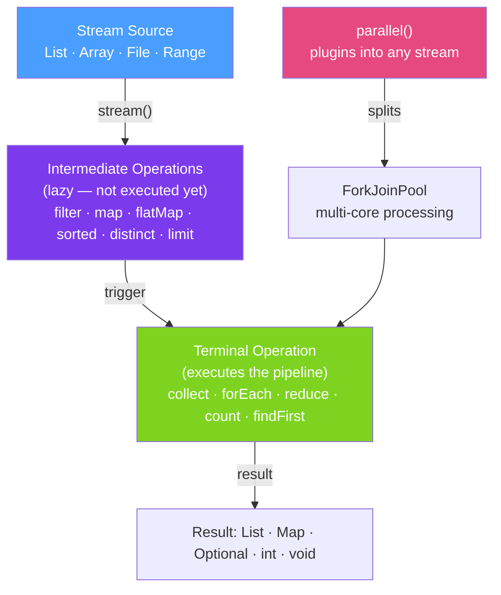

# 🌊 Stream API

> [!abstract] TL;DR
> `Stream<T>` represents a **lazy sequence of elements** processed through a pipeline of operations. Intermediate operations (`filter`, `map`, `flatMap`, `sorted`, `distinct`) are lazy — they don't execute until a terminal operation (`collect`, `forEach`, `reduce`, `count`, `findFirst`) triggers the pipeline. Streams can be **parallel** for multi-core processing. Key collectors: `toList()`, `toMap()`, `groupingBy()`, `joining()`, `counting()`.

## Intuition — Assembly Line, Not Loop

Traditional loops are like a **warehouse worker** visiting every item one at a time. Streams are like an **assembly line** — you specify what transformations to apply to each item (filter, then paint, then box), and items flow through the line. The line only runs when you press "start" (terminal operation). Pausing before the end (no terminal op) means nothing actually happens — that's lazy evaluation.

---

## How It Works



## Key Concepts / Details

### Creating Streams

```java
// From collection
List<String> names = List.of("Alice", "Bob", "Charlie");
Stream<String> streamFromList = names.stream();

// From array
String[] arr = {"a", "b", "c"};
Stream<String> streamFromArray = Arrays.stream(arr);

// Static factory
Stream<String> of = Stream.of("x", "y", "z");
Stream<String> empty = Stream.empty();

// Infinite streams (must use limit() or findFirst())
Stream<Integer> naturals = Stream.iterate(0, n -> n + 1);  // 0, 1, 2, 3, ...
Stream<Integer> odds = Stream.iterate(1, n -> n + 2);       // 1, 3, 5, 7, ...
Stream<Double> randoms = Stream.generate(Math::random);

// Numeric streams (avoid boxing)
IntStream range = IntStream.range(0, 10);      // 0..9 (exclusive end)
IntStream rangeClosed = IntStream.rangeClosed(1, 10);  // 1..10 (inclusive)
LongStream longs = LongStream.of(1L, 2L, 3L);

// Lines from file
Stream<String> lines = Files.lines(Path.of("data.txt"), StandardCharsets.UTF_8);
// IMPORTANT: close the stream after use — it holds a file handle
try (Stream<String> fileLines = Files.lines(Path.of("data.txt"))) {
    fileLines.forEach(System.out::println);
}
```

### Intermediate Operations

```java
List<Order> orders = getOrders();

// filter — keep elements matching predicate
List<Order> active = orders.stream()
    .filter(o -> o.getStatus() == Status.ACTIVE)
    .collect(Collectors.toList());

// map — transform each element
List<String> ids = orders.stream()
    .map(Order::getId)  // Order → String
    .collect(Collectors.toList());

// flatMap — flatten nested streams
List<List<OrderItem>> nestedItems = orders.stream()
    .map(Order::getItems)  // Stream<List<OrderItem>>
    .collect(Collectors.toList());

List<OrderItem> allItems = orders.stream()
    .flatMap(o -> o.getItems().stream())  // flatten → Stream<OrderItem>
    .collect(Collectors.toList());

// sorted — natural order or custom comparator
List<Order> sorted = orders.stream()
    .sorted(Comparator.comparing(Order::getAmount).reversed())
    .collect(Collectors.toList());

// distinct — remove duplicates (uses equals())
List<String> uniqueNames = orders.stream()
    .map(Order::getCustomerId)
    .distinct()
    .collect(Collectors.toList());

// limit / skip — pagination
List<Order> page2 = orders.stream()
    .sorted(Comparator.comparing(Order::getCreatedAt))
    .skip(20)   // skip first 20 (page 1)
    .limit(10)  // take next 10 (page 2)
    .collect(Collectors.toList());

// peek — debug without breaking the chain
orders.stream()
    .filter(o -> o.getAmount() > 100)
    .peek(o -> System.out.println("Processing: " + o.getId()))  // debug only
    .map(Order::getAmount)
    .forEach(System.out::println);
```

### Terminal Operations

```java
List<Integer> nums = List.of(1, 2, 3, 4, 5);

// forEach — consume each element
nums.stream().forEach(System.out::println);

// collect — gather into a collection
List<Integer> list = nums.stream().collect(Collectors.toList());
// Java 16+:
List<Integer> list2 = nums.stream().toList();  // unmodifiable list

// count — number of elements
long count = nums.stream().filter(n -> n > 2).count();  // 3

// reduce — combine elements into one
Optional<Integer> sum = nums.stream().reduce(Integer::sum);  // Optional (empty if empty stream)
int sumWithIdentity = nums.stream().reduce(0, Integer::sum);  // 0 is identity — never empty

// min / max
Optional<Integer> min = nums.stream().min(Comparator.naturalOrder());
Optional<Integer> max = nums.stream().max(Integer::compareTo);

// findFirst / findAny (findAny better for parallel)
Optional<Integer> first = nums.stream().filter(n -> n > 3).findFirst();
Optional<Integer> any = nums.stream().filter(n -> n > 3).findAny();

// anyMatch / allMatch / noneMatch — short-circuit evaluation
boolean anyBig = nums.stream().anyMatch(n -> n > 4);   // true (5 > 4)
boolean allPos = nums.stream().allMatch(n -> n > 0);    // true
boolean noneNeg = nums.stream().noneMatch(n -> n < 0);  // true

// toArray
Integer[] arr = nums.stream().toArray(Integer[]::new);
```

### Collectors — The Power of `collect()`

```java
List<Order> orders = getOrders();

// Basic collectors
List<Order> toList = orders.stream().collect(Collectors.toList());
Set<String> toSet = orders.stream().map(Order::getCustomerId).collect(Collectors.toSet());
String joined = orders.stream().map(Order::getId).collect(Collectors.joining(", ", "[", "]"));
// "[order-1, order-2, order-3]"

// toMap — to Map<K, V>
Map<String, Order> byId = orders.stream()
    .collect(Collectors.toMap(Order::getId, o -> o));
// Note: throws IllegalStateException on duplicate keys — add merge function:
Map<String, Order> safe = orders.stream()
    .collect(Collectors.toMap(Order::getId, o -> o, (existing, replacement) -> existing));

// groupingBy — group into Map<K, List<V>>
Map<Status, List<Order>> byStatus = orders.stream()
    .collect(Collectors.groupingBy(Order::getStatus));

// groupingBy with downstream collector
Map<Status, Long> countByStatus = orders.stream()
    .collect(Collectors.groupingBy(Order::getStatus, Collectors.counting()));

Map<String, Double> avgAmountByCustomer = orders.stream()
    .collect(Collectors.groupingBy(
        Order::getCustomerId,
        Collectors.averagingDouble(Order::getAmount)
    ));

Map<String, List<String>> orderIdsByCustomer = orders.stream()
    .collect(Collectors.groupingBy(
        Order::getCustomerId,
        Collectors.mapping(Order::getId, Collectors.toList())
    ));

// partitioningBy — split into true/false groups
Map<Boolean, List<Order>> partitioned = orders.stream()
    .collect(Collectors.partitioningBy(o -> o.getAmount() > 100));
List<Order> big = partitioned.get(true);
List<Order> small = partitioned.get(false);

// summarizingInt/Double/Long — statistics
IntSummaryStatistics stats = orders.stream()
    .collect(Collectors.summarizingInt(o -> (int) o.getAmount()));
System.out.println("Min: " + stats.getMin() + ", Max: " + stats.getMax() +
    ", Avg: " + stats.getAverage() + ", Sum: " + stats.getSum());
```

### Parallel Streams

```java
// Add .parallel() to use all available CPU cores
List<Order> orders = loadMillionOrders();

// CPU-intensive work — parallel helps
double totalRevenue = orders.parallelStream()
    .filter(o -> o.getStatus() == Status.COMPLETED)
    .mapToDouble(Order::getAmount)
    .sum();

// PITFALL: mutable shared state breaks parallelism
List<Order> result = new ArrayList<>();  // NOT thread-safe!
orders.parallelStream()
    .filter(o -> o.getAmount() > 100)
    .forEach(result::add);  // RACE CONDITION — don't do this

// CORRECT: use thread-safe collectors
List<Order> safeResult = orders.parallelStream()
    .filter(o -> o.getAmount() > 100)
    .collect(Collectors.toList());  // Collectors are thread-safe with parallel streams

// When NOT to use parallel:
// - Small collections (< 1000 elements) — fork/join overhead dominates
// - I/O-bound operations (network, DB) — all threads wait; no CPU speedup
// - Ordered operations that require sequential processing
// Use parallel only for CPU-intensive work on large in-memory datasets
```

### Lazy Evaluation Demo

```java
// Short-circuit: stream stops as soon as terminal op is satisfied
Optional<String> firstLong = Stream.of("hi", "hello", "world", "java")
    .filter(s -> s.length() > 4)
    .findFirst();
// Only processes "hi" (skip), "hello" (found) — stops. "world" and "java" are never processed.

// Lazy generation with limit
Stream.iterate(0, n -> n + 1)
    .filter(n -> n % 2 == 0)
    .limit(5)
    .forEach(System.out::println);
// Prints: 0, 2, 4, 6, 8 — generates only what's needed
```

## Real-World Notes

- **`Collectors.toUnmodifiableList()` or `stream.toList()`** — in Java 16+ prefer `stream.toList()` which returns an unmodifiable list directly. It's shorter and avoids accidental mutation.
- **`Files.lines()` must be closed** — it wraps a `BufferedReader` that holds a file descriptor. Always use try-with-resources: `try (Stream<String> lines = Files.lines(path)) { ... }`.
- **IntStream/LongStream/DoubleStream avoid boxing** — for numeric processing, avoid `Stream<Integer>` in favour of `IntStream`. Use `mapToInt()` to convert, `.boxed()` to convert back.
- **Streams are single-use** — once a terminal operation is called, the stream is "consumed" and cannot be reused. Calling a second terminal op throws `IllegalStateException`.

## Common Pitfalls

- **Modifying the source collection during iteration** — `list.stream().filter(...).forEach(list::remove)` → `ConcurrentModificationException`. Collect first, then modify.
- **Forgetting terminal operation** — intermediate operations without a terminal op do nothing. `stream.filter(p).map(f)` with no terminal op = zero processing.
- **Using `parallelStream()` everywhere** — parallel streams have overhead (fork/join). For small collections or I/O-bound work, sequential is faster.
- **`reduce()` without identity vs with identity** — without identity returns `Optional<T>` (could be empty). With identity returns `T` directly. Use the right form to avoid unnecessary Optional unwrapping.

## Related Concepts
- [[Functional_Interfaces]] — every stream operation takes a functional interface
- [[Optional_Class]] — `findFirst()`, `min()`, `max()` return Optional
- [[Lambda_Expressions]] — lambdas are the expressions passed to stream operations

## Review Questions
1. What is lazy evaluation in streams and why does `findFirst()` stop processing early?
2. What is the difference between `map()` and `flatMap()` in streams?
3. Why should you never share mutable state between lambdas in a parallel stream?

#java #functional #streams #collectors #lazy-evaluation #parallel-streams
