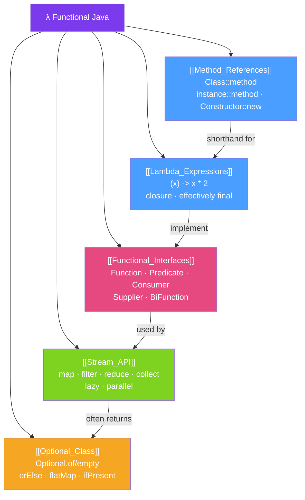

# λ Functional Java — Map of Content

> [!abstract] What This Section Covers
> Java 8 introduced functional programming features that transformed idiomatic Java: lambdas, Streams, Optional, method references, and functional interfaces. This section covers all five pillars. Mastering these is essential for modern Java — virtually all Java 8+ codebases use them heavily, and understanding them is required to read Spring, JDK, and library source code.

## Concept Map

## Learning Path
1. [[Functional_Interfaces]] — Understand the interfaces that lambdas implement.
2. [[Lambda_Expressions]] — Write lambdas and understand closures.
3. [[Method_References]] — Shorthand for lambdas using existing methods.
4. [[Stream_API]] — Chain operations on collections lazily and in parallel.
5. [[Optional_Class]] — Eliminate null checks with Optional.

## All Notes at a Glance
| Note | Difficulty | What You'll Learn |
|------|------------|-------------------|
| [[Functional_Interfaces]] | Beginner | Function, Predicate, Consumer, Supplier, composition |
| [[Lambda_Expressions]] | Beginner | Lambda syntax, closures, effectively final, capturing scope |
| [[Method_References]] | Beginner | ::, static/instance/constructor references |
| [[Stream_API]] | Intermediate | map/filter/reduce/collect, lazy evaluation, Collectors, parallel |
| [[Optional_Class]] | Intermediate | Optional.of/empty, orElse/orElseThrow, map/flatMap, anti-patterns |

## Key Questions This Section Answers
- What is the difference between `map()` and `flatMap()` in streams?
- Why must variables captured in a lambda be effectively final?
- When should you use `Optional` vs null vs throwing an exception?
- What is lazy evaluation in streams and why does it matter?
- How does `Collectors.groupingBy()` work?

## Related Sections
- [[_MOC_Java_Master|↑ Java Master MOC]]
- [[_MOC_Java_Networking|← Java Networking]]
- [[_MOC_Java_Patterns|→ Java Patterns]]

#MOC #java #functional #lambda #streams #optional #method-references
