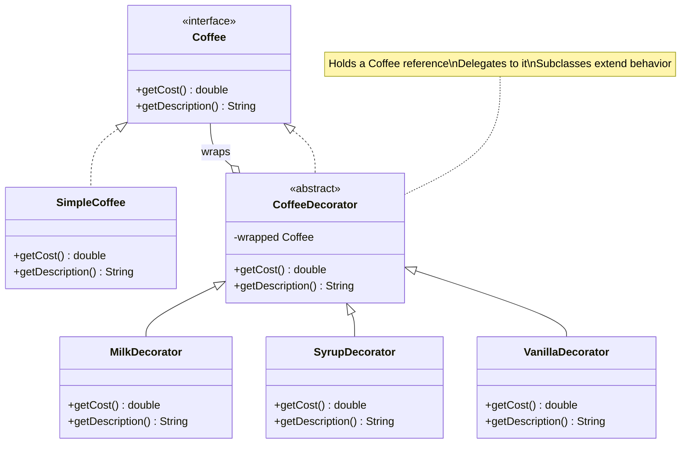

# 🎁 Decorator Pattern

> [!abstract] TL;DR
> The Decorator pattern wraps an object in another object implementing the same interface, transparently adding behavior before or after delegating to the wrapped object — enabling feature composition without inheritance and without combinatorial class explosion. Java's own `java.io` package is the canonical example: `new BufferedReader(new InputStreamReader(new FileInputStream("file.txt")))` stacks three decorators, each adding one capability (buffering, charset decoding, file reading). Unlike Proxy (which controls access with the same interface) the Decorator's intent is purely feature addition; unlike inheritance it allows runtime composition of arbitrary feature combinations.

---

## Intuition

A plain espresso shot (`SimpleCoffee`) costs $1. You hand it to a `MilkDecorator` — it wraps it, adds milk, and charges $0.50 more. Hand that to a `SyrupDecorator` — wraps again, adds syrup, $0.75 more. The barista (caller) treats the final object exactly like an espresso (same `Coffee` interface) but calling `getCost()` cascades through all three wrappers. No new `EspressoWithMilkAndSyrup` class needed — any combination is built at runtime.

---

## How It Works

### Decorator Class Diagram



---

## Key Concepts

### 1. Full Decorator Implementation

```java
// ── Step 1: Component interface ──────────────────────────────────────────
public interface Coffee {
    double getCost();
    String getDescription();
}

// ── Step 2: Concrete component (plain, undecorated object) ───────────────
public class SimpleCoffee implements Coffee {
    @Override public double getCost()          { return 1.00; }
    @Override public String getDescription()   { return "Espresso"; }
}

// ── Step 3: Abstract decorator — implements interface, wraps it ──────────
public abstract class CoffeeDecorator implements Coffee {
    protected final Coffee wrapped; // the object being decorated

    public CoffeeDecorator(Coffee coffee) {
        this.wrapped = coffee;
    }

    // Default: delegate to wrapped object (subclasses extend this)
    @Override public double getCost()        { return wrapped.getCost(); }
    @Override public String getDescription() { return wrapped.getDescription(); }
}

// ── Step 4: Concrete decorators — each adds one responsibility ───────────
public class MilkDecorator extends CoffeeDecorator {
    public MilkDecorator(Coffee coffee) { super(coffee); }

    @Override public double getCost()        { return super.getCost() + 0.50; }
    @Override public String getDescription() { return super.getDescription() + ", Milk"; }
}

public class SyrupDecorator extends CoffeeDecorator {
    private final String flavor;
    public SyrupDecorator(Coffee coffee, String flavor) {
        super(coffee);
        this.flavor = flavor;
    }

    @Override public double getCost()        { return super.getCost() + 0.75; }
    @Override public String getDescription() { return super.getDescription() + ", " + flavor + " Syrup"; }
}

public class LargeDecorator extends CoffeeDecorator {
    public LargeDecorator(Coffee coffee) { super(coffee); }

    @Override public double getCost()        { return super.getCost() * 1.5; } // 50% more
    @Override public String getDescription() { return "Large " + super.getDescription(); }
}

// ── Runtime composition ──────────────────────────────────────────────────
Coffee order1 = new MilkDecorator(new SimpleCoffee());
// Espresso + Milk = $1.50

Coffee order2 = new SyrupDecorator(new MilkDecorator(new SimpleCoffee()), "Caramel");
// Espresso + Milk + Caramel Syrup = $2.25

Coffee order3 = new LargeDecorator(new SyrupDecorator(new MilkDecorator(new SimpleCoffee()), "Vanilla"));
// Large (Espresso + Milk + Vanilla Syrup) = (1.00 + 0.50 + 0.75) * 1.5 = $3.375

System.out.println(order3.getDescription()); // Large Espresso, Milk, Vanilla Syrup
System.out.printf("Cost: $%.2f%n", order3.getCost()); // Cost: $3.38
```

### 2. Java I/O — The Classic Decorator Stack

```java
import java.io.*;
import java.nio.charset.StandardCharsets;

// Java I/O is the most famous real-world decorator chain:
//   FileInputStream       — concrete component (reads raw bytes from file)
//   InputStreamReader     — decorator: adds charset decoding (bytes → chars)
//   BufferedReader        — decorator: adds buffering (reduces syscalls)

try (BufferedReader reader = new BufferedReader(
        new InputStreamReader(
            new FileInputStream("/var/log/app.log"),
            StandardCharsets.UTF_8))) {

    String line;
    while ((line = reader.readLine()) != null) {
        System.out.println(line);
    }
}

// Can swap any layer independently:
// - Replace FileInputStream with GZIPInputStream to read compressed files
// - Same BufferedReader + InputStreamReader on top — zero changes to upper layers

try (BufferedReader gzipReader = new BufferedReader(
        new InputStreamReader(
            new java.util.zip.GZIPInputStream(
                new FileInputStream("/var/log/app.log.gz")),
            StandardCharsets.UTF_8))) {
    // identical code above works unchanged
}

// OutputStream decorator chain (writing):
try (PrintWriter pw = new PrintWriter(
        new BufferedWriter(
            new OutputStreamWriter(
                new FileOutputStream("/tmp/out.txt"),
                StandardCharsets.UTF_8)))) {
    pw.println("Decorated output");
}
```

### 3. Functional Decorators with `Function::andThen`

```java
import java.util.function.Function;

// In functional style, decorators are functions composed with andThen/compose
Function<String, String> trim     = String::strip;
Function<String, String> lower    = String::toLowerCase;
Function<String, String> addGreet = s -> "Hello, " + s + "!";

// Compose: apply trim, then lower, then addGreet
Function<String, String> pipeline = trim.andThen(lower).andThen(addGreet);

System.out.println(pipeline.apply("  ALICE  ")); // Hello, alice!

// Real-world: validation / transformation pipeline
Function<Order, Order> validateStock  = order -> { checkStock(order); return order; };
Function<Order, Order> applyDiscount  = order -> order.withDiscount(computeDiscount(order));
Function<Order, Order> addTax         = order -> order.withTax(TAX_RATE);

Function<Order, Order> orderPipeline =
    validateStock.andThen(applyDiscount).andThen(addTax);

Order processed = orderPipeline.apply(rawOrder);

// Decorator factory using generics
@FunctionalInterface
interface Transformer<T> extends Function<T, T> {}

Transformer<String> maskEmail = s -> s.replaceAll("(?<=.{2}).(?=.*@)", "*");
Transformer<String> truncate  = s -> s.length() > 50 ? s.substring(0, 47) + "..." : s;

Transformer<String> sanitize  = ((Transformer<String>) maskEmail).andThen(truncate)::apply;
// Note: functional decorators compose without the class hierarchy
```

### 4. Decorator for Cross-Cutting Concerns (Logger, Metrics)

```java
// Interface
public interface OrderService {
    Order createOrder(CreateOrderRequest req);
    Order getOrder(Long id);
}

// Real implementation
@Service
public class OrderServiceImpl implements OrderService {
    @Override public Order createOrder(CreateOrderRequest req) { /* DB logic */ return order; }
    @Override public Order getOrder(Long id) { /* DB query */ return order; }
}

// Logging decorator — wraps without modifying the original
public class LoggingOrderService implements OrderService {
    private final OrderService delegate;
    private final Logger log = LoggerFactory.getLogger(getClass());

    public LoggingOrderService(OrderService delegate) {
        this.delegate = delegate;
    }

    @Override
    public Order createOrder(CreateOrderRequest req) {
        log.info("Creating order for user {}", req.userId());
        Instant start = Instant.now();
        try {
            Order result = delegate.createOrder(req);
            log.info("Order {} created in {}ms", result.id(),
                Duration.between(start, Instant.now()).toMillis());
            return result;
        } catch (Exception e) {
            log.error("Order creation failed: {}", e.getMessage());
            throw e;
        }
    }

    @Override
    public Order getOrder(Long id) {
        log.debug("Fetching order {}", id);
        return delegate.getOrder(id);
    }
}

// Metrics decorator — stacks on top of logging decorator
public class MeteredOrderService implements OrderService {
    private final OrderService delegate;
    private final MeterRegistry registry;

    @Override
    public Order createOrder(CreateOrderRequest req) {
        return registry.timer("order.create").record(() -> delegate.createOrder(req));
    }

    @Override
    public Order getOrder(Long id) {
        return registry.timer("order.get").record(() -> delegate.getOrder(id));
    }
}

// Composition — outermost is MeteredOrderService → LoggingOrderService → OrderServiceImpl
OrderService service = new MeteredOrderService(
    new LoggingOrderService(
        new OrderServiceImpl(orderRepo, paymentClient)));
```

### 5. Decorator vs Proxy vs Inheritance

| Dimension | Decorator | Proxy | Inheritance |
|-----------|-----------|-------|-------------|
| Intent | Add features | Control access | Extend/specialize |
| Same interface | Yes | Yes | Via polymorphism |
| Transparency to client | Yes | Yes | Yes |
| Runtime vs compile-time | Runtime composition | Usually compile-time | Compile-time |
| Stack combinability | Yes — N layers | No — usually one | No — class hierarchy explodes |
| Spring AOP equivalent | Bean wrapping | `@Transactional`, `@Cacheable` (proxy) | Not applicable |
| Classic Java example | `java.io` streams | `java.lang.reflect.Proxy` | Template Method |

### 6. Spring's BeanDefinitionDecorator

```java
// Spring internally uses the Decorator pattern when processing beans with
// BeanDefinitionDecorator — custom XML namespace handlers or bean post-processors
// wrap a BeanDefinition to add additional metadata before the bean is instantiated.

// Spring @Cacheable is implemented as a Proxy-based Decorator:
@Service
public class CatalogService {

    @Cacheable("products")           // Spring wraps this bean in a caching proxy (decorator)
    public Product findProduct(Long id) {
        return productRepository.findById(id).orElseThrow();
    }

    @Transactional                   // Another proxy decorator layer for transaction management
    public Product saveProduct(Product p) {
        return productRepository.save(p);
    }
}
// At runtime: client → TransactionProxy → CachingProxy → CatalogService
// Each proxy is a decorator — same interface, adds behavior, delegates to next
```

---

## Real-World Notes

- **Spring Security filter chain**: Each `SecurityFilterChain` is a chain of filters — each filter is a decorator wrapping the next one, adding authentication/authorization behavior before delegating.
- **Resilience4j**: `CircuitBreaker`, `RateLimiter`, and `Retry` wrappers are decorators — wrap any `Supplier<T>` or `Function<T,R>` with resilience behavior without coupling to implementation.
- **Servlet filters**: `HttpServletRequestWrapper` and `HttpServletResponseWrapper` are explicit decorator classes in the Jakarta API — extend them to add CORS headers, gzip encoding, or request logging.
- **Spring's `RestTemplate` interceptors**: `ClientHttpRequestInterceptor` decorates the request/response pipeline — add auth headers, log calls, inject tracing — without modifying the template or handler.

---

## Common Pitfalls

| Pitfall | Consequence | Fix |
|---------|-------------|-----|
| Forgetting to delegate | Decorator silently swallows calls to wrapped object | Always call `super.method()` or `wrapped.method()` in every overridden method |
| Decorator accumulates state from multiple layers | Inconsistent behavior — `getDescription()` misses a layer | Ensure every decorator's override calls `super` before adding its fragment |
| Deep wrapping makes debugging hard | Stack traces show decorator, not the real implementation | Use IDE "Step Into" to navigate; log at each decorator layer |
| Using Decorator when Proxy intent applies | Semantically confusing codebase | Decorator adds features; Proxy controls access — use the right term in code reviews |
| Combinatorial test coverage | N decorators × M combinations = O(N×M) test cases | Test each decorator in isolation; integration-test representative stacks |

---

## Related Notes

- [[_MOC_Java_Patterns|↑ Section MOC — Java Patterns]]
- [[Strategy_Pattern]] — both use composition; Strategy replaces the whole algorithm, Decorator adds to it
- [[Template_Method_Pattern]] — inheritance-based alternative; less flexible but simpler
- [[Observer_Pattern]] — another structural composition; push vs wrap model

---

## Review Questions

1. Java's `BufferedReader` wraps `InputStreamReader` which wraps `FileInputStream`. Trace exactly what happens when you call `bufferedReader.readLine()` — describe the call chain through each decorator layer and what each layer contributes.

2. A team implements logging, caching, and metrics for `OrderService` using three separate decorator classes. A fourth cross-cutting concern (rate limiting) needs to be added. Compare the effort with: (a) Decorator pattern — add a fourth wrapper class, and (b) Spring AOP — add a `@RateLimiter` aspect. When would you prefer one over the other?

3. Explain the key difference in intent between `java.lang.reflect.Proxy` and the Decorator pattern using the `OrderService` logging example. Both produce an object that implements `OrderService` and delegates to the real one — what is conceptually different?

---

#Java #Java_Patterns #Decorator #StructuralPattern #DesignPatterns #Composition #Intermediate
