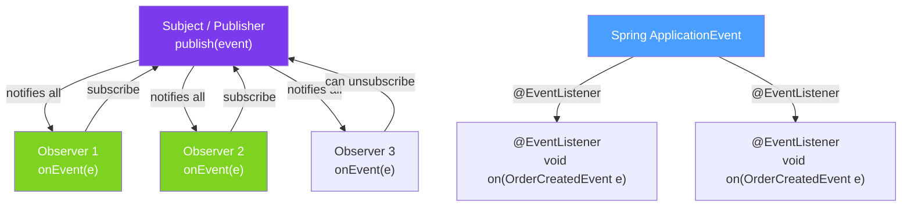

# 👁️ Observer Pattern

> [!abstract] TL;DR
> The Observer pattern defines a **one-to-many dependency**: when one object (the "subject" or "publisher") changes state, all its "observers" (subscribers, listeners) are notified automatically. This decouples producers from consumers — the subject doesn't know who's listening. Java implementations: `java.util.Observable` (deprecated), custom listener interfaces, Spring's `ApplicationEvent` + `@EventListener`, and Guava's `EventBus`.

## Intuition — A News Subscription

The Observer pattern is like a **news subscription**: the newspaper (subject) produces articles, and all subscribers (observers) receive them. The newspaper doesn't know who subscribes — it just publishes. Subscribers can subscribe or unsubscribe at any time. Multiple subscribers get the same news independently.

The alternative — the newspaper directly calling each subscriber's phone — creates tight coupling. With a subscription model, both sides only know about the news/event type, not each other.

---

## How It Works



## Key Concepts / Details

### Classic Observer — Manual Implementation

```java
// Observer interface
public interface OrderEventListener {
    void onOrderCreated(Order order);
    void onOrderCancelled(Order order, String reason);
}

// Subject (maintains list of observers)
public class OrderService {
    private final List<OrderEventListener> listeners = new CopyOnWriteArrayList<>();

    public void addListener(OrderEventListener listener) {
        listeners.add(listener);
    }

    public void removeListener(OrderEventListener listener) {
        listeners.remove(listener);
    }

    public Order createOrder(CreateOrderRequest req) {
        Order order = repository.save(new Order(req));
        // Notify all observers
        listeners.forEach(l -> l.onOrderCreated(order));
        return order;
    }

    public void cancelOrder(Long id, String reason) {
        Order order = repository.findById(id).orElseThrow();
        order.cancel(reason);
        repository.save(order);
        listeners.forEach(l -> l.onOrderCancelled(order, reason));
    }
}

// Observer implementations
public class EmailNotificationService implements OrderEventListener {
    @Override
    public void onOrderCreated(Order order) {
        emailService.send(order.getEmail(), "Order confirmed: " + order.getId());
    }
    @Override
    public void onOrderCancelled(Order order, String reason) {
        emailService.send(order.getEmail(), "Order cancelled: " + reason);
    }
}

public class AnalyticsService implements OrderEventListener {
    @Override
    public void onOrderCreated(Order order) {
        analyticsClient.track("order_created", order.getAmount());
    }
    @Override
    public void onOrderCancelled(Order order, String reason) {
        analyticsClient.track("order_cancelled");
    }
}

// Wire up
orderService.addListener(new EmailNotificationService(emailService));
orderService.addListener(new AnalyticsService(analyticsClient));
```

### Functional Observer — Lambdas

```java
// Use functional interfaces for single-method observers
@FunctionalInterface
public interface OrderListener {
    void onOrder(Order order);
}

public class OrderService {
    private final Map<String, List<OrderListener>> listeners = new ConcurrentHashMap<>();

    public void on(String eventType, OrderListener listener) {
        listeners.computeIfAbsent(eventType, k -> new CopyOnWriteArrayList<>()).add(listener);
    }

    private void emit(String eventType, Order order) {
        listeners.getOrDefault(eventType, List.of()).forEach(l -> l.onOrder(order));
    }

    public Order createOrder(CreateOrderRequest req) {
        Order order = repository.save(new Order(req));
        emit("created", order);
        return order;
    }
}

// Usage — lambda as observer
orderService.on("created", order -> emailService.send(order.getEmail(), "Confirmed!"));
orderService.on("created", order -> analytics.track("order_created"));
orderService.on("created", order -> inventoryService.reserve(order));
```

### Spring `ApplicationEvent` — The Idiomatic Spring Way

```java
// 1. Define event class
public class OrderCreatedEvent extends ApplicationEvent {
    private final Order order;

    public OrderCreatedEvent(Object source, Order order) {
        super(source);
        this.order = order;
    }
    public Order getOrder() { return order; }
}

// 2. Publish events from the subject
@Service
public class OrderService {
    @Autowired ApplicationEventPublisher eventPublisher;

    @Transactional
    public Order createOrder(CreateOrderRequest req) {
        Order order = repository.save(new Order(req));
        // Publish event — all listeners in the same transaction
        eventPublisher.publishEvent(new OrderCreatedEvent(this, order));
        return order;
    }
}

// 3. Listen to events (any Spring bean)
@Service
public class EmailService {
    @EventListener
    public void onOrderCreated(OrderCreatedEvent event) {
        Order order = event.getOrder();
        sendConfirmationEmail(order);
    }
}

@Service
public class InventoryService {
    @EventListener
    public void reserveStock(OrderCreatedEvent event) {
        inventoryRepository.reserve(event.getOrder().getProductId());
    }
}

// Async listener — runs in separate thread (enable with @EnableAsync)
@Service
public class AnalyticsService {
    @Async
    @EventListener
    public void trackOrder(OrderCreatedEvent event) {
        // Runs asynchronously — doesn't block the order creation transaction
        analyticsClient.track("order_created", event.getOrder().getAmount());
    }
}

// Conditional listener — only handle certain events
@Service
public class PremiumOrderService {
    @EventListener(condition = "#event.order.amount > 1000")  // SpEL condition
    public void onHighValueOrder(OrderCreatedEvent event) {
        assignDedicatedRepresentative(event.getOrder());
    }
}

// Simpler: use plain POJO event (Spring 4.2+)
public record OrderCreatedEvent(Order order) {}  // No need to extend ApplicationEvent

@Service
public class OrderService {
    @Autowired ApplicationEventPublisher eventPublisher;

    public Order createOrder(CreateOrderRequest req) {
        Order order = repository.save(new Order(req));
        eventPublisher.publishEvent(new OrderCreatedEvent(order));  // plain object event
        return order;
    }
}
```

### Transaction-Bound Events — `@TransactionalEventListener`

```java
// Problem: @EventListener runs in the same transaction.
// If you send an email inside the transaction and then the transaction rolls back,
// the email was already sent for an order that doesn't exist.

// Solution: @TransactionalEventListener — bind listener to transaction phase
@Service
public class EmailService {

    // AFTER_COMMIT (default) — only send if transaction commits
    @TransactionalEventListener(phase = TransactionPhase.AFTER_COMMIT)
    public void sendConfirmation(OrderCreatedEvent event) {
        emailService.send(event.getOrder().getEmail(), "Order confirmed");
    }

    // AFTER_ROLLBACK — send failure notification if order creation fails
    @TransactionalEventListener(phase = TransactionPhase.AFTER_ROLLBACK)
    public void notifyFailure(OrderCreatedEvent event) {
        log.error("Order creation failed: {}", event.getOrder().getId());
    }

    // BEFORE_COMMIT — rare, runs before commit (still in transaction)
    @TransactionalEventListener(phase = TransactionPhase.BEFORE_COMMIT)
    public void preCommitAudit(OrderCreatedEvent event) {
        auditLog.record(event);  // in same transaction — rolls back if commit fails
    }
}
```

### Observer vs Message Broker Comparison

| Approach | Coupling | Scope | Failure isolation | Use Case |
|----------|----------|-------|------------------|---------|
| Direct listener | Tight (same JVM) | Single process | No | Simple in-process events |
| Spring `@EventListener` | Loose (same JVM) | Single process | Partial (`@Async`) | Spring Boot application events |
| Kafka/RabbitMQ | Loose (network) | Cross-service | Full | Microservice integration |
| Guava EventBus | Loose (same JVM) | Single thread or async | No | Legacy apps, simple cases |

## Real-World Notes

- **`@TransactionalEventListener` prevents phantom notifications** — never use `@EventListener` alone for events that trigger external side effects (emails, payments). Use `AFTER_COMMIT` to ensure the transaction succeeded.
- **Spring events are synchronous by default** — all `@EventListener` methods run in the publisher's thread, in the publisher's transaction. Use `@Async` for listeners that should not block the publisher.
- **Event classes should be immutable** — use records or final classes with only getters. Multiple listeners receive the same event object; mutating it would affect others.
- **For cross-service communication, use message brokers** — Spring's in-process event bus works within one JVM. For multiple services, publish events to Kafka or RabbitMQ instead.

## Common Pitfalls

- **Throwing exceptions in listeners** — if a synchronous `@EventListener` throws an uncaught exception, the publisher's transaction may be rolled back unexpectedly. Always wrap listener logic in try-catch.
- **Circular event dependencies** — listener A's action publishes event B, whose listener publishes event A. This creates infinite loops. Design event flows as a DAG.
- **Memory leaks in manual registration** — if observers are registered but never removed, they accumulate. Use `WeakReference` or ensure lifecycle management removes listeners on bean destruction.
- **`@Async` without `@EnableAsync`** — `@Async` is silently ignored without `@EnableAsync` on a configuration class. Enable it globally in your `@SpringBootApplication` class.

## Related Concepts
- [[Strategy_Pattern]] — both decouple behaviour, but Strategy selects one algorithm, Observer notifies many listeners
- [[Decorator_Pattern]] — Spring filter chain is both decorator and observer-like

## Review Questions
1. What is the difference between `@EventListener` and `@TransactionalEventListener(AFTER_COMMIT)`?
2. Why should you use `@Async` on event listeners that perform external side effects?
3. How does the Observer pattern decouple the publisher from subscribers?

#java #design-patterns #observer #event-listener #spring-events #pubsub
