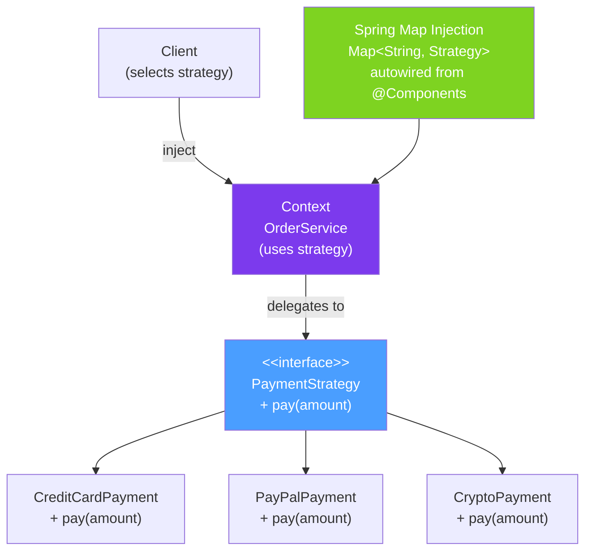

# 🎯 Strategy Pattern

> [!abstract] TL;DR
> The Strategy pattern defines a family of algorithms, encapsulates each one as a class (or lambda), and makes them interchangeable. The context uses one strategy at a time but can switch at runtime. In modern Java, **lambdas replace Strategy classes** for simple single-method strategies. In Spring, the **`Map<String, StrategyInterface>` injection pattern** allows selecting strategies by type at runtime without explicit if-else chains.

## Intuition — Interchangeable Navigation Algorithms

A GPS app that routes you home has multiple strategies: fastest route, shortest route, avoid tolls, avoid highways. The car (context) uses one strategy at a time, and you can switch the strategy without changing the car. The car just says "give me the route from A to B" — the strategy decides how.

Without Strategy, you'd have `if (mode == FASTEST) { ... } else if (mode == SHORTEST) { ... }` — every new mode requires changing the car. With Strategy, you add a new `RoutingStrategy` class and register it — the car never changes.

---

## How It Works



## Key Concepts / Details

### Classic Strategy — Interface + Implementations

```java
// Strategy interface
public interface PaymentStrategy {
    void pay(double amount, String currency);
    String getStrategyName();
}

// Concrete strategies
@Component("CREDIT_CARD")
public class CreditCardPayment implements PaymentStrategy {
    @Autowired private CreditCardGateway gateway;

    @Override
    public void pay(double amount, String currency) {
        gateway.charge(amount, currency);
        log.info("Charged {} {} via credit card", amount, currency);
    }

    @Override
    public String getStrategyName() { return "CREDIT_CARD"; }
}

@Component("PAYPAL")
public class PayPalPayment implements PaymentStrategy {
    @Autowired private PayPalClient paypal;

    @Override
    public void pay(double amount, String currency) {
        paypal.initiatePayment(amount, currency);
        log.info("Initiated {} {} via PayPal", amount, currency);
    }

    @Override
    public String getStrategyName() { return "PAYPAL"; }
}

@Component("BANK_TRANSFER")
public class BankTransferPayment implements PaymentStrategy {
    @Autowired private BankApiClient bankApi;

    @Override
    public void pay(double amount, String currency) {
        bankApi.initiateTransfer(amount, currency);
    }

    @Override
    public String getStrategyName() { return "BANK_TRANSFER"; }
}
```

### Spring Map Injection — The Idiomatic Spring Strategy

```java
// Spring automatically injects ALL PaymentStrategy beans into a Map
// Key = bean name (@Component("CREDIT_CARD") → key is "CREDIT_CARD")
@Service
public class PaymentService {

    // Spring populates this map: {"CREDIT_CARD" → CreditCardPayment, "PAYPAL" → PayPalPayment, ...}
    private final Map<String, PaymentStrategy> strategies;

    @Autowired
    public PaymentService(Map<String, PaymentStrategy> strategies) {
        this.strategies = strategies;
    }

    public void processPayment(Order order) {
        String paymentMethod = order.getPaymentMethod();  // e.g., "CREDIT_CARD"

        PaymentStrategy strategy = strategies.get(paymentMethod);
        if (strategy == null) {
            throw new UnsupportedPaymentMethodException(
                "Unknown payment method: " + paymentMethod);
        }

        strategy.pay(order.getAmount(), order.getCurrency());
    }
}

// Adding a new payment method = add new @Component class
// PaymentService never changes — Open/Closed Principle
@Component("APPLE_PAY")
public class ApplePayPayment implements PaymentStrategy {
    @Override
    public void pay(double amount, String currency) { /* ... */ }
    @Override
    public String getStrategyName() { return "APPLE_PAY"; }
}
```

### Lambda Strategies — Replacing Simple Strategy Classes

```java
// For simple single-method strategies, lambdas replace entire classes
@FunctionalInterface
public interface DiscountStrategy {
    double calculateDiscount(Order order);
}

@Service
public class PricingService {

    // Map of strategies — defined as lambdas (no separate class needed)
    private final Map<CustomerType, DiscountStrategy> discounts = Map.of(
        CustomerType.STANDARD,  order -> 0.0,                           // no discount
        CustomerType.LOYAL,     order -> order.getAmount() * 0.10,      // 10% off
        CustomerType.VIP,       order -> order.getAmount() * 0.20,      // 20% off
        CustomerType.EMPLOYEE,  order -> order.getAmount() * 0.40       // 40% off
    );

    public double finalPrice(Order order, CustomerType customerType) {
        DiscountStrategy strategy = discounts.getOrDefault(
            customerType, order -> 0.0  // default: no discount
        );
        double discount = strategy.calculateDiscount(order);
        return order.getAmount() - discount;
    }
}
```

### Dynamic Strategy Selection

```java
// Strategies with complex selection logic — use a factory/resolver
@Service
public class ShippingStrategyResolver {

    private final Map<String, ShippingStrategy> strategies;
    @Autowired List<ShippingStrategy> strategyList;

    @PostConstruct
    public void init() {
        // Map by capability: strategy that can handle the shipment
    }

    // Strategy selected at runtime based on order characteristics
    public ShippingStrategy resolve(Order order) {
        // Try express if requested and available
        if (order.isExpress()) {
            return strategies.entrySet().stream()
                .filter(e -> e.getValue().supportsExpress(order))
                .map(Map.Entry::getValue)
                .findFirst()
                .orElseThrow(() -> new NoShippingStrategyException("No express available"));
        }

        // Select by destination country
        return strategies.entrySet().stream()
            .filter(e -> e.getValue().supportsDestination(order.getDestinationCountry()))
            .map(Map.Entry::getValue)
            .min(Comparator.comparingDouble(s -> s.estimatedCost(order)))  // cheapest
            .orElseThrow(() -> new NoShippingStrategyException("Cannot ship to " + order.getDestinationCountry()));
    }
}
```

### Sorting as Strategy — Comparator

```java
// Comparator IS the Strategy pattern — pluggable comparison algorithm
// Java's sort() delegates to the strategy (Comparator)
List<Order> orders = getOrders();

// Different strategies for sorting
Comparator<Order> byAmount = Comparator.comparing(Order::getAmount);
Comparator<Order> byDate = Comparator.comparing(Order::getCreatedAt);
Comparator<Order> byCustomer = Comparator.comparing(Order::getCustomerId);
Comparator<Order> byAmountDesc = byAmount.reversed();

// Select strategy at runtime
Map<String, Comparator<Order>> sortStrategies = Map.of(
    "amount", byAmount,
    "date", byDate,
    "customer", byCustomer
);

String sortParam = request.getParam("sort");  // "amount" from HTTP request
Comparator<Order> selectedStrategy = sortStrategies.getOrDefault(sortParam, byDate);
orders.sort(selectedStrategy);
```

### Validation as Strategy

```java
// Chain of validation strategies
@FunctionalInterface
public interface ValidationRule<T> {
    ValidationResult validate(T item);
}

public class OrderValidator {
    private final List<ValidationRule<Order>> rules = List.of(
        order -> order.getAmount() > 0
            ? ValidationResult.ok()
            : ValidationResult.error("Amount must be positive"),
        order -> order.getCustomerId() != null && !order.getCustomerId().isBlank()
            ? ValidationResult.ok()
            : ValidationResult.error("Customer ID required"),
        order -> order.getItems() != null && !order.getItems().isEmpty()
            ? ValidationResult.ok()
            : ValidationResult.error("Order must have at least one item")
    );

    public List<String> validate(Order order) {
        return rules.stream()
            .map(rule -> rule.validate(order))
            .filter(ValidationResult::isError)
            .map(ValidationResult::getMessage)
            .collect(Collectors.toList());
    }
}
```

### Strategy vs If-Else Comparison

```java
// BAD: if-else chain (violates Open/Closed Principle)
public void pay(String method, double amount) {
    if (method.equals("CREDIT_CARD")) {
        creditCardGateway.charge(amount);
    } else if (method.equals("PAYPAL")) {
        paypal.initiate(amount);
    } else if (method.equals("BANK_TRANSFER")) {
        bank.transfer(amount);
    }
    // Every new method requires modifying this class
}

// GOOD: Strategy pattern (Open/Closed)
public void pay(String method, double amount) {
    strategies.get(method).pay(amount);  // never changes
    // Adding new method = add new class, not modify existing
}
```

## Real-World Notes

- **Spring's DI makes Strategy trivial** — auto-populating `Map<String, StrategyInterface>` from `@Component` beans is the most elegant Strategy implementation in Java. Zero factory code needed.
- **Lambdas replace trivial Strategy classes** — for strategies that are just one expression (discount calculation, validation rule), lambdas are more concise. Use classes when the strategy needs injected dependencies.
- **`Comparator` IS a Strategy in Java's API** — `List.sort(comparator)`, `TreeMap(comparator)`, `PriorityQueue(comparator)` all use the Strategy pattern with `Comparator` as the algorithm interface.
- **Chain of Responsibility is a list of strategies** — when multiple strategies try to handle a request in sequence (Spring Security filters, Servlet filters), that's Chain of Responsibility — closely related to Strategy.

## Common Pitfalls

- **Stateful strategy classes** — if a strategy holds per-request state, it cannot be a Spring singleton. Either inject state via method parameters or use `@Scope("prototype")`.
- **Null strategy** — always provide a default strategy or throw a meaningful exception when no strategy is found. A `NullPointerException` when calling `strategies.get(key)` is confusing.
- **Over-engineering with Strategy** — for code paths that will never change (2-3 fixed cases), a `switch` expression is cleaner than full Strategy pattern. Apply when behaviour needs to be extended.

## Related Concepts
- [[Template_Method_Pattern]] — Strategy selects whole algorithm; Template Method varies steps within a fixed algorithm
- [[Observer_Pattern]] — Observer notifies many; Strategy selects one algorithm for a context
- [[Functional_Interfaces]] — lambdas are the modern way to represent single-method strategies

## Review Questions
1. What Spring mechanism automatically populates `Map<String, StrategyInterface>` from `@Component` beans?
2. How does the Strategy pattern implement the Open/Closed Principle?
3. When would you use a lambda as a strategy vs a full class implementation?

#java #design-patterns #strategy #polymorphism #spring #open-closed
