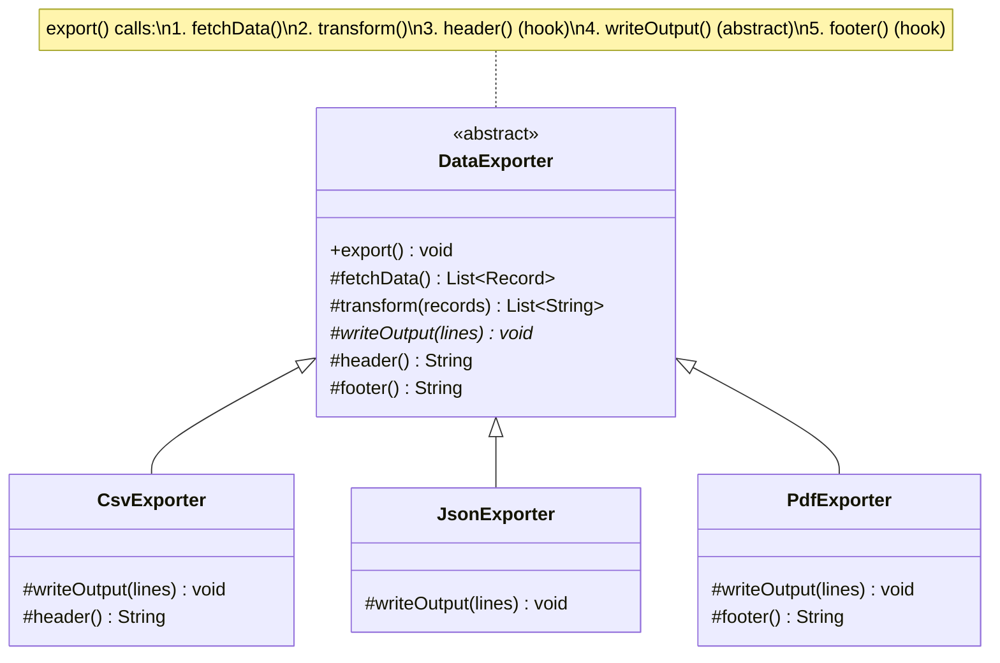

# 📋 Template Method Pattern

> [!abstract] TL;DR
> The Template Method pattern defines the **skeleton of an algorithm** in an abstract base class, with specific steps delegated to abstract or hook methods that subclasses override — embodying the Hollywood Principle: "Don't call us, we'll call you." The base class controls the algorithm's overall sequence while subclasses fill in the blanks without changing the sequence. This differs from Strategy, which delegates the entire algorithm to a collaborator object; Template Method uses inheritance for compile-time variation while Strategy uses composition for runtime switching.

---

## Intuition

A data export report always follows the same recipe: fetch data, transform it, write output. But the *how* differs per format — CSV, Excel, PDF. Template Method is the master chef's recipe card: it says "Step 1: fetch, Step 2: transform, Step 3: write" in that fixed order, but leaves "write" as a blank line for apprentice chefs (subclasses) to fill in. The chef controls the sequence; apprentices control the specialization. You cannot reorder the steps — but you can replace any step.

---

## How It Works

### Template Method Class Diagram



---

## Key Concepts

### 1. Core Implementation

```java
// Abstract base class — defines the algorithm skeleton
public abstract class DataExporter {

    // ── TEMPLATE METHOD — final; subclasses cannot reorder steps ────────
    public final void export(String destination) {
        List<Record> raw      = fetchData();          // concrete: same for all
        List<String> lines    = transform(raw);       // concrete: same for all

        String hdr = header();                        // hook: optional override
        writeOutput(lines, destination, hdr, footer()); // abstract: must override
        postExport(destination);                      // hook: optional override
    }

    // ── CONCRETE STEP — shared implementation ────────────────────────────
    protected List<Record> fetchData() {
        // Common implementation: query DB with JDBC/JPA
        return database.query("SELECT * FROM export_queue WHERE processed = false");
    }

    protected List<String> transform(List<Record> records) {
        return records.stream()
            .map(r -> r.id() + "|" + r.value() + "|" + r.timestamp())
            .toList();
    }

    // ── ABSTRACT STEP — subclasses MUST implement ────────────────────────
    protected abstract void writeOutput(List<String> lines, String destination,
                                        String header, String footer);

    // ── HOOK METHODS — optional override (have default impl) ────────────
    protected String header() {
        return "Exported: " + LocalDate.now();  // sensible default
    }

    protected String footer() {
        return "End of report";
    }

    protected void postExport(String destination) {
        // Default: no-op — subclasses may override for notification, cleanup, etc.
    }
}
```

### 2. Concrete Subclasses

```java
// CSV exporter — overrides writeOutput and customizes header
public class CsvExporter extends DataExporter {

    @Override
    protected void writeOutput(List<String> lines, String dest,
                               String header, String footer) {
        try (var writer = new PrintWriter(new FileWriter(dest))) {
            writer.println(header);
            lines.forEach(writer::println);
            writer.println(footer);
        } catch (IOException e) {
            throw new ExportException("CSV write failed", e);
        }
    }

    @Override
    protected String header() {
        return "id,value,timestamp"; // CSV-specific column header
    }
}

// JSON exporter — overrides writeOutput only
public class JsonExporter extends DataExporter {

    @Override
    protected void writeOutput(List<String> lines, String dest,
                               String header, String footer) {
        // Transform pipe-delimited lines to JSON array
        String json = lines.stream()
            .map(line -> {
                String[] parts = line.split("\\|");
                return """
                    {"id": "%s", "value": "%s", "timestamp": "%s"}
                    """.formatted(parts[0], parts[1], parts[2]).strip();
            })
            .collect(Collectors.joining(",\n", "[\n", "\n]"));

        Files.writeString(Path.of(dest), json);
    }

    // Does NOT override header()/footer() — uses defaults from base class
}

// PDF exporter — overrides writeOutput AND postExport hook
public class PdfExporter extends DataExporter {

    @Override
    protected void writeOutput(List<String> lines, String dest,
                               String header, String footer) {
        PdfDocument doc = new PdfDocument(dest);
        doc.addTitle(header);
        lines.forEach(doc::addRow);
        doc.addFooter(footer);
        doc.save();
    }

    @Override
    protected void postExport(String destination) {
        emailService.sendNotification("PDF export ready: " + destination);
    }
}

// Usage — polymorphic: caller uses abstract type
void runExport(DataExporter exporter, String output) {
    exporter.export(output);  // calls all steps in fixed order
}

runExport(new CsvExporter(),  "/reports/data.csv");
runExport(new JsonExporter(), "/reports/data.json");
runExport(new PdfExporter(),  "/reports/data.pdf");
```

### 3. Real Java Examples of Template Method

```java
// ── java.util.AbstractList ────────────────────────────────────────────────
// AbstractList.add(int index, E element) is abstract.
// AbstractList.addAll() uses add() — template method calling the abstract step.
public abstract class AbstractList<E> {
    // Template method — calls abstract get() and size() which you implement:
    public Iterator<E> iterator() {
        return new Itr();  // Itr uses abstract get() and size() internally
    }
    public abstract E get(int index);  // abstract step — you fill this in
    public abstract int size();
}

// Your ArrayList must override get() and size(); iterator() behavior is inherited.

// ── JdbcTemplate (Spring) ────────────────────────────────────────────────
// JdbcTemplate.query() is the template method:
// - Opens connection (concrete)
// - Prepares statement (concrete)
// - Sets parameters (abstract — your RowMapper fills this)
// - Executes query (concrete)
// - Maps ResultSet rows (abstract — your RowMapper fills this)
// - Closes connection (concrete, in finally)

List<User> users = jdbcTemplate.query(
    "SELECT * FROM users WHERE active = ?",
    (rs, rowNum) -> new User(rs.getLong("id"), rs.getString("name")),  // RowMapper hook
    true
);

// ── HttpServlet (Jakarta EE) ─────────────────────────────────────────────
// HttpServlet.service() is the template method — it checks request method
// then calls the appropriate doGet(), doPost(), doPut() hook:
public class MyServlet extends HttpServlet {
    @Override
    protected void doGet(HttpServletRequest req, HttpServletResponse resp) {
        // service() calls this; you don't call service() yourself (Hollywood Principle)
    }
}

// ── TestCase (JUnit 3 style) ─────────────────────────────────────────────
// TestCase.runTest() template: setUp() → test method → tearDown()
// You override setUp() and tearDown() hooks.
```

### 4. Hook Methods vs Abstract Steps

```java
// Three kinds of methods in a template class:
abstract class ReportGenerator {

    // 1. TEMPLATE METHOD — concrete, final — algorithm skeleton
    public final String generate() {
        String data   = loadData();              // abstract — MUST override
        String body   = formatBody(data);        // abstract — MUST override
        String header = formatHeader();          // hook — MAY override
        String footer = formatFooter();          // hook — MAY override
        return assemble(header, body, footer);   // concrete — NEVER override
    }

    // 2. ABSTRACT STEP — no default, subclass must provide
    protected abstract String loadData();
    protected abstract String formatBody(String data);

    // 3. HOOK METHOD — has default impl, subclass may override
    protected String formatHeader() { return ""; }  // default: empty header
    protected String formatFooter() { return ""; }  // default: empty footer

    // 4. PRIVATE CONCRETE STEP — implementation detail, hidden
    private String assemble(String h, String b, String f) {
        return h + "\n" + b + "\n" + f;
    }
}
```

### 5. Template Method vs Strategy

```java
// Template Method — inheritance, compile-time variation
abstract class Sorter {
    public final void sort(int[] arr) {
        validate(arr);       // concrete
        doSort(arr);         // abstract — subclass defines algorithm
        logResult(arr);      // concrete
    }
    protected abstract void doSort(int[] arr);
}
class BubbleSorter extends Sorter {
    protected void doSort(int[] arr) { /* bubble sort */ }
}
class QuickSorter extends Sorter {
    protected void doSort(int[] arr) { /* quicksort */ }
}

// Strategy — composition, runtime variation (preferred when switching needed)
@FunctionalInterface
interface SortStrategy {
    void sort(int[] arr);
}
class Sorter {
    private SortStrategy strategy; // INJECTED, changeable at runtime
    public void setStrategy(SortStrategy s) { this.strategy = s; }
    public void sort(int[] arr) {
        validate(arr);
        strategy.sort(arr);  // delegate to injected strategy
        logResult(arr);
    }
}
// Switch at runtime:
sorter.setStrategy(arr -> Arrays.sort(arr)); // no new class needed
```

**Choose Template Method when:** the algorithm structure is fixed, variation is known at compile time, and the set of subclasses is closed. **Choose Strategy when:** you need runtime switching, testing with mock algorithms, or the algorithm is user-configurable.

---

## Real-World Notes

- **Spring Batch**: `AbstractStep` uses Template Method — `doExecute()` is abstract, while open/close, transaction management, and listeners are handled by the template.
- **Spring Security filters**: `GenericFilterBean.doFilter()` is a template; concrete filters override `doFilterInternal()`.
- **JUnit 5 extensions**: `@BeforeEach`/`@AfterEach` form a template around each test method — the framework calls your hooks, you don't call the framework (Hollywood Principle).
- **Android Activity lifecycle**: `onCreate()`, `onStart()`, `onResume()` are all hooks in the `Activity` template method — the OS framework calls them in order; you fill them in.

---

## Common Pitfalls

| Pitfall | Consequence | Fix |
|---------|-------------|-----|
| Not making the template method `final` | Subclasses can override and break the algorithm contract | Mark template methods `final` |
| Too many abstract methods | Subclasses must implement 10+ methods — high friction | Convert non-essential steps to hook methods with sensible defaults |
| Inheritance abuse — using Template Method for every variation | Explosion of subclass permutations | Prefer Strategy (composition) when the algorithm needs runtime switching |
| Calling abstract method from constructor | Abstract method called before subclass constructor runs | Only call abstract/hook methods from the template method, not constructors |
| Logic in constructor instead of template method | Cannot be overridden; breaks polymorphism | Move setup logic into an `initialize()` hook called by the template method |

---

## Related Notes

- [[_MOC_Java_Patterns|↑ Section MOC — Java Patterns]]
- [[Strategy_Pattern]] — composition alternative for runtime algorithm switching
- [[Observer_Pattern]] — another behavioral pattern; separates event notification from handling
- [[Decorator_Pattern]] — wraps objects to add behavior without inheritance

---

## Review Questions

1. Spring's `JdbcTemplate.query()` is a classic Template Method. Identify the abstract step (what you provide as the caller) and the concrete steps (what JdbcTemplate always handles). Explain how this embodies the Hollywood Principle.

2. Your team builds a `PaymentProcessor` abstract class with a template method `processPayment()` that calls `validate()`, `charge()`, and `sendConfirmation()`. A new requirement arrives: some processors need to skip `sendConfirmation()` for internal transfers. Should you (a) make `sendConfirmation()` a hook method, (b) add an `if` flag in the base class, or (c) switch to Strategy? Justify your answer.

3. Compare subclassing `DataExporter` (Template Method) to injecting a `DataWriter` interface (Strategy) for the CSV/JSON/PDF variation. What does each approach make easy, and what does it make difficult? When does the inheritance graph of Template Method become a maintenance burden?

---

#Java #Java_Patterns #TemplateMethod #BehavioralPattern #DesignPatterns #HollywoodPrinciple #Intermediate
