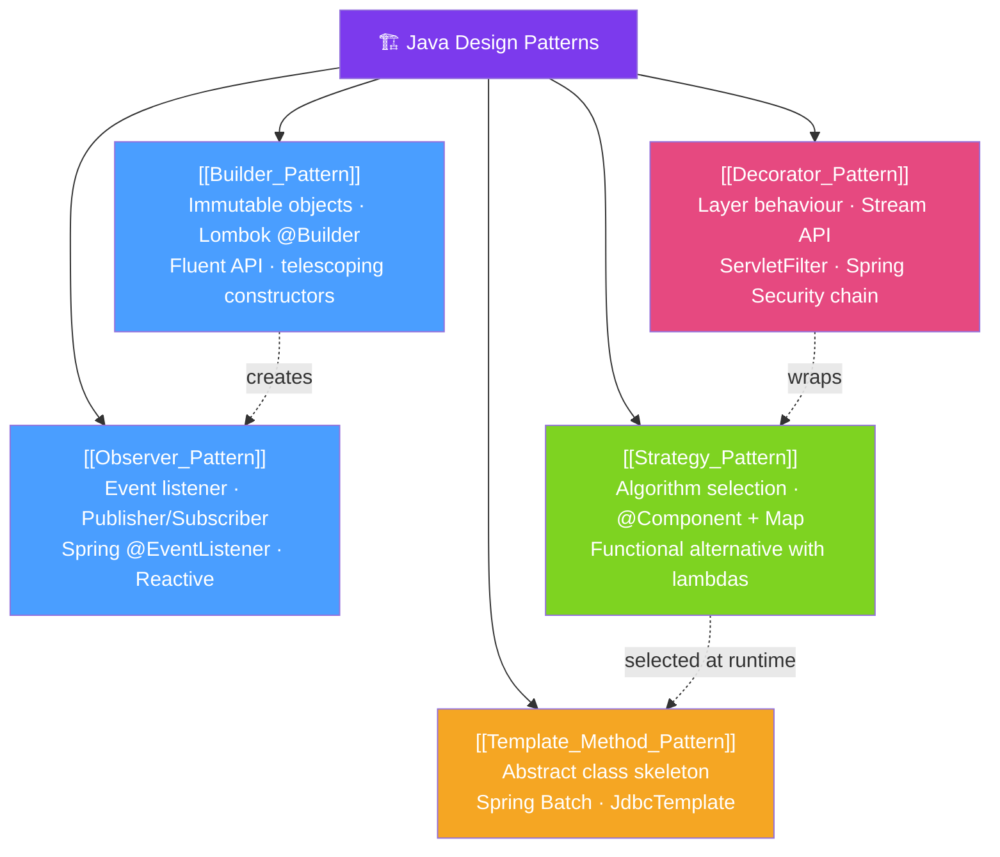

# 🏗️ Java Design Patterns — Map of Content

> [!abstract] What This Section Covers
> Design patterns are proven solutions to recurring software design problems. This section covers five foundational patterns in Java/Spring context: **Builder** (construct complex objects step by step), **Observer** (event-driven notification), **Strategy** (interchangeable algorithms), **Template Method** (define skeleton, let subclasses fill in steps), and **Decorator** (add behaviour without subclassing). Each includes modern Java implementation using lambdas and functional interfaces where applicable.

## Concept Map

## Learning Path
1. [[Builder_Pattern]] — Build complex objects safely and readably.
2. [[Strategy_Pattern]] — Select algorithms at runtime — polymorphism done right.
3. [[Template_Method_Pattern]] — Define skeleton algorithms with pluggable steps.
4. [[Decorator_Pattern]] — Layer behaviour without modifying the original class.
5. [[Observer_Pattern]] — Decouple producers from consumers with events.

## All Notes at a Glance
| Note | Difficulty | What You'll Learn |
|------|------------|-------------------|
| [[Builder_Pattern]] | Beginner | Builder vs constructors, Lombok @Builder, record builders, telescoping problem |
| [[Observer_Pattern]] | Intermediate | Java Observer, Spring events, Guava EventBus, reactive alternatives |
| [[Strategy_Pattern]] | Intermediate | Strategy interface, Spring @Component registry, lambda strategies |
| [[Template_Method_Pattern]] | Intermediate | Abstract class template, Spring's JdbcTemplate, callback variants |
| [[Decorator_Pattern]] | Intermediate | Decorator vs inheritance, Java I/O stack, Spring filter chains |

## Key Questions This Section Answers
- When should you use a Builder instead of a constructor?
- How does Spring's `@EventListener` implement the Observer pattern?
- How do lambda expressions replace Strategy pattern implementations in Java 8+?
- What is the difference between Decorator and Proxy patterns?
- How does Spring Security's filter chain implement the Decorator pattern?

## Related Sections
- [[_MOC_Java_Master|↑ Java Master MOC]]
- [[36_Functional_Java/_MOC_Functional_Java|← Functional Java]]
- [[38_Java_Internals/_MOC_Java_Internals|→ Java Internals]]

#MOC #java #design-patterns #builder #observer #strategy #decorator #template-method
