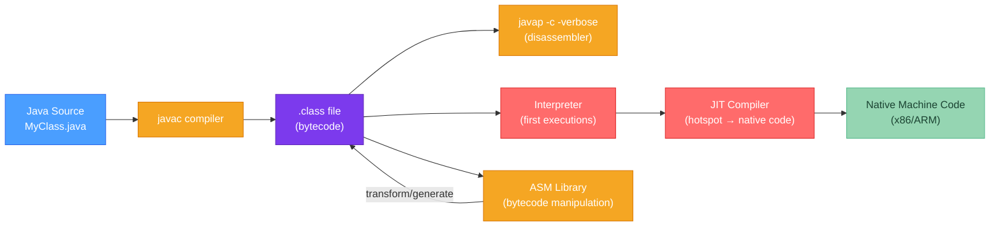

# 🔢 Bytecode and the JVM

> [!abstract] TL;DR
> Java source compiles to **bytecode** (`.class` files) — a stack-based instruction set interpreted or JIT-compiled by the JVM. A `.class` file starts with magic number `0xCAFEBABE`, then a **constant pool** (string table for all symbols), then class/method metadata. Bytecode instructions fall into: load/store (`iload`, `astore`), arithmetic (`iadd`, `lmul`), method invocation (`invokevirtual`, `invokeinterface`, `invokestatic`, `invokespecial`, `invokedynamic`), and control flow (`goto`, `if_icmpne`). Use `javap -c -verbose` to disassemble any `.class` file. **Bytecode manipulation** via ASM enables frameworks like Hibernate, Mockito, and Spring to generate or transform classes at runtime.

---

## Intuition

Think of bytecode as the intermediate representation between Java source and machine code — like assembly language, but for an imaginary CPU (the JVM) instead of a real one. This imaginary CPU is **stack-based**: instead of registers (`eax`, `rbx`), it pushes values onto an **operand stack** and operations pop their inputs from it. `javap` is the tool that translates the binary bytecode back into human-readable mnemonics so you can see exactly what the JVM runs.

---

## How It Works



---

## Key Concepts

### 1. .class File Structure

```
.class file binary layout:
┌─────────────────────────────────────────┐
│  Magic Number: 0xCAFEBABE (4 bytes)     │ ← identifies it as a Java class file
│  Minor version (2 bytes)                │
│  Major version (2 bytes)                │ ← 65 = Java 21, 61 = Java 17, 55 = Java 11
├─────────────────────────────────────────┤
│  Constant Pool Count (2 bytes)          │
│  Constant Pool entries (variable)       │ ← string table: all symbols, literals
├─────────────────────────────────────────┤
│  Access Flags (2 bytes)                 │ ← public, final, interface, abstract, etc.
│  This Class (index into CP)             │
│  Super Class (index into CP)            │
│  Interfaces (array of CP indexes)       │
├─────────────────────────────────────────┤
│  Fields (count + field_info[])          │
│  Methods (count + method_info[])        │ ← each has a Code attribute with bytecode
│  Attributes (SourceFile, etc.)          │
└─────────────────────────────────────────┘
```

**Constant Pool entry types:**

| Tag | Type | Contains |
|-----|------|---------|
| 1 | `Utf8` | String value (method names, descriptors) |
| 7 | `Class` | Reference to class name (as Utf8 index) |
| 8 | `String` | Reference to string literal (as Utf8 index) |
| 9 | `Fieldref` | Class + name-and-type reference |
| 10 | `Methodref` | Class + name-and-type reference |
| 11 | `InterfaceMethodref` | Interface + name-and-type reference |
| 3/4 | `Integer`/`Float` | Constant values |
| 5/6 | `Long`/`Double` | 64-bit constants (take two CP slots) |

### 2. Using `javap`

```java
// Source: SimpleExample.java
public class SimpleExample {
    public static int add(int a, int b) {
        return a + b;
    }

    public static void main(String[] args) {
        int result = add(3, 4);
        System.out.println(result);
    }
}
```

```bash
# Compile
javac SimpleExample.java

# Disassemble: show bytecode for all methods
javap -c SimpleExample

# Disassemble with full details: constant pool, descriptors, line numbers
javap -c -verbose SimpleExample
```

**Disassembled output for `add` method:**
```
public static int add(int, int);
  Code:
     0: iload_0        // push local var 0 (parameter 'a') onto operand stack
     1: iload_1        // push local var 1 (parameter 'b') onto operand stack
     2: iadd           // pop 2 ints, push their sum
     3: ireturn        // pop int, return it to caller

// Frame at entry: locals=[int a, int b], stack=[]
// After iload_0:  locals=[int a, int b], stack=[a]
// After iload_1:  locals=[int a, int b], stack=[a, b]
// After iadd:     locals=[int a, int b], stack=[a+b]
// ireturn: returns a+b, frame destroyed
```

**Disassembled `main` method:**
```
public static void main(java.lang.String[]);
  Code:
     0: iconst_3       // push int constant 3
     1: iconst_4       // push int constant 4
     2: invokestatic  #7   // Method add:(II)I  ← method descriptor: (int, int) → int
     5: istore_1       // pop result, store in local var 1 ('result')
     6: getstatic     #13  // Field java/lang/System.out:Ljava/io/PrintStream;
     9: iload_1        // push 'result'
    10: invokevirtual #19  // Method java/io/PrintStream.println:(I)V
    13: return
```

### 3. Bytecode Instruction Categories

**Load/Store:**
| Instruction | Meaning |
|------------|---------|
| `iload_0` | Push int local var 0 onto stack |
| `aload_1` | Push reference local var 1 onto stack |
| `lload_2` | Push long local var 2 (long takes 2 local var slots) |
| `istore_3` | Pop int from stack, store in local var 3 |
| `astore` | Pop reference, store in local var |
| `ldc #5` | Push constant pool entry #5 (int/float/String/Class) |
| `ldc2_w #8` | Push wide constant pool entry #8 (long/double) |

**Arithmetic:**
| Instruction | Meaning |
|------------|---------|
| `iadd` / `isub` / `imul` / `idiv` | int arithmetic |
| `ladd` / `lmul` | long arithmetic |
| `fadd` / `dadd` | float / double arithmetic |
| `i2l` / `l2i` | type conversions (widening / narrowing) |
| `iinc 1 2` | increment local var 1 by 2 (optimization for loop counters) |

**Method Invocation — the critical five:**
| Instruction | Used for |
|------------|---------|
| `invokevirtual` | Virtual method call (normal instance methods — dispatches on actual type) |
| `invokeinterface` | Interface method call (similar to virtual but different dispatch table) |
| `invokestatic` | Static method call |
| `invokespecial` | Constructors, private methods, super calls (non-virtual dispatch) |
| `invokedynamic` | Lambda expressions, method handles, dynamic dispatch (Java 7+) |

**Control Flow:**
| Instruction | Meaning |
|------------|---------|
| `goto <label>` | Unconditional jump |
| `if_icmpeq` | Jump if top two ints are equal |
| `if_icmpne` | Jump if top two ints are not equal |
| `ifnull` / `ifnonnull` | Jump if reference is null / non-null |
| `tableswitch` | Switch on int (dense ranges — O(1) lookup) |
| `lookupswitch` | Switch on int (sparse keys — binary search) |
| `athrow` | Throw exception (top of stack must be Throwable) |

### 4. `invokedynamic` and Lambdas

```java
// Java source: lambda expression
Runnable r = () -> System.out.println("hello");

// Compiled bytecode (simplified):
// invokedynamic #0, run:()Ljava/lang/Runnable;
//   BootstrapMethods: #0 java/lang/invoke/LambdaMetafactory.metafactory

// invokedynamic defers the linkage decision to a "bootstrap method" at runtime.
// For lambdas, LambdaMetafactory generates an implementation class the first time.
// This is more efficient than anonymous inner classes:
// - Single class per lambda type (not per usage site)
// - JIT can inline the lambda body
```

### 5. Bytecode Manipulation with ASM

```java
// ASM is used by: Hibernate (entity enhancement), Mockito (mock generation),
// CGLIB, Jacoco (instrumentation), Spring (AOP proxy generation)

// Example: add a logging statement to every method using ASM Visitor API
import org.objectweb.asm.*;

public class LoggingClassAdapter extends ClassVisitor {

    public LoggingClassAdapter(ClassVisitor cv) {
        super(Opcodes.ASM9, cv);
    }

    @Override
    public MethodVisitor visitMethod(int access, String name, String descriptor,
                                     String signature, String[] exceptions) {
        MethodVisitor mv = super.visitMethod(access, name, descriptor, signature, exceptions);

        // Wrap the original MethodVisitor to inject instructions
        return new MethodVisitor(Opcodes.ASM9, mv) {
            @Override
            public void visitCode() {
                super.visitCode();
                // Inject: System.out.println("Entering: " + name)
                // This adds bytecode BEFORE the original method body
                mv.visitFieldInsn(Opcodes.GETSTATIC,
                        "java/lang/System", "out", "Ljava/io/PrintStream;");
                mv.visitLdcInsn("Entering: " + name);
                mv.visitMethodInsn(Opcodes.INVOKEVIRTUAL,
                        "java/io/PrintStream", "println", "(Ljava/lang/String;)V", false);
            }
        };
    }
}

// Load and transform a class programmatically
ClassReader reader = new ClassReader("com.example.MyClass");
ClassWriter writer = new ClassWriter(ClassWriter.COMPUTE_FRAMES);
reader.accept(new LoggingClassAdapter(writer), 0);
byte[] transformedBytecode = writer.toByteArray();
// Define the class from the modified bytecode...
```

### 6. Method Descriptors

Method and field references in bytecode use descriptor notation:

```
Descriptor syntax:
(parameters)returnType

Type codes:
B = byte        C = char        D = double      F = float
I = int         J = long        S = short       Z = boolean
V = void        L<classname>;  = reference type (ends with ;)
[<type>         = array of type

Examples:
(II)I             → (int, int) → int                 [add method]
(Ljava/lang/String;I)V  → (String, int) → void
([Ljava/lang/String;)V  → (String[]) → void         [main method]
()Ljava/util/List;       → () → List
(ILjava/lang/String;Z)Ljava/lang/Object; → (int, String, boolean) → Object
```

---

## Real-World Notes

- **JIT tiered compilation**: the HotSpot JVM uses tiered compilation (C1 → C2). C1 compiles quickly with basic optimizations; C2 compiles deeply optimized native code for truly hot methods. This is why benchmarks need warmup.
- **Reading bytecode to debug JIT**: when you suspect the JIT made a surprising optimization, `-XX:+PrintCompilation` and `-XX:+PrintInlining` show what the JIT is doing. This helps explain unexpected performance characteristics.
- **Bytecode vs source line numbers**: `javap` output can show source line numbers with `-l` flag. These are stored in the `LineNumberTable` attribute inside Code. Debuggers use this to map bytecode positions back to source lines.

---

## Common Pitfalls

| Pitfall | Consequence | Fix |
|---------|-------------|-----|
| Editing bytecode manually (hex editor) | Class verifier rejects invalid bytecode with VerifyError | Use ASM or Byte Buddy for bytecode manipulation |
| Class major version mismatch | `UnsupportedClassVersionError` at load time | Compile with compatible `--source`/`--release` flag or correct JDK version |
| ASM version mismatch (`Opcodes.ASMX`) | `IllegalArgumentException` from ASM | Match ASM version constant to ASM library version |
| `invokespecial` vs `invokevirtual` confusion | Calling super wrong, or non-virtual when virtual needed | `invokespecial` for constructors/private/super; `invokevirtual` for everything else |

---

## Related Concepts

- [[_MOC_Java_Internals|↑ Section MOC — Java Internals]]
- [[Java_Memory_Model]] — The JMM constrains how bytecode instruction effects become visible across threads
- [[Reflection_API]] — Reflection inspects class structure that is stored in the constant pool
- [[Proxy_and_Dynamic_Code]] — CGLIB and Byte Buddy generate bytecode at runtime to create proxies

---

## Review Questions

1. Explain what the operand stack is and trace through the operand stack state for these bytecode instructions: `iconst_5`, `iload_1`, `iadd`, `istore_2`. What is in the stack and local variable table at each step?

2. What is the difference between `invokevirtual` and `invokespecial`? Give one example where each is used and explain why the other instruction would be wrong in that context.

3. A framework needs to add a timing wrapper around every method in a class without modifying the source. Describe at a high level how this can be achieved with a Java agent using ASM's visitor pattern, including which phase of the JVM lifecycle the transformation happens in.

---

## Sources
- Java Virtual Machine Specification, Chapter 4 (The class File Format)
- Java Virtual Machine Specification, Chapter 6 (The Java Virtual Machine Instruction Set)
- [ASM User Guide](https://asm.ow2.io/asm4-guide.pdf)
- Nikita Lipsky, *Java Bytecode Fundamentals*

#java #internals #bytecode #JVM #javap #invokedynamic #Advanced
