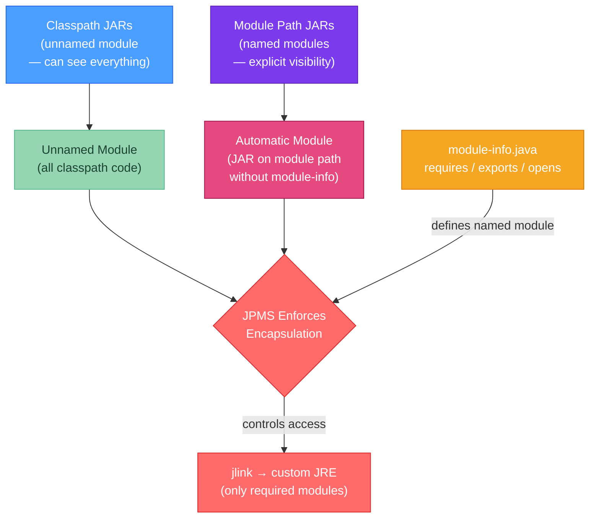

# 📦 Classpath and the Java Module System

> [!abstract] TL;DR
> Java's original **classpath** is a flat list of JARs — no encapsulation between them. Java 9 introduced **JPMS (Java Platform Module System)** via `module-info.java`: modules declare what they `exports` (public API) and what they `requires` (dependencies). Code in unexported packages is inaccessible even via reflection. **Automatic modules**: a JAR on the module path without a `module-info.java` becomes an automatic module. **Unnamed module**: all classpath JARs form one unnamed module that can access everything. `jlink` creates a minimal custom runtime containing only the JDK modules your app needs. `--add-opens` and `--add-exports` are escape hatches for legacy compatibility.

---

## Intuition

The old classpath is like an open-plan office: everyone can walk up to anyone's desk and see their work (public class = accessible to all). JPMS adds walls and doors: each team (module) decides which rooms `exports` (visitors allowed) and which are `opens` (can be inspected). You can only enter a room if you were explicitly invited. `--add-opens` is the facility manager overriding the locks in an emergency. `jlink` is the interior designer who builds a custom office with only the rooms the company actually uses.

---

## How It Works



---

## Key Concepts

### 1. Classpath (Pre-Module System)

```bash
# -cp / -classpath: semicolon-separated (Windows) or colon-separated (Unix) list of:
# - directories (containing .class files)
# - JAR files
# - ZIP files

# Examples:
java -cp "lib/spring.jar;lib/jackson.jar;target/classes" com.example.Main
java -cp "lib/*:target/classes" com.example.Main  # wildcard: all JARs in lib/

# CLASSPATH environment variable (global, overridden by -cp):
# export CLASSPATH=/usr/lib/java/commons-lang.jar  (Unix)
# $env:CLASSPATH = "C:\lib\commons-lang.jar"       (Windows)

# JAR manifest Class-Path attribute: a JAR can declare its own dependencies
# META-INF/MANIFEST.MF:
# Class-Path: lib/commons-lang3-3.14.0.jar lib/jackson-databind-2.17.0.jar
# Then: java -jar my-app.jar (auto-resolves transitive JARs relative to the JAR location)

# Classpath problems:
# - "JAR hell": different versions of the same class on the classpath → unpredictable which loads
# - No encapsulation: any code can access any public class in any JAR
# - No dependency declaration: mismatched transitive deps detected only at runtime
```

### 2. module-info.java — The Module Descriptor

```java
// src/main/java/module-info.java
// Must be in the root of the source tree (not in a package)

module com.example.app {

    // ── requires: declare dependencies on other modules ────────────────────
    requires java.base;          // implicit — you don't need to declare this
    requires java.sql;           // need JDBC
    requires spring.core;        // Spring Core module
    requires spring.context;

    // requires transitive: anyone requiring YOUR module also gets this dependency
    // (use sparingly — only for modules in your public API signatures)
    requires transitive com.example.common;

    // requires static: compile-time only (optional at runtime)
    requires static java.annotation;  // e.g., for @Nullable annotations

    // ── exports: make packages accessible as public API ────────────────────
    exports com.example.api;        // any module can use com.example.api
    exports com.example.dto;        // DTOs accessible to all

    // Qualified export: only specific modules can see this package
    exports com.example.internal to spring.core, com.example.test;

    // ── opens: allow deep reflection (setAccessible) on a package ─────────
    // 'exports' allows compile-time access to public types only
    // 'opens' additionally allows runtime reflection (setAccessible, getDeclaredFields)
    opens com.example.entities to spring.orm, jakarta.persistence;

    // Open everything to everyone (useful for library modules, frameworks):
    // opens com.example.impl;  // any module can reflect into impl

    // ── uses / provides: service loader mechanism ─────────────────────────
    uses com.example.spi.DataStore;          // this module consumes this service
    provides com.example.spi.DataStore       // this module provides an implementation
        with com.example.impl.PostgresStore;
}
```

**Module types summary:**

| Type | Description | Source |
|------|-------------|--------|
| Named module | Has a `module-info.java`, on module path | Your code / modular libs |
| Automatic module | JAR on module path WITHOUT `module-info.java` | Legacy libs on module path |
| Unnamed module | All JARs on classpath (one big unnamed module) | Legacy classpath JARs |
| Platform module | JDK modules (`java.base`, `java.sql`, etc.) | Built into the JDK |

### 3. Module Graph Example

```java
// Multi-module project structure:
my-app/
├── app/
│   ├── src/main/java/module-info.java
│   └── src/main/java/com/example/app/Main.java
├── api/
│   ├── src/main/java/module-info.java    ← exports com.example.api
│   └── src/main/java/com/example/api/UserService.java
└── persistence/
    ├── src/main/java/module-info.java    ← requires com.example.api
    └── src/main/java/com/example/persistence/UserRepo.java

// app/module-info.java:
module com.example.app {
    requires com.example.api;
    requires com.example.persistence;
}

// api/module-info.java:
module com.example.api {
    exports com.example.api;  // UserService interface visible to all
}

// persistence/module-info.java:
module com.example.persistence {
    requires com.example.api;
    opens com.example.persistence to jakarta.persistence;  // JPA entity reflection
}
```

### 4. Running with the Module Path

```bash
# Compile multi-module project
javac --module-source-path src \
      --module com.example.app \
      -d out

# Run modular application
java --module-path out \
     --module com.example.app/com.example.app.Main

# Mix classpath and module path (transition scenario)
java --module-path mods \        # named modules here
     --class-path libs/* \       # unnamed module (classpath) JARs here
     --module com.example.app/com.example.app.Main

# Check module dependencies
java --module-path mods --list-modules
java --module-path mods --describe-module com.example.api
```

### 5. Automatic Modules

When you place a non-modular JAR (no `module-info.java`) on the module path:
- It becomes an **automatic module**
- Its module name is derived from the JAR file name (`jackson-databind-2.17.0.jar` → `jackson.databind`)
- Or from the `Automatic-Module-Name` attribute in `META-INF/MANIFEST.MF` (library authors should set this)
- It `exports` all its packages to everyone
- It `requires transitive` all other automatic and named modules

### 6. `jlink` — Custom Minimal JRE

`jlink` creates a self-contained runtime image containing only the JDK modules your application needs (no javac, no jshell, no unused APIs). This is key for lean Docker images.

```bash
# Step 1: Determine which JDK modules your app needs
jdeps --module-path mods \
      --print-module-deps \
      out/com.example.app.jar
# Output: java.base,java.sql,java.logging

# Step 2: Create the minimal runtime image
jlink \
  --module-path "$JAVA_HOME/jmods:mods" \   # JDK modules + your modules
  --add-modules com.example.app \           # entry module (includes transitive requires)
  --output dist/my-runtime \               # output directory
  --no-header-files \                      # remove JDK doc headers (smaller)
  --no-man-pages \                         # remove man pages (smaller)
  --compress=2 \                           # level 2 compression
  --strip-debug                            # remove debug symbols

# Result: dist/my-runtime/ — a complete minimal JRE (~30-60 MB vs full JDK ~200 MB)

# Run with the custom runtime (no JDK installation needed on target system)
dist/my-runtime/bin/java \
  --module com.example.app/com.example.app.Main

# Dockerfile using jlink:
# FROM eclipse-temurin:21-jdk AS builder
# COPY ... /app
# RUN jlink --module-path $JAVA_HOME/jmods:mods \
#           --add-modules com.example.app \
#           --output /custom-jre ...
#
# FROM debian:bookworm-slim
# COPY --from=builder /custom-jre /custom-jre
# ENTRYPOINT ["/custom-jre/bin/java", "--module", "com.example.app/com.example.app.Main"]
```

### 7. Escape Hatches: `--add-opens` and `--add-exports`

When modular code breaks legacy frameworks that use reflection:

```bash
# --add-opens: open a package for deep reflection (setAccessible)
# Format: --add-opens <module>/<package>=<accessing-module>
# ALL-UNNAMED = grant to unnamed module (all classpath code)

java --add-opens java.base/java.lang=ALL-UNNAMED \
     --add-opens java.base/java.util=ALL-UNNAMED \
     --add-opens java.base/sun.nio.ch=ALL-UNNAMED \
     -jar my-app.jar

# --add-exports: make a package accessible (compile-time API access, without opens)
javac --add-exports java.base/sun.misc=com.example.app \
      --module-source-path src ...

# Spring Boot typical --add-opens (added automatically by spring-boot:run):
# java.base/java.lang
# java.base/java.util
# java.base/java.lang.reflect
# java.base/java.io
# java.base/java.net
```

```yaml
# In Spring Boot's application Maven plugin — add JVM args for IDE runs:
# pom.xml:
# <plugin>
#   <groupId>org.springframework.boot</groupId>
#   <artifactId>spring-boot-maven-plugin</artifactId>
#   <configuration>
#     <jvmArguments>
#       --add-opens java.base/java.lang=ALL-UNNAMED
#       --add-opens java.base/java.util=ALL-UNNAMED
#     </jvmArguments>
#   </configuration>
# </plugin>
```

### 8. Module Layers and Custom Class Loading

```java
// Module layers allow multiple versions of the same module in one JVM
// (e.g., plugin systems where each plugin can have its own dependency version)

// Create a new module layer from a set of paths:
ModuleFinder finder = ModuleFinder.of(Path.of("plugins/plugin-a.jar"));
ModuleLayer parent = ModuleLayer.boot();

Configuration config = parent.configuration()
        .resolve(finder, ModuleFinder.of(), Set.of("com.plugin.a"));

ClassLoader loader = ClassLoader.getSystemClassLoader();
ModuleLayer pluginLayer = parent.defineModulesWithOneLoader(config, loader);

// Load classes from the plugin layer:
Class<?> pluginMain = pluginLayer.findLoader("com.plugin.a")
        .loadClass("com.plugin.a.Main");
```

---

## Real-World Notes

- **Most Spring Boot apps still use the classpath**: Spring Boot fat JARs (executable JARs) use a custom class loader (`JarLauncher`) and don't use the module path by default. The JPMS module system is primarily relevant for library authors and teams building truly modular applications or using `jlink`.
- **`--add-opens` in CI**: many CI environments run Spring Boot tests with `--add-opens` flags that are missing in production. If production runs as a modular JAR and CI uses classpath, you can have CI-passing but prod-failing reflection issues.
- **`jdeps` for migration analysis**: before migrating to modules, run `jdeps --jdk-internals my-app.jar` to find all usages of internal JDK APIs that modules will hide. Fix these before adding `module-info.java`.

---

## Common Pitfalls

| Pitfall | Consequence | Fix |
|---------|-------------|-----|
| JAR on module path without `Automatic-Module-Name` | Module name derived from filename — unstable if JAR renamed | Library authors: add `Automatic-Module-Name` to MANIFEST.MF |
| Missing `opens` for JPA entity packages | `InaccessibleObjectException` at startup when Hibernate reflects on entities | Add `opens com.example.entities to jakarta.persistence` |
| Using `--add-opens ALL-UNNAMED` in production | Silently re-opens all module encapsulation — defeats JPMS | Fix root cause by adding `opens` to the module descriptor |
| Circular `requires` | Module system rejects the module graph at startup | Refactor to break the cycle; extract a shared common module |
| `exports` vs `opens` confusion | Exporting a package allows public API access but NOT `setAccessible()` | Use `opens` additionally if frameworks need reflection on that package |

---

## Related Concepts

- [[_MOC_Java_Internals|↑ Section MOC — Java Internals]]
- [[Reflection_API]] — Module system restricts `setAccessible()` to opened packages
- [[Proxy_and_Dynamic_Code]] — Spring proxies need `opens` declarations for the packages they intercept
- [[Bytecode_and_JVM]] — `jlink` packages bytecode (.class files) into the runtime image

---

## Review Questions

1. Explain the difference between `exports com.example.service` and `opens com.example.service` in a `module-info.java`. Which one does Spring need to inject into private fields annotated with `@Autowired`, and why?

2. You're building a Spring Boot application and receiving `InaccessibleObjectException: Unable to make field private com.example.User.name accessible` at startup. Describe two ways to fix this — one that modifies `module-info.java` and one that adds a JVM argument — and explain why the first option is preferable.

3. Your team wants to ship a lean Docker image for a Java 21 command-line tool (~5 dependencies, no web server). Describe the `jlink` workflow from `jdeps` to the final runtime image, and estimate roughly what Docker image size benefit you'd achieve versus using a `eclipse-temurin:21-jdk` base image directly.

---

## Sources
- [JEP 261: Module System](https://openjdk.org/jeps/261)
- [JEP 282: jlink](https://openjdk.org/jeps/282)
- [Java Platform Module System (Sander Mak, Paul Bakker)](https://www.manning.com/books/java-9-modularity)
- [State of the Module System](https://openjdk.org/projects/jigsaw/spec/sotms/)

#java #internals #JPMS #modules #jlink #classpath #Advanced
