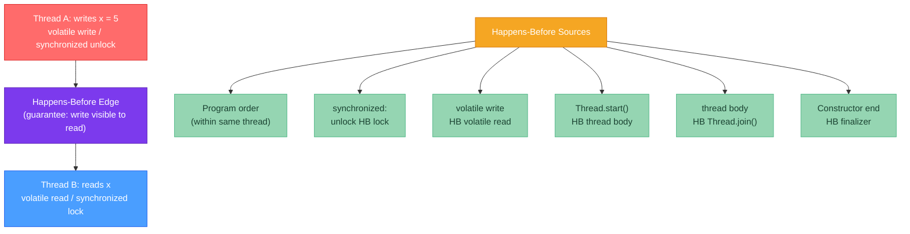

# 🧵 Java Memory Model

> [!abstract] TL;DR
> The Java Memory Model (JMM) defines when writes by one thread become **visible** to reads by another. The key relationship is **happens-before (HB)**: if action A HB action B, then all of A's effects are guaranteed visible to B. The JMM defines six HB edges: program order, `synchronized` unlock→lock, `volatile` write→read, thread start, thread join, and finalizer. **`volatile`** guarantees visibility + no reordering (NOT atomicity for compound ops like `++`). **`synchronized`** provides mutual exclusion AND establishes HB. **Final fields** are safely published after construction completes. Double-checked locking requires `volatile` on the field to be correct.

---

## Intuition

Imagine two programmers in separate rooms (threads), each with their own whiteboard (CPU cache / local registers). They share a central blackboard (main memory). One programmer writes `x = 5` on their whiteboard. When does the other programmer see it on the central blackboard? The JMM defines the rules. Without synchronization, the answer is "whenever the CPU feels like flushing the cache" — which could be never. `volatile` and `synchronized` are the protocols that force the whiteboards to sync with the central blackboard at defined moments.

---

## How It Works



---

## Key Concepts

### 1. Happens-Before (HB) Relationship

HB is a partial ordering over program actions. If A HB B:
1. All writes by A are **visible** to B
2. All of A's actions appear to B to have occurred **before** B's actions

HB is **transitive**: if A HB B and B HB C, then A HB C.

Without HB between a write and a read of the same variable across threads, the read may see:
- The initial value (0 / null)
- A stale cached value
- The correct written value
- A partially-written value (for 64-bit `long`/`double` on 32-bit JVMs — non-atomic)

The JMM makes **no guarantee** about value visibility across threads unless an HB edge exists.

### 2. `volatile` — Visibility + Ordering

```java
// ── Incorrect shared flag: no happens-before ──────────────────────────────
public class StopThread {
    private static boolean stopRequested = false;  // NOT volatile!

    public static void main(String[] args) throws InterruptedException {
        Thread backgroundThread = new Thread(() -> {
            while (!stopRequested) {
                // Infinite loop! JIT may hoist the read of stopRequested out
                // of the loop because it doesn't see any writes to it.
                // Thread may never see the update: stopRequested = true
            }
        });
        backgroundThread.start();

        TimeUnit.SECONDS.sleep(1);
        stopRequested = true;  // No HB with the read in backgroundThread
        // Background thread may run forever!
    }
}

// ── Fixed: volatile creates HB ────────────────────────────────────────────
public class CorrectStopThread {
    private static volatile boolean stopRequested = false;  // volatile!

    // volatile write (main) HB volatile read (backgroundThread)
    // → backgroundThread guaranteed to eventually see stopRequested = true
}
```

**What `volatile` guarantees:**
- **Visibility**: every volatile write is visible to all subsequent volatile reads of the same variable
- **No reordering**: the JVM/CPU cannot reorder volatile reads/writes with other memory accesses (full fence semantics in practice on most hardware)
- **64-bit atomicity**: `long` and `double` reads/writes are atomic for volatile fields (not guaranteed for non-volatile on 32-bit JVMs)

**What `volatile` does NOT guarantee:**
- **Atomicity for compound operations**: `volatile int counter; counter++` is NOT atomic — it's read, increment, write — three separate operations. Use `AtomicInteger` or `synchronized` instead.

```java
// ❌ Not atomic, not safe with multiple writers:
private volatile int counter = 0;
public void increment() { counter++; }  // race condition!

// ✓ Atomic for single writer, multiple readers:
// (single writer: only one thread can write; volatile ensures readers see latest)
private volatile int version = 0;
public void markUpdated() { version++; }      // safe if only one thread writes
public int getVersion() { return version; }    // readers always see latest
```

### 3. `synchronized` — Mutual Exclusion + HB

`synchronized` provides two guarantees:
1. **Mutual exclusion**: at most one thread holds the monitor at a time
2. **Happens-before**: monitor unlock by A HB monitor lock by B

```java
// synchronized method — monitor = 'this' (instance) or Class (static)
public class SafeCounter {
    private int count = 0;

    // Every exit of synchronized block flushes writes to main memory
    // Every entry reads the latest state from main memory
    public synchronized void increment() {
        count++;  // safe: only one thread in here at a time, and HB established
    }

    public synchronized int get() {
        return count;  // safe: sees the latest write because of HB from unlock
    }
}

// synchronized block — monitor = any object reference
private final Object lock = new Object();
private int count = 0;

public void increment() {
    synchronized (lock) {
        count++;
    }
}
```

### 4. Final Fields — Safe Publication

```java
// Final fields: the JMM guarantees that after a constructor completes,
// any thread that obtains a reference to the object sees the final fields
// correctly initialized — even without synchronization.
public class ImmutablePoint {
    private final int x;
    private final int y;

    public ImmutablePoint(int x, int y) {
        this.x = x;
        this.y = y;
        // After this constructor returns, x and y are safely published
    }
    // Reads of x and y from any thread are safe — no volatile/synchronized needed
}

// ❌ Escaping 'this' from constructor breaks safe publication!
public class UnsafeEscape {
    private final int value;
    private static UnsafeEscape instance;

    public UnsafeEscape(int value) {
        instance = this;   // THIS LEAKS: constructor hasn't finished!
        this.value = value; // other threads may see instance but value is not set yet
    }
}
```

### 5. Double-Checked Locking (DCL) — The Classic JMM Trap

```java
// ❌ Broken DCL (Java 1.4 and before — instruction reordering allows partially
//    initialized object to be visible to other threads):
public class BrokenSingleton {
    private static BrokenSingleton instance;

    public static BrokenSingleton getInstance() {
        if (instance == null) {             // check 1 (no lock)
            synchronized (BrokenSingleton.class) {
                if (instance == null) {     // check 2 (with lock)
                    instance = new BrokenSingleton(); // PROBLEM: write to 'instance'
                    // may be visible before the constructor completes in other threads
                }
            }
        }
        return instance;
    }
}

// ✓ Fixed DCL with volatile (Java 5+):
public class CorrectSingleton {
    private static volatile CorrectSingleton instance; // volatile = no reordering!

    public static CorrectSingleton getInstance() {
        if (instance == null) {
            synchronized (CorrectSingleton.class) {
                if (instance == null) {
                    instance = new CorrectSingleton();
                    // volatile write HB any subsequent volatile read
                    // → any thread seeing instance != null also sees fully initialized object
                }
            }
        }
        return instance;
    }
}

// ✓ Even simpler: Initialization-on-demand holder (no volatile needed)
public class HolderSingleton {
    private static class Holder {
        static final HolderSingleton INSTANCE = new HolderSingleton();
        // Class initialization is synchronized by the JVM (ClassLoader guarantee)
        // and the HB edge from class initialization to first use of the class
    }

    public static HolderSingleton getInstance() {
        return Holder.INSTANCE;  // Holder class loaded (and INSTANCE initialized)
                                 // only on first call to getInstance()
    }
}
```

### 6. Common JMM Bugs

| Bug | Description | Fix |
|-----|-------------|-----|
| Visibility failure | Thread B never sees Thread A's write | Add `volatile` or `synchronized` |
| Stale reads | Thread reads old cached value after another writes | `volatile` field or `synchronized` read |
| Instruction reordering | Writes appear to happen out of order to other threads | `volatile` (full fence) or `synchronized` |
| Non-atomic long/double | 32-bit JVM may write 64-bit value in two 32-bit writes | Declare `long`/`double` fields as `volatile` or use `synchronized` |
| Broken DCL | Partially constructed object visible | Declare lazy field `volatile` |

---

## Real-World Notes

- **Modern x86 hardware**: x86 has a relatively strong memory model (Total Store Order). Many JMM bugs only manifest on ARM or POWER architectures (weak memory model), which is why multiplatform testing matters.
- **JIT reordering**: the CPU isn't the only threat. The JIT compiler itself may reorder instructions for performance, as long as the reordering is invisible within a single thread. `volatile` prevents JIT reordering.
- **`java.util.concurrent` uses JMM internally**: all j.u.c classes (ConcurrentHashMap, AtomicInteger, LinkedBlockingQueue) are carefully designed around JMM guarantees. This is why you can use them from multiple threads without additional synchronization.

---

## Common Pitfalls

| Pitfall | Consequence | Fix |
|---------|-------------|-----|
| `volatile` field that's read and then written (two ops) | Race condition between the two ops | Use `AtomicInteger`/`AtomicReference` for compound ops |
| `synchronized` on different monitors | No mutual exclusion, no HB | Always lock the same monitor for a given shared variable |
| Caching reference to `volatile` field in local var | Loses volatile semantics after first read | Re-read from the field each time; don't cache in loop variable |
| Escaping `this` from constructor | Other threads see partially initialized object | Never publish `this` before constructor completes |

---

## Related Concepts

- [[_MOC_Java_Internals|↑ Section MOC — Java Internals]]
- [[Synchronized_and_Locks]] — Practical use of synchronized, ReentrantLock, and AtomicInteger
- [[Threads_and_Runnable]] — Thread lifecycle and the scenarios where JMM matters
- [[Proxy_and_Dynamic_Code]] — Understanding why Spring proxies must be accessed via proxy reference to maintain synchronization semantics

---

## Review Questions

1. Thread A writes `result = compute()` and then sets `done = true`. Thread B loops until `done == true` then reads `result`. Without any synchronization, is Thread B guaranteed to see the correct `result`? What if `done` is `volatile` — does that fix it and why?

2. Explain why the broken double-checked locking pattern fails at the JMM level (not just at the CPU level). What specific JMM guarantee does `volatile` add that fixes it?

3. A colleague argues that `synchronized` is sufficient for thread-safe singleton initialization and that the holder pattern is unnecessary complexity. Make the case for the holder pattern — specifically why it achieves lazy initialization AND thread safety without any explicit locking.

---

## Sources
- JSR 133: Java Memory Model and Thread Specification (2004)
- Jeremy Manson, William Pugh, Sarita Adve — *The Java Memory Model* (POPL 2005)
- Brian Goetz, *Java Concurrency in Practice* (2006), Chapter 3
- Aleksey Shipilev, *Java Memory Model Pragmatics* (blog series)

#java #internals #JMM #happens-before #volatile #concurrency #Advanced
