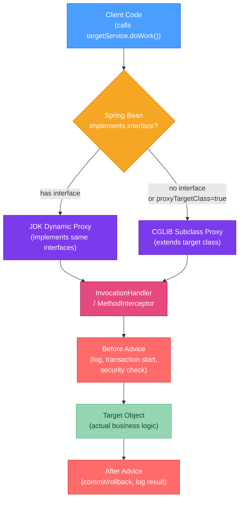

# 🎭 Proxy and Dynamic Code Generation

> [!abstract] TL;DR
> **JDK dynamic proxy** (`java.lang.reflect.Proxy`) creates a proxy that implements specified **interfaces** at runtime. All calls are routed through an `InvocationHandler`. **Limitation**: only works with interfaces — cannot proxy concrete classes. **CGLIB** (used by Spring when no interface exists) generates a **subclass** of the target class at runtime. **Spring AOP** chooses: JDK proxy if the bean implements an interface, CGLIB otherwise; `proxyTargetClass=true` forces CGLIB always. **Byte Buddy** is the modern bytecode generation library (used by Mockito, Hibernate) with a fluent API. All proxies enable frameworks to intercept method calls for cross-cutting concerns: transactions, security checks, logging, lazy loading.

---

## Intuition

A proxy is like a personal assistant standing between you and an executive. When someone calls the executive's number (invokes a method), the assistant picks up first (InvocationHandler). The assistant can log the call, check credentials, add to a queue, or forward directly to the executive. The caller doesn't know they're talking to an assistant — they just called the executive's number. JDK proxy is an assistant who can only answer phones labeled with a specific job title (interface). CGLIB is an assistant who can answer any phone in the building, including ones with no formal title.

---

## How It Works



---

## Key Concepts

### 1. JDK Dynamic Proxy

`Proxy.newProxyInstance` creates a class at runtime that implements the given interfaces. Every method call on that class goes through the `InvocationHandler`.

```java
import java.lang.reflect.*;

// ── Target interface and implementation ────────────────────────────────────
public interface UserService {
    User findById(Long id);
    User save(User user);
}

public class UserServiceImpl implements UserService {
    public User findById(Long id) { /* real logic */ return null; }
    public User save(User user) { /* real logic */ return user; }
}

// ── InvocationHandler: intercepts all method calls ─────────────────────────
public class LoggingInvocationHandler implements InvocationHandler {
    private final Object target;

    public LoggingInvocationHandler(Object target) {
        this.target = target;
    }

    @Override
    public Object invoke(Object proxy, Method method, Object[] args) throws Throwable {
        // 'proxy'  = the proxy object itself (rarely needed)
        // 'method' = the Method being called (via reflection)
        // 'args'   = actual arguments (null if no args)

        System.out.println("→ Calling: " + method.getName() +
                           " with args: " + Arrays.toString(args));
        long start = System.nanoTime();
        try {
            Object result = method.invoke(target, args);  // delegate to real impl
            System.out.println("← Returned: " + result +
                               " in " + (System.nanoTime() - start) / 1_000 + "µs");
            return result;
        } catch (InvocationTargetException e) {
            System.out.println("✗ Exception: " + e.getCause());
            throw e.getCause();  // unwrap and rethrow original exception
        }
    }
}

// ── Creating the proxy ─────────────────────────────────────────────────────
public class ProxyDemo {
    public static void main(String[] args) {
        UserServiceImpl realService = new UserServiceImpl();

        UserService proxy = (UserService) Proxy.newProxyInstance(
                UserServiceImpl.class.getClassLoader(),   // ClassLoader for the proxy class
                new Class[]{UserService.class},           // interfaces to implement
                new LoggingInvocationHandler(realService) // handler for all calls
        );

        // The proxy implements UserService — client can't tell it's a proxy
        proxy.findById(42L);   // → invokes handler.invoke() → logs → delegates

        // Checking if an object is a JDK proxy
        System.out.println(Proxy.isProxyClass(proxy.getClass()));  // true
        InvocationHandler handler = Proxy.getInvocationHandler(proxy);

        // ⚠️ LIMITATION: JDK proxy only works with interfaces
        // UserServiceImpl directProxy = (UserServiceImpl) Proxy.newProxyInstance(...)
        // → Cannot proxy concrete classes — ClassCastException at runtime
    }
}
```

### 2. CGLIB (Code Generation Library)

CGLIB generates a **subclass** of the target class, overriding all non-final methods to route them through a `MethodInterceptor`. Spring bundles CGLIB (no separate dependency needed since Spring 3.2).

```java
// CGLIB dependency (if used outside Spring):
// net.bytebuddy:byte-buddy or cglib:cglib-nodep:3.3.0

import net.sf.cglib.proxy.*;

public class CglibDemo {

    public static void main(String[] args) {
        Enhancer enhancer = new Enhancer();

        // ── Set the class to subclass ──────────────────────────────────────
        enhancer.setSuperclass(UserServiceImpl.class);  // no interface needed!

        // ── Set the interceptor ────────────────────────────────────────────
        enhancer.setCallback((MethodInterceptor) (obj, method, methodArgs, proxy) -> {
            // 'obj'        = the proxy object
            // 'method'     = the Method being called
            // 'methodArgs' = actual arguments
            // 'proxy'      = MethodProxy (use to call super without reflection)

            System.out.println("CGLIB intercepting: " + method.getName());
            Object result = proxy.invokeSuper(obj, methodArgs);  // call real method
            return result;
        });

        UserServiceImpl proxy = (UserServiceImpl) enhancer.create();
        // ✓ Proxy IS-A UserServiceImpl — works without any interface
        proxy.findById(42L);  // intercepted
    }
}
```

**CGLIB limitations:**
- Cannot proxy `final` classes (cannot subclass them)
- Cannot proxy `final` methods (cannot override them — calls bypass the interceptor)
- Requires a no-arg constructor (Spring works around this with Objenesis to create instances without calling constructors)

### 3. Spring AOP Proxy Selection

```java
// Spring chooses proxy type automatically based on the bean:

// Case 1: Bean implements at least one interface → JDK Proxy
@Service
public class OrderServiceImpl implements OrderService {
    @Transactional  // Spring creates a JDK proxy for OrderService interface
    public void placeOrder(Order order) { ... }
}

// Case 2: Bean implements no interface → CGLIB subclass
@Service
public class ReportGenerator {
    @Transactional  // Spring creates a CGLIB subclass of ReportGenerator
    public void generate() { ... }
}

// Force CGLIB always (even when interfaces exist):
@Configuration
@EnableAspectJAutoProxy(proxyTargetClass = true)  // forces CGLIB for all beans
public class AppConfig {}

// Or in application.properties:
// spring.aop.proxy-target-class=true

// ── Self-invocation problem: proxy is bypassed! ────────────────────────────
@Service
public class UserService {
    @Transactional
    public void createUser(User user) { ... }

    public void bulkCreate(List<User> users) {
        for (User u : users) {
            this.createUser(u);  // ❌ 'this' = real object, NOT the proxy
                                 // @Transactional is ignored — direct call bypasses AOP!
        }
    }
    // FIX: inject self as proxy, or use @Lookup, or move createUser to a separate bean
}
```

### 4. Byte Buddy — Modern Bytecode Generation

Byte Buddy is the modern replacement for CGLIB, used by Mockito (since 2.x), Hibernate (since 5.x), and many other frameworks. It provides a fluent API and better Java 9+ module compatibility.

```java
import net.bytebuddy.ByteBuddy;
import net.bytebuddy.implementation.MethodDelegation;
import net.bytebuddy.implementation.bind.annotation.*;
import net.bytebuddy.matcher.ElementMatchers;

// ── Example: intercept all methods with a logging interceptor ──────────────
public class LoggingInterceptor {

    // @RuntimeType: allows returning Object from methods with any return type
    @RuntimeType
    public static Object intercept(
            @SuperCall Callable<?> superMethod,  // call original method
            @Origin Method method,               // the Method being called
            @AllArguments Object[] args          // all arguments
    ) throws Exception {
        System.out.println("Before: " + method.getName());
        Object result = superMethod.call();      // invoke original implementation
        System.out.println("After: " + method.getName() + " → " + result);
        return result;
    }
}

public class ByteBuddyDemo {
    public static void main(String[] args) throws Exception {
        // ── Create a subclass proxy ────────────────────────────────────────
        Class<? extends UserServiceImpl> proxyClass = new ByteBuddy()
                .subclass(UserServiceImpl.class)
                .method(ElementMatchers.any())   // intercept all methods
                .intercept(MethodDelegation.to(LoggingInterceptor.class))
                .make()
                .load(UserServiceImpl.class.getClassLoader())
                .getLoaded();

        UserServiceImpl proxy = proxyClass.getDeclaredConstructor().newInstance();
        proxy.findById(42L);  // logged

        // ── Generate a completely new class at runtime ─────────────────────
        Class<?> dynamicClass = new ByteBuddy()
                .subclass(Object.class)
                .name("com.example.DynamicClass")
                .defineMethod("greet", String.class, Modifier.PUBLIC)
                .withParameter(String.class, "name")
                .intercept(FixedValue.value("Hello!"))  // always returns "Hello!"
                .make()
                .load(ClassLoader.getSystemClassLoader())
                .getLoaded();

        Object instance = dynamicClass.getDeclaredConstructor().newInstance();
        Method greet = dynamicClass.getMethod("greet", String.class);
        System.out.println(greet.invoke(instance, "Alice"));  // "Hello!"
    }
}
```

### 5. Why Frameworks Use Proxies

| Framework | Proxy Type | Cross-cutting Concern |
|-----------|-----------|----------------------|
| Spring `@Transactional` | JDK / CGLIB | Begin/commit/rollback transactions |
| Spring `@Cacheable` | JDK / CGLIB | Check cache, populate cache |
| Spring Security `@PreAuthorize` | JDK / CGLIB | Authorization check before method |
| JPA Lazy Loading | Byte Buddy (Hibernate 5+) | Load entity data from DB on first field access |
| Mockito `.mock()` | Byte Buddy | Record and verify interactions |
| Spring `@Async` | JDK / CGLIB | Execute method in background thread pool |

---

## Real-World Notes

- **Self-invocation is the #1 Spring AOP mistake**: calling `this.transactionalMethod()` from within the same bean bypasses the proxy — the `@Transactional` annotation has no effect. Detection: enable Spring's `DEBUG` logging for transactions; you'll see no transaction started.
- **Proxy performance**: calling through a Spring proxy adds ~50-100ns per call. This is negligible for business logic but matters for hot loops. Never put a `@Transactional` method in an inner loop.
- **Virtual threads and proxies**: CGLIB proxies capture `synchronized` in their generated code, which pins virtual threads in Java 21. If using Project Loom, consider `@EnableAspectJAutoProxy(proxyTargetClass = false)` to prefer JDK proxies.

---

## Common Pitfalls

| Pitfall | Consequence | Fix |
|---------|-------------|-----|
| Self-invocation bypass | @Transactional/@Cacheable silently ignored | Inject self as proxy or move to separate bean |
| `final` method in CGLIB target | Method not intercepted — proxy calls original directly | Remove `final` or use interface-based (JDK) proxy |
| `final` class with CGLIB | `Cannot subclass final class` exception at startup | Implement an interface so JDK proxy can be used instead |
| Casting JDK proxy to concrete class | ClassCastException | Only cast to interface types; or use CGLIB |
| Proxy not returned (bean replaced) | `@Autowired` gets real object, not proxy | Never instantiate beans with `new`; always let Spring inject |

---

## Related Concepts

- [[_MOC_Java_Internals|↑ Section MOC — Java Internals]]
- [[Reflection_API]] — InvocationHandler.invoke() receives a `Method` object, used reflectively
- [[Bytecode_and_JVM]] — CGLIB and Byte Buddy manipulate bytecode to generate proxy classes
- [[Java_Memory_Model]] — Proxied @Transactional methods must correctly handle volatile/synchronized semantics

---

## Review Questions

1. You annotate a method with `@Transactional` in a Spring service, but you observe that calling it from another method in the same class does not open a transaction. Explain the root cause in terms of Spring's proxy mechanism, and give two concrete solutions.

2. A bean has no interface. Spring is trying to create a CGLIB proxy for it but throws `Cannot subclass final class`. The class is a third-party library class marked `final`. What is your only option for applying Spring AOP to it?

3. Compare JDK dynamic proxy and Byte Buddy in terms of: (a) what they can proxy, (b) performance, and (c) Java module system compatibility. Why did Mockito switch from CGLIB to Byte Buddy?

---

## Sources
- [java.lang.reflect.Proxy javadoc](https://docs.oracle.com/en/java/docs/api/java.base/java/lang/reflect/Proxy.html)
- [Byte Buddy documentation](https://bytebuddy.net/)
- [Spring AOP reference — proxy mechanisms](https://docs.spring.io/spring-framework/reference/core/aop/proxying.html)
- Vlad Mihalcea, *How does Spring @Transactional work* (blog)

#java #internals #proxy #CGLIB #Byte-Buddy #Spring-AOP #dynamic-proxy #Advanced
