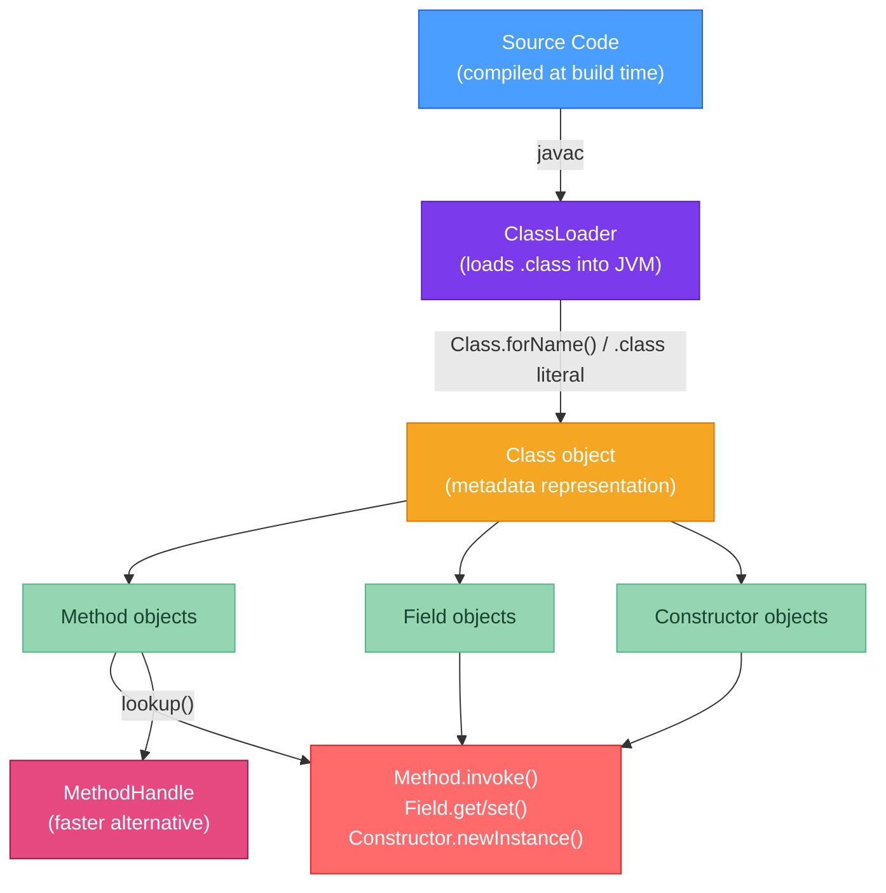

# 🔭 Java Reflection API

> [!abstract] TL;DR
> Reflection allows Java code to inspect and invoke classes, methods, and fields at runtime — without knowing them at compile time. Three ways to get a `Class` object: `Class.forName("com.example.Foo")` (dynamic, throws `ClassNotFoundException`), `Foo.class` (compile-time literal), `obj.getClass()` (runtime actual type). `getDeclaredMethods()` returns methods of that class only; `getMethods()` returns all public methods including inherited ones. `Method.invoke(obj, args)` calls a method reflectively. `setAccessible(true)` bypasses access control but is blocked by the Java 9 module system. **Performance**: reflective invocation is ~1000x slower than a direct call in tight loops — cache `Method`/`Field` objects. Use `MethodHandles.lookup().findVirtual()` as a faster alternative.

---

## Intuition

Reflection is like reading a blueprint of a building (class) at runtime — you can see all the rooms (fields), doorways (methods), and blueprints of sub-rooms (nested classes) even if you didn't design the building. Normally, Java code is like a contractor who follows a fixed plan written at compile time. Reflection makes the contractor a universal inspector who can walk into any building, read its layout, and modify rooms on the fly — useful for tools like debuggers, DI containers, and ORMs, but slower than knowing the plan upfront.

---

## How It Works



---

## Key Concepts

### 1. Getting a Class Object

```java
// ── Three ways to obtain Class<T> ─────────────────────────────────────────

// 1. Class literal (compile-time, no class loading, no exception)
Class<String> stringClass = String.class;
Class<int[]> arrayClass   = int[].class;

// 2. Instance method (returns actual runtime type, not declared type)
Object obj = "Hello";
Class<?> runtimeClass = obj.getClass();  // returns Class<String>, not Class<Object>
System.out.println(runtimeClass.getName());  // java.lang.String

// 3. Dynamic loading by name (throws ClassNotFoundException if not on classpath)
try {
    Class<?> dynamicClass = Class.forName("com.example.UserService");
    // Optional second arg: initialize the class (run static initializers)?
    Class<?> lazy = Class.forName("com.example.BigService", false,
            Thread.currentThread().getContextClassLoader());
} catch (ClassNotFoundException e) {
    // Handle: class not found on classpath
}

// Useful Class methods:
Class<?> cls = String.class;
cls.getName()           // "java.lang.String" (binary name)
cls.getSimpleName()     // "String"
cls.getPackageName()    // "java.lang"
cls.getSuperclass()     // Object.class
cls.getInterfaces()     // [Serializable, CharSequence, Comparable, ...]
cls.isInterface()       // false
cls.isArray()           // false
cls.isPrimitive()       // false
cls.isAnnotation()      // false
cls.isEnum()            // false
cls.isRecord()          // false (Java 16+ records)
```

### 2. Methods: `getDeclaredMethods` vs `getMethods`

```java
// getMethods(): all PUBLIC methods (inherited + declared) — includes Object methods
// getDeclaredMethods(): all methods of THIS CLASS ONLY (all access levels, no inherited)

public class Animal {
    public void breathe() {}
    protected void grow() {}
    private void think() {}
}

public class Dog extends Animal {
    public void bark() {}
    private void wag() {}
}

Class<Dog> cls = Dog.class;

// getMethods(): public methods visible on Dog (inherited + declared)
Method[] publicMethods = cls.getMethods();
// → bark(), breathe(), wait(), equals(), hashCode(), toString(), ... (Object methods too)

// getDeclaredMethods(): only Dog's own methods (all access levels)
Method[] dogOnly = cls.getDeclaredMethods();
// → bark(), wag()  (not breathe() — it's inherited from Animal, not declared in Dog)

// Access a specific method by name and parameter types
Method barker = cls.getDeclaredMethod("bark");           // no-arg
Method method = cls.getDeclaredMethod("myMethod", String.class, int.class);
```

### 3. Invoking Methods, Getting/Setting Fields

```java
import java.lang.reflect.*;

public class ReflectionDemo {

    private String secret = "hidden value";
    public int compute(int x, int y) { return x + y; }

    public static void main(String[] args) throws Exception {
        ReflectionDemo instance = new ReflectionDemo();
        Class<?> cls = instance.getClass();

        // ── Method invocation ─────────────────────────────────────────────
        Method compute = cls.getDeclaredMethod("compute", int.class, int.class);
        int result = (int) compute.invoke(instance, 3, 4);  // → 7
        // compute.invoke(null, ...) for static methods

        // ── Accessing a private field ──────────────────────────────────────
        Field secretField = cls.getDeclaredField("secret");
        secretField.setAccessible(true);  // bypass private access control
        String value = (String) secretField.get(instance);   // → "hidden value"
        secretField.set(instance, "new value");               // mutate it

        // ── Creating an instance via reflection ───────────────────────────
        Constructor<ReflectionDemo> ctor = ReflectionDemo.class.getDeclaredConstructor();
        ctor.setAccessible(true);  // if private constructor
        ReflectionDemo newInst = ctor.newInstance();  // equivalent to new ReflectionDemo()

        // ── Checking annotations ──────────────────────────────────────────
        if (compute.isAnnotationPresent(Deprecated.class)) {
            System.out.println("Method is deprecated");
        }
        Deprecated ann = compute.getAnnotation(Deprecated.class);

        // ── Working with generics at runtime ──────────────────────────────
        Field listField = cls.getDeclaredField("items");  // List<String> items
        Type genericType = listField.getGenericType();
        if (genericType instanceof ParameterizedType pt) {
            Type[] typeArgs = pt.getActualTypeArguments();  // → [String.class]
        }
    }
}
```

### 4. Performance Cost and Caching

```java
// Reflection overhead benchmark (approximate):
// Direct method call:  1 ns
// MethodHandle call:   3-5 ns (after warmup)
// Method.invoke():     100-1000 ns (JVM-version and access-check dependent)
//
// Root causes of slowness:
// 1. Access check on every invoke() call (unless setAccessible(true))
// 2. Boxing/unboxing of primitive arguments into Object[]
// 3. No JIT inlining through reflection (JVM can't prove the call target)
// 4. Dynamic lookup overhead

// ── WRONG: re-looking up Method on every call ─────────────────────────────
public void badExample(Object obj, String value) throws Exception {
    // getDeclaredMethod is expensive — involves hash map lookup in Class metadata
    Method m = obj.getClass().getDeclaredMethod("setValue", String.class);
    m.invoke(obj, value);
}

// ── RIGHT: cache the Method object ───────────────────────────────────────
private static final Method SET_VALUE_METHOD;
static {
    try {
        SET_VALUE_METHOD = MyService.class.getDeclaredMethod("setValue", String.class);
        SET_VALUE_METHOD.setAccessible(true);
    } catch (NoSuchMethodException e) {
        throw new ExceptionInInitializerError(e);
    }
}

public void goodExample(MyService obj, String value) throws Exception {
    SET_VALUE_METHOD.invoke(obj, value);  // only invoke overhead, no lookup
}
```

### 5. MethodHandles — Faster Alternative

`MethodHandles` are the JVM-level mechanism behind `invokedynamic`. They provide reflection-like capability with near-direct-call performance after JIT warmup.

```java
import java.lang.invoke.*;

public class MethodHandleDemo {

    public String greet(String name) {
        return "Hello, " + name + "!";
    }

    public static void main(String[] args) throws Throwable {
        MethodHandles.Lookup lookup = MethodHandles.lookup();

        // findVirtual: public instance method
        MethodHandle greetHandle = lookup.findVirtual(
                MethodHandleDemo.class,
                "greet",
                MethodType.methodType(String.class, String.class)  // (return, params)
        );

        MethodHandleDemo instance = new MethodHandleDemo();
        String result = (String) greetHandle.invoke(instance, "World");
        // → "Hello, World!"

        // invokeExact: faster (no type coercion); must match exactly
        String exact = (String) greetHandle.invokeExact(instance, "World");

        // findStatic: static method
        MethodHandle parseIntHandle = lookup.findStatic(
                Integer.class, "parseInt",
                MethodType.methodType(int.class, String.class));
        int parsed = (int) parseIntHandle.invoke("42");  // → 42

        // findConstructor
        MethodHandle ctorHandle = lookup.findConstructor(
                StringBuilder.class,
                MethodType.methodType(void.class, String.class));
        StringBuilder sb = (StringBuilder) ctorHandle.invoke("initial");

        // Accessing private members: requires privateLookupIn (Java 9+)
        MethodHandles.Lookup privateLookup = MethodHandles.privateLookupIn(
                MethodHandleDemo.class, lookup);
        MethodHandle privateHandle = privateLookup.findVirtual(/* private method */);

        // Binding: create a curried handle with the receiver already bound
        MethodHandle bound = greetHandle.bindTo(instance);
        String bound_result = (String) bound.invoke("Alice");  // no instance arg needed
    }
}
```

### 6. Module System Restrictions (Java 9+)

```java
// Java 9+ modules can restrict reflective access:
// - Unexported packages: Class.forName works but getDeclaredMethods/setAccessible throws
// - Module adds opens: allows reflective access to a specific package

// module-info.java (the module being accessed):
// module com.example.lib {
//     exports com.example.api;              // public API, reflectable
//     opens com.example.impl to spring.core;  // allow Spring to reflect into impl
// }

// Without 'opens', calling setAccessible(true) on a field in a non-open package throws:
// java.lang.reflect.InaccessibleObjectException:
//   Unable to make field private ... accessible:
//   module com.example.lib does not "opens com.example.impl" to module myapp

// Legacy workaround (NOT recommended — add-opens suppresses module security):
// java --add-opens com.example.lib/com.example.impl=ALL-UNNAMED MyApp

// The right fix: add 'opens' to the module-info.java of the target module
```

---

## Real-World Notes

- **DI frameworks**: Spring uses reflection to inject dependencies into private fields (`@Autowired private Service service`). Jackson uses it to map JSON to Java fields. Both cache their `Field`/`Method` objects aggressively.
- **JVM intrinsification**: some `Method.invoke()` calls are intrinsified by the JIT after enough invocations (inflation threshold: 15 by default). After inflation, the JVM generates native code for the reflective call — dramatically closing the performance gap. This is why benchmarking reflection in isolation without warmup is misleading.
- **Spring and `--add-opens`**: Spring Boot 3.x requires `--add-opens java.base/java.lang=ALL-UNNAMED` for certain operations. This is a known friction point with the JPMS module system.

---

## Common Pitfalls

| Pitfall | Consequence | Fix |
|---------|-------------|-----|
| Not caching `Method`/`Field` objects | Repeated getDeclaredMethod() calls → significant overhead | Cache in static final fields (initialized in static block) |
| Using `getMethods()` when `getDeclaredMethods()` needed | Missing private/package-private methods | Use `getDeclaredMethods()` and `setAccessible(true)` |
| Ignoring `InvocationTargetException` | Swallowing real exceptions thrown by invoked methods | Always unwrap: `ex.getCause()` to get the original exception |
| `setAccessible(true)` in Java 9+ modules | `InaccessibleObjectException` at runtime | Add `opens` to `module-info.java` or `--add-opens` JVM flag |
| Passing wrong argument types to `invoke()` | `IllegalArgumentException` at runtime | Double-check method descriptor and argument types |

---

## Related Concepts

- [[_MOC_Java_Internals|↑ Section MOC — Java Internals]]
- [[Bytecode_and_JVM]] — Reflection reads the same metadata stored in .class constant pool
- [[Proxy_and_Dynamic_Code]] — JDK Proxy uses reflection (InvocationHandler.invoke receives Method)
- [[ClassPath_and_Modules]] — Module system controls which packages can be opened for reflection

---

## Review Questions

1. A serialization library needs to set all fields (including private ones) of an arbitrary class to values from a JSON document. Write the code skeleton using reflection, and explain the one JVM argument you might need to add when the target class lives in a named module.

2. Explain the `InvocationTargetException` wrapping behavior of `Method.invoke()`. If the invoked method throws an `IllegalArgumentException`, what do you actually catch, and how do you retrieve the original exception?

3. A performance test shows that a class that calls `getDeclaredMethod()` and `Method.invoke()` on every request is 500x slower than expected. Describe the two changes that would bring it closest to direct-call performance, and explain why MethodHandles are faster than Method.invoke() after JIT warmup.

---

## Sources
- [java.lang.reflect package javadoc](https://docs.oracle.com/en/java/docs/api/java.base/java/lang/reflect/package-summary.html)
- [java.lang.invoke (MethodHandles)](https://docs.oracle.com/en/java/docs/api/java.base/java/lang/invoke/package-summary.html)
- Brian Goetz, *State of the Lambda: Libraries Edition* (2013)
- [JEP 396: Strongly Encapsulate JDK Internals](https://openjdk.org/jeps/396)

#java #internals #reflection #MethodHandles #introspection #Intermediate
