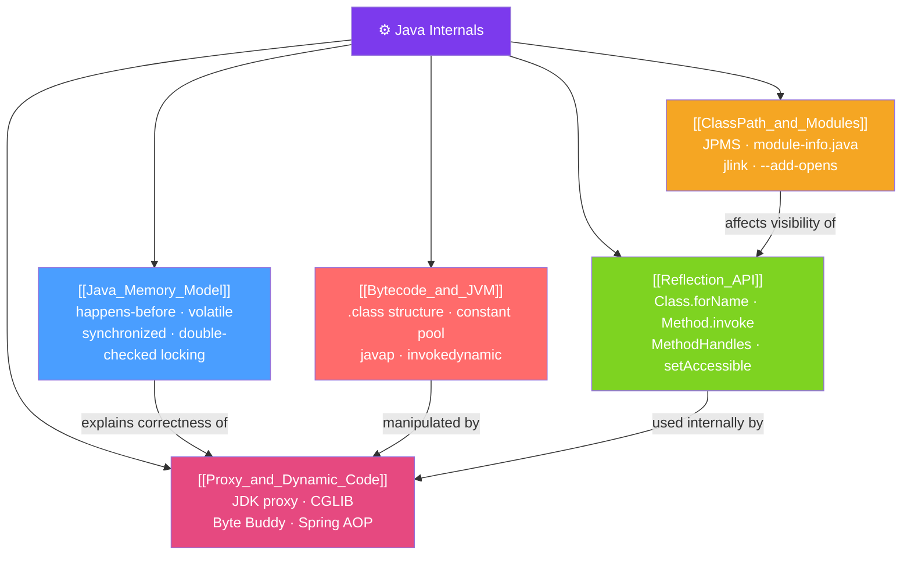

# ⚙️ Java Internals — Map of Content

> [!abstract] What This Section Covers
> Java Internals covers the mechanisms under the hood that experienced engineers need to reason about: the Java Memory Model (what makes concurrent code correct), bytecode and the JVM's execution engine, the Reflection API (how frameworks introspect and manipulate code at runtime), proxy-based dynamic code generation (the foundation of Spring AOP and JPA lazy loading), and the module system (JPMS) introduced in Java 9. These topics explain *why* frameworks like Spring work the way they do.

## Concept Map

## Learning Path
1. [[Java_Memory_Model]] — Understand happens-before, volatile, and synchronized at the specification level — essential for writing correct concurrent code.
2. [[Bytecode_and_JVM]] — See what Java code looks like at the bytecode level and understand how the JVM executes it.
3. [[Reflection_API]] — Learn how frameworks inspect and call code at runtime; understand the performance cost and module system restrictions.
4. [[Proxy_and_Dynamic_Code]] — Understand how JDK Proxy, CGLIB, and Byte Buddy generate classes at runtime — the mechanism behind Spring AOP and JPA.
5. [[ClassPath_and_Modules]] — Master the Java 9 module system, `module-info.java`, and tools like `jlink` for custom runtimes.

## All Notes at a Glance
| Note | Difficulty | What You'll Learn |
|------|------------|-------------------|
| [[Java_Memory_Model]] | Advanced | happens-before edges, volatile guarantees, JMM bugs, double-checked locking |
| [[Bytecode_and_JVM]] | Advanced | .class file structure, instruction categories, javap, invokedynamic, ASM basics |
| [[Reflection_API]] | Intermediate | Class introspection, Method.invoke, MethodHandles, performance cost, module restrictions |
| [[Proxy_and_Dynamic_Code]] | Advanced | JDK Proxy, CGLIB, Byte Buddy, Spring AOP proxy selection, InvocationHandler |
| [[ClassPath_and_Modules]] | Advanced | JPMS, module-info.java syntax, unnamed module, jlink, --add-opens |

## Key Questions This Section Answers
- What is the happens-before relationship and why does it matter for concurrent code correctness?
- What does `volatile` actually guarantee (and what doesn't it guarantee)?
- How does `javap` help you understand what the JIT compiler sees?
- Why is `Method.invoke()` 1000x slower than a direct call, and what is the faster alternative?
- When does Spring AOP use a JDK proxy vs a CGLIB proxy?
- What is `module-info.java` and how does it break reflection-based frameworks like Spring?

## Related Sections
- [[_MOC_Java_Master|↑ Java Master MOC]]
- [[_MOC_JVM_Memory|→ JVM Memory]] — GC algorithms and memory areas
- [[_MOC_Concurrency|→ Concurrency]] — Threads and locks that the JMM governs
- [[_MOC_Design_Patterns|→ Design Patterns]] — Proxy pattern that dynamic proxies implement

#MOC #java #internals #JVM
