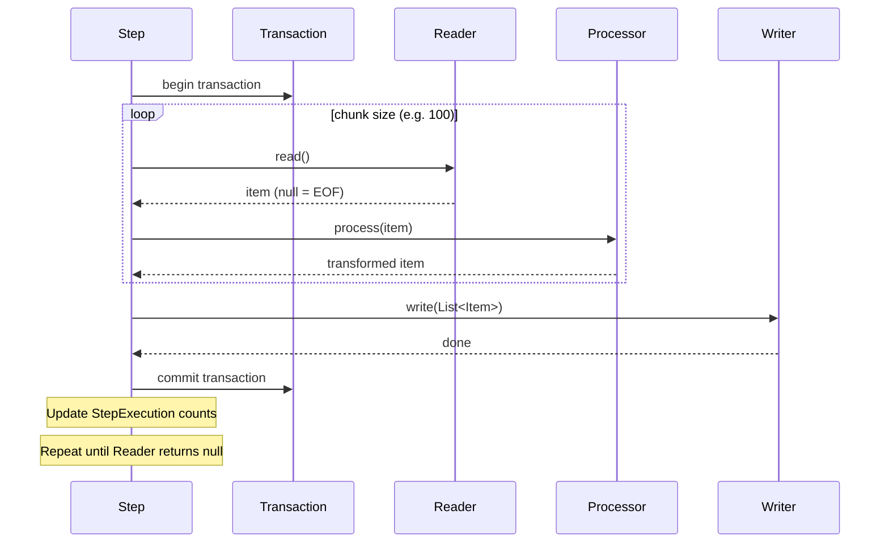

# 🔄 Chunk Processing

> [!abstract] TL;DR
> Chunk-oriented processing is Spring Batch's core model: items are read one-at-a-time, optionally transformed by an `ItemProcessor`, then written in a configurable batch (the "chunk"). Each chunk is wrapped in a transaction — commit-interval controls how often the DB transaction commits. Fault tolerance adds skip and retry logic so bad records don't fail the entire job.

## Intuition — analogy FIRST

Imagine a **mail sorting facility**. Letters come down a conveyor (ItemReader) — one at a time. A sorter (ItemProcessor) checks each letter: valid address? Correct postage? Every 100 letters (commit-interval), the sorted batch is loaded into a mail cart and dispatched to delivery trucks (ItemWriter), sealing that batch's transaction. If 3 letters in one batch have unreadable addresses (skip policy), they go to the "undeliverable" bin and the batch continues. If the dispatch system is temporarily down (transient error), the batch waits 2 seconds and retries up to 3 times before giving up. The entire process is trackable: how many letters read, sorted, dispatched, and rejected.

---

## How It Works



## Key Concepts / Details

### Commit Interval (Chunk Size)

The `chunk(N)` setting controls how many items are read/processed before the writer is called and the transaction commits:

```java
// Commit every 100 items
.<InputType, OutputType>chunk(100, transactionManager)
    .reader(reader)
    .processor(processor)
    .writer(writer)
```

**Choosing commit interval**:
- Too small (e.g., 1): excessive transaction overhead, slow throughput
- Too large (e.g., 100,000): large memory footprint, long transactions risk locks/timeouts, more re-work on restart
- Typical range: 100–1,000 for DB writes; 1,000–10,000 for file writes

### ItemProcessor — Transformation and Filtering

```java
@Component
public class UserEnrichmentProcessor implements ItemProcessor<UserCsv, User> {
    
    private final GeolocationService geoService;
    
    @Override
    public User process(UserCsv item) throws Exception {
        // Return null to FILTER the item (it won't be written)
        if (!isValidEmail(item.getEmail())) {
            return null;  // filtered items are not counted as written
        }
        
        User user = new User();
        user.setEmail(item.getEmail().toLowerCase());
        user.setCountry(geoService.lookup(item.getIpAddress()));
        user.setCreatedAt(LocalDateTime.now());
        return user;
    }
}
```

Chain multiple processors with `CompositeItemProcessor`:

```java
@Bean
public CompositeItemProcessor<UserCsv, User> compositeProcessor(
        ValidationProcessor<UserCsv> validator,
        EnrichmentProcessor<UserCsv, User> enricher) {
    CompositeItemProcessor<UserCsv, User> processor = new CompositeItemProcessor<>();
    processor.setDelegates(List.of(validator, enricher));
    return processor;
}
```

### Fault Tolerance — Skip Policy

Skip allows bad records to be bypassed without failing the entire step:

```java
.<UserCsv, User>chunk(100, txManager)
    .reader(reader)
    .processor(processor)
    .writer(writer)
    .faultTolerant()
        // Skip these exceptions — item logged and processing continues
        .skip(DataIntegrityViolationException.class)
        .skip(MalformedRecordException.class)
        .skipLimit(50)  // fail the step after 50 total skips
        // NEVER skip these — always fail
        .noSkip(DatabaseConnectionException.class)
```

**Custom SkipPolicy** for fine-grained control:

```java
public class BusinessSkipPolicy implements SkipPolicy {
    @Override
    public boolean shouldSkip(Throwable t, long skipCount) throws SkipLimitExceededException {
        if (t instanceof MalformedDataException) {
            return skipCount < 100;  // skip up to 100 malformed records
        }
        if (t instanceof DuplicateKeyException) {
            return true;  // always skip duplicates
        }
        return false;  // fail for anything else
    }
}
```

### Fault Tolerance — Retry Policy

Retry handles **transient** failures (network timeouts, temporary DB unavailability):

```java
.faultTolerant()
    .retry(TransientDataAccessException.class)
    .retry(HttpServerErrorException.class)
    .retryLimit(3)
    // Optional: exponential backoff between retries
    .retryContextCache(new MapRetryContextCache())
```

**Important**: Retry re-reads and re-processes the entire chunk (not just the failed item), then re-writes. The chunk is processed in "single-item mode" during the scan-for-skip phase. This means your reader must be restartable.

### Skip and Retry Together

```java
.<UserCsv, User>chunk(500, txManager)
    .reader(reader)
    .processor(processor)
    .writer(writer)
    .faultTolerant()
        // Retry transient errors
        .retry(OptimisticLockingFailureException.class).retryLimit(3)
        // Skip permanent data errors
        .skip(ConstraintViolationException.class).skipLimit(100)
        // Add listeners to log skipped/retried items
        .listener(skipListener())
        .listener(retryListener())
```

### Listeners for Observability

```java
@Component
public class UserSkipListener 
        implements SkipListener<UserCsv, User> {
    
    @Override
    public void onSkipInRead(Throwable t) {
        log.warn("Skipped during read: {}", t.getMessage());
    }
    
    @Override
    public void onSkipInProcess(UserCsv item, Throwable t) {
        log.warn("Skipped during processing of {}: {}", item.getEmail(), t.getMessage());
        // Could write to a reject file or dead-letter queue
        rejectWriter.write(item, t);
    }
    
    @Override
    public void onSkipInWrite(User item, Throwable t) {
        log.warn("Skipped during write of user {}: {}", item.getId(), t.getMessage());
    }
}
```

### Chunk vs Tasklet — Decision Table

| Criterion | Chunk Step | Tasklet Step |
|-----------|-----------|--------------|
| Volume | Millions of records | Small, bounded operations |
| Transaction granularity | Per chunk (N items) | Single transaction |
| Restart granularity | From last committed chunk | From beginning of tasklet |
| Fault tolerance | Skip/retry per record | All-or-nothing |
| Use case | ETL, data migration, report generation | File move, email send, cleanup |

### Multi-Threaded Step

Process multiple chunks in parallel using a `TaskExecutor`:

```java
@Bean
public Step multiThreadedStep(JobRepository repo, PlatformTransactionManager txManager,
                               ItemReader<Order> reader, ItemWriter<Order> writer) {
    return new StepBuilder("multiThreadedStep", repo)
            .<Order, Order>chunk(100, txManager)
            .reader(reader)  // Must be thread-safe! Use SynchronizedItemStreamReader
            .writer(writer)
            .taskExecutor(new SimpleAsyncTaskExecutor())
            .throttleLimit(10)  // max 10 concurrent threads
            .build();
}
```

## Real-World Notes

- **Chunk transaction isolation**: By default, chunk transactions use the `@Transactional` settings of the step. Set `isolation` on the `PlatformTransactionManager` for batch-appropriate isolation levels (often `READ_COMMITTED` is sufficient).
- **Skip limit in production**: Set skip limits conservatively. A skip limit of 1% of expected records is a common baseline. Alert ops when the skip count is non-zero.
- **Retry with non-idempotent writers**: If your writer is not idempotent (e.g., inserts without upsert), retry causes duplicates. Use `ON CONFLICT DO UPDATE` or `MERGE` statements.
- **Processor returning null**: Items filtered out (null return from processor) don't count toward write count in `StepExecution.getWriteCount()` but do count toward read count. This is intentional — use it for filtering invalid records cleanly.

## Common Pitfalls

- **Retrying non-transient errors**: Retrying `ConstraintViolationException` (permanent error) wastes retries. Classify errors: transient (retry) vs permanent (skip or fail).
- **Mixing skip and retry on same exception**: Defining both `.skip(SomeException.class)` and `.retry(SomeException.class)` causes retry to win. Be explicit about classification.
- **Large chunk size with JPA**: JPA first-level cache accumulates all entities in the chunk. For chunk sizes > 100 with JPA, either call `entityManager.clear()` or use `JdbcBatchItemWriter` instead.
- **Non-restartable processors**: If your processor has side effects (calls an external API, sends SMS), retrying the chunk re-invokes the processor for already-processed items. Design processors to be idempotent.

## Related Concepts
- [[ItemReader_ItemWriter]] — The read and write components used in chunk steps
- [[Job_and_Step]] — How chunk steps are configured within a Job
- [[Spring_Batch_Monitoring]] — Tracking commit counts, skip counts via `StepExecution`

## Review Questions
1. What determines how often a database transaction commits in a chunk step?
2. What happens when an `ItemProcessor` returns `null`?
3. What is the difference between skip and retry fault tolerance?
4. Why must readers be thread-safe in multi-threaded steps?
5. How does Spring Batch handle a job restart after a failed chunk step?

## Sources
- Spring Batch Reference — Chunk-Oriented Processing: https://docs.spring.io/spring-batch/docs/current/reference/html/step.html#chunkOrientedProcessing
- Spring Batch Reference — Fault Tolerance: https://docs.spring.io/spring-batch/docs/current/reference/html/step.html#faultTolerant

#java #spring #spring-batch #chunk-processing #fault-tolerance
