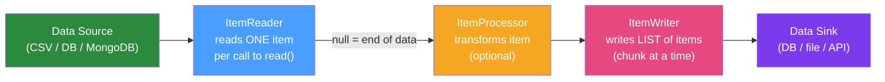

# 📖 ItemReader and ItemWriter

> [!abstract] TL;DR
> `ItemReader<T>` and `ItemWriter<T>` are the read and write sides of Spring Batch's chunk-oriented processing. Spring Batch ships with production-ready implementations for flat files, JDBC (cursor and paging), JPA, MongoDB, Kafka, and more. Understanding which reader to use for which data size, and how to write custom implementations, is central to building efficient batch jobs.

## Intuition — analogy FIRST

Think of `ItemReader` as a **checkout scanner at a grocery store** — it picks up items one at a time off the belt. The cashier (processor) might transform each item (apply a coupon). Then the `ItemWriter` is the **packing bags** — it doesn't pack one item at a time but waits until the chunk (a group of scanned items) is complete and packs them all at once efficiently. Spring Batch's built-in readers handle the tricky parts: how do you resume scanning if the belt stops mid-way? JDBC cursor readers store their position; paging readers know which page they're on.

---

## How It Works



## Key Concepts / Details

### Built-in ItemReaders

#### FlatFileItemReader — CSV/Fixed Width

```java
@Bean
@StepScope
public FlatFileItemReader<UserCsv> csvReader(
        @Value("#{jobParameters['inputFile']}") String filePath) {
    return new FlatFileItemReaderBuilder<UserCsv>()
            .name("csvUserReader")
            .resource(new FileSystemResource(filePath))
            .linesToSkip(1)  // skip header
            .delimited()
                .names("firstName", "lastName", "email")
            .targetType(UserCsv.class)
            .build();
}
```

#### JdbcCursorItemReader — Streaming from DB

Best for large result sets — holds a JDBC cursor open, fetches rows one at a time. Requires a dedicated DB connection for the duration of the step.

```java
@Bean
public JdbcCursorItemReader<Order> orderCursorReader(DataSource dataSource) {
    return new JdbcCursorItemReaderBuilder<Order>()
            .name("orderCursorReader")
            .dataSource(dataSource)
            .sql("SELECT id, customer_id, total FROM orders WHERE status = 'PENDING' ORDER BY id")
            .rowMapper(new BeanPropertyRowMapper<>(Order.class))
            .fetchSize(1000)  // JDBC fetch size hint to DB driver
            .build();
}
```

#### JdbcPagingItemReader — Page-by-page from DB

Better for restartable jobs — uses `LIMIT`/`OFFSET` (or `ROW_NUMBER()`) paging. Can be used with multi-threaded steps safely (unlike cursor reader).

```java
@Bean
public JdbcPagingItemReader<Order> orderPagingReader(DataSource dataSource) {
    Map<String, Order> sortKeys = Map.of("id", Order.SortKey.ASCENDING);
    return new JdbcPagingItemReaderBuilder<Order>()
            .name("orderPagingReader")
            .dataSource(dataSource)
            .selectClause("SELECT id, customer_id, total")
            .fromClause("FROM orders")
            .whereClause("WHERE status = :status")
            .sortKeys(Map.of("id", Order.class))
            .parameterValues(Map.of("status", "PENDING"))
            .rowMapper(new BeanPropertyRowMapper<>(Order.class))
            .pageSize(1000)
            .build();
}
```

#### JpaPagingItemReader — JPA Entities

```java
@Bean
public JpaPagingItemReader<Order> jpaOrderReader(EntityManagerFactory emf) {
    return new JpaPagingItemReaderBuilder<Order>()
            .name("jpaOrderReader")
            .entityManagerFactory(emf)
            .queryString("SELECT o FROM Order o WHERE o.status = :status ORDER BY o.id")
            .parameterValues(Map.of("status", OrderStatus.PENDING))
            .pageSize(500)
            .build();
}
```

### Built-in ItemWriters

#### JdbcBatchItemWriter — High-throughput DB writes

Uses `PreparedStatement.addBatch()` under the hood for maximum write throughput:

```java
@Bean
public JdbcBatchItemWriter<User> jdbcUserWriter(DataSource dataSource) {
    return new JdbcBatchItemWriterBuilder<User>()
            .dataSource(dataSource)
            .sql("INSERT INTO users (first_name, last_name, email) " +
                 "VALUES (:firstName, :lastName, :email) " +
                 "ON CONFLICT (email) DO UPDATE SET first_name = EXCLUDED.first_name")
            .beanMapped()  // uses getter names as named params
            .build();
}
```

#### JpaItemWriter — JPA persist/merge

```java
@Bean
public JpaItemWriter<User> jpaUserWriter(EntityManagerFactory emf) {
    JpaItemWriter<User> writer = new JpaItemWriter<>();
    writer.setEntityManagerFactory(emf);
    return writer;
}
```

#### FlatFileItemWriter — Write to CSV

```java
@Bean
@StepScope
public FlatFileItemWriter<UserDto> csvWriter(
        @Value("#{jobParameters['outputFile']}") String outputPath) {
    return new FlatFileItemWriterBuilder<UserDto>()
            .name("csvUserWriter")
            .resource(new FileSystemResource(outputPath))
            .delimited()
                .names("id", "email", "status")
            .headerCallback(writer -> writer.write("ID,Email,Status"))
            .build();
}
```

#### CompositeItemWriter — Write to multiple sinks

```java
@Bean
public CompositeItemWriter<User> compositeWriter(
        JdbcBatchItemWriter<User> dbWriter,
        FlatFileItemWriter<User> auditWriter) {
    CompositeItemWriter<User> composite = new CompositeItemWriter<>();
    composite.setDelegates(List.of(dbWriter, auditWriter));
    return composite;
}
```

### Custom ItemReader

```java
public class ApiItemReader implements ItemReader<Product> {
    private final ProductApiClient apiClient;
    private Iterator<Product> currentPage;
    private int pageNumber = 0;
    private boolean exhausted = false;

    @Override
    public Product read() throws Exception {
        if (exhausted) return null;
        if (currentPage == null || !currentPage.hasNext()) {
            List<Product> page = apiClient.getProducts(pageNumber++, 100);
            if (page.isEmpty()) { exhausted = true; return null; }
            currentPage = page.iterator();
        }
        return currentPage.next();
    }
}
```

### Thread Safety

| Reader | Thread-safe? | Multi-threaded step? |
|--------|-------------|----------------------|
| `FlatFileItemReader` | No | Wrap in `SynchronizedItemStreamReader` |
| `JdbcCursorItemReader` | No | Not recommended — single cursor |
| `JdbcPagingItemReader` | Yes | Safe for multi-threaded steps |
| `JpaPagingItemReader` | No | Wrap in `SynchronizedItemStreamReader` |

```java
// Making a non-thread-safe reader safe:
@Bean
public SynchronizedItemStreamReader<UserCsv> threadSafeReader(
        FlatFileItemReader<UserCsv> delegate) {
    return new SynchronizedItemStreamReaderBuilder<UserCsv>()
            .delegate(delegate)
            .build();
}
```

## Real-World Notes

- **Cursor reader holds a connection**: The `JdbcCursorItemReader` keeps a DB connection open for the entire step. Monitor connection pool usage carefully.
- **Prefer paging for large datasets**: Paging readers release resources between pages and work with multi-threaded steps.
- **`@StepScope` for parameter access**: Any reader/writer that uses `@Value("#{jobParameters[...]}")` must be `@StepScope`-annotated to resolve at step execution time.
- **`ItemStream` for restartability**: Implement `ItemStream` in custom readers to save/restore cursor position in `ExecutionContext` — enables job restart.

## Common Pitfalls

- **Forgetting `@StepScope` on readers using job parameters**: Without it, the bean is created at application context startup (before parameters are known), causing a `NullPointerException`.
- **Cursor reader in multi-threaded step**: Multiple threads sharing one cursor cause data corruption. Use paging reader or `SynchronizedItemStreamReader`.
- **JPA reader with EAGER fetching**: Fetching associations eagerly in JPA reader causes N+1 queries. Use `JOIN FETCH` in JPQL or `EntityGraph`.
- **Large commit intervals with JPA writer**: JPA first-level cache grows with each item in the chunk — leads to OOM. Keep commit intervals reasonable (100-1000) or call `entityManager.clear()` strategically.

## Related Concepts
- [[Chunk_Processing]] — How readers and writers fit into the chunk transaction model
- [[Job_and_Step]] — Step configuration that wires reader/processor/writer together
- [[Spring_Batch_Monitoring]] — Tracking read/write counts via `StepExecution`

## Review Questions
1. What is the difference between `JdbcCursorItemReader` and `JdbcPagingItemReader`? When do you prefer each?
2. Why must readers using `@Value("#{jobParameters[...]}")` be annotated with `@StepScope`?
3. How do you make a `FlatFileItemReader` thread-safe for use in a multi-threaded step?
4. What is `CompositeItemWriter` and when would you use it?
5. How do you implement restartability in a custom `ItemReader`?

## Sources
- Spring Batch Reference — Item Readers and Writers: https://docs.spring.io/spring-batch/docs/current/reference/html/readersAndWriters.html

#java #spring #spring-batch #itemreader #itemwriter
