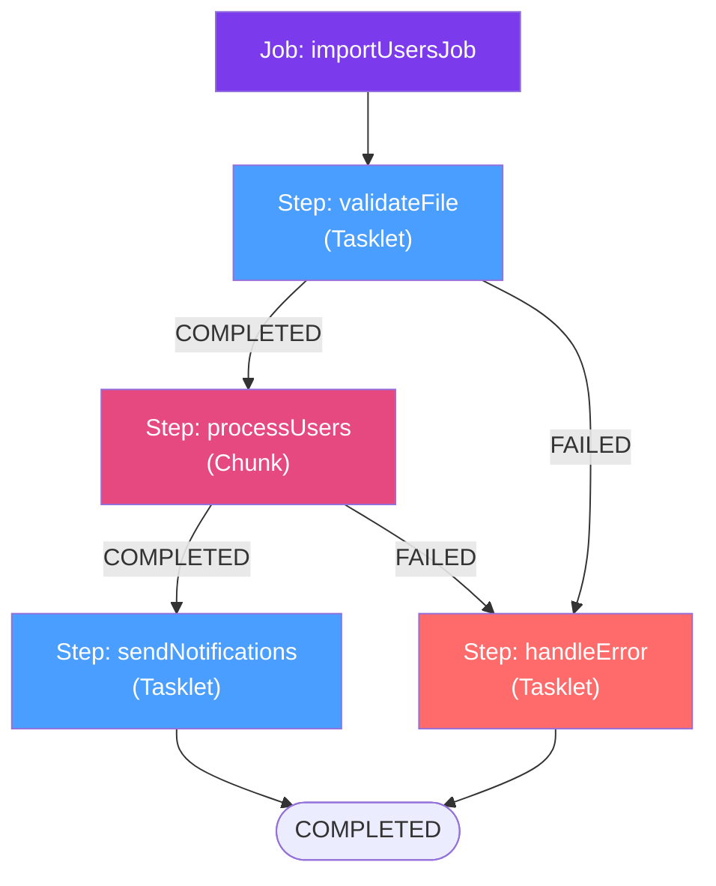

# 🔧 Job and Step

> [!abstract] TL;DR
> A Spring Batch **Job** is a named, configurable batch process composed of one or more **Steps** executed in a defined order. Steps are either **Tasklet-based** (arbitrary logic, single transaction) or **Chunk-based** (reader → processor → writer pipeline with commit intervals). The `JobBuilder` API provides rich flow control: sequential steps, conditional transitions, split flows for parallelism, and decision-based routing.

## Intuition — analogy FIRST

A **Job** is like a **recipe** in a professional kitchen. The recipe has a name ("Roast Chicken") and a sequence of steps: prep ingredients → marinate → roast → rest → plate. Each **Step** is a distinct phase with a clear start, completion, and measurable output. Some steps must happen in order (you can't roast before marinating), some could happen in parallel (prep sides while roasting), and some only happen under conditions (if the chicken is undercooked, return to oven — the "retry" flow). The `JobRepository` is the kitchen's ticket system: it records every order, every step's progress, and enables the chef to restart an interrupted prep from where they left off.

---

## How It Works



## Key Concepts / Details

### Tasklet Step

A Tasklet step is the simplest step type — it executes a single `Tasklet` interface implementation in a single transaction. Use it for: file validation, moving files, sending summary emails, cleanup tasks.

```java
@Bean
public Step validateFileStep(JobRepository jobRepository,
                              PlatformTransactionManager txManager) {
    return new StepBuilder("validateFile", jobRepository)
            .tasklet((contribution, chunkContext) -> {
                String filePath = chunkContext.getStepContext()
                    .getJobParameters().getString("inputFile");
                Path file = Paths.get(filePath);
                if (!Files.exists(file)) {
                    throw new FileNotFoundException("Input file not found: " + filePath);
                }
                log.info("File validated: {} ({} bytes)", filePath, Files.size(file));
                return RepeatStatus.FINISHED;  // or CONTINUABLE for multi-call tasklets
            }, txManager)
            .build();
}
```

### Chunk Step

The chunk step is the workhorse — it reads items one at a time, optionally processes them, then writes them in batches (chunks):

```java
@Bean
public Step processUsersStep(JobRepository jobRepository,
                              PlatformTransactionManager txManager,
                              ItemReader<UserCsv> reader,
                              ItemProcessor<UserCsv, User> processor,
                              ItemWriter<User> writer) {
    return new StepBuilder("processUsers", jobRepository)
            .<UserCsv, User>chunk(100, txManager)  // commit every 100 items
            .reader(reader)
            .processor(processor)
            .writer(writer)
            .faultTolerant()
                .skip(MalformedRecordException.class).skipLimit(50)
                .retry(TransientDataAccessException.class).retryLimit(3)
            .build();
}
```

### Sequential Flow

```java
@Bean
public Job importJob(JobRepository repo, Step validate, Step process, Step notify) {
    return new JobBuilder("importJob", repo)
            .start(validate)
            .next(process)
            .next(notify)
            .build();
}
```

### Conditional Flow (on Exit Status)

```java
@Bean
public Job conditionalJob(JobRepository repo, Step step1, Step step2, Step errorStep) {
    return new JobBuilder("conditionalJob", repo)
            .start(step1)
                .on("COMPLETED").to(step2)
                .on("FAILED").to(errorStep)
            .end()
            .build();
}
```

Exit status strings: `"COMPLETED"`, `"FAILED"`, `"*"` (wildcard), `"NOOP"`, custom values you set via `contribution.setExitStatus(new ExitStatus("VALIDATION_FAILED"))`.

### Parallel Split Flow

Run steps in parallel using `split()`:

```java
@Bean
public Job parallelJob(JobRepository repo, 
                        Step extractAccounts, Step extractTransactions,
                        Step loadToWarehouse) {
    Flow flow1 = new FlowBuilder<SimpleFlow>("flow1")
            .start(extractAccounts).build();
    Flow flow2 = new FlowBuilder<SimpleFlow>("flow2")
            .start(extractTransactions).build();

    return new JobBuilder("parallelJob", repo)
            .start(new FlowBuilder<SimpleFlow>("splitFlow")
                    .split(new SimpleAsyncTaskExecutor())
                    .add(flow1, flow2)
                    .build())
            .next(loadToWarehouse)  // runs after both parallel flows complete
            .end()
            .build();
}
```

### JobExecutionDecider — Dynamic Routing

```java
public class RecordCountDecider implements JobExecutionDecider {
    @Override
    public FlowExecutionStatus decide(JobExecution jobExecution,
                                      StepExecution stepExecution) {
        long count = (Long) stepExecution.getExecutionContext().get("recordCount");
        return count == 0 ? new FlowExecutionStatus("NO_RECORDS") 
                          : FlowExecutionStatus.COMPLETED;
    }
}

// In job definition:
.start(readStep)
.next(decider)
    .on("NO_RECORDS").end()
    .on("COMPLETED").to(processStep)
.end()
```

### JobParametersValidator

Validate parameters before the job starts:

```java
@Bean
public Job validatedJob(JobRepository repo, Step step) {
    return new JobBuilder("validatedJob", repo)
            .validator(parameters -> {
                if (parameters.getString("inputFile") == null) {
                    throw new JobParametersInvalidException("inputFile parameter is required");
                }
            })
            .start(step)
            .build();
}
```

## Real-World Notes

- **Restart behaviour**: When a failed `JobExecution` is restarted, Spring Batch skips `COMPLETED` steps and re-runs `FAILED`/`STARTED` ones. Steps must be designed to be restartable (idempotent writes, cursor state in `ExecutionContext`).
- **Step scope**: Use `@StepScope` for beans that need access to late-bound job/step parameters: `@Value("#{jobParameters['inputFile']}")`.
- **Job listener**: `@Bean JobExecutionListener` lets you run code before/after the entire job — useful for sending summary emails or archiving files.
- **Programmatic launch**: `JobLauncher.run()` is synchronous by default. For async, configure `SimpleJobLauncher` with a `TaskExecutor`.

## Common Pitfalls

- **Shared mutable state in Tasklets**: If a Tasklet stores state in instance fields and steps run in parallel, you'll get race conditions. Use `StepScope` beans or pass state via `ExecutionContext`.
- **Not defining exit codes for conditional flows**: The `on("*")` catch-all must come last; otherwise it shadows specific conditions.
- **Forgetting to call `.end()` or `.build()`**: Fluent APIs require proper termination; missing `.end()` causes runtime errors.
- **Large split flows blocking**: `SimpleAsyncTaskExecutor` creates unlimited threads. Use a bounded `ThreadPoolTaskExecutor` for production split flows.

## Related Concepts
- [[Spring_Batch_Architecture]] — Domain model (JobInstance, JobExecution, StepExecution)
- [[Chunk_Processing]] — How chunk-oriented steps process data with fault tolerance
- [[ItemReader_ItemWriter]] — The reader/writer components used in chunk steps

## Review Questions
1. When would you use a Tasklet step vs a Chunk step?
2. How does Spring Batch handle conditional flow between steps?
3. Explain how parallel split flows work and what happens when one flow fails.
4. What is the purpose of `JobExecutionDecider`?
5. How does Spring Batch handle job restart — which steps re-run?

## Sources
- Spring Batch Reference — Configuring a Job: https://docs.spring.io/spring-batch/docs/current/reference/html/job.html
- Spring Batch Reference — Configuring a Step: https://docs.spring.io/spring-batch/docs/current/reference/html/step.html

#java #spring #spring-batch #job #step
