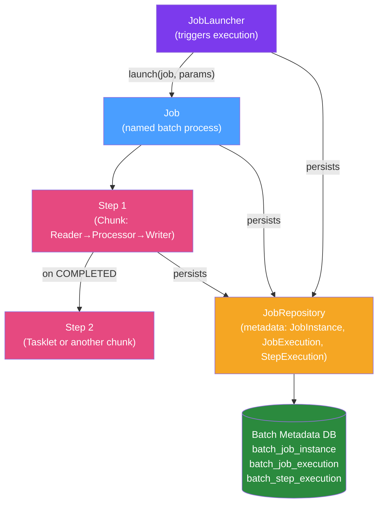

# ⚙️ Spring Batch Architecture

> [!abstract] TL;DR
> Spring Batch is a lightweight batch framework providing reusable functions for processing large volumes of records. Its domain model centres on the **Job** (the batch process), **Step** (a phase of a Job), and **JobRepository** (the metadata store that enables restart and monitoring). Everything runs through a **JobLauncher** which creates `JobExecution` instances tracked in the `JobRepository`.

## Intuition — analogy FIRST

Think of Spring Batch like an **assembly line factory**. The factory manager (**JobLauncher**) receives a production order (**Job**) with specific parameters (batch date, file name). The order goes through multiple workstations (**Steps**) — raw material intake, processing, quality check, packaging. A central logbook (**JobRepository**) records when each workstation started, finished, how many items it processed, and whether any errors occurred. If the power goes out mid-shift, the logbook tells workers exactly which workstation failed and how many items were already done, so they restart from that point rather than from scratch.

---

## How It Works



## Key Concepts / Details

### Domain Model

The Spring Batch domain model has four core concepts:

| Concept | Description | Multiplicity |
|---------|-------------|--------------|
| `Job` | The named batch process definition | 1 definition |
| `JobInstance` | A logical run with specific parameters (e.g., date=2026-01-15) | 1 per unique params |
| `JobExecution` | An attempt to run a `JobInstance` (may succeed or fail) | Many per `JobInstance` |
| `StepExecution` | An attempt to run one Step within a `JobExecution` | 1 per Step per `JobExecution` |

A `JobInstance` maps to one set of `JobParameters`. If you run the same job with the same parameters and it completed successfully, Spring Batch **rejects** it (idempotency). If it failed, you get a new `JobExecution` for the same `JobInstance` — this is how restart works.

### Spring Batch 5 Configuration (Java 17+)

Spring Batch 5 (part of Spring Boot 3) removed the deprecated `JobBuilderFactory` and `StepBuilderFactory`. The new style injects `JobRepository` and `PlatformTransactionManager` directly:

```java
@Configuration
@EnableBatchProcessing
public class BatchConfig {

    @Bean
    public Job importUsersJob(JobRepository jobRepository,
                              Step step1, Step step2) {
        return new JobBuilder("importUsersJob", jobRepository)
                .incrementer(new RunIdIncrementer())
                .start(step1)
                .next(step2)
                .build();
    }

    @Bean
    public Step step1(JobRepository jobRepository,
                      PlatformTransactionManager txManager,
                      ItemReader<UserCsv> reader,
                      ItemProcessor<UserCsv, User> processor,
                      ItemWriter<User> writer) {
        return new StepBuilder("step1", jobRepository)
                .<UserCsv, User>chunk(100, txManager)
                .reader(reader)
                .processor(processor)
                .writer(writer)
                .build();
    }
}
```

### JobRepository and Metadata Tables

Spring Batch requires 6 metadata tables (created automatically or via `spring.batch.jdbc.initialize-schema=always`):

```
BATCH_JOB_INSTANCE       — one row per unique job+params combo
BATCH_JOB_EXECUTION      — one row per execution attempt
BATCH_JOB_EXECUTION_PARAMS — job parameters
BATCH_JOB_EXECUTION_CONTEXT — serialized checkpoint state
BATCH_STEP_EXECUTION     — one row per step per execution
BATCH_STEP_EXECUTION_CONTEXT — step-level checkpoint state
```

The `ExecutionContext` is the checkpoint mechanism: processors can store state here (e.g., last processed ID for cursor-based readers), enabling restart from the last committed position.

### JobParameters — Identity and Restart Control

`JobParameters` serve two purposes: they identify the `JobInstance` (making it unique) and they pass runtime data into the job.

```java
// Launching with parameters
JobParameters params = new JobParametersBuilder()
    .addString("inputFile", "/data/users-2026-01-15.csv")
    .addLocalDate("processDate", LocalDate.now())
    .addLong("runId", System.currentTimeMillis()) // ensures new instance each run
    .toJobParameters();

jobLauncher.run(importUsersJob, params);
```

Use `RunIdIncrementer` to automatically add an incrementing `run.id` parameter, ensuring each run gets a fresh `JobInstance`.

### Application Properties

```yaml
spring:
  batch:
    job:
      enabled: false          # Don't auto-run jobs on startup
    jdbc:
      initialize-schema: always  # Create batch tables automatically
  datasource:
    url: jdbc:postgresql://localhost:5432/batchdb
```

## Real-World Notes

- **In-memory JobRepository**: For testing, use `MapJobRepositoryFactoryBean` (Spring Batch < 5) or configure H2 in-memory. Spring Boot's `@SpringBatchTest` sets this up automatically.
- **Multiple DataSources**: If your batch DB is separate from your business DB, configure `@BatchDataSource` on the batch datasource bean.
- **JobRepository is thread-safe**: Multiple jobs and steps can run concurrently; the repository handles concurrent access.
- **Execution context serialization**: By default, Spring Batch serializes `ExecutionContext` as JSON (Spring Batch 5). Keep stored state small and serializable.

## Common Pitfalls

- **Running same job twice**: If you don't use `RunIdIncrementer` and the job completes successfully, a second identical run throws `JobInstanceAlreadyCompleteException`. Always increment the `run.id` for scheduled jobs.
- **Not configuring a datasource**: Spring Batch requires a relational DB for `JobRepository`. In-memory `Map`-based repository was removed in Batch 5 — use H2 for tests.
- **Forgetting `@EnableBatchProcessing`**: Without this, the `JobRepository`, `JobLauncher`, and other infrastructure beans aren't created.
- **Using deprecated factories**: Spring Batch 5 (Spring Boot 3) removed `JobBuilderFactory` and `StepBuilderFactory`. Migrate to the new `JobBuilder`/`StepBuilder` style.

## Related Concepts
- [[Job_and_Step]] — How to define Jobs and Steps with flow control
- [[Chunk_Processing]] — The chunk-oriented processing model in depth
- [[ItemReader_ItemWriter]] — Built-in readers and writers
- [[Spring_Batch_Monitoring]] — Querying job history via `JobExplorer`

## Review Questions
1. What is the difference between `JobInstance` and `JobExecution`? When does Spring Batch create a new `JobInstance` vs a new `JobExecution`?
2. Why does Spring Batch need a relational database? What data does it store there?
3. How does the `ExecutionContext` enable job restart after failure?
4. What changed in Spring Batch 5 regarding job configuration?

## Sources
- Spring Batch Reference Documentation — https://docs.spring.io/spring-batch/docs/current/reference/html/
- Spring Batch 5 Migration Guide — https://github.com/spring-projects/spring-batch/wiki/Spring-Batch-5.0-Migration-Guide
- "The Domain Language of Batch" — Spring Batch docs chapter

#java #spring #spring-batch #architecture
