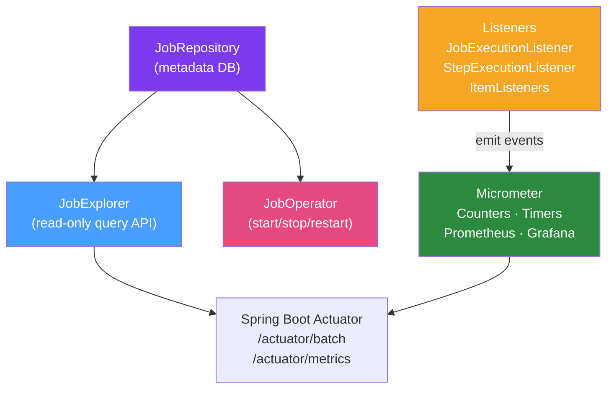

# 📊 Spring Batch Monitoring

> [!abstract] TL;DR
> Spring Batch provides built-in monitoring via the `JobExplorer` and `JobOperator` APIs for programmatic job history queries, listener interfaces for event-driven observability, and Micrometer integration for metrics. Effective batch monitoring covers: job execution status, step throughput (read/write/skip counts), failed job alerting, and re-run procedures for failed jobs.

## Intuition — analogy FIRST

Think of batch monitoring like **air traffic control**. The ATC tower (monitoring system) tracks every flight (job execution) — departure time, current altitude (progress), speed (throughput), and landing status (completion). When a flight is delayed (job running longer than SLA) or crashes (job failed), ATC gets immediate alerts with full telemetry (what step failed, how many items were processed, the error message). The flight log (JobRepository) stores every historical flight for post-incident analysis. Controllers can also ground flights that are stuck (stop a running job) or reroute failed ones (restart from last checkpoint).

---

## How It Works



## Key Concepts / Details

### JobExplorer — Querying Job History

`JobExplorer` is the read-only API for querying `JobRepository` metadata:

```java
@Service
public class BatchMonitoringService {
    
    private final JobExplorer jobExplorer;
    
    public List<JobExecution> getRunningJobs(String jobName) {
        return jobExplorer.findRunningJobExecutions(jobName)
                .stream().toList();
    }
    
    public JobExecution getLastExecution(String jobName) {
        List<JobInstance> instances = jobExplorer.findJobInstancesByJobName(jobName, 0, 1);
        if (instances.isEmpty()) return null;
        List<JobExecution> executions = jobExplorer.getJobExecutions(instances.get(0));
        return executions.isEmpty() ? null : executions.get(0);
    }
    
    public BatchStats getJobStats(String jobName) {
        JobExecution last = getLastExecution(jobName);
        if (last == null) return BatchStats.empty();
        
        return BatchStats.builder()
                .status(last.getStatus())
                .startTime(last.getStartTime())
                .endTime(last.getEndTime())
                .exitDescription(last.getExitStatus().getExitDescription())
                .stepStats(last.getStepExecutions().stream()
                        .map(StepStat::from)
                        .toList())
                .build();
    }
}
```

### JobOperator — Operational Control

`JobOperator` extends `JobExplorer` with control operations:

```java
@Service
public class BatchOperationsService {
    
    private final JobOperator jobOperator;
    
    // Restart a failed job execution
    public Long restartFailedJob(Long executionId) throws Exception {
        return jobOperator.restart(executionId);
    }
    
    // Stop a running job
    public boolean stopJob(Long executionId) throws Exception {
        return jobOperator.stop(executionId);
    }
    
    // Start a job programmatically
    public Long startJob(String jobName, String params) throws Exception {
        return jobOperator.start(jobName, params);
        // params format: "date=2026-01-15,file=users.csv"
    }
    
    // Get all running job names
    public Set<String> getRunningJobNames() {
        return jobOperator.getJobNames();
    }
}
```

### JobExecutionListener — Job-Level Events

```java
@Component
public class JobCompletionNotificationListener 
        implements JobExecutionListener {
    
    private final AlertService alertService;
    
    @Override
    public void beforeJob(JobExecution jobExecution) {
        log.info("Job '{}' starting with params: {}",
                jobExecution.getJobInstance().getJobName(),
                jobExecution.getJobParameters());
    }
    
    @Override
    public void afterJob(JobExecution jobExecution) {
        if (jobExecution.getStatus() == BatchStatus.COMPLETED) {
            log.info("Job '{}' completed successfully. Total time: {}ms",
                    jobExecution.getJobInstance().getJobName(),
                    Duration.between(jobExecution.getStartTime(), 
                                     jobExecution.getEndTime()).toMillis());
        } else if (jobExecution.getStatus() == BatchStatus.FAILED) {
            String errorMsg = jobExecution.getAllFailureExceptions().stream()
                    .map(Throwable::getMessage)
                    .collect(Collectors.joining(", "));
            alertService.sendJobFailureAlert(
                    jobExecution.getJobInstance().getJobName(), errorMsg);
        }
    }
}
```

### StepExecutionListener — Step-Level Metrics

```java
@Component
public class StepMetricsListener implements StepExecutionListener {
    
    private final MeterRegistry meterRegistry;
    
    @Override
    public ExitStatus afterStep(StepExecution stepExecution) {
        String stepName = stepExecution.getStepName();
        
        // Record counts as Micrometer counters
        meterRegistry.counter("batch.step.read.count", "step", stepName)
                .increment(stepExecution.getReadCount());
        meterRegistry.counter("batch.step.write.count", "step", stepName)
                .increment(stepExecution.getWriteCount());
        meterRegistry.counter("batch.step.skip.count", "step", stepName)
                .increment(stepExecution.getSkipCount());
        
        log.info("Step '{}': read={}, write={}, skip={}, filter={}",
                stepName,
                stepExecution.getReadCount(),
                stepExecution.getWriteCount(),
                stepExecution.getSkipCount(),
                stepExecution.getFilterCount());
        
        return stepExecution.getExitStatus();
    }
}
```

### Item-Level Listeners

```java
@Component
public class AuditItemWriteListener implements ItemWriteListener<User> {
    
    @Override
    public void beforeWrite(Chunk<? extends User> items) {
        log.debug("Writing chunk of {} users", items.size());
    }
    
    @Override
    public void afterWrite(Chunk<? extends User> items) {
        log.debug("Successfully wrote {} users", items.size());
    }
    
    @Override
    public void onWriteError(Exception exception, Chunk<? extends User> items) {
        log.error("Write error for {} users: {}", items.size(), exception.getMessage());
        // Could publish to DLQ or alert channel
    }
}
```

### Micrometer Integration (Spring Batch 5+)

Spring Batch 5 auto-configures Micrometer metrics when `micrometer-core` is on the classpath:

| Metric | Type | Description |
|--------|------|-------------|
| `spring.batch.job` | Timer | Job execution duration |
| `spring.batch.step` | Timer | Step execution duration |
| `spring.batch.item.read` | Timer | Item read duration |
| `spring.batch.item.process` | Timer | Item process duration |
| `spring.batch.item.write` | Timer | Item write duration |

Access via `/actuator/metrics/spring.batch.job`.

### Re-running Failed Jobs

```java
// Option 1: Restart via JobOperator (resumes from last checkpoint)
Long newExecutionId = jobOperator.restart(failedExecutionId);

// Option 2: Start fresh with new RunId (re-processes everything)
JobParameters newParams = new JobParametersBuilder(originalParams)
        .addLong("run.id", System.currentTimeMillis())
        .toJobParameters();
jobLauncher.run(job, newParams);
```

### Scheduled Job with Health Check

```java
@Component
public class DailyBatchScheduler {
    
    private final Job importJob;
    private final JobLauncher jobLauncher;
    private final MeterRegistry meterRegistry;
    
    @Scheduled(cron = "0 0 2 * * *")  // 2 AM daily
    public void runDailyImport() {
        try {
            JobParameters params = new JobParametersBuilder()
                    .addLocalDate("processDate", LocalDate.now())
                    .addLong("runId", System.currentTimeMillis())
                    .toJobParameters();
            
            JobExecution execution = jobLauncher.run(importJob, params);
            
            meterRegistry.counter("batch.daily.import",
                    "status", execution.getStatus().name()).increment();
                    
        } catch (Exception e) {
            log.error("Daily import failed to launch", e);
            meterRegistry.counter("batch.daily.import", "status", "LAUNCH_FAILED").increment();
        }
    }
}
```

## Real-World Notes

- **Actuator endpoint**: Spring Boot Actuator exposes `/actuator/batch/jobs` and `/actuator/batch/jobs/{name}` endpoints for REST-based monitoring. Enable with `management.endpoints.web.exposure.include=batch`.
- **Metadata cleanup**: The `JobRepository` tables grow indefinitely. Set up a scheduled cleanup job using `MapJobRepositoryFactoryBean.clear()` (test) or a SQL purge job for production (delete executions older than N days).
- **PagerDuty/Slack integration**: Wire `JobExecutionListener.afterJob()` to send alerts to Slack or PagerDuty when `BatchStatus.FAILED`. Include the step name, exit description, and job parameters in the alert.
- **Dashboard**: Build a Grafana dashboard from Micrometer metrics: job execution duration histogram, skip rate by step, daily job success/failure rate.

## Common Pitfalls

- **Not setting up failure alerts**: Without failure alerting, a batch job can silently fail at 3 AM and not be discovered until the next business day.
- **Restarting without checking why it failed**: Always investigate the root cause before restarting. Restarting a job that's failing due to bad data will just fail again (and again) until skip limit is hit.
- **Growing metadata tables**: Batch tables grow without bound. Implement periodic cleanup or the metadata DB will become a performance bottleneck.
- **Using `jobExplorer` in tight loops**: `JobExplorer` queries the DB on every call. Cache results or use batch queries for dashboard endpoints.

## Related Concepts
- [[Spring_Batch_Architecture]] — How JobRepository stores execution metadata
- [[Chunk_Processing]] — Skip/retry counts that appear in StepExecution
- [[Job_and_Step]] — Job/step listener registration in the builder API

## Review Questions
1. What is the difference between `JobExplorer` and `JobOperator`?
2. How do you restart a failed Spring Batch job? What happens to completed steps?
3. What Micrometer metrics does Spring Batch 5 auto-configure?
4. How do you alert on a failed batch job?
5. Why do batch metadata tables grow over time, and how do you manage this?

## Sources
- Spring Batch Reference — Monitoring and Metrics: https://docs.spring.io/spring-batch/docs/current/reference/html/monitoring-and-metrics.html
- Spring Batch Reference — JobExplorer: https://docs.spring.io/spring-batch/docs/current/reference/html/job.html#JobExplorer

#java #spring #spring-batch #monitoring #observability
