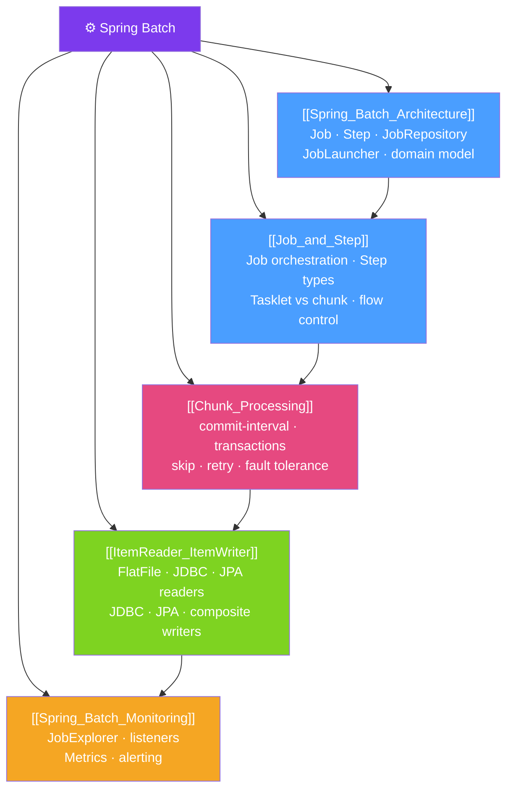

# 🗺️ Spring Batch — Map of Content

> [!abstract] What This Section Covers
> Spring Batch is the de-facto standard for building enterprise-grade batch processing applications in Java. This section covers the full Spring Batch lifecycle: the architectural domain model (Jobs, Steps, JobRepository), chunk-oriented processing (ItemReader → ItemProcessor → ItemWriter), fault-tolerance mechanisms (skip, retry, restart), and operational monitoring. Whether you're processing millions of database rows overnight or transforming large CSV files, Spring Batch provides the infrastructure so you focus on business logic.

## Concept Map

## Learning Path
1. [[Spring_Batch_Architecture]] — Understand the domain model and how all pieces fit together before writing any code.
2. [[Job_and_Step]] — Learn how to define Jobs and Steps, including flow control and parallel steps.
3. [[Chunk_Processing]] — Master chunk-oriented processing, the heart of Spring Batch's processing model.
4. [[ItemReader_ItemWriter]] — Explore the built-in readers and writers for common data sources/sinks.
5. [[Spring_Batch_Monitoring]] — Learn to monitor, alert on, and operationally manage batch jobs.

## All Notes at a Glance
| Note | Difficulty | What You'll Learn |
|------|------------|-------------------|
| [[Spring_Batch_Architecture]] | Intermediate | Domain model, JobRepository, JobInstance vs JobExecution, restart semantics |
| [[Job_and_Step]] | Intermediate | Job/Step definition, flow control, split steps, DeciderStep |
| [[ItemReader_ItemWriter]] | Intermediate | FlatFileItemReader, JdbcCursorItemReader, JpaPagingItemReader, all major writers |
| [[Chunk_Processing]] | Advanced | Commit intervals, skip/retry policies, ItemProcessor, fault tolerance |
| [[Spring_Batch_Monitoring]] | Intermediate | Listeners, JobExplorer, Micrometer metrics, operational management |

## Key Questions This Section Answers
- What is the difference between a `JobInstance` and a `JobExecution`?
- When do you use a Tasklet step vs a Chunk step?
- How does Spring Batch handle restart and recovery after failure?
- How do you skip bad records without failing the entire job?
- How do you monitor running and completed batch jobs?
- How do parallel splits and partitioning improve batch throughput?

## Related Sections
- [[_MOC_Java_Master|↑ Java Master MOC]]
- [[_MOC_Spring_Integration|→ Spring Integration]] — message-driven pipelines complement batch
- [[_MOC_Data_Processing|→ Java Data Processing]] — broader data engineering context

#java #spring #MOC #spring-batch
