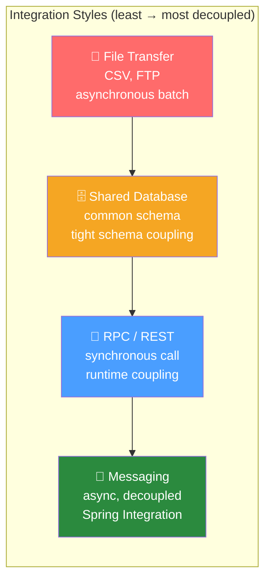

# 📐 Enterprise Integration Patterns

> [!abstract] TL;DR
> Enterprise Integration Patterns (EIP), catalogued by Gregor Hohpe and Bobby Woolf, are the vocabulary for messaging-based integration. The four integration styles — File Transfer, Shared Database, RPC, and Messaging — represent a spectrum from tight to loose coupling. Spring Integration implements the full EIP catalog, providing channels, routers, transformers, splitters, aggregators, and endpoints as first-class Spring beans.

## Intuition — analogy FIRST

Imagine a large **hospital system** connecting multiple departments: radiology, pharmacy, billing, wards. Four ways to share a patient record: (1) **File Transfer** — print the chart and hand-carry it (slow, asynchronous, no real-time updates). (2) **Shared Database** — all departments read from the same patient record system (tight coupling, schema changes break everyone). (3) **RPC** — billing calls radiology's API directly to get the scan (synchronous, radiology must be available when billing calls). (4) **Messaging** — departments send messages to a central message bus; radiology publishes "scan completed," billing subscribes and processes it asynchronously (loose coupling, each department evolves independently). Enterprise Integration Patterns are the detailed blueprints for making option 4 work reliably at enterprise scale.

---

## How It Works



## Key Concepts / Details

### The Four Integration Styles

| Style | Coupling | Latency | Reliability | Use When |
|-------|----------|---------|-------------|----------|
| File Transfer | Loose | High (batch) | Manual error handling | Legacy systems, large data volumes, overnight ETL |
| Shared Database | Tight | Low | DB is SPOF | Small teams, same tech stack, OLTP |
| RPC (REST/gRPC) | Medium | Low | Caller blocked if callee down | Real-time queries, request-response workflows |
| Messaging | Loose | Medium | Built-in retry/dead-letter | Decoupled services, event-driven, async workflows |

### Core EIP Message Components

A **Message** in Spring Integration consists of:
- **Payload**: the data being transported (`Object`)
- **Headers**: metadata (`Map<String, Object>`) — message ID, correlation ID, timestamp, reply-to channel

```java
// Creating a message
Message<String> message = MessageBuilder.withPayload("Hello World")
        .setHeader("correlationId", UUID.randomUUID().toString())
        .setHeader("sourceSystem", "CRM")
        .setPriority(5)
        .build();

// Accessing headers
String correlationId = (String) message.getHeaders().get("correlationId");
```

### Key EIP Patterns

#### Message Channel
The pipe connecting components. Messages flow through channels. Spring Integration provides typed channels for different delivery semantics.

#### Message Router
Routes a message to different channels based on payload content or headers:

```java
// Content-based router
@Router(inputChannel = "orderChannel")
public String routeByOrderType(Order order) {
    return switch (order.getType()) {
        case RETAIL -> "retailOrderChannel";
        case WHOLESALE -> "wholesaleOrderChannel";
        case SUBSCRIPTION -> "subscriptionOrderChannel";
    };
}
```

#### Message Filter
Passes or discards messages based on a predicate:

```java
@Filter(inputChannel = "rawEventsChannel", outputChannel = "validEventsChannel")
public boolean isValidEvent(Event event) {
    return event.getTimestamp() != null && event.getUserId() != null;
}
```

#### Splitter
Splits one message into multiple:

```java
@Splitter(inputChannel = "bulkOrderChannel", outputChannel = "singleOrderChannel")
public List<Order> splitBulkOrder(BulkOrder bulk) {
    return bulk.getOrders();  // each Order becomes a separate message
}
```

#### Aggregator
Combines related messages back into one:

```java
@Aggregator(inputChannel = "fragmentChannel", outputChannel = "completeChannel")
public ReportDocument aggregateReportFragments(List<ReportFragment> fragments) {
    return ReportDocument.builder()
            .sections(fragments.stream().sorted(Comparator.comparing(ReportFragment::getPageNumber))
                    .map(ReportFragment::getContent)
                    .collect(Collectors.joining("\n")))
            .build();
}

// Correlation strategy: which messages belong together
@CorrelationStrategy
public String correlate(ReportFragment fragment) {
    return fragment.getReportId();
}

// Release strategy: when to release the aggregation
@ReleaseStrategy
public boolean isComplete(List<ReportFragment> fragments) {
    return fragments.stream().anyMatch(ReportFragment::isLastFragment);
}
```

#### Dead Letter Channel

Messages that cannot be processed go to a dead-letter channel for inspection and retry:

```java
@Bean
public IntegrationFlow withErrorHandling() {
    return IntegrationFlow.from("inputChannel")
            .handle(orderService::processOrder, e -> e.advice(retryAdvice()))
            .channel("outputChannel")
            .get();
}

@Bean
public IntegrationFlow deadLetterFlow() {
    return IntegrationFlow.from("errorChannel")
            .handle(deadLetterProcessor::handle)  // log, alert, or re-queue
            .get();
}
```

#### Scatter-Gather

Broadcast to multiple services, collect responses:

```java
@Bean
public IntegrationFlow scatterGatherFlow() {
    return IntegrationFlow.from("priceRequestChannel")
            .scatterGather(
                scatter -> scatter.applySequence(true)
                        .recipientFlow(f -> f.handle(supplierA::getPrice))
                        .recipientFlow(f -> f.handle(supplierB::getPrice))
                        .recipientFlow(f -> f.handle(supplierC::getPrice)),
                gather -> gather.releaseStrategy(group -> group.size() == 3)
                        .outputProcessor(group -> group.getMessages().stream()
                                .min(Comparator.comparingDouble(m -> 
                                        ((Price) m.getPayload()).getAmount()))
                                .orElseThrow())
            )
            .channel("bestPriceChannel")
            .get();
}
```

### EIP Pattern Quick Reference

| Pattern | Purpose | Spring Integration |
|---------|---------|-------------------|
| Message Channel | Decouple sender from receiver | `DirectChannel`, `QueueChannel` |
| Message Router | Route by content/header | `@Router`, `HeaderValueRouter` |
| Message Filter | Conditional pass/discard | `@Filter` |
| Transformer | Format/structure conversion | `@Transformer` |
| Splitter | 1 message → N messages | `@Splitter` |
| Aggregator | N messages → 1 message | `@Aggregator` |
| Service Activator | Call a service method | `@ServiceActivator` |
| Dead Letter Channel | Handle failed messages | `errorChannel` |
| Scatter-Gather | Broadcast + collect best | `scatterGather()` |
| Claim Check | Large payload handling | `ClaimCheckTransformer` |
| Polling Consumer | Pull from external system | `@InboundChannelAdapter` |

## Real-World Notes

- **Spring Integration vs Spring Cloud Stream**: Spring Cloud Stream is built on top of Spring Integration and adds binder abstractions for Kafka, RabbitMQ, etc. Use Spring Cloud Stream for microservice messaging; use Spring Integration for complex in-process integration flows.
- **EIP in Apache Camel**: Apache Camel is the other major EIP framework. Spring Integration is Spring-native; Camel has more out-of-box connectors (300+ components). For Spring shops, Spring Integration is the natural choice.
- **Testing integration flows**: Use `@SpringIntegrationTest` with `MockMessageChannel` and `MessageCollector` to unit-test flows without needing real infrastructure.

## Common Pitfalls

- **Overusing RPC when messaging fits better**: If your services are tightly synchronized (caller blocks until callee responds), you've built a distributed monolith. Consider if the workflow truly needs synchronous response or if async messaging fits.
- **Confusing payload and header concerns**: Business data belongs in the payload; routing/metadata belongs in headers. Putting business logic in headers makes flows hard to debug.
- **Missing dead-letter handling**: Without a dead-letter channel, failed messages disappear silently. Always configure error handling.

## Related Concepts
- [[Message_Channels]] — The pipes connecting EIP components
- [[Message_Transformers]] — The Transformer pattern in Spring Integration
- [[Service_Activators]] — The Service Activator pattern
- [[Spring_Integration_DSL]] — Building complete EIP flows

## Review Questions
1. What are the four integration styles, and how does each compare in terms of coupling and latency?
2. What is the difference between a Splitter and an Aggregator?
3. How does the Scatter-Gather pattern work, and when would you use it?
4. What is a Dead Letter Channel, and why is it important?
5. How does Spring Integration relate to Spring Cloud Stream?

## Sources
- Gregor Hohpe, Bobby Woolf — *Enterprise Integration Patterns* (Addison-Wesley, 2003)
- Spring Integration Reference — https://docs.spring.io/spring-integration/docs/current/reference/html/
- EIP pattern catalog — https://www.enterpriseintegrationpatterns.com/

#java #spring #spring-integration #EIP
