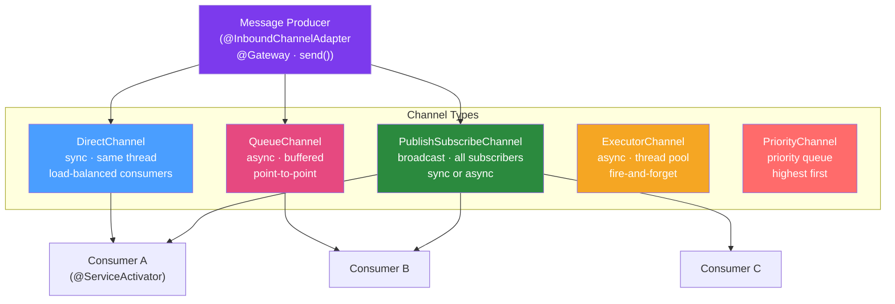

# 📡 Message Channels

> [!abstract] TL;DR
> Message Channels are the pipes of Spring Integration — they decouple message senders from receivers. Spring Integration provides six channel types with different delivery semantics: `DirectChannel` (synchronous, same thread), `QueueChannel` (async, point-to-point, buffered), `PublishSubscribeChannel` (broadcast to all subscribers), `ExecutorChannel` (async with thread pool), `PriorityChannel` (priority queue), and `RendezvousChannel` (synchronous handoff requiring a waiting receiver).

## Intuition — analogy FIRST

Think of message channels like different types of **postal infrastructure**:

- **DirectChannel** = handing a letter directly to a colleague sitting next to you — instant, same interaction, no queue.
- **QueueChannel** = putting a letter in a shared mailbox — you drop it and walk away; the recipient picks it up later at their own pace (buffered, async).
- **PublishSubscribeChannel** = a company-wide announcement board — one message, everyone relevant reads it.
- **ExecutorChannel** = a courier service — you hand over the letter, a courier (thread from pool) delivers it asynchronously.
- **PriorityChannel** = VIP postal tray — urgent letters get processed before standard ones regardless of arrival order.
- **RendezvousChannel** = a meeting room handoff — sender waits at the door until receiver is ready to receive.

---

## How It Works



## Key Concepts / Details

### DirectChannel — Synchronous, Load-Balanced

Default channel type. Delivers the message on the **sender's thread** by calling the subscriber directly. If multiple subscribers are registered, it load-balances using a `LoadBalancingStrategy` (round-robin by default).

```java
@Bean
public MessageChannel orderChannel() {
    return new DirectChannel();
}

// Shorter form — Spring Integration creates DirectChannel by default
// when you reference a channel by name in annotations
```

**When to use**: Internal flow components that must run in the same transaction as the sender. Most intra-flow connections.

### QueueChannel — Asynchronous, Buffered

Stores messages in an in-memory queue. Sender returns immediately after queuing. A **Poller** must be configured to drain the queue.

```java
@Bean
public PollableChannel asyncOrderChannel() {
    return new QueueChannel(100);  // bounded capacity = backpressure
}

// The consumer must use a Poller to drain the QueueChannel
@ServiceActivator(inputChannel = "asyncOrderChannel",
        poller = @Poller(fixedDelay = "1000", maxMessagesPerPoll = "10"))
public void processOrder(Order order) {
    orderService.process(order);
}
```

**When to use**: Decoupling producer and consumer throughput, absorbing bursts, rate-limiting consumers.

### PublishSubscribeChannel — Broadcast

Delivers each message to **all registered subscribers**. By default, subscribers are invoked on the sender's thread sequentially. Provide a `TaskExecutor` for parallel delivery.

```java
@Bean
public MessageChannel eventBusChannel() {
    PublishSubscribeChannel channel = new PublishSubscribeChannel();
    channel.setTaskExecutor(Executors.newFixedThreadPool(5));  // async parallel delivery
    return channel;
}

// Multiple subscribers on same channel
@ServiceActivator(inputChannel = "eventBusChannel")
public void auditEventHandler(OrderEvent event) { auditService.log(event); }

@ServiceActivator(inputChannel = "eventBusChannel")
public void notificationHandler(OrderEvent event) { emailService.sendConfirmation(event); }
```

**When to use**: Event broadcasting, observer pattern, audit logging alongside business processing.

### ExecutorChannel — Async with Thread Pool

Like `DirectChannel` but delivers on a thread from an executor. Sender thread is freed immediately.

```java
@Bean
public MessageChannel asyncChannel() {
    ExecutorChannel channel = new ExecutorChannel(
            Executors.newFixedThreadPool(10));
    return channel;
}
```

**When to use**: Fire-and-forget async processing; when you want asynchronous dispatch but point-to-point semantics.

### PriorityChannel — Priority Queue

Messages are sorted by a `Comparator` or by the `priority` header (higher = first):

```java
@Bean
public PollableChannel priorityOrderChannel() {
    return new PriorityChannel(1000,
            Comparator.comparingInt(msg -> 
                    -(Integer) msg.getHeaders().getOrDefault("priority", 0)));
}

// Sending with priority
Message<Order> urgent = MessageBuilder.withPayload(vipOrder)
        .setPriority(10)
        .build();
Message<Order> normal = MessageBuilder.withPayload(regularOrder)
        .setPriority(1)
        .build();
```

### RendezvousChannel — Synchronous Handoff

A zero-capacity queue — the sender **blocks** until a receiver is ready to consume. Useful for synchronous producer-consumer rendezvous.

```java
@Bean
public PollableChannel rendezvousChannel() {
    return new RendezvousChannel();
}
```

### NullChannel — Dev/Null

Discards all messages silently. Useful in tests or for suppressing output from a flow:

```java
@Bean
public MessageChannel discardChannel() {
    return new NullChannel();
}
```

### Channel Interceptors — Cross-Cutting Concerns

Intercept messages as they enter or leave a channel — logging, security checks, header manipulation:

```java
@Component
public class AuditChannelInterceptor implements ChannelInterceptor {
    
    @Override
    public Message<?> preSend(Message<?> message, MessageChannel channel) {
        log.debug("Sending to channel {}: {}", channel, message.getPayload());
        // Return null to block the message; return modified message to transform it
        return message;
    }
    
    @Override
    public void postSend(Message<?> message, MessageChannel channel, boolean sent) {
        if (!sent) log.warn("Message failed to send to {}", channel);
    }
}

// Registering interceptors
@Bean
public MessageChannel auditedChannel(AuditChannelInterceptor interceptor) {
    DirectChannel channel = new DirectChannel();
    channel.addInterceptor(interceptor);
    return channel;
}

// Or globally with ChannelInterceptorAware GlobalChannelInterceptorWrapper:
@Bean
@GlobalChannelInterceptor(patterns = "order*")  // intercept all channels matching pattern
public AuditChannelInterceptor globalInterceptor() {
    return new AuditChannelInterceptor();
}
```

### Channel Comparison Table

| Channel | Delivery | Buffered | Multi-Consumer | Backpressure |
|---------|----------|----------|----------------|--------------|
| `DirectChannel` | Sync (sender thread) | No | Round-robin load balance | Inline — sender blocks |
| `QueueChannel` | Async (via Poller) | Yes | First available | Bounded capacity |
| `PublishSubscribeChannel` | Sync or Async | No | All subscribers | Async with executor |
| `ExecutorChannel` | Async (thread pool) | Task queue | Single subscriber | Executor queue |
| `PriorityChannel` | Async (via Poller) | Yes (sorted) | First available | Bounded capacity |
| `RendezvousChannel` | Sync (handoff) | No | One at a time | Sender blocks |

## Real-World Notes

- **Persistent channels**: In-memory `QueueChannel` loses messages on restart. For production, use `JdbcChannelMessageStore` to persist queue messages to a database, or route to Kafka/RabbitMQ.
- **Channel names matter**: In annotation-based configuration, channels are created by name. `@ServiceActivator(inputChannel = "orderChannel")` automatically creates a `DirectChannel` named "orderChannel" if it doesn't exist.
- **Monitor queue depth**: For `QueueChannel`, monitor queue depth via `IntegrationMBeanExporter` (JMX) or Micrometer `spring.integration.channel.queue.size` gauge.
- **Avoid unbounded queues**: `new QueueChannel()` with no capacity limit creates an unbounded queue — a memory leak waiting to happen under sustained load. Always specify capacity.

## Common Pitfalls

- **Not configuring a Poller for QueueChannel subscribers**: A `@ServiceActivator` on a `QueueChannel` without a `poller` will throw a configuration error. Pollers are required for `PollableChannel` consumption.
- **DirectChannel in high-concurrency context**: If your `DirectChannel` subscriber is slow, the sender thread is blocked. Use `ExecutorChannel` or route to a `QueueChannel` for high-throughput scenarios.
- **Forgetting `@GlobalChannelInterceptor` scope**: Without `patterns`, a global interceptor applies to **all** channels including internal Spring Integration channels — can cause unexpected interception.

## Related Concepts
- [[Enterprise_Integration_Patterns]] — Why channels are the fundamental EIP abstraction
- [[Service_Activators]] — How services subscribe to channels
- [[Spring_Integration_DSL]] — How channels are wired in DSL flows

## Review Questions
1. What is the key difference between `DirectChannel` and `QueueChannel`?
2. When would you choose `PublishSubscribeChannel` over `DirectChannel`?
3. Why must a `QueueChannel` subscriber have a Poller configured?
4. How do channel interceptors work, and what are they useful for?
5. What happens if you use an unbounded `QueueChannel` with a slow consumer?

## Sources
- Spring Integration Reference — Message Channels: https://docs.spring.io/spring-integration/docs/current/reference/html/channel.html

#java #spring #spring-integration #channels
