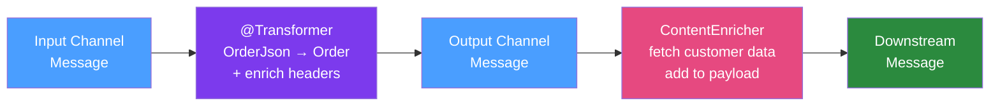

# 🔄 Message Transformers

> [!abstract] TL;DR
> Message Transformers in Spring Integration convert message payloads or headers from one format to another as messages flow through channels. The `@Transformer` annotation, `ContentEnricher`, `HeaderEnricher`, and `ClaimCheckTransformer` are the key tools. Transformers enable decoupling: each component speaks its own data model, and transformers translate between them at integration boundaries.

## Intuition — analogy FIRST

Imagine an **international airport customs desk**. A passenger's documents arrive in their home country's format (Japanese passport, luggage in centimetres). The customs officer (Transformer) converts them to the local format: translates the passport to English, converts baggage dimensions to the local system, adds a customs stamp (header enrichment). The passenger doesn't change — only their paperwork representation does. The airline (sender) submitted Japanese documents; the hotel (receiver) gets English ones. Each system speaks its own language; the transformer bridges the gap invisibly.

---

## How It Works



## Key Concepts / Details

### @Transformer — Basic Payload Conversion

```java
@Component
public class OrderTransformers {
    
    private final ObjectMapper objectMapper;
    
    // JSON string → Order object
    @Transformer(inputChannel = "rawOrderChannel", 
                 outputChannel = "parsedOrderChannel")
    public Order jsonToOrder(String jsonPayload) throws JsonProcessingException {
        return objectMapper.readValue(jsonPayload, Order.class);
    }
    
    // Order → OrderDto (domain model to API model)
    @Transformer(inputChannel = "domainOrderChannel",
                 outputChannel = "apiOrderChannel")
    public OrderDto orderToDto(Order order) {
        return OrderDto.builder()
                .id(order.getId().toString())
                .customerEmail(order.getCustomer().getEmail())
                .totalFormatted(formatCurrency(order.getTotal()))
                .build();
    }
    
    // Access full Message (payload + headers)
    @Transformer(inputChannel = "rawChannel", outputChannel = "enrichedChannel")
    public Message<Order> enrichWithHeaders(Message<String> rawMessage) {
        Order order = parseOrder(rawMessage.getPayload());
        return MessageBuilder.withPayload(order)
                .copyHeaders(rawMessage.getHeaders())  // preserve existing headers
                .setHeader("processingTime", System.currentTimeMillis())
                .setHeader("sourceFormat", "JSON")
                .build();
    }
}
```

### HeaderEnricher — Adding/Modifying Headers

Use `HeaderEnricher` when you only need to manipulate headers without changing the payload:

```java
@Bean
public IntegrationFlow headerEnrichmentFlow() {
    return IntegrationFlow.from("inputChannel")
            .enrichHeaders(h -> h
                    .header("correlationId", UUID.randomUUID().toString())
                    .header("processedAt", LocalDateTime.now())
                    .headerExpression("orderId", "payload.id")  // SpEL
                    .headerFunction("region", msg -> 
                            regionService.getRegion((String) msg.getHeaders().get("country")))
            )
            .channel("outputChannel")
            .get();
}
```

### ContentEnricher — Fetching Additional Data

`ContentEnricher` calls an external service and merges the result into the message:

```java
@Bean
public IntegrationFlow contentEnricherFlow() {
    return IntegrationFlow.from("orderChannel")
            .enrich(enricher -> enricher
                    // Request channel to fetch customer details
                    .requestChannel("customerLookupChannel")
                    // What to send to the lookup service
                    .requestPayloadExpression("payload.customerId")
                    // Map the lookup result back into the original payload
                    .propertyFunction("customer", reply -> reply.getPayload())
                    .propertyExpression("customerEmail", "payload.email")
            )
            .channel("enrichedOrderChannel")
            .get();
}
```

### ObjectToStringTransformer and Codec Transformers

```java
@Bean
public IntegrationFlow codecFlow() {
    return IntegrationFlow.from("inputChannel")
            // Deserialize JSON bytes to Order
            .transform(Transformers.fromJson(Order.class))
            // ... process
            // Serialize Order to JSON bytes for downstream
            .transform(Transformers.toJson())
            .channel("outputChannel")
            .get();
}
```

### ClaimCheckTransformer — Large Payload Handling

When payloads are too large to pass through channels (e.g., multi-MB files), the ClaimCheck pattern stores the payload externally and passes a claim ticket:

```java
@Bean
public IntegrationFlow claimCheckFlow(MessageStore messageStore) {
    return IntegrationFlow.from("largePayloadChannel")
            // Store payload, pass claim ticket
            .transform(new ClaimCheckInTransformer(messageStore))
            .channel("claimTicketChannel")
            // ... route, log, audit using only the small ticket
            .transform(new ClaimCheckOutTransformer(messageStore))  // retrieve payload
            .channel("processChannel")
            .get();
}

@Bean
public MessageStore messageStore() {
    // In-memory for dev, JdbcMessageStore for production
    return new JdbcMessageStore(dataSource);
}
```

### Splitter as Transformer

Splitting is a special transformation: one message → many messages:

```java
@Splitter(inputChannel = "bulkOrderChannel", 
          outputChannel = "singleOrderChannel",
          applySequence = true)  // adds sequence number/size headers
public List<LineItem> splitOrder(Order order) {
    return order.getLineItems();
}
```

Each `LineItem` becomes a separate message with `SEQUENCE_NUMBER` and `SEQUENCE_SIZE` headers for later aggregation.

### Custom MessageTransformingHandler

For complex transformation logic as a class:

```java
@Component
public class CsvToOrderTransformer extends AbstractTransformer {
    
    @Override
    protected Object doTransform(Message<?> message) {
        String csvLine = (String) message.getPayload();
        String[] fields = csvLine.split(",");
        
        Order order = new Order();
        order.setOrderId(fields[0].trim());
        order.setCustomerId(fields[1].trim());
        order.setAmount(new BigDecimal(fields[2].trim()));
        order.setStatus(OrderStatus.valueOf(fields[3].trim()));
        
        return MessageBuilder.withPayload(order)
                .copyHeaders(message.getHeaders())
                .setHeader("originalCsv", csvLine)
                .build();
    }
}

@Bean
public IntegrationFlow csvFlow(CsvToOrderTransformer transformer) {
    return IntegrationFlow.from("csvChannel")
            .transform(transformer)
            .channel("orderChannel")
            .get();
}
```

### Transformation Chain

Multiple transformers can be chained:

```java
@Bean
public IntegrationFlow transformationChain() {
    return IntegrationFlow.from("rawChannel")
            .transform(Transformers.fromJson(RawEvent.class))     // bytes → RawEvent
            .transform(rawEvent -> normalizer.normalize(rawEvent)) // RawEvent → NormalizedEvent
            .enrichHeaders(h -> h.header("normalized", true))      // add header
            .filter(NormalizedEvent::isValid)                       // filter invalid
            .channel("validEventChannel")
            .get();
}
```

## Real-World Notes

- **Transformer vs Service Activator**: If a method only changes the message (payload or headers) without calling external systems, use `@Transformer`. If it calls external systems (DB, REST API) and may have side effects, use `@ServiceActivator`.
- **Idempotent transformers**: Transformers should be side-effect-free and deterministic. Avoid calling external systems that might fail — use `ContentEnricher` for that pattern.
- **JSON to/from Object**: Use `Transformers.fromJson()` and `Transformers.toJson()` (built-in) instead of manual `ObjectMapper` calls — they handle headers and error cases correctly.

## Common Pitfalls

- **Mutating the input message**: Spring Integration messages are immutable. Use `MessageBuilder.fromMessage(original).withPayload(newPayload).build()` to create modified messages.
- **Using transformer for business logic**: Transformers are structural — they change format. Business logic (validation, enrichment from DB) belongs in Service Activators.
- **Losing headers in transformation**: When returning a plain object from a `@Transformer` method, Spring Integration creates a new message but carries over standard headers. Custom headers may be lost — return a `Message<T>` explicitly to preserve all headers.

## Related Concepts
- [[Message_Channels]] — Channels connect transformers in a flow
- [[Service_Activators]] — For logic that goes beyond pure transformation
- [[Enterprise_Integration_Patterns]] — Transformer as EIP pattern
- [[Spring_Integration_DSL]] — DSL syntax for chaining transformers

## Review Questions
1. What is the difference between `@Transformer` and `@ServiceActivator`?
2. How does `ContentEnricher` differ from writing a custom `@Transformer` that calls a service?
3. When would you use the Claim Check pattern?
4. How do you preserve custom message headers when writing a transformer that returns a plain object?
5. What does `applySequence = true` do in a `@Splitter`?

## Sources
- Spring Integration Reference — Transformer: https://docs.spring.io/spring-integration/docs/current/reference/html/transformer.html
- Spring Integration Reference — Content Enricher: https://docs.spring.io/spring-integration/docs/current/reference/html/content-enrichment.html

#java #spring #spring-integration #transformer
