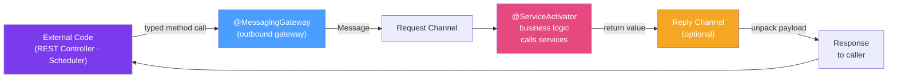

# ⚡ Service Activators

> [!abstract] TL;DR
> Service Activators are the bridge between Spring Integration messaging flows and your business logic. The `@ServiceActivator` annotation marks a method to be invoked when a message arrives on a channel. `@MessagingGateway` provides the inverse: a synchronous, typed interface for sending messages from non-integration code. Together they decouple application code from messaging infrastructure.

## Intuition — analogy FIRST

A **Service Activator** is like a **hotel concierge**. Messages flow down the hotel's communication system (channels). When a guest request (message) arrives at the concierge desk (the channel the activator listens on), the concierge springs into action (the `@ServiceActivator` method runs). The concierge doesn't know or care how the request was routed — someone pressed a button on a phone, someone sent an email, or a bellhop carried a note. The concierge just handles the request and potentially sends a reply.

A **Messaging Gateway** is the reverse: it's the **guest's phone** — a simple interface the guest uses to make requests. Pressing "0" for the front desk looks synchronous to the guest, but behind the scenes it goes through the hotel's messaging infrastructure.

---

## How It Works



## Key Concepts / Details

### @ServiceActivator — Basic Usage

```java
@Component
public class OrderProcessor {
    
    private final OrderService orderService;
    private final EmailService emailService;
    
    // Fire-and-forget (void return, no reply channel needed)
    @ServiceActivator(inputChannel = "newOrderChannel")
    public void processNewOrder(Order order) {
        orderService.save(order);
        emailService.sendConfirmation(order.getCustomerEmail(), order.getId());
        log.info("Processed order {}", order.getId());
    }
    
    // Request-reply (return value becomes reply message payload)
    @ServiceActivator(inputChannel = "orderLookupChannel",
                      outputChannel = "orderResponseChannel")
    public Order lookupOrder(String orderId) {
        return orderService.findById(UUID.fromString(orderId))
                .orElseThrow(() -> new OrderNotFoundException(orderId));
    }
    
    // Access full message (payload + headers)
    @ServiceActivator(inputChannel = "enrichedOrderChannel")
    public void processWithContext(Message<Order> message) {
        Order order = message.getPayload();
        String correlationId = (String) message.getHeaders().get("correlationId");
        String region = (String) message.getHeaders().get("region");
        
        MDC.put("correlationId", correlationId);
        log.info("Processing order {} for region {}", order.getId(), region);
        orderService.processForRegion(order, region);
    }
}
```

### @ServiceActivator with Advice (Retry, Circuit Breaker)

```java
@Bean
public Advice retryAdvice() {
    RequestHandlerRetryAdvice advice = new RequestHandlerRetryAdvice();
    RetryTemplate retryTemplate = RetryTemplate.builder()
            .maxAttempts(3)
            .exponentialBackoff(1000, 2, 10000)
            .retryOn(TransientDataAccessException.class)
            .build();
    advice.setRetryTemplate(retryTemplate);
    return advice;
}

@ServiceActivator(inputChannel = "orderChannel",
                  adviceChain = "retryAdvice")
public void processOrderWithRetry(Order order) {
    externalPaymentService.charge(order);
}
```

### @MessagingGateway — Typed Inbound Interface

The `@MessagingGateway` interface acts as the entry point from non-integration code into Spring Integration:

```java
@MessagingGateway
public interface OrderGateway {
    
    // Send and forget
    @Gateway(requestChannel = "newOrderChannel")
    void submitOrder(Order order);
    
    // Send and receive (blocking)
    @Gateway(requestChannel = "orderLookupChannel",
             replyChannel = "orderResponseChannel",
             replyTimeout = 5000)  // 5s timeout
    Order getOrder(String orderId);
    
    // Send with custom headers
    @Gateway(requestChannel = "priorityOrderChannel")
    void submitPriorityOrder(Order order,
            @Header("priority") int priority,
            @Header("vipCustomer") boolean isVip);
}

// Usage — looks like a regular Spring service
@RestController
public class OrderController {
    private final OrderGateway orderGateway;
    
    @PostMapping("/orders")
    public ResponseEntity<Void> createOrder(@RequestBody Order order) {
        orderGateway.submitOrder(order);  // routed to Spring Integration
        return ResponseEntity.accepted().build();
    }
    
    @GetMapping("/orders/{id}")
    public Order getOrder(@PathVariable String id) {
        return orderGateway.getOrder(id);  // synchronous request-reply
    }
}
```

### Async Service Activator with ExecutorChannel

Make service activator calls non-blocking using an `ExecutorChannel`:

```java
@Bean
public MessageChannel asyncProcessingChannel() {
    return new ExecutorChannel(Executors.newFixedThreadPool(5));
}

@ServiceActivator(inputChannel = "asyncProcessingChannel")
public void processAsync(Order order) {
    // Runs on executor thread, not the caller's thread
    heavyProcessingService.process(order);
}
```

### Error Handling in Service Activators

```java
// Global error channel
@ServiceActivator(inputChannel = "errorChannel")
public void handleError(ErrorMessage errorMessage) {
    Throwable cause = errorMessage.getPayload().getCause();
    Message<?> failedMessage = errorMessage.getPayload().getFailedMessage();
    
    log.error("Integration error processing {}: {}", 
            failedMessage.getPayload().getClass().getSimpleName(),
            cause.getMessage(), cause);
    
    // Options: alert, dead-letter queue, manual retry queue
    deadLetterService.store(failedMessage, cause);
}

// Per-channel error handling
@Bean
public IntegrationFlow orderFlowWithErrorHandling() {
    return IntegrationFlow.from("orderChannel")
            .handle(orderService::process,
                    e -> e.requiresReply(false)  // don't fail if no reply
                          .onFailureHandlerChannel("orderErrorChannel"))
            .channel("successChannel")
            .get();
}
```

### Request-Reply Pattern (Outbound Gateway)

For calling external REST APIs or synchronous external systems:

```java
@Bean
public IntegrationFlow httpOutboundFlow() {
    return IntegrationFlow.from("externalApiChannel")
            .handle(Http.outboundGateway("https://api.payment.com/charge")
                    .httpMethod(HttpMethod.POST)
                    .expectedResponseType(PaymentResponse.class)
                    .requestFactory(clientHttpRequestFactory())
                    .errorHandler(defaultResponseErrorHandler()))
            .channel("paymentResponseChannel")
            .get();
}
```

### Service Activator vs Transformer

| Concern | `@ServiceActivator` | `@Transformer` |
|---------|--------------------|--------------------|
| Purpose | Business logic, side effects | Pure data conversion |
| External calls | Yes (DB, REST, messaging) | Avoid (use ContentEnricher) |
| State | Stateful services | Stateless functions |
| Reply | Optional | Required (always returns) |
| Error handling | Can fail with business exceptions | Format errors only |

## Real-World Notes

- **Transaction boundaries**: `@ServiceActivator` methods participate in transactions when called via `DirectChannel` (same thread). For `QueueChannel`-based activators, configure `@Transactional` on the activator method — each polled message gets its own transaction.
- **Gateway timeout configuration**: Always set `replyTimeout` on blocking gateways. Without it, a slow consumer causes the caller thread to block indefinitely.
- **Service activator as integration test target**: Test `@ServiceActivator` methods by sending messages directly to their input channel in integration tests. No need to test the channel wiring separately.

## Common Pitfalls

- **Blocking gateway in reactive context**: Calling a blocking `@MessagingGateway` from a WebFlux controller blocks the event loop. Wrap with `Mono.fromCallable()` and `subscribeOn(Schedulers.boundedElastic())`.
- **Missing reply channel**: If a `@ServiceActivator` returns a value but no `outputChannel` is configured and no `replyChannel` header is set, the return value is discarded silently.
- **Not handling `errorChannel`**: By default, exceptions from service activators go to the `errorChannel`. Without a subscriber, the exception is logged but the message is lost. Always subscribe to `errorChannel`.

## Related Concepts
- [[Message_Channels]] — Input and output channels for service activators
- [[Message_Transformers]] — When to transform vs when to activate a service
- [[Enterprise_Integration_Patterns]] — Service Activator as EIP endpoint pattern
- [[Spring_Integration_DSL]] — Inline service activator configuration

## Review Questions
1. What is the difference between `@ServiceActivator` and `@MessagingGateway`?
2. How do you make a `@ServiceActivator` non-blocking?
3. What happens when a `@ServiceActivator` method throws an exception?
4. How does `replyTimeout` work in a blocking `@MessagingGateway`?
5. When is `@Transactional` needed on a `@ServiceActivator` method?

## Sources
- Spring Integration Reference — Service Activator: https://docs.spring.io/spring-integration/docs/current/reference/html/service-activator.html
- Spring Integration Reference — Messaging Gateways: https://docs.spring.io/spring-integration/docs/current/reference/html/gateway.html

#java #spring #spring-integration #service-activator #messaging-gateway
