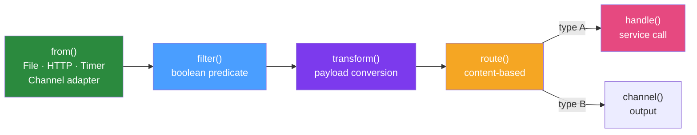

# 🔧 Spring Integration DSL

> [!abstract] TL;DR
> The Spring Integration Java DSL provides a fluent, composable API for building integration flows as Spring beans. `IntegrationFlow` chains sources, channels, transformers, routers, filters, and endpoints into readable pipeline declarations. The DSL replaces XML configuration and complements annotation-based configuration, producing fully-featured integration flows with less ceremony.

## Intuition — analogy FIRST

Think of the Integration DSL as a **recipe card for a complex cocktail**. Instead of separately labelling every glass, shaker, and ingredient station and then having someone mentally trace where each ingredient goes, you write a recipe: "Start with gin → add tonic → garnish with lemon → pour into tall glass → serve at bar." The DSL is the recipe card — it describes the entire flow of ingredients (messages) through operations (transforms, filters, routes) in one readable declaration. Anyone reading the recipe immediately understands the end-to-end flow without chasing annotations scattered across multiple classes.

---

## How It Works



## Key Concepts / Details

### Basic IntegrationFlow Structure

```java
@Bean
public IntegrationFlow orderProcessingFlow() {
    return IntegrationFlow
            .from("rawOrderChannel")                     // source channel
            .filter(Order.class, o -> o.getTotal().compareTo(BigDecimal.ZERO) > 0)  // filter
            .transform(order -> enrichmentService.enrich(order))  // transform
            .handle(orderService::processOrder)          // service call
            .channel("processedOrderChannel")            // output channel
            .get();                                      // build the flow
}
```

### Starting Flows from Different Sources

#### Timer-Based (Scheduled)

```java
@Bean
public IntegrationFlow scheduledFlow() {
    return IntegrationFlow
            .from(Files.inboundAdapter(new File("/data/incoming"))
                          .patternFilter("*.csv"),
                  e -> e.poller(Pollers.fixedDelay(30_000)))  // poll every 30s
            .transform(Files.toStringTransformer())
            .handle(csvProcessingService::processCsvContent)
            .get();
}
```

#### HTTP Inbound

```java
@Bean
public IntegrationFlow httpInboundFlow() {
    return IntegrationFlow
            .from(Http.inboundChannelAdapter("/events")
                       .requestMapping(r -> r.methods(HttpMethod.POST))
                       .requestPayloadType(EventDto.class))
            .transform(eventMapper::toEvent)
            .channel("eventChannel")
            .get();
}
```

#### Channel-Based (Most Common)

```java
@Bean
public IntegrationFlow fromChannelFlow() {
    return IntegrationFlow.from("inputChannel")
            .handle(myService::process)
            .get();
}
```

### Routing in DSL

```java
@Bean
public IntegrationFlow routingFlow() {
    return IntegrationFlow.from("orderChannel")
            .route(Order::getType, mapping -> mapping
                    .subFlowMapping(OrderType.RETAIL, sf -> sf
                            .handle(retailService::process))
                    .subFlowMapping(OrderType.WHOLESALE, sf -> sf
                            .transform(wholesaleTransformer::transform)
                            .handle(wholesaleService::process))
                    .defaultSubFlowMapping(sf -> sf
                            .handle(defaultService::process))
            )
            .get();
}
```

### Splitting and Aggregating

```java
@Bean
public IntegrationFlow splitAggregateFlow() {
    return IntegrationFlow.from("bulkOrderChannel")
            .split()  // split List<Order> into individual Order messages
            .channel(c -> c.executor(Executors.newFixedThreadPool(4)))  // parallel processing
            .handle(orderProcessor::processItem)
            .aggregate(agg -> agg
                    .correlationStrategy(msg -> msg.getHeaders().get("correlationId"))
                    .releaseStrategy(group -> group.isComplete())
                    .outputProcessor(group -> 
                            group.getMessages().stream()
                                 .map(m -> (ProcessedItem) m.getPayload())
                                 .collect(Collectors.toList()))
            )
            .handle(resultService::handleBatchResult)
            .get();
}
```

### Complete File Polling Flow

A complete real-world example — poll for CSV files, process each line, write results:

```java
@Bean
public IntegrationFlow csvIngestionFlow(
        CsvLineProcessor processor, 
        AuditService auditService) {
    return IntegrationFlow
            .from(Files.inboundAdapter(new File("/data/input"))
                          .patternFilter("orders-*.csv")
                          .preventDuplicates(true),
                  e -> e.poller(Pollers.cron("0 */5 * * * *")  // every 5 min
                                       .maxMessagesPerPoll(1)))
            .enrichHeaders(h -> h.headerFunction("batchId", 
                    msg -> UUID.randomUUID().toString()))
            .transform(Files.toStringTransformer(StandardCharsets.UTF_8))
            .split(s -> s.delimiters("\n").skipFirst(1))  // split lines, skip header
            .filter(String.class, line -> !line.isBlank())
            .transform(String.class, processor::parseOrderLine)
            .filter(Order.class, Order::isValid, 
                    f -> f.discardChannel("invalidOrderChannel"))
            .handle(orderRepository::save)
            .get();
}

// Handle invalid orders separately
@Bean
public IntegrationFlow invalidOrderFlow() {
    return IntegrationFlow.from("invalidOrderChannel")
            .handle(auditService::logInvalidOrder)
            .get();
}
```

### HTTP Outbound Gateway in DSL

```java
@Bean
public IntegrationFlow httpOutboundFlow() {
    return IntegrationFlow.from("paymentRequestChannel")
            .handle(Http.outboundGateway("https://payments.api.com/charge")
                    .httpMethod(HttpMethod.POST)
                    .expectedResponseType(PaymentResponse.class)
                    .requestFactory(requestFactory())
                    .errorHandler(new DefaultResponseErrorHandler()))
            .transform(PaymentResponse::getTransactionId)
            .channel("transactionIdChannel")
            .get();
}
```

### Dynamic Flow Registration

Register integration flows programmatically at runtime:

```java
@Service
public class DynamicFlowService {
    
    private final IntegrationFlowContext flowContext;
    
    public void registerTenantFlow(String tenantId, String inputDir) {
        IntegrationFlow flow = IntegrationFlow
                .from(Files.inboundAdapter(new File(inputDir))
                              .patternFilter("*.json"),
                      e -> e.poller(Pollers.fixedDelay(10_000)))
                .enrichHeaders(h -> h.header("tenantId", tenantId))
                .handle(tenantProcessor::process)
                .get();
        
        flowContext.registration(flow)
                   .id("tenant-flow-" + tenantId)
                   .register()
                   .start();
    }
    
    public void removeTenantFlow(String tenantId) {
        flowContext.remove("tenant-flow-" + tenantId);
    }
}
```

### DSL vs Annotation Style — Comparison

| Aspect | DSL (`IntegrationFlow`) | Annotations (`@ServiceActivator` etc.) |
|--------|------------------------|---------------------------------------|
| Readability | End-to-end flow visible | Logic scattered across classes |
| Testability | Test the `IntegrationFlow` bean | Test individual methods |
| Dynamic flows | Supported via `IntegrationFlowContext` | Static only |
| IDE support | Good (fluent API autocomplete) | Good (annotation-based) |
| Complex routing | Sub-flow mappings are expressive | Requires multiple beans |
| Recommendation | New code, complex flows | Legacy migration, simple activators |

## Real-World Notes

- **Mixing DSL and annotations**: You can mix DSL-defined flows with `@ServiceActivator`-annotated beans. A `handle()` in a DSL flow can call an annotated service activator by channel name.
- **Testing DSL flows**: Use `@SpringIntegrationTest` with `@Autowired MessageChannel` to send test messages and `@Autowired MessageCollector` to capture output.
- **Flow visualisation**: Spring Integration provides a `IntegrationGraphServer` that exposes the entire flow graph as JSON, consumable by the Spring Integration visualizer or custom dashboards.

## Common Pitfalls

- **Forgetting `.get()`**: The `IntegrationFlow` builder is lazy — `.get()` builds the flow. Without it, no flow is registered.
- **Infinite polling without maxMessagesPerPoll**: A poller without `maxMessagesPerPoll` defaults to processing 1 message per poll. For file polling, set `maxMessagesPerPoll(-1)` to drain all available files per poll cycle.
- **Shared state in flow lambdas**: Lambda functions in DSL flows are called on potentially different threads. Avoid shared mutable state in flow lambdas.

## Related Concepts
- [[Message_Channels]] — Channel declarations used in DSL flows
- [[Service_Activators]] — `handle()` calls service activator logic
- [[Message_Transformers]] — `transform()` and `enrich()` operations
- [[Enterprise_Integration_Patterns]] — Patterns implemented in DSL

## Review Questions
1. What is the purpose of `.get()` at the end of an `IntegrationFlow` builder chain?
2. How do you poll a directory for CSV files every 5 minutes using the DSL?
3. What is the difference between `.split()` and `.route()` in the DSL?
4. How do you register an integration flow dynamically at runtime?
5. When would you use annotation-based configuration vs the Java DSL?

## Sources
- Spring Integration Reference — Java DSL: https://docs.spring.io/spring-integration/docs/current/reference/html/dsl.html
- Spring Integration Samples — GitHub: https://github.com/spring-projects/spring-integration-samples

#java #spring #spring-integration #dsl #integration-flow
