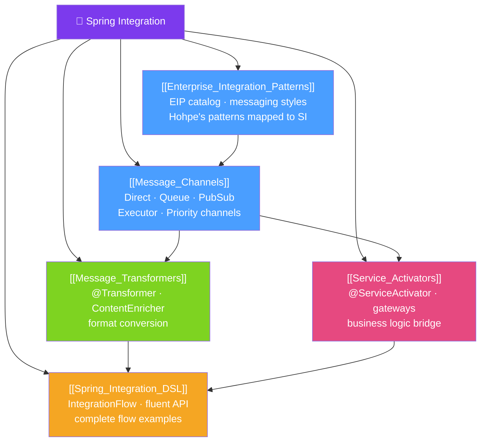

# 🗺️ Spring Integration — Map of Content

> [!abstract] What This Section Covers
> Spring Integration is the Spring implementation of Enterprise Integration Patterns (EIP) — the canonical language for building messaging-based integration solutions. This section covers the EIP patterns (message channels, routers, transformers, splitters, aggregators), Spring Integration's channel types, the Java DSL for building integration flows, and production patterns for connecting disparate systems. Spring Integration is the foundation under Spring Cloud Stream and complements Spring Batch for event-driven pipelines.

## Concept Map

## Learning Path
1. [[Enterprise_Integration_Patterns]] — Understand the EIP vocabulary before looking at Spring Integration APIs.
2. [[Message_Channels]] — Learn the channel types that carry messages between components.
3. [[Message_Transformers]] — See how messages are transformed as they flow through channels.
4. [[Service_Activators]] — Bridge integration flows with Spring business services.
5. [[Spring_Integration_DSL]] — Combine everything into complete integration flows using the Java DSL.

## All Notes at a Glance
| Note | Difficulty | What You'll Learn |
|------|------------|-------------------|
| [[Enterprise_Integration_Patterns]] | Intermediate | The four integration styles, EIP pattern catalog, why messaging beats RPC for decoupling |
| [[Message_Channels]] | Intermediate | DirectChannel, QueueChannel, PublishSubscribeChannel, ExecutorChannel, interceptors |
| [[Message_Transformers]] | Intermediate | @Transformer, ContentEnricher, ClaimCheck, format conversion, header manipulation |
| [[Service_Activators]] | Advanced | @ServiceActivator, @MessagingGateway, request-reply, error channels, async activators |
| [[Spring_Integration_DSL]] | Advanced | IntegrationFlow DSL, routing, splitting, aggregating, complete end-to-end flows |

## Key Questions This Section Answers
- What is the difference between point-to-point and publish-subscribe messaging?
- When should you use `DirectChannel` vs `QueueChannel`?
- How do you transform a message payload without knowing the downstream consumer?
- How does `@MessagingGateway` bridge synchronous code with asynchronous messaging?
- How do you build a complete file-polling integration flow with the DSL?
- How does Spring Integration relate to Spring Cloud Stream?

## Related Sections
- [[_MOC_Java_Master|↑ Java Master MOC]]
- [[_MOC_Spring_Batch|↔ Spring Batch]] — batch processing often feeds integration flows
- [[_MOC_Data_Processing|↔ Java Data Processing]] — pipeline patterns

#java #spring #MOC #spring-integration
