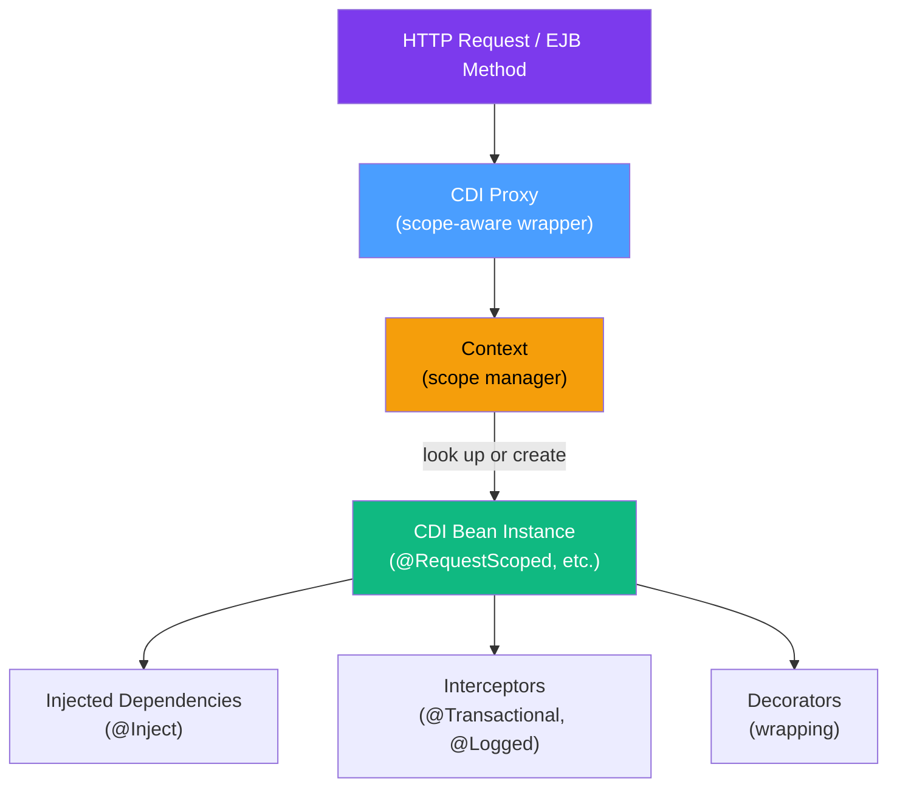

# 💉 CDI Contexts and Dependency Injection

> [!abstract] TL;DR
> CDI (Contexts and Dependency Injection, `jakarta.inject` / `jakarta.enterprise.context`) is the standard dependency injection framework for Jakarta EE. It goes beyond simple DI by providing scoped component lifecycle management, a type-safe event bus, interceptors, decorators, and producers. CDI 4.0 (Jakarta EE 10) also introduced "CDI Lite" for environments without full CDI support (like native images).

## Intuition — analogy FIRST
CDI scopes are like **hotel rooms of different durations**. A `@RequestScoped` bean is like the hotel lobby — it's created for your visit (HTTP request) and cleared out afterward. A `@SessionScoped` bean is like your hotel room — it persists for your stay (HTTP session). An `@ApplicationScoped` bean is like the hotel's permanent fixtures — the pool, the gym — shared by all guests, existing for the lifetime of the hotel. `@Dependent` scope is like a disposable item given to you — it lives exactly as long as whoever asked for it.

---

## How It Works



CDI creates a **proxy** for every normal-scoped bean. When you inject a `@RequestScoped` bean, you get the proxy. The proxy knows which context is active and delegates to the correct bean instance for the current request/session.

---

## Key Concepts / Details

### CDI Scopes

#### `@RequestScoped`
One instance per HTTP request (or per method invocation in non-web contexts).

```java
import jakarta.enterprise.context.RequestScoped;
import jakarta.inject.Inject;

@RequestScoped
public class ShoppingCartService {
    private List<CartItem> items = new ArrayList<>();

    public void addItem(CartItem item) { items.add(item); }
    public List<CartItem> getItems() { return items; }
}
```

#### `@SessionScoped`
One instance per HTTP session. Must be `Serializable` for passivation.

```java
import jakarta.enterprise.context.SessionScoped;
import java.io.Serializable;

@SessionScoped
public class UserSession implements Serializable {
    private static final long serialVersionUID = 1L;

    private String username;
    private Set<String> roles = new HashSet<>();

    public boolean hasRole(String role) { return roles.contains(role); }
    public void login(String username, Set<String> roles) {
        this.username = username;
        this.roles = roles;
    }
}
```

#### `@ApplicationScoped`
One instance for the entire application lifetime. Similar to Singleton but CDI-managed (interceptors work, can be mocked in tests).

```java
import jakarta.enterprise.context.ApplicationScoped;

@ApplicationScoped
public class ExchangeRateCache {
    private final ConcurrentHashMap<String, Double> rates = new ConcurrentHashMap<>();

    public void updateRate(String currency, double rate) {
        rates.put(currency, rate);
    }

    public double getRate(String currency) {
        return rates.getOrDefault(currency, 1.0);
    }
}
```

#### `@ConversationScoped`
For long-running, multi-page wizard flows (web-specific). Manually begin/end:

```java
import jakarta.enterprise.context.ConversationScoped;
import jakarta.inject.Inject;
import jakarta.enterprise.context.Conversation;
import java.io.Serializable;

@ConversationScoped
public class MultiStepCheckout implements Serializable {
    @Inject
    private Conversation conversation;

    private Order pendingOrder;

    public void beginCheckout() {
        conversation.begin();  // start the conversation
        pendingOrder = new Order();
    }

    public void addShipping(Address address) {
        pendingOrder.setShippingAddress(address);
    }

    public void confirmOrder() {
        // save order...
        conversation.end();  // end the conversation
    }
}
```

#### `@Dependent` (pseudo-scope)
The bean has no scope of its own — it inherits the scope of whoever injects it. No proxy is created.

```java
import jakarta.enterprise.context.Dependent;

@Dependent  // will be destroyed when its injecting bean is destroyed
public class PasswordEncoder {
    public String encode(String raw) {
        return BCrypt.hashpw(raw, BCrypt.gensalt(12));
    }
}
```

### Scope Comparison Table

| Scope | Lifetime | Proxy? | Serializable? | Thread Safe? |
|-------|----------|--------|--------------|-------------|
| `@RequestScoped` | HTTP request | Yes | Not required | Yes (one per request) |
| `@SessionScoped` | HTTP session | Yes | **Required** | No (session access serialized) |
| `@ApplicationScoped` | App lifetime | Yes | Not required | No — synchronize manually |
| `@ConversationScoped` | Manual begin/end | Yes | **Required** | No |
| `@Dependent` | Injector's lifetime | No | Not required | Inherits |
| `@Singleton` (EJB) | App lifetime | No | Not required | Yes (container locks) |

### `@Inject` — The CDI Injection Point

```java
@RequestScoped
public class OrderController {

    // Constructor injection (preferred for testability)
    private final OrderService orderService;
    private final UserSession session;

    @Inject
    public OrderController(OrderService orderService, UserSession session) {
        this.orderService = orderService;
        this.session = session;
    }

    // Field injection (less testable, but common in Jakarta EE)
    @Inject
    private ExchangeRateCache rateCache;

    // Method injection
    private EmailService emailService;

    @Inject
    public void setEmailService(EmailService emailService) {
        this.emailService = emailService;
    }
}
```

### `@Inject` vs `@EJB` vs `@Resource`

```java
@RequestScoped
public class ServiceExample {

    // CDI injection — works with CDI beans and EJBs
    @Inject
    private PaymentService paymentService;  // CDI bean

    // EJB-specific injection — only for EJBs; supports remote lookups
    @EJB(beanName = "LegacyOrderService")
    private OrderService orderService;

    // Java EE resource injection — JNDI resources, data sources, JMS
    @Resource(name = "java:jboss/datasources/MyDS")
    private DataSource dataSource;

    @Resource(mappedName = "java:/queue/OrderQueue")
    private Queue orderQueue;
}
```

**Use `@Inject` for everything you can.** `@EJB` is needed only for remote EJB lookup (cross-JVM). `@Resource` is needed for JNDI-bound resources like data sources.

### Qualifiers — Disambiguating Multiple Implementations

When multiple implementations of the same type exist, qualifiers select the right one:

```java
// Define a qualifier annotation
@Qualifier
@Retention(RetentionPolicy.RUNTIME)
@Target({ElementType.FIELD, ElementType.TYPE, ElementType.METHOD, ElementType.PARAMETER})
public @interface Premium { }

@Qualifier
@Retention(RetentionPolicy.RUNTIME)
@Target({ElementType.FIELD, ElementType.TYPE, ElementType.METHOD, ElementType.PARAMETER})
public @interface Standard { }

// Two implementations
@ApplicationScoped
@Premium
public class PremiumShippingService implements ShippingService {
    public double calculate(Order order) { return 0;  }  // free shipping
}

@ApplicationScoped
@Standard
public class StandardShippingService implements ShippingService {
    public double calculate(Order order) { return 5.99; }
}

// Inject the right one
@RequestScoped
public class CheckoutService {

    @Inject @Premium
    private ShippingService premiumShipping;

    @Inject @Standard
    private ShippingService standardShipping;

    public double calculateShipping(Order order, boolean isPremium) {
        return isPremium
            ? premiumShipping.calculate(order)
            : standardShipping.calculate(order);
    }
}
```

### Producers (`@Produces`) and Disposers (`@Disposes`)

Producers create beans that CDI can't instantiate directly (e.g., from factories, JNDI, third-party classes):

```java
import jakarta.enterprise.inject.Produces;
import jakarta.enterprise.inject.Disposes;
import jakarta.enterprise.context.ApplicationScoped;
import jakarta.enterprise.context.RequestScoped;

@ApplicationScoped
public class DatabaseProducer {

    // Produce a CDI-managed EntityManager per request
    @Produces
    @RequestScoped
    @PersistenceContext(unitName = "myPU")
    private EntityManager em;  // injected by the container

    // Disposer — called when the EntityManager's scope ends
    public void closeEntityManager(@Disposes EntityManager em) {
        if (em.isOpen()) em.close();
    }

    // Produce a Logger for any injection point
    @Produces
    public Logger produceLogger(InjectionPoint ip) {
        return Logger.getLogger(ip.getMember().getDeclaringClass().getName());
    }
}

// Usage of produced logger
@RequestScoped
public class OrderService {
    @Inject
    private Logger log;  // automatically gets logger for OrderService.class

    public void process() {
        log.info("Processing order");
    }
}
```

### Alternatives (`@Alternative`)

Useful for testing — replace production beans with test stubs:

```java
// Production bean
@ApplicationScoped
public class EmailService {
    public void send(String to, String body) { /* real email */ }
}

// Test alternative
@Alternative
@Priority(1)  // enables this alternative globally (CDI 4.0)
@ApplicationScoped
public class FakeEmailService extends EmailService {
    private List<String> sentEmails = new ArrayList<>();

    @Override
    public void send(String to, String body) {
        sentEmails.add(to + ": " + body);  // capture instead of send
    }
}
```

Alternatively, activate in `beans.xml`:
```xml
<beans xmlns="https://jakarta.ee/xml/ns/jakartaee" version="4.0">
    <alternatives>
        <class>com.example.FakeEmailService</class>
    </alternatives>
</beans>
```

### CDI Events — Decoupled Communication

CDI events implement the Observer pattern without coupling components:

```java
// Define event payload (any POJO)
public class OrderPlacedEvent {
    private final Order order;

    public OrderPlacedEvent(Order order) { this.order = order; }
    public Order getOrder() { return order; }
}

// Fire the event
@RequestScoped
public class OrderService {

    @Inject
    private Event<OrderPlacedEvent> orderPlacedEvent;

    public Order placeOrder(OrderRequest request) {
        Order order = createOrder(request);
        // Fire event — synchronously notifies all observers
        orderPlacedEvent.fire(new OrderPlacedEvent(order));
        return order;
    }
}

// Multiple observers — no coupling to OrderService
@ApplicationScoped
public class EmailNotificationObserver {
    @Observes
    public void onOrderPlaced(OrderPlacedEvent event) {
        sendConfirmationEmail(event.getOrder());
    }
}

@ApplicationScoped
public class InventoryObserver {
    @Observes
    public void onOrderPlaced(OrderPlacedEvent event) {
        reserveInventory(event.getOrder().getItems());
    }
}

// Asynchronous event firing (CDI 2.0+)
@RequestScoped
public class AsyncOrderService {

    @Inject
    private Event<OrderPlacedEvent> orderPlacedEvent;

    public CompletionStage<Void> placeOrderAsync(OrderRequest request) {
        Order order = createOrder(request);
        return orderPlacedEvent.fireAsync(new OrderPlacedEvent(order));
    }
}

// Conditional observation with @Observes qualifiers
@ApplicationScoped
public class PremiumOrderObserver {
    @Observes @Premium  // only observe events fired with @Premium qualifier
    public void onPremiumOrderPlaced(OrderPlacedEvent event) {
        upgradeShipping(event.getOrder());
    }
}
```

### Interceptors — Cross-Cutting Concerns

```java
// 1. Define interceptor binding annotation
@InterceptorBinding
@Retention(RetentionPolicy.RUNTIME)
@Target({ElementType.METHOD, ElementType.TYPE})
public @interface Logged { }

// 2. Implement the interceptor
@Logged
@Interceptor
@Priority(Interceptor.Priority.APPLICATION)  // activation order
public class LoggingInterceptor {

    @Inject
    private Logger log;

    @AroundInvoke
    public Object logMethod(InvocationContext ctx) throws Exception {
        String method = ctx.getMethod().getName();
        log.info("Entering: " + method);
        long start = System.currentTimeMillis();
        try {
            Object result = ctx.proceed();  // call the actual method
            log.info("Exiting: " + method + " (" + (System.currentTimeMillis() - start) + "ms)");
            return result;
        } catch (Exception e) {
            log.severe("Exception in: " + method + ": " + e.getMessage());
            throw e;
        }
    }
}

// 3. Apply to beans
@RequestScoped
@Logged  // all methods in this class are logged
public class PaymentService {
    public void charge(double amount) { /* ... */ }
    public void refund(double amount) { /* ... */ }
}
```

### CDI vs Spring DI Comparison

| Feature | CDI (Jakarta EE) | Spring DI |
|---------|-----------------|-----------|
| Standard | JSR-365 (portable) | Spring-specific |
| Default scope | `@Dependent` | Singleton |
| Injection | `@Inject` | `@Autowired` / `@Inject` |
| Qualifier | `@Qualifier` custom annotation | `@Qualifier("name")` string-based or custom |
| Events | `Event<T>` / `@Observes` | `ApplicationEventPublisher` / `@EventListener` |
| Interceptors | `@InterceptorBinding` + `@Interceptor` | AOP (`@Aspect`, `@Around`) |
| Conditional beans | `@Alternative` + `@Priority` | `@Conditional`, `@Profile` |
| Bean discovery | `beans.xml` or `@BeanDefiningAnnotation` | Component scan, `@SpringBootApplication` |
| Producers | `@Produces` | `@Bean` in `@Configuration` |
| Testability | `@Alternative` | `@MockBean`, `@TestConfiguration` |

---

## Real-World Notes
- In modern Jakarta EE applications, CDI is used almost exclusively instead of `@EJB` for DI — `@EJB` is only needed for remote beans or JMS-specific patterns
- CDI events are heavily used for domain event patterns in DDD (Domain-Driven Design) with Jakarta EE
- Quarkus uses "CDI Lite" (build-time processing) for extremely fast startup — understanding CDI scopes is essential for Quarkus development

---

## Common Pitfalls
- Injecting a `@RequestScoped` bean into an `@ApplicationScoped` bean — the `@ApplicationScoped` bean is created once, but CDI's proxy resolves the right request-scoped instance per request. Forgetting this proxy mechanism and trying to serialize the injected reference causes failures.
- `@SessionScoped` beans that aren't `Serializable` — causes `PassivationException` when the server tries to passivate the session
- Calling `@Produces` method on an `@Dependent` bean and not providing a `@Disposes` — resource leaks for resources like JDBC connections
- Using `@Singleton` EJB and `@ApplicationScoped` CDI interchangeably — EJB `@Singleton` has container-managed concurrency (via `@Lock`); CDI `@ApplicationScoped` does not

---

## Related Concepts
- [[EJB_Fundamentals]] — EJBs and CDI beans work together; `@Inject` injects both
- [[Jakarta_REST]] — JAX-RS resources use CDI injection
- [[Jakarta_EE_Overview]] — CDI as a core platform specification

---

## Review Questions
1. What is the difference between `@RequestScoped`, `@SessionScoped`, and `@ApplicationScoped`? Give a real-world example for each.
2. Why must `@SessionScoped` and `@ConversationScoped` beans implement `Serializable`?
3. You have two implementations of `PaymentGateway`. How do you use CDI qualifiers to inject the right one in a `CheckoutService`?
4. Explain CDI events. How does `Event<T>.fire()` work, and what is `fireAsync()` for?
5. What is the difference between a CDI interceptor and a CDI decorator?
6. When would you use `@Produces` in CDI? Give a concrete example.

## Sources
- CDI 4.0 Specification: https://jakarta.ee/specifications/cdi/4.0/
- "Weld Reference Guide" (Weld is the CDI reference implementation)

#java #jakarta-ee #cdi #dependency-injection #intermediate
