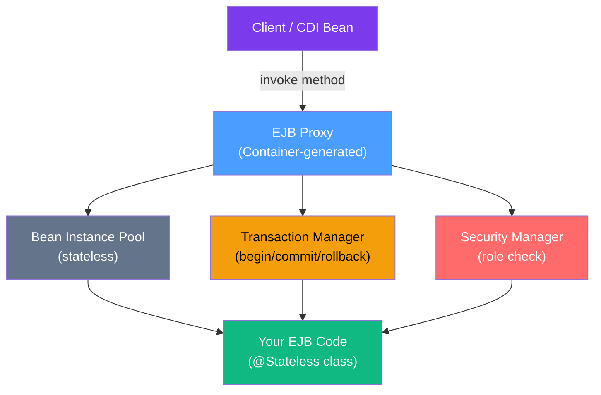

# 🏢 EJB Fundamentals

> [!abstract] TL;DR
> Enterprise JavaBeans (EJB) is a server-side component model that provides container-managed services: transactions, security, concurrency, and lifecycle. Three bean types exist — Stateless Session Beans (`@Stateless`), Stateful Session Beans (`@Stateful`), and Message-Driven Beans (`@MessageDriven`). EJB was infamous for complexity in its EJB 2.x era; EJB 3.x with annotations made it approachable. Spring largely replaced EJBs in greenfield development, but they remain critical in existing Jakarta EE deployments.

## Intuition — analogy FIRST
An EJB container is like a **hotel concierge service**. You (the developer) write the business logic (the hotel guest's requests). The container (the concierge) handles all the operational concerns: opening a transaction before your method runs (arranging transport), rolling it back if something fails (canceling the reservation), ensuring thread-safety (only one staff member handles your request at a time), and managing the lifecycle (checking you in and out). You don't write a single line of transaction or thread management code — the container does it for you declaratively via annotations.

---

## How It Works



Every call to an EJB goes through a **proxy**. The container intercepts the call, applies cross-cutting concerns (transactions, security), then delegates to your actual bean code.

---

## Key Concepts / Details

### Bean Type 1: Stateless Session Bean (`@Stateless`)

A stateless session bean holds no conversational state between method calls. The container maintains a pool of instances and assigns one per request.

```java
import jakarta.ejb.Stateless;
import jakarta.persistence.EntityManager;
import jakarta.persistence.PersistenceContext;

@Stateless
public class OrderService {

    @PersistenceContext(unitName = "myPU")
    private EntityManager em;  // injected by container

    public Order findOrder(Long id) {
        return em.find(Order.class, id);
    }

    public Order createOrder(Order order) {
        em.persist(order);
        return order;
        // transaction committed automatically when method exits
    }

    public void cancelOrder(Long id) {
        Order order = em.find(Order.class, id);
        if (order == null) {
            throw new IllegalArgumentException("Order not found: " + id);
            // container rolls back the transaction
        }
        order.setStatus(OrderStatus.CANCELLED);
        // EntityManager tracks the change — no explicit update needed
    }
}
```

Key properties of `@Stateless`:
- **Instance pooling**: container creates N instances, reuses them across requests
- **Thread safety guaranteed**: each request gets its own instance from the pool
- **No client affinity**: any instance in the pool can serve any client
- **Performance**: cheapest EJB type; scale by increasing pool size

### Bean Type 2: Stateful Session Bean (`@Stateful`)

A stateful session bean maintains conversational state per client. Each client gets a dedicated instance that lives for the duration of the session.

```java
import jakarta.ejb.Stateful;
import jakarta.ejb.Remove;
import jakarta.ejb.StatefulTimeout;
import java.util.concurrent.TimeUnit;
import java.util.ArrayList;
import java.util.List;

@Stateful
@StatefulTimeout(value = 30, unit = TimeUnit.MINUTES)  // auto-destroy after idle
public class ShoppingCart {

    private List<CartItem> items = new ArrayList<>();
    private String customerId;

    public void initialize(String customerId) {
        this.customerId = customerId;
    }

    public void addItem(CartItem item) {
        items.add(item);
    }

    public List<CartItem> getItems() {
        return List.copyOf(items);
    }

    public double getTotal() {
        return items.stream()
            .mapToDouble(CartItem::getPrice)
            .sum();
    }

    @Remove  // container destroys this instance after method returns
    public Order checkout() {
        Order order = new Order(customerId, items);
        // persist order...
        items.clear();
        return order;
    }
}
```

> [!warning] Stateful EJBs and clustering
> In a clustered environment, stateful session beans require passivation (serialization to disk/database) to survive failover. This is expensive and complex. Most modern systems use Redis or a distributed cache instead. This is a primary reason Spring's session management (with Redis) became popular.

### Bean Type 3: Message-Driven Bean (`@MessageDriven`)

An MDB consumes messages from a JMS queue or topic. It has no client-visible interface — it's triggered asynchronously by incoming messages.

```java
import jakarta.ejb.MessageDriven;
import jakarta.ejb.ActivationConfigProperty;
import jakarta.jms.MessageListener;
import jakarta.jms.Message;
import jakarta.jms.TextMessage;

@MessageDriven(activationConfig = {
    @ActivationConfigProperty(
        propertyName = "destinationType",
        propertyValue = "jakarta.jms.Queue"),
    @ActivationConfigProperty(
        propertyName = "destination",
        propertyValue = "java:/queue/OrderQueue"),
    @ActivationConfigProperty(
        propertyName = "acknowledgeMode",
        propertyValue = "Auto-acknowledge")
})
public class OrderProcessorMDB implements MessageListener {

    @Inject
    private OrderService orderService;  // can inject other EJBs

    @Override
    public void onMessage(Message message) {
        try {
            if (message instanceof TextMessage textMessage) {
                String orderId = textMessage.getText();
                orderService.processOrder(Long.parseLong(orderId));
            }
        } catch (Exception e) {
            // Throwing RuntimeException causes the message to be redelivered
            throw new RuntimeException("Order processing failed", e);
        }
    }
}
```

### Singleton EJB (`@Singleton`)

Exactly one instance exists for the entire application lifecycle. Useful for application-wide state or initialization.

```java
import jakarta.ejb.Singleton;
import jakarta.ejb.Startup;
import jakarta.annotation.PostConstruct;
import jakarta.annotation.PreDestroy;
import jakarta.ejb.Lock;
import jakarta.ejb.LockType;
import java.util.concurrent.ConcurrentHashMap;

@Singleton
@Startup  // eagerly initialized at deployment time
public class ApplicationConfigCache {

    private final ConcurrentHashMap<String, String> cache = new ConcurrentHashMap<>();

    @PostConstruct
    public void initialize() {
        System.out.println("Loading config cache...");
        // load from database or config file
        cache.put("maxRetries", "3");
        cache.put("timeoutMs", "5000");
    }

    @PreDestroy
    public void cleanup() {
        cache.clear();
    }

    @Lock(LockType.READ)  // allows concurrent reads
    public String get(String key) {
        return cache.get(key);
    }

    @Lock(LockType.WRITE)  // exclusive write access
    public void put(String key, String value) {
        cache.put(key, value);
    }
}
```

### Container-Managed Transactions (CMT) — Transaction Attributes

Transaction attributes control how the container handles transactions around your EJB methods. The default is `REQUIRED`.

```java
import jakarta.ejb.Stateless;
import jakarta.ejb.TransactionAttribute;
import jakarta.ejb.TransactionAttributeType;

@Stateless
public class PaymentService {

    // REQUIRED (default): join existing tx, or create new one
    @TransactionAttribute(TransactionAttributeType.REQUIRED)
    public void processPayment(Payment payment) { /* ... */ }

    // REQUIRES_NEW: always start a new tx; suspend existing one
    // Useful for audit logging that must commit even if main tx rolls back
    @TransactionAttribute(TransactionAttributeType.REQUIRES_NEW)
    public void logAuditEvent(AuditEvent event) { /* always committed */ }

    // MANDATORY: must have an active tx; throws exception if none
    @TransactionAttribute(TransactionAttributeType.MANDATORY)
    public void doInTransaction(Long id) { /* ... */ }

    // NOT_SUPPORTED: suspend any active tx for this method
    @TransactionAttribute(TransactionAttributeType.NOT_SUPPORTED)
    public void readOnlyOperation() { /* runs without a transaction */ }

    // SUPPORTS: join tx if one exists, otherwise run without
    @TransactionAttribute(TransactionAttributeType.SUPPORTS)
    public List<Payment> query() { /* ... */ }

    // NEVER: throws exception if called within a transaction
    @TransactionAttribute(TransactionAttributeType.NEVER)
    public void nonTransactionalOp() { /* ... */ }
}
```

| Attribute | Active TX exists | No TX exists |
|-----------|-----------------|--------------|
| `REQUIRED` | Join it | Create new |
| `REQUIRES_NEW` | Suspend, create new | Create new |
| `MANDATORY` | Join it | **Exception** |
| `NOT_SUPPORTED` | Suspend it | Run without |
| `SUPPORTS` | Join it | Run without |
| `NEVER` | **Exception** | Run without |

### Bean-Managed Transactions (BMT)

For fine-grained control, you can manage transactions yourself using `UserTransaction`:

```java
import jakarta.ejb.Stateless;
import jakarta.ejb.TransactionManagement;
import jakarta.ejb.TransactionManagementType;
import jakarta.transaction.UserTransaction;
import jakarta.annotation.Resource;

@Stateless
@TransactionManagement(TransactionManagementType.BEAN)
public class ManualTxService {

    @Resource
    private UserTransaction ut;

    public void complexOperation() throws Exception {
        ut.begin();
        try {
            // do work
            firstOperation();
            secondOperation();
            ut.commit();
        } catch (Exception e) {
            ut.rollback();
            throw e;
        }
    }
}
```

### EJB Timer Service (`@Schedule`)

EJBs can schedule work without an external scheduler:

```java
import jakarta.ejb.Stateless;
import jakarta.ejb.Schedule;
import jakarta.ejb.ScheduleExpression;
import jakarta.ejb.Timer;
import jakarta.ejb.TimerService;
import jakarta.annotation.Resource;

@Stateless
public class ReportGeneratorService {

    @Resource
    private TimerService timerService;

    // Run every day at 2:30 AM
    @Schedule(hour = "2", minute = "30", second = "0", persistent = true)
    public void generateDailyReport(Timer timer) {
        System.out.println("Generating daily report: " + timer.getInfo());
        // generate and email reports
    }

    // Programmatic timer creation
    public void scheduleOneTimeReport(Date runAt) {
        timerService.createSingleActionTimer(runAt, 
            new TimerConfig("one-time-report", true));
    }
}
```

### Why Spring Replaced EJBs

| Concern | EJB Solution | Spring Solution |
|---------|-------------|-----------------|
| DI | `@EJB`, `@Resource` | `@Autowired`, `@Inject` |
| Transactions | `@TransactionAttribute` | `@Transactional` |
| Persistence | `@PersistenceContext` | Spring Data JPA |
| Async messaging | `@MessageDriven` | `@RabbitListener`, `@KafkaListener` |
| Scheduling | `@Schedule` | `@Scheduled` |
| Remoting | EJB Remote | REST, gRPC |
| Testing | Complex (deploy to server) | Easy (plain JUnit + Mockito) |
| Startup | Slow (app server) | Fast (embedded) |

Spring's key advantages over EJBs:
1. **Testability**: Spring beans are POJOs; EJBs traditionally required a container to test
2. **No deployment ceremony**: No EAR/WAR required; run from `main()`
3. **Broader ecosystem**: Spring Data, Spring Security, Spring Cloud have no EJB equivalents
4. **Better messaging**: Kafka, RabbitMQ with Spring are simpler than JMS MDBs

**When EJBs still make sense:**
- Existing Jakarta EE application servers in production (migration cost > benefit)
- You need clustered `@Stateful` beans with automatic failover (WebLogic does this)
- You need XA transactions across multiple JMS destinations and databases (container-managed XA)
- Regulatory/certification requirements mandate a Jakarta EE Full Platform certified server

---

## Real-World Notes
- Most new projects avoid EJBs even on Jakarta EE; they use CDI beans with `@Transactional` (which CDI 4.0 supports via Jakarta Transactions integration)
- MDBs are still used in systems with deep JMS infrastructure (WebSphere MQ, HornetQ)
- The EJB pooling mechanism is actually valuable for protecting resources; connection pool size and EJB pool size tuning is a common performance lever in production WildFly/JBoss deployments

---

## Common Pitfalls
- Calling one EJB method from another method **in the same bean** bypasses the container proxy — transaction and security interceptors are NOT applied for self-calls. Use `@Inject`-ed self reference or restructure code.
- `@Stateful` beans that are not `@Remove`d accumulate in memory — always mark the final method with `@Remove`
- Using `@Singleton` with `LockType.WRITE` by default — this serializes ALL access and kills throughput
- EJBs do not support inheritance of EJB metadata annotations; they must be on the concrete class

---

## Related Concepts
- [[CDI_Contexts]] — CDI beans vs EJBs; `@Inject` works with both
- [[JPA_Deep_Dive]] — `@PersistenceContext` injection inside EJBs
- [[Jakarta_EE_Overview]] — understanding where EJBs fit in the platform

---

## Review Questions
1. What is the difference between `@Stateless` and `@Stateful` session beans? When would you use each?
2. Explain the difference between `REQUIRED` and `REQUIRES_NEW` transaction attributes. Give a real use case for `REQUIRES_NEW`.
3. Why does calling an EJB method from within the same EJB class bypass the container proxy? How do you fix this?
4. What is the role of `@MessageDriven` and `MessageListener` together? What triggers an MDB to execute?
5. Why did Spring largely replace EJBs in greenfield development, even for teams that still deploy to Jakarta EE servers?

## Sources
- Jakarta EE 10 EJB specification: https://jakarta.ee/specifications/enterprise-beans/4.0/
- "Enterprise JavaBeans 3.1" by Rubinger & Burke (O'Reilly)

#java #jakarta-ee #ejb #intermediate
