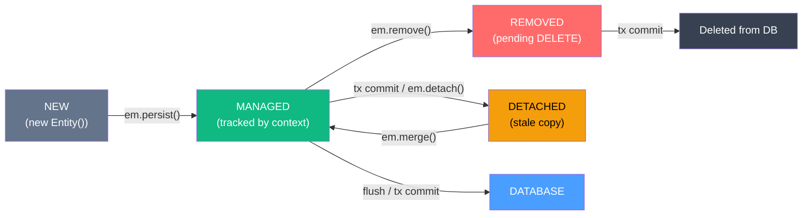
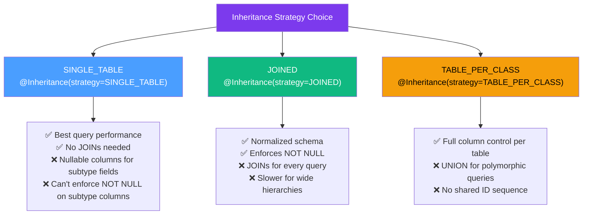

# 🗄️ JPA Deep Dive

> [!abstract] TL;DR
> JPA (Jakarta Persistence API) is the standard ORM specification for Java. Beyond the basics of `@Entity` and `@Id`, JPA's power and danger lie in its persistence context (first-level cache), entity lifecycle state machine, inheritance mapping strategies, optimistic/pessimistic locking, and the N+1 select problem. Mastering these is essential for building performant, correct Java applications.

## Intuition — analogy FIRST
The JPA `EntityManager` and its persistence context is like a **scratchpad on your desk**. When you "look up" an entity (e.g., `em.find(Order.class, 1L)`), JPA pulls the record from the database and puts it on your scratchpad. Any subsequent lookup of the same entity within the same request finds it on the scratchpad — no second database round trip. Any changes you make to entities on the scratchpad are automatically tracked. When you're done (transaction commits), JPA "files" the changes: syncing the scratchpad state back to the permanent database cabinet. When the request ends, the scratchpad is thrown away — that's entity detachment.

---

## How It Works



---

## Key Concepts / Details

### Entity Lifecycle States

```java
import jakarta.persistence.*;

@Entity
@Table(name = "orders")
public class Order {
    @Id @GeneratedValue(strategy = GenerationType.IDENTITY)
    private Long id;

    private String status;
    private double total;
    // getters/setters...
}
```

```java
@Stateless
public class OrderRepository {

    @PersistenceContext
    private EntityManager em;

    public void demonstrateLifecycle() {
        // 1. NEW state — not tracked by any EntityManager
        Order order = new Order();
        order.setStatus("PENDING");
        order.setTotal(99.99);

        // 2. MANAGED state — EntityManager now tracks all changes
        em.persist(order);
        // At this point, order.id is populated (after flush or if IDENTITY generator)

        // 3. Any change to a MANAGED entity is auto-detected (dirty checking)
        order.setStatus("CONFIRMED");  // No em.update() needed!

        // 4. Transaction commit triggers flush → UPDATE SQL issued
        // --- tx boundary ---

        // 5. After the persistence context closes, entity is DETACHED
        // If you return 'order' from an EJB method, it's now detached
    }

    public void demonstrateDetached(Long id) {
        Order order = em.find(Order.class, id);  // MANAGED
        em.detach(order);  // explicitly DETACH

        order.setStatus("MODIFIED");  // change not tracked — no SQL generated

        // Re-attach with merge — JPA loads entity and copies detached state
        Order reattached = em.merge(order);  // reattached is MANAGED, order is still DETACHED
        // Always use the returned value from merge!
    }
}
```

### First-Level Cache (Persistence Context)

```java
public void cacheDemo() {
    // First call: goes to database, caches in persistence context
    Order a = em.find(Order.class, 1L);

    // Second call within SAME persistence context: returns CACHED instance
    // Zero SQL executed!
    Order b = em.find(Order.class, 1L);

    System.out.println(a == b);  // true — same Java object reference!

    // Clear the cache if you need a fresh read (e.g., after external update)
    em.clear();  // detaches all managed entities

    Order c = em.find(Order.class, 1L);  // goes to DB again
    System.out.println(a == c);  // false — different objects
}
```

### JPQL vs Criteria API vs Native SQL

```java
// --- JPQL --- entity-oriented, portable
public List<Order> findByStatus(String status) {
    return em.createQuery(
        "SELECT o FROM Order o WHERE o.status = :status ORDER BY o.id DESC",
        Order.class)
        .setParameter("status", status)
        .setMaxResults(50)
        .getResultList();
}

// Named query — compiled at startup, slightly faster
@Entity
@NamedQuery(
    name = "Order.findByStatus",
    query = "SELECT o FROM Order o WHERE o.status = :status"
)
public class Order { /* ... */ }

// Usage:
List<Order> orders = em.createNamedQuery("Order.findByStatus", Order.class)
    .setParameter("status", "PENDING")
    .getResultList();


// --- Criteria API --- type-safe, refactoring-safe, but verbose ---
public List<Order> findByStatusCriteria(String status) {
    CriteriaBuilder cb = em.getCriteriaBuilder();
    CriteriaQuery<Order> cq = cb.createQuery(Order.class);
    Root<Order> root = cq.from(Order.class);

    cq.select(root)
      .where(cb.equal(root.get("status"), status))
      .orderBy(cb.desc(root.get("id")));

    return em.createQuery(cq).setMaxResults(50).getResultList();
}

// JPA 3.1 improvement: JPA Criteria with type-safe metamodel
// Generated by annotation processor: Order_, OrderItem_
public List<Order> findByStatusTypeSafe(String status) {
    CriteriaBuilder cb = em.getCriteriaBuilder();
    CriteriaQuery<Order> cq = cb.createQuery(Order.class);
    Root<Order> root = cq.from(Order.class);

    cq.select(root)
      .where(cb.equal(root.get(Order_.status), status));  // compile-time safe

    return em.createQuery(cq).getResultList();
}

// --- Native SQL --- for database-specific features or performance ---
public List<Order> findTopOrders() {
    return em.createNativeQuery(
        "SELECT * FROM orders WHERE total > 1000 ORDER BY total DESC LIMIT 10",
        Order.class)
        .getResultList();
}
```

### Entity Inheritance Strategies



```java
// SINGLE_TABLE — one table for entire hierarchy
@Entity
@Inheritance(strategy = InheritanceType.SINGLE_TABLE)
@DiscriminatorColumn(name = "payment_type", discriminatorType = DiscriminatorType.STRING)
public abstract class Payment {
    @Id @GeneratedValue
    private Long id;
    private double amount;
}

@Entity
@DiscriminatorValue("CARD")
public class CardPayment extends Payment {
    private String cardNumber;  // nullable column in payments table
    private String expiryDate;
}

@Entity
@DiscriminatorValue("BANK")
public class BankTransfer extends Payment {
    private String accountNumber;  // also nullable in same table
    private String routingNumber;
}

// JOINED — separate table per class
@Entity
@Inheritance(strategy = InheritanceType.JOINED)
public abstract class Vehicle {
    @Id @GeneratedValue
    private Long id;
    private String vin;
}

@Entity
@PrimaryKeyJoinColumn(name = "vehicle_id")
public class Car extends Vehicle {
    private int numDoors;
    // SELECT v.vin, c.num_doors FROM vehicles v JOIN cars c ON v.id = c.vehicle_id
}
```

### Optimistic Locking with `@Version`

Prevents lost updates in concurrent environments without holding database locks:

```java
@Entity
public class BankAccount {
    @Id
    private Long id;

    private double balance;

    @Version
    private Long version;  // JPA manages this automatically

    public void debit(double amount) {
        if (balance < amount) throw new InsufficientFundsException();
        this.balance -= amount;
    }
}
```

```java
// Thread 1 reads: {id:1, balance:1000, version:1}
// Thread 2 reads: {id:1, balance:1000, version:1}

// Thread 1 updates: UPDATE bank_account SET balance=900, version=2 WHERE id=1 AND version=1
// → succeeds; version is now 2

// Thread 2 tries: UPDATE bank_account SET balance=800, version=2 WHERE id=1 AND version=1
// → WHERE version=1 finds no rows → JPA throws OptimisticLockException!
```

```java
// Handling OptimisticLockException with retry logic
public void debitWithRetry(Long accountId, double amount) {
    int maxRetries = 3;
    for (int attempt = 0; attempt < maxRetries; attempt++) {
        try {
            em.getTransaction().begin();
            BankAccount account = em.find(BankAccount.class, accountId);
            account.debit(amount);
            em.getTransaction().commit();
            return;  // success
        } catch (OptimisticLockException e) {
            em.getTransaction().rollback();
            if (attempt == maxRetries - 1) throw e;
            // brief pause before retry
        }
    }
}
```

### Pessimistic Locking

When you can't afford retries and need to guarantee exclusive access:

```java
// Locks the row at SELECT time — other transactions must wait
BankAccount account = em.find(
    BankAccount.class,
    accountId,
    LockModeType.PESSIMISTIC_WRITE  // SELECT ... FOR UPDATE
);

// Or with JPQL
BankAccount account = em.createQuery(
    "SELECT a FROM BankAccount a WHERE a.id = :id", BankAccount.class)
    .setParameter("id", accountId)
    .setLockMode(LockModeType.PESSIMISTIC_WRITE)
    .getSingleResult();
```

| Lock Mode | SQL | Use Case |
|-----------|-----|---------|
| `NONE` | Regular SELECT | No locking needed |
| `OPTIMISTIC` | Regular SELECT + version check | Concurrent reads, rare conflicts |
| `OPTIMISTIC_FORCE_INCREMENT` | SELECT + version increment | Even if entity not modified |
| `PESSIMISTIC_READ` | SELECT ... FOR SHARE | Prevent dirty reads; others can read |
| `PESSIMISTIC_WRITE` | SELECT ... FOR UPDATE | Exclusive lock; prevent all concurrent modifications |

### The N+1 Problem and EntityGraph

```java
// BAD: N+1 problem
// This issues 1 SQL for orders, then N SQLs for each order's items
List<Order> orders = em.createQuery("SELECT o FROM Order o", Order.class)
    .getResultList();

for (Order order : orders) {
    System.out.println(order.getItems().size());  // LAZY load fires here — N more queries!
}

// FIX 1: JOIN FETCH in JPQL
List<Order> orders = em.createQuery(
    "SELECT DISTINCT o FROM Order o LEFT JOIN FETCH o.items", Order.class)
    .getResultList();  // 1 SQL with JOIN; all data loaded

// FIX 2: Entity Graph — more flexible, reusable
@Entity
@NamedEntityGraph(
    name = "Order.withItems",
    attributeNodes = @NamedAttributeNode("items")
)
public class Order {
    @Id
    private Long id;

    @OneToMany(mappedBy = "order", fetch = FetchType.LAZY)
    private List<OrderItem> items;
}

// Usage:
EntityGraph graph = em.getEntityGraph("Order.withItems");
List<Order> orders = em.createQuery("SELECT o FROM Order o", Order.class)
    .setHint("jakarta.persistence.fetchgraph", graph)
    .getResultList();  // items eagerly loaded
```

### Entity Listeners

```java
import jakarta.persistence.*;

@Entity
@EntityListeners(AuditListener.class)  // attach listener to entity
public class Customer {
    @Id @GeneratedValue
    private Long id;
    private String name;

    @Column(updatable = false)
    private LocalDateTime createdAt;

    private LocalDateTime updatedAt;

    @PrePersist
    public void onPrePersist() {
        this.createdAt = LocalDateTime.now();
        this.updatedAt = LocalDateTime.now();
    }

    @PreUpdate
    public void onPreUpdate() {
        this.updatedAt = LocalDateTime.now();
    }
}

// External listener class
public class AuditListener {

    @PostLoad
    public void afterLoad(Object entity) {
        System.out.println("Loaded: " + entity.getClass().getSimpleName());
    }

    @PostPersist
    public void afterSave(Object entity) {
        // log to audit table
    }
}
```

Available entity lifecycle callbacks:
- `@PrePersist` / `@PostPersist` — before/after `persist()`
- `@PreUpdate` / `@PostUpdate` — before/after flush of changes
- `@PreRemove` / `@PostRemove` — before/after `remove()`
- `@PostLoad` — after entity is loaded from database

### Second-Level Cache

The first-level cache is per-persistence-context. The second-level cache is shared across all persistence contexts (the whole application):

```xml
<!-- persistence.xml -->
<persistence-unit name="myPU">
    <properties>
        <!-- Enable shared cache -->
        <property name="jakarta.persistence.sharedCache.mode" value="ENABLE_SELECTIVE"/>
        <!-- Provider-specific: Hibernate with EhCache -->
        <property name="hibernate.cache.region.factory_class"
                  value="org.hibernate.cache.jcache.JCacheRegionFactory"/>
    </properties>
</persistence-unit>
```

```java
@Entity
@Cacheable  // enable second-level cache for this entity
@Cache(usage = CacheConcurrencyStrategy.READ_WRITE)  // Hibernate-specific
public class Country {
    @Id
    private String code;
    private String name;
    // rarely changes — perfect for L2 cache
}
```

---

## Real-World Notes
- The N+1 problem is the most common JPA performance issue in production. Always check your SQL logs with `spring.jpa.show-sql=true` or Hibernate's statistics.
- Optimistic locking is preferred in high-read, low-conflict scenarios (e-commerce product views). Pessimistic locking is needed for financial transactions where you cannot tolerate any concurrent modification.
- `SINGLE_TABLE` inheritance is almost always the right choice for performance unless you need database-enforced NOT NULL constraints on subtype columns.
- `em.merge()` loads the entity from the database first — if you're calling merge in a loop, you'll get N database reads. Use `em.getReference()` when you only need the proxy for a foreign key relationship.

---

## Common Pitfalls
- Using `em.merge()` when you want `em.persist()` — merge on a new entity with no ID will try to update a non-existent row, then insert, causing unexpected behavior
- Modifying detached entities and expecting JPA to track changes — detached entities are not tracked; always use the return value of `merge()`
- `LazyInitializationException` — accessing a lazy collection after the persistence context closes (common when returning JPA entities from REST controllers without a DTO layer)
- Cartesian product from multiple `JOIN FETCH` — joining two collections simultaneously produces a Cartesian product; use `@EntityGraph` with `SUBGRAPH` or separate queries instead

---

## Related Concepts
- [[EJB_Fundamentals]] — `@PersistenceContext` injection in session beans
- [[CDI_Contexts]] — `@PersistenceContext` also works in CDI beans
- [[Jakarta_EE_Overview]] — JPA as a core Jakarta EE specification

---

## Review Questions
1. Draw the JPA entity lifecycle state machine. What triggers each transition?
2. Explain the N+1 problem with a concrete example. Show two ways to fix it in JPA.
3. What is the difference between optimistic and pessimistic locking? When would you choose each?
4. Compare `SINGLE_TABLE`, `JOINED`, and `TABLE_PER_CLASS` inheritance strategies. What are the SQL trade-offs?
5. Why should you always use the return value of `em.merge()` rather than the original object?
6. What is the second-level cache, and how does it differ from the first-level cache (persistence context)?

## Sources
- Jakarta Persistence 3.1 Specification: https://jakarta.ee/specifications/persistence/3.1/
- "Java Persistence with Hibernate" by Bauer, King, Gregory (Manning)
- Vlad Mihalcea's blog: https://vladmihalcea.com

#java #jakarta-ee #jpa #persistence #advanced
