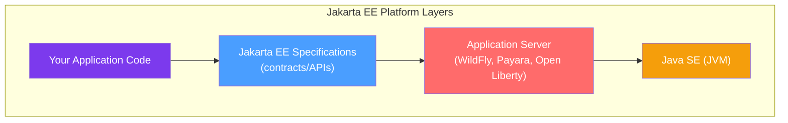
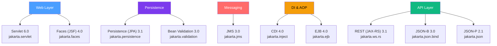

# ☕ Jakarta EE Overview

> [!abstract] TL;DR
> Jakarta EE is the enterprise Java platform governed by the Eclipse Foundation since 2017, evolving from Sun's J2EE (1999) through Oracle's Java EE to its current form. The defining breaking change was the namespace migration from `javax.*` to `jakarta.*` in Jakarta EE 9 (2020), with Jakarta EE 10 (2022) as the current major release. It competes with (and complements) Spring Boot, each with distinct trade-offs.

## Intuition — analogy FIRST
Think of Jakarta EE as a **government-issued building code** for enterprise applications. Just like building codes define what load-bearing walls must do, what wiring standards exist, and how fire exits must be placed — Jakarta EE defines what a container (application server) must provide, so your application code can rely on those services without worrying about implementation. Spring Boot is like a contractor who says "forget the standard code, I'll build you a house from scratch using my own proven materials" — faster to set up, more opinionated, but you're relying on one company's stack.

---

## How It Works



The key insight: you write to the **specification** (interfaces, annotations), and the **application server** provides the runtime implementation. This means theoretically you can switch from WildFly to Payara without changing your application code.

---

## Key Concepts / Details

### The History: J2EE → Java EE → Jakarta EE

| Era | Name | Year | Governing Body | Key Change |
|-----|------|------|---------------|------------|
| Phase 1 | J2EE 1.2 | 1999 | Sun Microsystems | Initial release; EJB 1.1, Servlet 2.2, JSP 1.1 |
| Phase 2 | J2EE 1.3–1.4 | 2001–2003 | Sun | Added web services, EJB 2.x (infamously complex) |
| Phase 3 | Java EE 5 | 2006 | Sun | Annotations revolution; EJB 3.0, JPA 1.0 introduced |
| Phase 4 | Java EE 6–8 | 2009–2017 | Oracle | CDI introduced (EE6); Profiles (web, full); REST (EE6) |
| Phase 5 | Jakarta EE 8 | 2019 | Eclipse Foundation | Same as Java EE 8; just transferred ownership |
| Phase 6 | **Jakarta EE 9** | 2020 | Eclipse Foundation | **`javax.*` → `jakarta.*`** namespace migration |
| Phase 7 | **Jakarta EE 10** | 2022 | Eclipse Foundation | CDI 4.0, UUID as entity ID, new Core Profile |

> [!warning] The Namespace Break
> The `javax.*` → `jakarta.*` change in Jakarta EE 9 is a hard breaking change. Any library that imports `javax.servlet.*` is not compatible with Jakarta EE 9+. This caused significant ecosystem churn and is why you'll still see both namespaces in legacy codebases.

### Jakarta EE 10 Key Specifications



### Jakarta EE Profiles
Jakarta EE 10 introduced three profiles for different deployment targets:

| Profile | Included Specs | Use Case |
|---------|---------------|---------|
| **Core Profile** | CDI Lite, JSON-B, JSON-P, Jakarta REST | Microservices; no EJB, no JMS |
| **Web Profile** | Core + Servlet, JPA, JSF, Bean Validation, EJB Lite | Web applications |
| **Full Platform** | Web Profile + EJB Full, JMS, JCA, JavaMail | Full enterprise apps |

### Major Application Servers

```java
// pom.xml — Jakarta EE 10 Full Platform dependency
<dependency>
    <groupId>jakarta.platform</groupId>
    <artifactId>jakarta.jakartaee-api</artifactId>
    <version>10.0.0</version>
    <scope>provided</scope>  <!-- provided by the app server at runtime -->
</dependency>
```

| Server | Vendor | License | Jakarta EE 10 | Notable |
|--------|--------|---------|--------------|---------|
| **WildFly** | Red Hat | Open Source | Full Platform | Production-proven; basis for JBoss EAP |
| **GlassFish** | Eclipse | Open Source | Full Platform | Reference implementation |
| **Payara** | Payara Services | Open Source + Commercial | Full Platform | GlassFish fork with better cloud support |
| **Open Liberty** | IBM | Open Source | Full Platform | MicroProfile leader; excellent observability |
| **TomEE** | Apache | Open Source | Web Profile | Tomcat + EE specs; lightweight |

### Deploying a Jakarta EE Application

```java
// A simple Jakarta EE application entry point
@ApplicationPath("/api")
public class RestApplication extends Application {
    // Jakarta REST scans for @Path classes automatically
    // No need to register resources manually with CDI discovery
}
```

```java
// WildFly standalone.xml - data source configuration (simplified)
<datasource jndi-name="java:/MyDS" pool-name="MyPool">
    <connection-url>jdbc:postgresql://localhost/mydb</connection-url>
    <driver>postgresql</driver>
    <security>
        <user-name>user</user-name>
        <password>pass</password>
    </security>
</datasource>
```

### Jakarta EE vs Spring Boot

This is the most common interview and architectural question. There is no universally correct answer.

| Dimension | Jakarta EE | Spring Boot |
|-----------|-----------|-------------|
| **Deployment** | WAR/EAR to app server | Embedded server (fat JAR) |
| **DI Container** | CDI (standard) | Spring IoC (proprietary, but dominant) |
| **Configuration** | Convention + XML + annotations | Auto-configuration + `application.properties` |
| **Startup time** | Slower (full server bootstrap) | Faster (lightweight) |
| **Memory footprint** | Heavier | Lighter |
| **Standardization** | JCP spec → portable across servers | Spring-specific APIs |
| **Ecosystem** | Smaller, spec-driven | Massive (Spring Data, Spring Security, etc.) |
| **Learning curve** | Moderate (once you know CDI) | Moderate (annotation magic can be confusing) |
| **Cloud-native** | Getting better (MicroProfile) | Excellent (Spring Cloud) |
| **EJB** | Full support | Not supported (use Spring `@Transactional`) |

**Use Jakarta EE when:**
- Your organization mandates a certified Jakarta EE container
- You need full JMS support with container-managed MDBs
- You're building on top of an existing Jakarta EE infrastructure
- You require full EJB spec compliance (e.g., clustered stateful session beans)
- Regulatory requirements mandate certified/standard implementations

**Use Spring Boot when:**
- You want faster iteration and simpler local development
- You need the broad Spring ecosystem (Spring Data, Spring Security, Spring Cloud)
- You're building microservices with embedded containers
- Your team already knows Spring

> [!tip] The pragmatic view
> In practice, ~80% of new Java enterprise development uses Spring Boot. However, Jakarta EE knowledge is invaluable because Spring implements many of the same concepts (JPA, Bean Validation, CDI-like scoping), and large financial, government, and telecom systems still run on Jakarta EE application servers.

---

## Real-World Notes
- Major banks (JPMorgan, Deutsche Bank) and government systems run Java EE 7 or Jakarta EE apps on WebSphere or WildFly. These won't migrate to Spring anytime soon.
- Oracle's WebLogic Server supports Jakarta EE but is proprietary and expensive.
- Quarkus (Red Hat) and Helidon (Oracle) are cloud-native frameworks that implement Jakarta EE/MicroProfile specs but with fast startup via AOT compilation (GraalVM native image). They represent the future of Jakarta EE in cloud environments.

---

## Common Pitfalls
- Confusing `javax.*` and `jakarta.*` imports — mixing them causes `ClassNotFoundException` at runtime
- Deploying to an application server that doesn't support the Jakarta EE version you compiled against
- Expecting the `provided` scope dependency to be on the classpath at runtime (it won't be — the server provides it)
- Forgetting to add `beans.xml` (even empty) to enable CDI discovery in older servers

---

## Related Concepts
- [[EJB_Fundamentals]] — enterprise components that run inside the Jakarta EE container
- [[JPA_Deep_Dive]] — the persistence spec that replaced JDBC boilerplate
- [[CDI_Contexts]] — the injection and context management backbone of the platform
- [[Jakarta_REST]] — how to build REST APIs on Jakarta EE

---

## Review Questions
1. What triggered the `javax.*` → `jakarta.*` namespace change, and in which version did it happen?
2. Name three Jakarta EE application servers and one differentiating feature of each.
3. A client has a legacy JBoss EAP 7.2 deployment and wants to migrate to Jakarta EE 10 on WildFly 27. What is the first thing you need to change in their code?
4. When would you recommend Jakarta EE over Spring Boot for a new greenfield project?
5. What is the Jakarta EE "Core Profile" and what problem does it solve?

## Sources
- Jakarta EE official spec: https://jakarta.ee/specifications/
- Eclipse Foundation Jakarta EE release notes
- Jakarta EE 10 Platform specification document

#java #jakarta-ee #beginner
