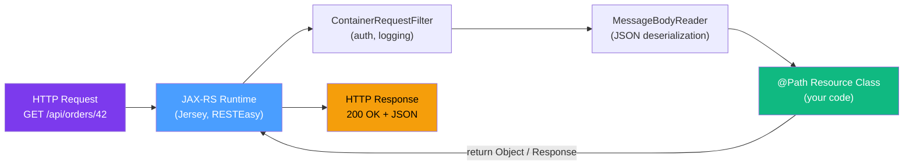

# 🌐 Jakarta REST (JAX-RS)

> [!abstract] TL;DR
> Jakarta REST (JAX-RS 3.1 in Jakarta EE 10) is the standard Java API for building RESTful web services using annotations. You annotate plain Java classes with `@Path`, HTTP method annotations (`@GET`, `@POST`, etc.), and parameter annotations (`@PathParam`, `@QueryParam`). The runtime handles HTTP parsing, serialization, and exception mapping. JAX-RS also includes a fluent client API for consuming REST services.

## Intuition — analogy FIRST
JAX-RS is like **giving your Java method a postal address**. You tell the runtime: "this method lives at address `/orders/{id}`, it accepts GET requests, it speaks JSON." The JAX-RS runtime is the postal service — it receives HTTP letters, figures out which method lives at the addressed route, hands the letter to that method, and mails back the response. You write business logic; the runtime handles all the HTTP postal routing.

---

## How It Works



---

## Key Concepts / Details

### Application Bootstrap

```java
import jakarta.ws.rs.ApplicationPath;
import jakarta.ws.rs.core.Application;

// Registers JAX-RS application at /api base path
// CDI auto-discovers all @Path classes — no manual registration needed
@ApplicationPath("/api")
public class RestApplication extends Application {
    // Leave empty for CDI-based auto-discovery
    // Or override getClasses()/getSingletons() for manual registration
}
```

### Core Resource Annotations

```java
import jakarta.ws.rs.*;
import jakarta.ws.rs.core.*;
import jakarta.inject.Inject;
import jakarta.enterprise.context.RequestScoped;

@Path("/orders")           // base URI for this resource class
@Produces(MediaType.APPLICATION_JSON)   // default output type
@Consumes(MediaType.APPLICATION_JSON)   // default input type
@RequestScoped             // CDI scope
public class OrderResource {

    @Inject
    private OrderService orderService;

    // GET /api/orders
    @GET
    public List<OrderDto> getAllOrders(
            @QueryParam("status") String status,
            @QueryParam("page") @DefaultValue("0") int page,
            @QueryParam("size") @DefaultValue("20") int size) {
        return orderService.findAll(status, page, size);
    }

    // GET /api/orders/42
    @GET
    @Path("/{id}")
    public Response getOrder(@PathParam("id") Long id) {
        return orderService.findById(id)
            .map(order -> Response.ok(order).build())
            .orElse(Response.status(Response.Status.NOT_FOUND).build());
    }

    // POST /api/orders
    @POST
    public Response createOrder(CreateOrderRequest request,
                                 @Context UriInfo uriInfo) {
        OrderDto created = orderService.create(request);

        // Build Location header pointing to the new resource
        URI location = uriInfo.getAbsolutePathBuilder()
            .path(String.valueOf(created.getId()))
            .build();

        return Response.created(location).entity(created).build();
    }

    // PUT /api/orders/42
    @PUT
    @Path("/{id}")
    public Response updateOrder(@PathParam("id") Long id,
                                 UpdateOrderRequest request) {
        return orderService.update(id, request)
            .map(updated -> Response.ok(updated).build())
            .orElse(Response.status(Response.Status.NOT_FOUND).build());
    }

    // PATCH /api/orders/42
    @PATCH
    @Path("/{id}")
    @Consumes("application/merge-patch+json")
    public Response patchOrder(@PathParam("id") Long id,
                                JsonMergePatch patch) {
        OrderDto patched = orderService.patch(id, patch);
        return Response.ok(patched).build();
    }

    // DELETE /api/orders/42
    @DELETE
    @Path("/{id}")
    public Response deleteOrder(@PathParam("id") Long id) {
        orderService.delete(id);
        return Response.noContent().build();  // 204
    }
}
```

### Parameter Annotations

```java
@Path("/search")
@RequestScoped
public class SearchResource {

    // @PathParam — from URI template segment: /search/users/42
    @GET
    @Path("/{type}/{id}")
    public Response findById(@PathParam("type") String type,
                              @PathParam("id") Long id) { /* ... */ }

    // @QueryParam — from ?q=java&lang=en
    @GET
    public Response search(@QueryParam("q") String query,
                           @QueryParam("lang") @DefaultValue("en") String lang,
                           @QueryParam("maxResults") @DefaultValue("10") int max) { /* ... */ }

    // @HeaderParam — from request headers
    @GET
    @Path("/secure")
    public Response secureGet(@HeaderParam("X-API-Key") String apiKey) { /* ... */ }

    // @CookieParam — from cookies
    @GET
    @Path("/user")
    public Response getUser(@CookieParam("sessionId") String sessionId) { /* ... */ }

    // @FormParam — from application/x-www-form-urlencoded body
    @POST
    @Path("/login")
    @Consumes(MediaType.APPLICATION_FORM_URLENCODED)
    public Response login(@FormParam("username") String username,
                          @FormParam("password") String password) { /* ... */ }

    // @BeanParam — aggregates multiple params into one POJO
    @GET
    @Path("/products")
    public Response searchProducts(@BeanParam ProductSearchParams params) { /* ... */ }
}

// BeanParam POJO
public class ProductSearchParams {
    @QueryParam("category")
    private String category;

    @QueryParam("minPrice")
    @DefaultValue("0")
    private double minPrice;

    @QueryParam("maxPrice")
    @DefaultValue("999999")
    private double maxPrice;

    @QueryParam("sort")
    @DefaultValue("name")
    private String sortBy;

    // getters...
}
```

### `@Context` — Container-Injected Objects

```java
@Path("/info")
@RequestScoped
public class InfoResource {

    @Context
    private UriInfo uriInfo;  // URI details: path, query params

    @Context
    private HttpHeaders headers;  // request headers

    @Context
    private Request request;  // JAX-RS Request object (for conditional GETs)

    @Context
    private SecurityContext securityContext;  // authentication info

    @GET
    public Response getInfo() {
        String path = uriInfo.getAbsolutePath().toString();
        String userAgent = headers.getHeaderString("User-Agent");
        boolean isAdmin = securityContext.isUserInRole("admin");

        return Response.ok(Map.of(
            "path", path,
            "userAgent", userAgent,
            "isAdmin", isAdmin
        )).build();
    }
}
```

### Exception Mappers

Exception mappers convert exceptions into HTTP responses globally — no try/catch in resources:

```java
import jakarta.ws.rs.ext.ExceptionMapper;
import jakarta.ws.rs.ext.Provider;
import jakarta.ws.rs.core.Response;

// @Provider marks this for auto-discovery
@Provider
public class EntityNotFoundExceptionMapper
        implements ExceptionMapper<EntityNotFoundException> {

    @Override
    public Response toResponse(EntityNotFoundException exception) {
        ErrorResponse error = new ErrorResponse(
            404,
            "NOT_FOUND",
            exception.getMessage()
        );
        return Response.status(Response.Status.NOT_FOUND)
            .entity(error)
            .type(MediaType.APPLICATION_JSON)
            .build();
    }
}

@Provider
public class ValidationExceptionMapper
        implements ExceptionMapper<jakarta.validation.ConstraintViolationException> {

    @Override
    public Response toResponse(ConstraintViolationException ex) {
        List<Map<String, String>> errors = ex.getConstraintViolations().stream()
            .map(cv -> Map.of(
                "field", cv.getPropertyPath().toString(),
                "message", cv.getMessage()
            ))
            .toList();

        return Response.status(422)
            .entity(Map.of("errors", errors))
            .build();
    }
}

@Provider
public class GenericExceptionMapper implements ExceptionMapper<Exception> {

    @Override
    public Response toResponse(Exception exception) {
        return Response.status(Response.Status.INTERNAL_SERVER_ERROR)
            .entity(Map.of("error", "An unexpected error occurred"))
            .build();
    }
}
```

### Filters and Interceptors

#### Container Request Filter (runs before resource method)

```java
import jakarta.ws.rs.container.ContainerRequestFilter;
import jakarta.ws.rs.container.ContainerRequestContext;
import jakarta.annotation.Priority;
import jakarta.ws.rs.Priorities;

@Provider
@Priority(Priorities.AUTHENTICATION)  // authentication before authorization
public class AuthenticationFilter implements ContainerRequestFilter {

    @Inject
    private TokenService tokenService;

    @Override
    public void filter(ContainerRequestContext requestContext) throws IOException {
        String authHeader = requestContext.getHeaderString(HttpHeaders.AUTHORIZATION);

        if (authHeader == null || !authHeader.startsWith("Bearer ")) {
            requestContext.abortWith(
                Response.status(Response.Status.UNAUTHORIZED)
                    .entity(Map.of("error", "Missing or invalid token"))
                    .build()
            );
            return;
        }

        String token = authHeader.substring(7);
        if (!tokenService.isValid(token)) {
            requestContext.abortWith(
                Response.status(Response.Status.UNAUTHORIZED).build()
            );
        }
    }
}
```

#### Name Binding — apply filter to specific resources only

```java
// Define a name-binding annotation
@NameBinding
@Retention(RetentionPolicy.RUNTIME)
@Target({ElementType.TYPE, ElementType.METHOD})
public @interface Authenticated { }

// Apply to filter
@Authenticated
@Provider
public class AuthFilter implements ContainerRequestFilter { /* ... */ }

// Apply to specific resource or method
@Path("/protected")
@Authenticated  // this whole resource requires auth
public class ProtectedResource { /* ... */ }

@Path("/mixed")
public class MixedResource {
    @GET
    public Response publicEndpoint() { /* no auth */ }

    @POST
    @Authenticated  // only this method requires auth
    public Response authenticatedEndpoint() { /* ... */ }
}
```

#### Container Response Filter (runs after resource method)

```java
@Provider
public class CorsFilter implements ContainerResponseFilter {

    @Override
    public void filter(ContainerRequestContext req,
                       ContainerResponseContext resp) throws IOException {
        resp.getHeaders().add("Access-Control-Allow-Origin", "*");
        resp.getHeaders().add("Access-Control-Allow-Methods", "GET, POST, PUT, DELETE, OPTIONS");
        resp.getHeaders().add("Access-Control-Allow-Headers", "Content-Type, Authorization");
    }
}
```

### Content Negotiation

```java
@Path("/report")
@RequestScoped
public class ReportResource {

    @GET
    @Produces({MediaType.APPLICATION_JSON, MediaType.APPLICATION_XML, "text/csv"})
    public Response getReport(@HeaderParam("Accept") String acceptHeader) {
        // JAX-RS automatically selects the right MessageBodyWriter
        // based on the client's Accept header
        ReportData data = reportService.generate();
        return Response.ok(data).build();
    }
}
```

### JAX-RS Client API

JAX-RS includes a client-side API for consuming REST services:

```java
import jakarta.ws.rs.client.*;
import jakarta.ws.rs.core.*;

public class ExternalApiClient {

    private final Client client;
    private final String baseUrl;

    public ExternalApiClient(String baseUrl) {
        this.baseUrl = baseUrl;
        this.client = ClientBuilder.newBuilder()
            .connectTimeout(5, TimeUnit.SECONDS)
            .readTimeout(30, TimeUnit.SECONDS)
            .build();
    }

    // GET request
    public Order getOrder(Long id) {
        return client.target(baseUrl)
            .path("/orders/{id}")
            .resolveTemplate("id", id)
            .request(MediaType.APPLICATION_JSON)
            .header("Authorization", "Bearer " + getToken())
            .get(Order.class);
    }

    // POST request
    public Order createOrder(CreateOrderRequest request) {
        Response response = client.target(baseUrl)
            .path("/orders")
            .request(MediaType.APPLICATION_JSON)
            .post(Entity.entity(request, MediaType.APPLICATION_JSON));

        if (response.getStatus() == 201) {
            return response.readEntity(Order.class);
        } else {
            throw new RuntimeException("Failed to create order: " + response.getStatus());
        }
    }

    // Async client call
    public CompletionStage<Order> getOrderAsync(Long id) {
        return client.target(baseUrl)
            .path("/orders/{id}")
            .resolveTemplate("id", id)
            .request(MediaType.APPLICATION_JSON)
            .rx()  // reactive invocation builder
            .get(Order.class);
    }

    // Always close the client when done
    @PreDestroy
    public void close() {
        client.close();
    }
}
```

### JAX-RS vs Spring MVC

| Feature | JAX-RS (Jakarta REST) | Spring MVC |
|---------|----------------------|-----------|
| Standard | Jakarta EE (JSR-370) | Spring Framework (proprietary) |
| Base annotation | `@Path` | `@RequestMapping` / `@RestController` |
| HTTP methods | `@GET`, `@POST`, etc. (separate annotations) | `@GetMapping`, `@PostMapping`, etc. |
| Path params | `@PathParam("id")` | `@PathVariable("id")` |
| Query params | `@QueryParam("name")` | `@RequestParam("name")` |
| Request body | Method parameter (auto-deserialized) | `@RequestBody` annotation |
| Response | `Response` builder or direct return | `ResponseEntity` or direct return |
| Exception handling | `ExceptionMapper<E>` | `@ExceptionHandler` / `@ControllerAdvice` |
| Filters | `ContainerRequestFilter` | `HandlerInterceptor` |
| Client API | `ClientBuilder` | `RestTemplate` / `WebClient` |
| Async | `@Suspended AsyncResponse` / `rx()` | `CompletableFuture`, `WebFlux` |
| Runtime | Jersey, RESTEasy, CXF | Spring MVC (Tomcat/Netty) |

```java
// Same endpoint in Spring MVC for comparison:
@RestController
@RequestMapping("/api/orders")
public class OrderController {

    @GetMapping("/{id}")
    public ResponseEntity<OrderDto> getOrder(@PathVariable Long id) {
        return orderService.findById(id)
            .map(ResponseEntity::ok)
            .orElse(ResponseEntity.notFound().build());
    }

    @PostMapping
    public ResponseEntity<OrderDto> createOrder(
            @RequestBody @Valid CreateOrderRequest request,
            UriComponentsBuilder uriBuilder) {
        OrderDto created = orderService.create(request);
        URI location = uriBuilder.path("/api/orders/{id}")
            .buildAndExpand(created.getId()).toUri();
        return ResponseEntity.created(location).body(created);
    }
}
```

---

## Real-World Notes
- RESTEasy is WildFly/JBoss's JAX-RS implementation; Jersey is GlassFish/Payara's reference implementation. Both are standards-compliant but have provider-specific extensions.
- For JSON serialization in Jakarta EE, JSON-B (Jackson or Yasson) is the standard. You can configure JSON-B via `@JsonbProperty`, `@JsonbTransient`, `@JsonbDateFormat`.
- Quarkus uses RESTEasy Reactive (a rewritten RESTEasy for non-blocking I/O) — understanding JAX-RS annotations transfers directly.

---

## Common Pitfalls
- Returning `null` from a resource method — this causes a `500 Internal Server Error`; always return a `Response` object or throw an exception that maps to a 404
- Forgetting `@Provider` on exception mappers and filters — they won't be discovered without it
- Not closing the JAX-RS `Client` — each `Client` instance holds connection pool resources; create one per application lifecycle, not per request
- Mixing `@SessionScoped` JAX-RS resources — REST should be stateless; use `@RequestScoped` for resource classes

---

## Related Concepts
- [[CDI_Contexts]] — CDI `@Inject` in JAX-RS resources; scopes for resource beans
- [[JPA_Deep_Dive]] — accessing JPA entities from JAX-RS resources; DTO conversion
- [[Jakarta_EE_Overview]] — JAX-RS as a core Jakarta EE specification

---

## Review Questions
1. What does `@ApplicationPath("/api")` on a class that extends `Application` do?
2. Show how you would build a REST endpoint that accepts a POST request with a JSON body and returns a 201 Created response with a `Location` header.
3. What is the difference between `@QueryParam` and `@PathParam`? Give an example of when to use each.
4. How do exception mappers work in JAX-RS? Write an exception mapper for a custom `OrderNotFoundException`.
5. What is name binding in JAX-RS, and why would you use it instead of applying a filter globally?
6. Compare JAX-RS `@GET`/`@PathParam` with Spring MVC `@GetMapping`/`@PathVariable`. What are the conceptual similarities?

## Sources
- Jakarta REST 3.1 Specification: https://jakarta.ee/specifications/restful-ws/3.1/
- RESTEasy documentation: https://resteasy.dev/docs/
- "RESTful Java with JAX-RS 2.0" by Burke (O'Reilly)

#java #jakarta-ee #rest #jax-rs #intermediate
