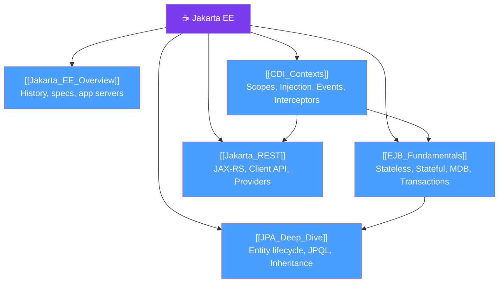

# 🗺️ Jakarta EE — Map of Content

> [!abstract] What This Section Covers
> Jakarta EE (formerly Java EE, formerly J2EE) is the enterprise edition of the Java platform. It defines a set of specifications for building multi-tier, scalable, secure, and transactional enterprise applications. This section covers the key specifications and programming models you'll encounter in real enterprise environments: EJBs for component management, JPA for persistence, CDI for dependency injection, and JAX-RS for RESTful services.

## Concept Map

## Learning Path
1. [[Jakarta_EE_Overview]] — start here to understand the platform, its history, and which application server you'll use
2. [[CDI_Contexts]] — CDI is the backbone of modern Jakarta EE; understand scopes and injection before anything else
3. [[JPA_Deep_Dive]] — persistence is central to any enterprise app; learn the entity lifecycle and advanced querying
4. [[EJB_Fundamentals]] — understand session beans and MDBs for transactional and async work
5. [[Jakarta_REST]] — build REST APIs using JAX-RS; tie together CDI, JPA, and REST

## All Notes at a Glance
| Note | Difficulty | What You'll Learn |
|------|------------|-------------------|
| [[Jakarta_EE_Overview]] | Beginner | Platform history, specs list, app server comparison, vs Spring Boot |
| [[EJB_Fundamentals]] | Intermediate | Session beans, MDBs, container transactions, timer service |
| [[JPA_Deep_Dive]] | Advanced | Entity lifecycle, inheritance strategies, locking, N+1, caching |
| [[CDI_Contexts]] | Intermediate | Scopes, qualifiers, producers, CDI events, interceptors |
| [[Jakarta_REST]] | Intermediate | JAX-RS annotations, client API, exception mappers, content negotiation |

## Key Questions This Section Answers
- What happened to Java EE and why did it become Jakarta EE?
- When should I use Jakarta EE application server vs Spring Boot?
- What is the difference between `@Stateless`, `@Stateful`, and `@MessageDriven` EJBs?
- How does JPA entity lifecycle work, and what are the N+1 and optimistic locking pitfalls?
- What CDI scope should I use for a given component, and how do CDI events work?
- How do I build a JAX-RS REST API and handle exceptions globally?

## Key Specifications at a Glance
| Specification | Jakarta EE 10 Version | Purpose |
|--------------|----------------------|---------|
| Servlet | 6.0 | HTTP request handling |
| Jakarta Persistence (JPA) | 3.1 | ORM and database access |
| CDI | 4.0 | Dependency injection and contexts |
| EJB | 4.0 | Enterprise components and transactions |
| Jakarta REST (JAX-RS) | 3.1 | RESTful web services |
| Bean Validation | 3.0 | Declarative constraint validation |
| JSON-B | 3.0 | JSON binding |
| JSON-P | 2.1 | JSON processing |
| JMS | 3.0 | Java Messaging Service |

## Related Sections
- [[_MOC_Java_Master|↑ Java Master MOC]]

#java #MOC #jakarta-ee
