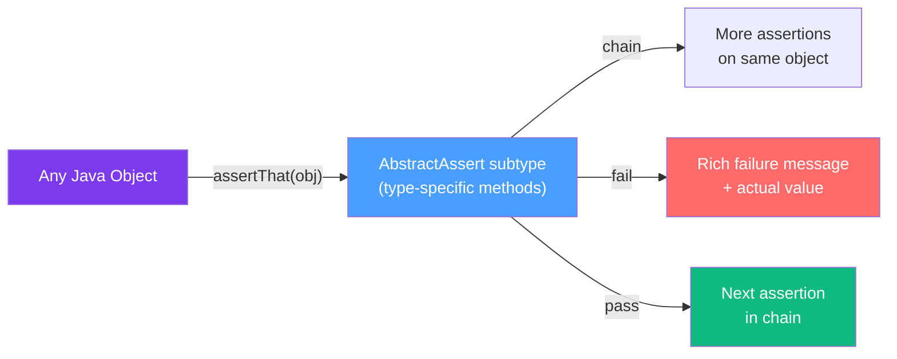

# ✅ AssertJ and Fluent Matchers

> [!abstract] TL;DR
> AssertJ is a fluent assertion library that dramatically improves test readability and failure messages compared to JUnit's built-in assertions. Its key features: method-chaining for multiple assertions, specialized assertion types for collections, strings, exceptions, and optionals, soft assertions that collect all failures, and `usingRecursiveComparison()` for deep object equality without requiring `equals()` implementation.

## Intuition — analogy FIRST
Think of JUnit assertions as a **terse telegram** — `assertTrue(list.size() == 3, "Expected size 3")` — vs AssertJ as a **plain-English sentence** — `assertThat(list).hasSize(3).containsExactly("a", "b", "c").doesNotContainNull()`. When the AssertJ assertion fails, the error message tells you exactly what the actual list contained. The JUnit version just says "expected true but was false." When you're debugging at 2am, that difference is enormous.

---

## How It Works



AssertJ's `assertThat()` is overloaded for every Java type. When you call `assertThat(list)`, you get a `ListAssert`. Call `assertThat("string")` and you get `AbstractStringAssert`. Each gives you type-appropriate methods with full IDE autocomplete.

---

## Key Concepts / Details

### Why AssertJ Beats JUnit Assertions

```java
// JUnit assertions — terse, poor failure messages
assertEquals(3, list.size());          // "expected: <3> but was: <5>"
assertTrue(name.contains("Java"));     // "expected: true but was: false"

// AssertJ — descriptive, IDE-friendly, chainable
assertThat(list).hasSize(3);           // "Expected size:<3> but was:<5> in:\n[a, b, c, d, e]"
assertThat(name).contains("Java");     // "expected:\n\"Kotlin\"\nto contain:\n\"Java\""
```

### Setup

```xml
<!-- pom.xml -->
<dependency>
    <groupId>org.assertj</groupId>
    <artifactId>assertj-core</artifactId>
    <version>3.25.3</version>
    <scope>test</scope>
</dependency>
```

```java
// Single static import — provides all assertThat overloads
import static org.assertj.core.api.Assertions.*;
```

### Core Assertions

```java
@Test
void coreAssertions() {
    // Equality
    assertThat(actual).isEqualTo(expected);
    assertThat(actual).isNotEqualTo(unexpected);

    // Null checks
    assertThat(obj).isNull();
    assertThat(obj).isNotNull();

    // Same instance (reference equality)
    assertThat(a).isSameAs(b);

    // Type checking
    assertThat(obj).isInstanceOf(String.class);
    assertThat(obj).isInstanceOfAny(String.class, Integer.class);

    // Boolean
    assertThat(flag).isTrue();
    assertThat(flag).isFalse();

    // Numeric comparisons
    assertThat(value).isGreaterThan(0);
    assertThat(value).isLessThanOrEqualTo(100);
    assertThat(value).isBetween(1, 10);

    // Floating point with offset
    assertThat(3.14159).isCloseTo(Math.PI, within(0.0001));
    assertThat(3.14159).isCloseTo(Math.PI, offset(0.001));
}
```

### Collection Assertions

```java
@Test
void collectionAssertions() {
    List<String> fruits = List.of("apple", "banana", "cherry");

    // Size
    assertThat(fruits).hasSize(3);
    assertThat(fruits).hasSizeGreaterThan(2);

    // Contains
    assertThat(fruits).contains("apple", "banana");         // order doesn't matter
    assertThat(fruits).containsOnly("cherry", "apple", "banana");  // exact elements, any order
    assertThat(fruits).containsExactly("apple", "banana", "cherry");  // exact order
    assertThat(fruits).containsExactlyInAnyOrder("cherry", "apple", "banana");  // exact elements, any order
    assertThat(fruits).containsAnyOf("fig", "apple", "grape");  // at least one

    // Does not contain
    assertThat(fruits).doesNotContain("grape", "mango");

    // Null checks
    assertThat(fruits).doesNotContainNull();

    // Start / end
    assertThat(fruits).startsWith("apple");
    assertThat(fruits).endsWith("cherry");

    // Empty checks
    assertThat(List.of()).isEmpty();
    assertThat(fruits).isNotEmpty();
}
```

### `extracting()` — Assert on Specific Fields

The most powerful collection assertion — extract a property from each element, then assert:

```java
List<Employee> employees = List.of(
    new Employee("Alice", 30, "Engineering"),
    new Employee("Bob", 25, "Design"),
    new Employee("Carol", 35, "Engineering")
);

// Extract single field
assertThat(employees)
    .extracting(Employee::getName)
    .containsExactlyInAnyOrder("Alice", "Bob", "Carol");

// Extract multiple fields as tuples
assertThat(employees)
    .extracting("name", "department")
    .containsExactlyInAnyOrder(
        tuple("Alice", "Engineering"),
        tuple("Bob", "Design"),
        tuple("Carol", "Engineering")
    );

// filteredOn() — filter then assert
assertThat(employees)
    .filteredOn(emp -> "Engineering".equals(emp.getDepartment()))
    .hasSize(2)
    .extracting(Employee::getName)
    .containsExactlyInAnyOrder("Alice", "Carol");

// filteredOn with property shorthand
assertThat(employees)
    .filteredOn("department", "Engineering")
    .hasSize(2);
```

### Exception Assertions

```java
// assertThatThrownBy — most common
@Test
void exceptionAssertions() {
    // Basic exception type check
    assertThatThrownBy(() -> orderService.findById(-1L))
        .isInstanceOf(IllegalArgumentException.class);

    // With message
    assertThatThrownBy(() -> orderService.findById(-1L))
        .isInstanceOf(IllegalArgumentException.class)
        .hasMessage("Order ID must be positive");

    // Message contains
    assertThatThrownBy(() -> parser.parse("invalid json"))
        .isInstanceOf(JsonParseException.class)
        .hasMessageContaining("Unexpected character");

    // Cause chain
    assertThatThrownBy(() -> service.process())
        .isInstanceOf(ServiceException.class)
        .hasCauseInstanceOf(SQLException.class)
        .hasRootCauseMessage("Connection refused");
}

// assertThatExceptionOfType — fluent, more explicit
assertThatExceptionOfType(IllegalArgumentException.class)
    .isThrownBy(() -> validator.validate(null))
    .withMessage("Input must not be null")
    .withNoCause();

// Verify no exception is thrown
assertThatCode(() -> service.healthCheck()).doesNotThrowAnyException();
```

### String Assertions

```java
@Test
void stringAssertions() {
    String email = "user@example.com";

    assertThat(email)
        .isNotBlank()
        .startsWith("user")
        .endsWith(".com")
        .contains("@")
        .hasSize(16);

    // Case-insensitive
    assertThat("Hello World").containsIgnoringCase("hello");
    assertThat("HELLO").isEqualToIgnoringCase("hello");

    // Regex
    assertThat(email).matches("[a-zA-Z0-9._%+-]+@[a-zA-Z0-9.-]+\\.[a-zA-Z]{2,}");
    assertThat("abc123").containsPattern("[0-9]+");

    // Blank/empty
    assertThat("  ").isBlank();
    assertThat("").isEmpty();
    assertThat("content").isNotEmpty().isNotBlank();
}
```

### Optional Assertions

```java
@Test
void optionalAssertions() {
    Optional<String> present = Optional.of("value");
    Optional<String> empty = Optional.empty();

    assertThat(present).isPresent();
    assertThat(present).hasValue("value");
    assertThat(present).containsInstanceOf(String.class);

    assertThat(empty).isEmpty();
    assertThat(empty).isNotPresent();

    // Assert on the value inside the Optional
    assertThat(present)
        .isPresent()
        .hasValueSatisfying(val -> assertThat(val).startsWith("val"));
}
```

### Map Assertions

```java
@Test
void mapAssertions() {
    Map<String, Integer> scores = Map.of("Alice", 95, "Bob", 87, "Carol", 92);

    assertThat(scores)
        .hasSize(3)
        .containsKey("Alice")
        .containsKeys("Bob", "Carol")
        .containsEntry("Alice", 95)
        .doesNotContainKey("Dave");

    assertThat(scores)
        .containsExactlyInAnyOrderEntriesOf(Map.of("Alice", 95, "Bob", 87, "Carol", 92));

    // Values/keys separately
    assertThat(scores.values()).allMatch(score -> score >= 80);
    assertThat(scores.keySet()).containsExactlyInAnyOrder("Alice", "Bob", "Carol");
}
```

### `usingRecursiveComparison()` — Deep Object Equality

Compares object graphs field-by-field without needing `equals()`:

```java
@Test
void recursiveComparisonExample() {
    Order expected = Order.builder()
        .customerId(1L)
        .status("PENDING")
        .total(99.99)
        .items(List.of(new OrderItem("product-1", 2, 49.99)))
        .build();

    Order actual = orderService.createOrder(request);

    assertThat(actual)
        .usingRecursiveComparison()
        .ignoringFields("id", "createdAt", "updatedAt")  // ignore generated fields
        .isEqualTo(expected);
}

// Ignore fields by type
assertThat(actual)
    .usingRecursiveComparison()
    .ignoringFieldsOfTypes(LocalDateTime.class)
    .isEqualTo(expected);

// Ignore null fields in expected (expected is a template)
assertThat(actual)
    .usingRecursiveComparison()
    .ignoringExpectedNullFields()
    .isEqualTo(partialExpected);

// Custom comparator for specific fields
assertThat(actual)
    .usingRecursiveComparison()
    .withComparatorForFields(
        (a, b) -> Double.compare(Math.abs((double)a - (double)b), 0.01) <= 0 ? 0 : 1,
        "price"  // use tolerance comparison for price field
    )
    .isEqualTo(expected);
```

### Soft Assertions — Collect All Failures

Normal assertions stop at the first failure. Soft assertions run all assertions and report all failures at once:

```java
@Test
void softAssertionsExample() {
    Order order = orderService.findById(1L);

    // Approach 1: SoftAssertions.assertSoftly (recommended)
    SoftAssertions.assertSoftly(softly -> {
        softly.assertThat(order.getId()).isNotNull();
        softly.assertThat(order.getStatus()).isEqualTo("CONFIRMED");
        softly.assertThat(order.getTotal()).isGreaterThan(0);
        softly.assertThat(order.getCustomerId()).isEqualTo(42L);
        softly.assertThat(order.getItems()).hasSize(3);
        // All 5 assertions run — all failures reported together
    });

    // Approach 2: JUnit 5 assertAll (built-in alternative)
    assertAll(
        () -> assertThat(order.getStatus()).isEqualTo("CONFIRMED"),
        () -> assertThat(order.getTotal()).isGreaterThan(0)
    );
}
```

Soft assertions are invaluable for:
- Validating multiple fields of a response object
- API response validation where you want to see all mismatches at once
- Integration test assertions on complex objects

### Custom Assertions — `AbstractAssert`

Build domain-specific assertion methods for cleaner test code:

```java
public class OrderAssert extends AbstractAssert<OrderAssert, Order> {

    public OrderAssert(Order actual) {
        super(actual, OrderAssert.class);
    }

    public static OrderAssert assertThat(Order actual) {
        return new OrderAssert(actual);
    }

    public OrderAssert isPending() {
        isNotNull();
        if (!"PENDING".equals(actual.getStatus())) {
            failWithMessage("Expected order to be PENDING but was <%s>", actual.getStatus());
        }
        return this;  // return this for chaining
    }

    public OrderAssert hasTotal(double expected) {
        isNotNull();
        if (Math.abs(actual.getTotal() - expected) > 0.001) {
            failWithMessage("Expected order total to be <%s> but was <%s>",
                expected, actual.getTotal());
        }
        return this;
    }

    public OrderAssert hasItems(int count) {
        isNotNull();
        if (actual.getItems().size() != count) {
            failWithMessage("Expected order to have <%d> items but had <%d>",
                count, actual.getItems().size());
        }
        return this;
    }
}

// Usage — reads like a business requirement
@Test
void orderCreationTest() {
    Order order = orderService.create(request);

    OrderAssert.assertThat(order)
        .isPending()
        .hasTotal(99.99)
        .hasItems(2);
}
```

---

## Real-World Notes
- In Spring Boot projects, `assertThat` from both AssertJ and Hamcrest is on the classpath. Use `import static org.assertj.core.api.Assertions.assertThat` to ensure you're using AssertJ.
- `usingRecursiveComparison()` eliminates the need to implement `equals()`/`hashCode()` on domain objects just for test assertions — a very common use case.
- Custom `AbstractAssert` subclasses are worth the investment in large codebases — domain-specific assertions dramatically reduce duplication across test classes.

---

## Common Pitfalls
- Mixing Hamcrest (`assertThat` from `org.hamcrest.MatcherAssert`) with AssertJ (`assertThat` from AssertJ) — name collision causes confusing compilation errors
- Not using `tuple()` when extracting multiple fields — `assertThat(list).extracting("name", "age")` returns `List<Tuple>`, not `List<Object>`
- `usingRecursiveComparison()` following lazy-loaded JPA collections — triggers `LazyInitializationException` when the persistence context is closed
- Forgetting `.assertAll()` or the lambda block with `SoftAssertions` — without calling `assertAll()`, failures are silently swallowed

---

## Related Concepts
- [[JUnit5_Advanced]] — AssertJ is used inside JUnit 5 test methods
- [[Mockito_Advanced]] — combine with `ArgumentCaptor` for rich captured-argument assertions

---

## Review Questions
1. What is the key advantage of AssertJ's failure messages compared to JUnit's `assertEquals`?
2. How would you use `extracting()` and `filteredOn()` to assert that all "Engineering" employees are named "Alice" or "Carol"?
3. What is the difference between `containsExactly()` and `containsExactlyInAnyOrder()`?
4. When would you use soft assertions? What problem do they solve?
5. How does `usingRecursiveComparison()` work, and when would you use `ignoringFields()`?
6. Write a custom `PersonAssert` class that provides an `isAdult()` method (checks age >= 18) and an `hasEmailDomain(String domain)` method.

## Sources
- AssertJ documentation: https://assertj.github.io/doc/
- AssertJ GitHub: https://github.com/assertj/assertj
- "Effective Software Testing" by Mauricio Aniche (Manning)

#java #testing #assertj #beginner
