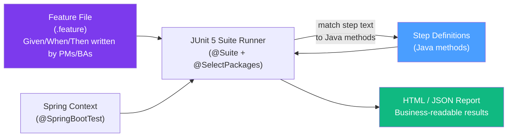
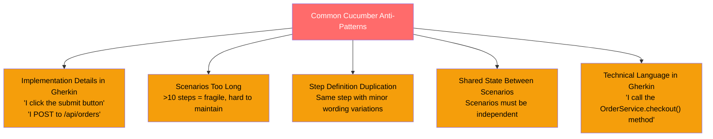

# 🥒 Cucumber BDD

> [!abstract] TL;DR
> Cucumber-JVM is a Behavior-Driven Development (BDD) framework that lets business stakeholders write feature specifications in Gherkin (plain English `Given/When/Then` syntax), which developers then implement as executable step definitions. The unique value: the same file that describes behavior to a product manager becomes an automated test. Cucumber integrates with Spring Boot via `@CucumberContextConfiguration` and with JUnit 5 via `@Suite`.

## Intuition — analogy FIRST
Cucumber is a **translation layer** between business language and test code. Imagine a product manager writing: "Given a logged-in user with a premium account, When they add an item to their cart and check out, Then they should receive free shipping." With Cucumber, this sentence IS the test. Developers write "step definition" functions that connect each sentence fragment to actual code. The PM sees passing/failing scenarios in plain English. The developer writes real test code. Neither has to learn the other's language.

---

## How It Works



---

## Key Concepts / Details

### Setup

```xml
<!-- pom.xml -->
<dependency>
    <groupId>io.cucumber</groupId>
    <artifactId>cucumber-java</artifactId>
    <version>7.18.0</version>
    <scope>test</scope>
</dependency>
<dependency>
    <groupId>io.cucumber</groupId>
    <artifactId>cucumber-spring</artifactId>
    <version>7.18.0</version>
    <scope>test</scope>
</dependency>
<dependency>
    <groupId>io.cucumber</groupId>
    <artifactId>cucumber-junit-platform-engine</artifactId>
    <version>7.18.0</version>
    <scope>test</scope>
</dependency>
<dependency>
    <groupId>org.junit.platform</groupId>
    <artifactId>junit-platform-suite</artifactId>
    <scope>test</scope>
</dependency>
```

### Gherkin Syntax — The Specification Language

Gherkin is a structured natural language with specific keywords:

```gherkin
# src/test/resources/features/order_management.feature

Feature: Order Management
  As a customer
  I want to place and track orders
  So that I can purchase products online

  Background:
    Given the following products exist in the catalog
      | name       | price | stock |
      | Laptop     | 999   | 10    |
      | Headphones | 79    | 50    |

  Scenario: Successfully place a simple order
    Given I am logged in as customer "alice@example.com"
    And I have an empty shopping cart
    When I add "Laptop" to my cart
    And I proceed to checkout
    Then an order is created with status "PENDING"
    And the order total is $999.00
    And I receive a confirmation email

  Scenario: Cannot place order with out-of-stock item
    Given I am logged in as customer "bob@example.com"
    And "Laptop" has 0 items in stock
    When I try to add "Laptop" to my cart
    Then I see error message "Item is out of stock"
    And no order is created

  Scenario Outline: Apply discount based on cart total
    Given I am logged in as customer "user@example.com"
    And my cart total is $<cartTotal>
    When I apply a discount code "<discountCode>"
    Then the final total is $<finalTotal>

    Examples:
      | cartTotal | discountCode | finalTotal |
      | 100       | SAVE10       | 90         |
      | 50        | SAVE10       | 45         |
      | 200       | VIP20        | 160        |
      | 30        | SAVE10       | 30         |
```

### Gherkin Keywords Reference

| Keyword | Purpose |
|---------|---------|
| `Feature` | Groups related scenarios; describes the feature |
| `Background` | Steps that run before every scenario in the feature file |
| `Scenario` | A single test case with a unique example |
| `Scenario Outline` | Parameterized scenario; paired with `Examples` table |
| `Given` | Establishes initial context/preconditions |
| `When` | Describes the action being tested |
| `Then` | Asserts the expected outcome |
| `And` | Continues the previous `Given`, `When`, or `Then` |
| `But` | Like `And`, used for negative context |
| `#` | Line comment |
| `@tag` | Tag scenarios for filtering |

### Step Definitions

Step definitions are Java methods annotated with patterns matching the Gherkin steps:

```java
import io.cucumber.java.en.*;
import io.cucumber.java.Before;
import io.cucumber.java.After;
import org.springframework.beans.factory.annotation.Autowired;
import static org.assertj.core.api.Assertions.*;

public class OrderStepDefinitions {

    @Autowired
    private OrderService orderService;

    @Autowired
    private CustomerService customerService;

    @Autowired
    private TestEmailCapture emailCapture;  // test-specific bean

    // Shared state between steps (one instance per scenario)
    private Customer currentCustomer;
    private Cart cart;
    private Order createdOrder;
    private String lastErrorMessage;

    // Matches: "I am logged in as customer "alice@example.com""
    @Given("I am logged in as customer {string}")
    public void iAmLoggedInAsCustomer(String email) {
        currentCustomer = customerService.findByEmail(email)
            .orElseThrow(() -> new IllegalStateException("Customer not found: " + email));
        cart = new Cart(currentCustomer);
    }

    // Matches: "I have an empty shopping cart"
    @Given("I have an empty shopping cart")
    public void iHaveAnEmptyShoppingCart() {
        cart = new Cart(currentCustomer);
        assertThat(cart.getItems()).isEmpty();
    }

    // Matches: "I add "Laptop" to my cart"
    @When("I add {string} to my cart")
    public void iAddToMyCart(String productName) {
        Product product = productService.findByName(productName)
            .orElseThrow(() -> new IllegalStateException("Product not found: " + productName));
        cart.addItem(new CartItem(product, 1));
    }

    // Matches: "I proceed to checkout"
    @When("I proceed to checkout")
    public void iProceedToCheckout() {
        try {
            createdOrder = orderService.checkout(cart);
        } catch (Exception e) {
            lastErrorMessage = e.getMessage();
        }
    }

    // Matches: "an order is created with status "PENDING""
    @Then("an order is created with status {string}")
    public void anOrderIsCreatedWithStatus(String expectedStatus) {
        assertThat(createdOrder).isNotNull();
        assertThat(createdOrder.getStatus()).isEqualTo(expectedStatus);
    }

    // Matches: "the order total is $999.00"
    @Then("the order total is ${double}")
    public void theOrderTotalIs(double expectedTotal) {
        assertThat(createdOrder.getTotal()).isCloseTo(expectedTotal, within(0.01));
    }

    // Matches: "I receive a confirmation email"
    @Then("I receive a confirmation email")
    public void iReceiveAConfirmationEmail() {
        assertThat(emailCapture.getEmailsFor(currentCustomer.getEmail()))
            .anyMatch(email -> email.getSubject().contains("Order Confirmation"));
    }
}
```

### `DataTable` — Tabular Input Handling

```java
import io.cucumber.datatable.DataTable;
import java.util.List;
import java.util.Map;

public class CatalogStepDefinitions {

    @Autowired
    private ProductRepository productRepository;

    // Matches the Background DataTable step:
    // "the following products exist in the catalog"
    // | name       | price | stock |
    // | Laptop     | 999   | 10    |
    @Given("the following products exist in the catalog")
    public void theFollowingProductsExist(DataTable dataTable) {
        // Each row becomes a Map<String, String> using header row as keys
        List<Map<String, String>> rows = dataTable.asMaps();
        rows.forEach(row -> {
            Product product = Product.builder()
                .name(row.get("name"))
                .price(Double.parseDouble(row.get("price")))
                .stock(Integer.parseInt(row.get("stock")))
                .build();
            productRepository.save(product);
        });
    }

    // Convert directly to a list of POJOs
    @Given("these customers are registered")
    public void theseCustomersAreRegistered(List<Customer> customers) {
        // Cucumber automatically maps columns to Customer fields
        customerRepository.saveAll(customers);
    }

    // Two-column "key-value" table (no header)
    @Given("the system configuration is")
    public void theSystemConfigIs(Map<String, String> config) {
        config.forEach(configService::set);
    }
}
```

### Spring Boot Integration

```java
// CucumberContextConfiguration — connects Cucumber with Spring
import io.cucumber.spring.CucumberContextConfiguration;
import org.springframework.boot.test.context.SpringBootTest;
import org.springframework.test.context.ActiveProfiles;

@CucumberContextConfiguration
@SpringBootTest(webEnvironment = SpringBootTest.WebEnvironment.RANDOM_PORT)
@ActiveProfiles("test")
public class CucumberSpringConfiguration {
    // This class just needs to exist with these annotations
    // It's the bridge between Cucumber and Spring context
}
```

```java
// JUnit 5 Suite Runner
import org.junit.platform.suite.api.*;

@Suite
@IncludeEngines("cucumber")
@SelectClasspathResource("features")  // scan features/ folder on classpath
@ConfigurationParameter(
    key = "cucumber.plugin",
    value = "pretty, html:target/cucumber-reports/report.html, json:target/cucumber.json"
)
@ConfigurationParameter(
    key = "cucumber.filter.tags",
    value = "not @Ignore"  // skip scenarios tagged @Ignore
)
public class CucumberTestSuite {
    // JUnit Suite entry point — nothing else needed here
}
```

### Hooks — `@Before` and `@After`

```java
import io.cucumber.java.Before;
import io.cucumber.java.After;
import io.cucumber.java.BeforeAll;
import io.cucumber.java.AfterAll;

public class DatabaseHooks {

    @Autowired
    private DatabaseCleaner databaseCleaner;

    @BeforeAll
    public static void startContainers() {
        // Start Testcontainers (e.g., PostgreSQL) once before all scenarios
        TestPostgresContainer.start();
    }

    @Before  // runs before each scenario
    public void cleanDatabase() {
        databaseCleaner.truncateAllTables();
    }

    @After  // runs after each scenario — useful for screenshots on failure
    public void afterScenario(Scenario scenario) {
        if (scenario.isFailed()) {
            // log scenario name for debugging
            System.err.println("FAILED: " + scenario.getName());
        }
    }

    @AfterAll
    public static void stopContainers() {
        TestPostgresContainer.stop();
    }
}

// Tagged hooks — only run for scenarios with specific tags
@Before("@browser")
public void launchBrowser() { /* start Selenium WebDriver */ }

@After("@browser")
public void closeBrowser() { /* quit WebDriver */ }
```

### Tags — Filter Which Scenarios Run

```gherkin
@smoke @regression
Scenario: Critical payment flow
  Given ...

@Ignore
Scenario: Work in progress
  Given ...

@slow @database
Scenario: Bulk import test
  Given ...
```

```java
// In CucumberTestSuite:
@ConfigurationParameter(key = "cucumber.filter.tags", value = "@smoke")  // only smoke tests
// OR:
@ConfigurationParameter(key = "cucumber.filter.tags", value = "@regression and not @slow")
// OR from command line:
// -Dcucumber.filter.tags="@smoke"
```

### HTML Reports

Cucumber generates multiple report formats. The HTML report includes:
- Each feature file organized by scenario
- Pass/fail status with timing
- Embedded screenshots (for browser tests)
- Full step output and error messages

```java
@ConfigurationParameter(
    key = "cucumber.plugin",
    value = "pretty, " +                                            // console output
            "html:target/cucumber-reports/index.html, " +          // HTML report
            "json:target/cucumber-reports/cucumber.json, " +        // for CI/CD tools
            "junit:target/cucumber-reports/cucumber.xml"            // JUnit XML format
)
```

### Scenario Outline — Parameterized Scenarios

```gherkin
Scenario Outline: Password strength validation
  Given a user attempts to set password "<password>"
  When the password is evaluated
  Then the strength is "<strength>"
  And the message is "<message>"

  Examples: Weak passwords
    | password | strength | message                    |
    | abc      | WEAK     | Too short (minimum 8 chars)|
    | 12345678 | WEAK     | No letters                 |

  Examples: Strong passwords
    | password        | strength | message |
    | Tr0ub4dor&3     | STRONG   | Valid   |
    | correct-horse!1 | STRONG   | Valid   |
```

---

## Cucumber BDD Anti-Patterns



**Good vs Bad Gherkin:**

```gherkin
# BAD — implementation details leaking in
Scenario: User places order
  Given I navigate to /products
  And I click "Add to Cart" button
  And I fill in "quantity" input with "2"
  And I click the "Submit" button
  Then I see "Order placed" in the h1 tag

# GOOD — describes business behavior, not UI
Scenario: User places order
  Given I am logged in as a customer
  And "Laptop" is available in the catalog
  When I add 2 "Laptop" items to my cart and checkout
  Then my order is confirmed and I receive a confirmation email
```

### When to Use Cucumber vs Plain JUnit/Mockito

| Situation | Use Cucumber | Use JUnit + Mockito |
|-----------|-------------|---------------------|
| Business stakeholders write/review tests | Yes | No |
| Acceptance criteria need to be executable | Yes | No |
| Unit testing individual classes | No | Yes |
| Integration testing without business narrative | No | Yes |
| Test coverage at service/API level | Sometimes | Yes |
| Regulatory compliance requiring human-readable tests | Yes | No |

---

## Real-World Notes
- Cucumber works best for **acceptance tests** (outer ring of the testing pyramid), not unit tests. Misusing it for unit-level tests creates massive overhead with zero clarity benefit.
- Teams that succeed with Cucumber involve product managers and BAs in writing Gherkin. Teams that struggle write Gherkin in isolation from business.
- Cucumber + Testcontainers is a powerful combination for full-stack integration tests that run against a real database.

---

## Common Pitfalls
- Undefined steps causing `PendingException` — Cucumber marks the scenario as pending, not failed. Configure your suite to treat pending as failed in CI.
- Sharing mutable state between scenarios via static fields — Cucumber creates a new step definition class instance per scenario, but `@SpringBootTest` context is shared. Use `@Before` hooks to reset state.
- Feature files that drift from step definitions — refactoring step text without updating feature files causes steps to become "undefined"
- Overusing `Background` steps — background runs for EVERY scenario in the file. If only 2 of 10 scenarios need it, move the setup into those specific scenarios.

---

## Related Concepts
- [[JUnit5_Advanced]] — Cucumber runs via JUnit 5 Suite engine; `@Suite` and `@SelectClasspathResource`
- [[Spock_Framework]] — alternative BDD-style testing with `given/when/then` blocks, but for developer-written specs
- [[Mockito_Advanced]] — usable inside step definitions for isolating external dependencies in integration tests

---

## Review Questions
1. What is the role of `@CucumberContextConfiguration` in a Spring Boot Cucumber project?
2. Explain the difference between `Scenario Outline` and multiple separate `Scenario` blocks. When would you use each?
3. What is the `Background` keyword for, and what is its anti-pattern?
4. How does `DataTable` work in step definitions? When would you use `asMaps()` vs `asList()`?
5. What are three BDD anti-patterns to avoid when writing Gherkin, and why?
6. How do you filter which Cucumber scenarios run based on tags in a JUnit 5 Suite?

## Sources
- Cucumber-JVM documentation: https://cucumber.io/docs/cucumber/
- Cucumber GitHub: https://github.com/cucumber/cucumber-jvm
- "BDD in Action" by John Ferguson Smart (Manning)
- "The Cucumber Book" by Wynne & Hellesoy (Pragmatic Programmers)

#java #testing #cucumber #bdd #gherkin #intermediate
