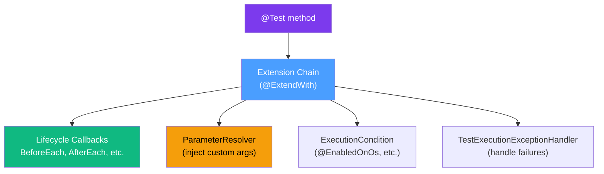

# 🧪 JUnit 5 Advanced

> [!abstract] TL;DR
> JUnit 5 (Jupiter) is far more than `@Test` and `@BeforeEach`. Its extension model replaces JUnit 4's `@Rule` and `@ClassRule` with a composable, powerful mechanism. Advanced features include parameterized tests with multiple source types, dynamic test generation with `@TestFactory`, nested test organization, conditional execution, parallel test execution, and a `@TempDir` for filesystem tests. Mastering these makes test code as readable and maintainable as production code.

## Intuition — analogy FIRST
JUnit 5's extension model is like a **pipeline of middleware**. Just as a web server passes a request through authentication middleware, logging middleware, and rate-limiting middleware before reaching the handler — JUnit 5 passes each test through a chain of extensions. An extension can set up resources before the test, inject parameters into the test method, monitor exceptions, and clean up afterward. You compose extensions like Lego bricks — a `@ExtendWith(MockitoExtension.class)` for mocks plus `@ExtendWith(SpringExtension.class)` for Spring context.

---

## How It Works



---

## Key Concepts / Details

### The Extension Model

JUnit 5 extensions implement one or more extension interfaces. A single class can implement multiple:

```java
import org.junit.jupiter.api.extension.*;

// A complete example: extension that provides a database connection
public class DatabaseExtension
        implements BeforeEachCallback, AfterEachCallback, ParameterResolver {

    private static final ExtensionContext.Namespace NS =
        ExtensionContext.Namespace.create(DatabaseExtension.class);

    @Override
    public void beforeEach(ExtensionContext context) {
        // Create a new connection before each test
        Connection conn = createTestConnection();
        context.getStore(NS).put("connection", conn);  // store in context
    }

    @Override
    public void afterEach(ExtensionContext context) {
        Connection conn = context.getStore(NS).get("connection", Connection.class);
        if (conn != null) {
            closeConnection(conn);
        }
    }

    @Override
    public boolean supportsParameter(ParameterContext paramCtx,
                                     ExtensionContext extCtx) {
        return paramCtx.getParameter().getType() == Connection.class;
    }

    @Override
    public Object resolveParameter(ParameterContext paramCtx,
                                   ExtensionContext extCtx) {
        return extCtx.getStore(NS).get("connection", Connection.class);
    }
}

// Usage
@ExtendWith(DatabaseExtension.class)
class OrderRepositoryTest {

    @Test
    void shouldSaveOrder(Connection conn) {  // injected by extension!
        // use conn for test
    }
}
```

### Available Extension Interfaces

| Interface | Callback Point |
|-----------|---------------|
| `BeforeAllCallback` | Before any test in the class |
| `AfterAllCallback` | After all tests in the class |
| `BeforeEachCallback` | Before each test method |
| `AfterEachCallback` | After each test method |
| `BeforeTestExecutionCallback` | Immediately before test execution |
| `AfterTestExecutionCallback` | Immediately after test execution |
| `ParameterResolver` | Inject parameters into `@Test` methods |
| `TestInstancePostProcessor` | After test instance creation |
| `TestInstancePreDestroyCallback` | Before test instance destruction |
| `ExecutionCondition` | Conditionally disable tests |
| `TestExecutionExceptionHandler` | Handle exceptions thrown by tests |
| `TestWatcher` | Observe test results (pass/fail/skip/abort) |

### Parameterized Tests

#### `@ValueSource` — Simple scalar values

```java
@ParameterizedTest
@ValueSource(strings = {"racecar", "radar", "level", "madam"})
void isPalindrome(String candidate) {
    assertTrue(StringUtils.isPalindrome(candidate));
}

@ParameterizedTest
@ValueSource(ints = {0, -1, -999, Integer.MIN_VALUE})
void isNonPositive(int value) {
    assertTrue(value <= 0);
}
```

#### `@CsvSource` and `@CsvFileSource` — Tabular data inline or from file

```java
@ParameterizedTest(name = "{index}: add({0}, {1}) = {2}")
@CsvSource({
    "1, 2, 3",
    "0, 0, 0",
    "-1, 1, 0",
    "100, 200, 300"
})
void addition(int a, int b, int expected) {
    assertEquals(expected, Math.add(a, b));
}

// From file: src/test/resources/test-data.csv
// header_1,header_2,expected
// Alice,30,ADULT
// Bob,17,MINOR
@ParameterizedTest
@CsvFileSource(resources = "/test-data.csv", numLinesToSkip = 1)
void classifyByAge(String name, int age, String expected) {
    assertEquals(expected, AgeClassifier.classify(age));
}
```

#### `@MethodSource` — Complex objects from factory methods

```java
@ParameterizedTest
@MethodSource("orderProvider")
void validateOrder(Order order, boolean expectedValid) {
    assertEquals(expectedValid, orderValidator.isValid(order));
}

// In the same class (or specify class#method for external)
static Stream<Arguments> orderProvider() {
    return Stream.of(
        Arguments.of(new Order(100.0, "PENDING"), true),
        Arguments.of(new Order(-5.0, "PENDING"), false),
        Arguments.of(new Order(100.0, null), false),
        Arguments.of(Order.builder().total(50).status("CONFIRMED").build(), true)
    );
}
```

#### `@EnumSource` — Test all or subset of enum values

```java
@ParameterizedTest
@EnumSource(DayOfWeek.class)  // all 7 days
void worksOnAllDays(DayOfWeek day) {
    assertNotNull(calendar.getSchedule(day));
}

@ParameterizedTest
@EnumSource(value = DayOfWeek.class, names = {"SATURDAY", "SUNDAY"})
void noMeetingsOnWeekends(DayOfWeek day) {
    assertTrue(calendar.getMeetings(day).isEmpty());
}
```

#### `@ArgumentsSource` — Custom `ArgumentsProvider` implementation

```java
public class RandomOrderProvider implements ArgumentsProvider {
    @Override
    public Stream<? extends Arguments> provideArguments(ExtensionContext context) {
        return IntStream.range(0, 10)
            .mapToObj(i -> Arguments.of(OrderFactory.randomValid()));
    }
}

@ParameterizedTest
@ArgumentsSource(RandomOrderProvider.class)
void validOrderPassesValidation(Order order) {
    assertTrue(validator.isValid(order));
}
```

### Dynamic Tests with `@TestFactory`

Generate tests at runtime — useful when test data comes from a database or file:

```java
@TestFactory
Collection<DynamicTest> dynamicTestsFromList() {
    List<String> palindromes = loadPalindromesFromFile();

    return palindromes.stream()
        .map(word -> DynamicTest.dynamicTest(
            "Is '" + word + "' a palindrome?",
            () -> assertTrue(StringUtils.isPalindrome(word))
        ))
        .toList();
}

@TestFactory
Stream<DynamicContainer> dynamicContainers() {
    return Stream.of("math", "strings", "dates")
        .map(category -> DynamicContainer.dynamicContainer(
            "Tests for: " + category,
            loadTestCasesForCategory(category).stream()
                .map(tc -> DynamicTest.dynamicTest(tc.name(), tc::run))
        ));
}
```

### `@Nested` — Organize Tests Hierarchically

```java
@DisplayName("OrderService")
class OrderServiceTest {

    private OrderService orderService;
    private OrderRepository mockRepo;

    @BeforeEach
    void setup() {
        mockRepo = Mockito.mock(OrderRepository.class);
        orderService = new OrderService(mockRepo);
    }

    @Nested
    @DisplayName("when creating an order")
    class WhenCreatingOrder {

        @Test
        @DisplayName("should persist the order")
        void shouldPersist() {
            orderService.create(new CreateOrderRequest("item1", 2));
            verify(mockRepo).save(any(Order.class));
        }

        @Test
        @DisplayName("should fail if quantity is negative")
        void shouldRejectNegativeQuantity() {
            assertThrows(IllegalArgumentException.class,
                () -> orderService.create(new CreateOrderRequest("item1", -1)));
        }
    }

    @Nested
    @DisplayName("when cancelling an order")
    class WhenCancellingOrder {

        @Test
        @DisplayName("should update status to CANCELLED")
        void shouldCancel() {
            when(mockRepo.findById(1L)).thenReturn(Optional.of(new Order(1L, "PENDING")));
            orderService.cancel(1L);
            verify(mockRepo).save(argThat(o -> "CANCELLED".equals(o.getStatus())));
        }
    }
}
```

### Conditional Test Execution

```java
@Test
@EnabledOnOs({OS.LINUX, OS.MAC})
void onlyOnUnix() { /* ... */ }

@Test
@DisabledOnOs(OS.WINDOWS)
void notOnWindows() { /* ... */ }

@Test
@EnabledOnJre(JRE.JAVA_21)
void requiresJava21() { /* ... */ }

@Test
@EnabledIfSystemProperty(named = "env", matches = "ci")
void onlyInCI() { /* ... */ }

@Test
@EnabledIfEnvironmentVariable(named = "RUN_INTEGRATION_TESTS", matches = "true")
void integrationTest() { /* ... */ }

// Custom condition via annotation
@Test
@EnabledIf("isFeatureFlagEnabled")
void featureFlagTest() { /* ... */ }

boolean isFeatureFlagEnabled() {
    return FeatureFlags.isEnabled("new-checkout");
}
```

### `@Tag` for Test Categorization

```java
@Tag("slow")
@Tag("database")
class DatabaseIntegrationTest {

    @Test
    @Tag("critical")
    void smokeTest() { /* ... */ }
}
```

```xml
<!-- Run only unit tests (not slow) in Maven Surefire -->
<plugin>
    <groupId>org.apache.maven.plugins</groupId>
    <artifactId>maven-surefire-plugin</artifactId>
    <configuration>
        <excludedGroups>slow,database</excludedGroups>
    </configuration>
</plugin>
```

### `@TempDir` — Filesystem Tests

```java
@Test
void shouldWriteAndReadFile(@TempDir Path tempDir) throws IOException {
    Path file = tempDir.resolve("output.txt");
    Files.writeString(file, "Hello, World!");

    String content = Files.readString(file);
    assertEquals("Hello, World!", content);
}

// Shared across tests in class
@TempDir
static Path sharedTempDir;

@Test
void test1() {
    // uses sharedTempDir
}
```

### Test Lifecycle: `@TestInstance`

By default, JUnit creates a new test class instance per test method. `PER_CLASS` creates one instance for all tests — allows non-static `@BeforeAll`:

```java
@TestInstance(TestInstance.Lifecycle.PER_CLASS)
class ExpensiveSetupTest {

    private MyService service;  // shared state

    @BeforeAll  // non-static! (works because of PER_CLASS)
    void setupOnce() {
        service = new MyService();
        service.initialize();  // expensive operation done once
    }

    @Test
    void test1() { /* uses service */ }

    @Test
    void test2() { /* uses same service instance */ }
}
```

### Parallel Test Execution

```properties
# junit-platform.properties (src/test/resources/)
junit.jupiter.execution.parallel.enabled=true
junit.jupiter.execution.parallel.mode.default=concurrent
junit.jupiter.execution.parallel.mode.classes.default=concurrent
junit.jupiter.execution.parallel.config.strategy=dynamic
junit.jupiter.execution.parallel.config.dynamic.factor=2
```

```java
// Control concurrency at class or method level
@Execution(ExecutionMode.CONCURRENT)
class ParallelTest {
    @Test
    void test1() { /* runs concurrently */ }

    @Test
    @Execution(ExecutionMode.SAME_THREAD)
    void mustRunSequentially() { /* serialized */ }
}

// ResourceLock to prevent concurrent access to shared state
@ResourceLock(Resources.SYSTEM_PROPERTIES)
@Test
void testWithSystemProperty() {
    System.setProperty("key", "value");
    assertEquals("value", System.getProperty("key"));
}
```

---

## Real-World Notes
- The `@ExtendWith(MockitoExtension.class)` extension initializes `@Mock` and `@InjectMocks` fields automatically — it's how Mockito integrates with JUnit 5
- `@SpringBootTest` uses `@ExtendWith(SpringExtension.class)` internally
- Parallel test execution requires tests to be thread-safe — avoid shared mutable state. `@TestInstance(PER_CLASS)` with parallel execution is a common source of flaky tests
- Custom `@ComposedAnnotation`s can bundle multiple JUnit/extension annotations — reduce boilerplate across test classes

---

## Common Pitfalls
- Using `@BeforeAll` and `@AfterAll` as non-static methods without `@TestInstance(PER_CLASS)` — causes `org.junit.platform.commons.JUnitException`
- `@MethodSource` referencing a non-static, non-default-argument method — must be `static` for PER_METHOD lifecycle
- Forgetting `@ParameterizedTest` and using `@Test` with parameterized sources — the test just runs once with the first argument
- Parallel execution flakiness from static mutable state (e.g., `System.setProperty`) — use `@ResourceLock` or isolate in non-parallel classes

---

## Related Concepts
- [[Mockito_Advanced]] — `@ExtendWith(MockitoExtension.class)` integrates with JUnit 5
- [[AssertJ_Matchers]] — AssertJ assertions used inside JUnit 5 test methods
- [[Spock_Framework]] — an alternative to JUnit 5 for BDD-style tests

---

## Review Questions
1. Write a JUnit 5 extension that measures and logs the execution time of each test method.
2. What is the difference between `@MethodSource` and `@CsvSource` for parameterized tests?
3. When would you use `@TestFactory` instead of `@ParameterizedTest`?
4. Explain `@Nested` classes in JUnit 5. What do you gain from using them?
5. What is the default test instance lifecycle, and why would you change it to `PER_CLASS`?
6. How do you enable parallel test execution in JUnit 5 and what pitfalls must you watch for?

## Sources
- JUnit 5 User Guide: https://junit.org/junit5/docs/current/user-guide/
- JUnit 5 GitHub: https://github.com/junit-team/junit5

#java #testing #junit5 #intermediate
