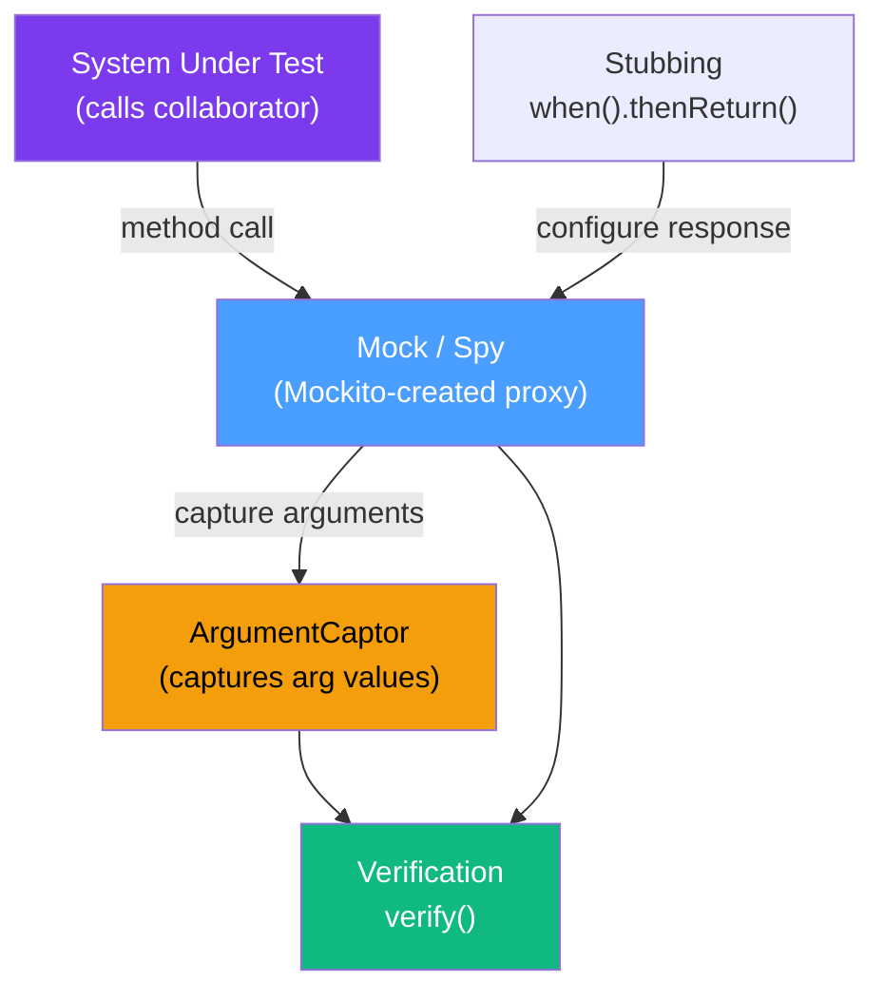

# 🎭 Mockito Advanced

> [!abstract] TL;DR
> Mockito beyond the basics: `ArgumentCaptor` captures arguments passed to mocked methods for detailed assertion, `doAnswer()` handles complex void-method behavior, `RETURNS_DEEP_STUBS` chains mock calls fluently, `@Spy` partially mocks real objects, `mockito-inline` mocks final classes and static methods, and strict stubbing (`STRICT_STUBS`) eliminates unnecessary stubs and catches mismatches early. These features cover 95% of real-world mocking scenarios.

## Intuition — analogy FIRST
Mockito's `ArgumentCaptor` is like an **undercover detective recording a conversation**. You tell Mockito "stand next to this method call and write down exactly what argument is passed." Later, you examine the transcript. Instead of just verifying "was the method called?" you can assert "was the method called with an object whose `status` field is `CONFIRMED` and whose `total` exceeds 100?" — precise, detailed verification without changing production code.

---

## How It Works



---

## Key Concepts / Details

### Setup: MockitoExtension (JUnit 5)

```java
import org.junit.jupiter.api.extension.ExtendWith;
import org.mockito.junit.jupiter.MockitoExtension;
import org.mockito.Mock;
import org.mockito.InjectMocks;
import org.mockito.Captor;
import org.mockito.Spy;

@ExtendWith(MockitoExtension.class)
class OrderServiceTest {

    @Mock
    private OrderRepository orderRepository;

    @Mock
    private EmailService emailService;

    @InjectMocks
    private OrderService orderService;  // mocks injected via constructor/field

    @Captor
    private ArgumentCaptor<Order> orderCaptor;
    // ...
}
```

### `ArgumentCaptor` — Capturing and Asserting Arguments

`ArgumentCaptor` is the go-to tool when you need to assert on the *content* of what was passed to a mock, not just that it was called:

```java
@Test
void shouldSaveOrderWithCorrectStatus() {
    // Arrange
    CreateOrderRequest request = new CreateOrderRequest("item-1", 2, 99.99);

    // Act
    orderService.createOrder(request);

    // Assert — capture what was passed to save()
    verify(orderRepository).save(orderCaptor.capture());
    Order savedOrder = orderCaptor.getValue();

    // Now assert on the captured object with full detail
    assertAll(
        () -> assertEquals("PENDING", savedOrder.getStatus()),
        () -> assertEquals(99.99, savedOrder.getTotal()),
        () -> assertNotNull(savedOrder.getCreatedAt()),
        () -> assertEquals("item-1", savedOrder.getItems().get(0).getProductId())
    );
}

// Capturing multiple invocations
@Test
void shouldSendEmailsToAllRecipients() {
    ArgumentCaptor<String> emailCaptor = ArgumentCaptor.forClass(String.class);

    orderService.notifyAll(List.of("a@example.com", "b@example.com", "c@example.com"));

    verify(emailService, times(3)).send(emailCaptor.capture(), anyString());
    List<String> recipients = emailCaptor.getAllValues();
    assertThat(recipients).containsExactlyInAnyOrder(
        "a@example.com", "b@example.com", "c@example.com"
    );
}
```

**Captor vs `argThat()` comparison:**

```java
// With ArgumentCaptor — separate capture and assertion
verify(repo).save(captor.capture());
Order order = captor.getValue();
assertEquals("CONFIRMED", order.getStatus());

// With argThat() inline — verification and assertion in one
verify(repo).save(argThat(o -> "CONFIRMED".equals(o.getStatus())));
// Issue: argThat() gives poor failure messages; Captor gives better diagnostics
```

Use `ArgumentCaptor` when:
- You need to assert multiple properties of the captured argument
- Better error messages are needed (captor + AssertJ gives the best output)
- You need all values from multiple invocations (`getAllValues()`)

### `ArgumentMatchers` — In-depth

```java
import static org.mockito.ArgumentMatchers.*;

@Test
void matcherExamples() {
    // any() — matches any argument (including null)
    when(service.find(any())).thenReturn(List.of());

    // any(Class<T>) — any non-null instance of T
    when(repo.save(any(Order.class))).thenReturn(savedOrder);

    // eq() — exact equality (use when mixing matchers)
    verify(service).update(eq(42L), any(UpdateRequest.class));

    // isNull() / isNotNull()
    when(cache.get(isNotNull())).thenReturn("hit");
    when(cache.get(isNull())).thenReturn(null);

    // argThat() — custom predicate
    when(repo.save(argThat(order -> order.getTotal() > 0)))
        .thenReturn(validOrder);

    // matches() — regex on String arguments
    when(service.findByCode(matches("[A-Z]{3}-\\d{4}")))
        .thenReturn(Optional.of(product));

    // startsWith() / endsWith() / contains()
    when(emailService.send(startsWith("admin@"), anyString()))
        .thenReturn(true);
}

// CRITICAL: mix matchers rule — if ANY argument uses a matcher,
// ALL arguments must use matchers
verify(service).findPage(eq(0), eq(20), anyString());  // correct
// verify(service).findPage(0, 20, anyString());  // ERROR — can't mix literal + matcher
```

### Deep Stubbing with `RETURNS_DEEP_STUBS`

For chained method calls on complex objects (use sparingly — often a design smell):

```java
// Without deep stubs — requires stubs for every intermediate object
Order mockOrder = mock(Order.class);
Customer mockCustomer = mock(Customer.class);
Address mockAddress = mock(Address.class);
when(mockOrder.getCustomer()).thenReturn(mockCustomer);
when(mockCustomer.getShippingAddress()).thenReturn(mockAddress);
when(mockAddress.getCity()).thenReturn("London");

// With RETURNS_DEEP_STUBS — chains mocked automatically
Order order = mock(Order.class, RETURNS_DEEP_STUBS);
when(order.getCustomer().getShippingAddress().getCity()).thenReturn("London");
// Now: order.getCustomer().getShippingAddress().getCity() == "London"
```

> [!warning] Deep stubs signal a design problem
> `RETURNS_DEEP_STUBS` violates the Law of Demeter. If you're chaining 3+ levels deep, consider whether the SUT should ask for objects rather than navigating through them. Use deep stubs only for DSL-style APIs (e.g., builder chains, query builders) where chaining is intentional.

### Strict Stubs — `STRICT_STUBS`

Strict stubbing catches common test maintenance problems:

```java
@ExtendWith(MockitoExtension.class)  // MockitoExtension uses STRICT_STUBS by default
class StrictStubbingTest {

    @Mock
    private OrderRepository repo;

    @Test
    void strictStubbingCatchesUnusedStubs() {
        // This stub is never used in the test body
        when(repo.findById(999L)).thenReturn(Optional.of(new Order()));

        // ↑ Mockito will FAIL the test with UnnecessaryStubbingException
        // This prevents "ghost" stubs that obscure test intent
    }

    @Test
    void strictStubbingCatchesStubbingArgumentMismatch() {
        when(repo.findById(42L)).thenReturn(Optional.of(new Order()));

        // Code under test calls repo.findById(99L) — different argument!
        // STRICT_STUBS detects this and fails: PotentialStubbingProblem
        orderService.process(99L);
    }
}

// Manual setup with explicit strictness:
@BeforeEach
void setup() {
    MockitoSession session = Mockito.mockitoSession()
        .initMocks(this)
        .strictness(Strictness.STRICT_STUBS)
        .startMocking();
}
```

### Mocking Final Classes and Static Methods (`mockito-inline`)

```xml
<!-- pom.xml — add mockito-inline for final/static mocking -->
<dependency>
    <groupId>org.mockito</groupId>
    <artifactId>mockito-inline</artifactId>
    <version>5.x.x</version>
    <scope>test</scope>
</dependency>
```

```java
// Mocking a final class
final class PaymentGateway {
    public String charge(double amount) {
        return "REAL_CHARGE_" + amount;
    }
}

@Test
void mockFinalClass() {
    PaymentGateway gateway = mock(PaymentGateway.class);  // works with mockito-inline!
    when(gateway.charge(100.0)).thenReturn("MOCK_CHARGE");

    assertEquals("MOCK_CHARGE", gateway.charge(100.0));
}

// Mocking static methods
@Test
void mockStaticMethod() {
    try (MockedStatic<UUID> mockedUUID = mockStatic(UUID.class)) {
        UUID fixedId = UUID.fromString("00000000-0000-0000-0000-000000000001");
        mockedUUID.when(UUID::randomUUID).thenReturn(fixedId);

        // Code that calls UUID.randomUUID() will get fixedId
        Order order = orderService.create(request);
        assertEquals(fixedId.toString(), order.getExternalId());
    }
    // MockedStatic is auto-closed — static mock is undone after try block
}

// Mocking LocalDateTime.now() — common need
@Test
void mockCurrentTime() {
    LocalDateTime fixedTime = LocalDateTime.of(2026, 7, 26, 10, 0);
    try (MockedStatic<LocalDateTime> mocked = mockStatic(LocalDateTime.class)) {
        mocked.when(LocalDateTime::now).thenReturn(fixedTime);

        Order order = orderService.createOrder(request);
        assertEquals(fixedTime, order.getCreatedAt());
    }
}
```

### `InOrder` — Ordered Verification

```java
@Test
void shouldProcessInCorrectOrder() {
    orderService.processWithPayment(order);

    InOrder inOrder = inOrder(paymentService, inventoryService, emailService);
    inOrder.verify(paymentService).charge(order.getTotal());
    inOrder.verify(inventoryService).reserve(order.getItems());
    inOrder.verify(emailService).sendConfirmation(order.getCustomerEmail());
    // Verifies they were called in THIS exact sequence
}
```

### `doAnswer()` — Complex Void Method Behavior

For void methods or complex responses based on inputs:

```java
@Test
void doAnswerExample() {
    // Simulate async callback
    doAnswer(invocation -> {
        OrderRequest req = invocation.getArgument(0);
        Callback<Order> callback = invocation.getArgument(1);

        // Simulate async completion
        Order result = new Order(req.getTotal());
        callback.onSuccess(result);
        return null;  // void method
    }).when(asyncService).processAsync(any(), any());

    // Test code that uses the callback
    List<Order> results = new ArrayList<>();
    asyncService.processAsync(request, results::add);
    assertFalse(results.isEmpty());
}

// Simulating side effects on passed collections
doAnswer(invocation -> {
    List<String> list = invocation.getArgument(0);
    list.add("injected-item");  // modify the argument
    return null;
}).when(processor).populate(anyList());
```

### Spies — Partial Mocking Real Objects

`@Spy` wraps a real object — real methods are called unless explicitly stubbed:

```java
@ExtendWith(MockitoExtension.class)
class SpyExample {

    @Spy
    private ArrayList<String> realList = new ArrayList<>();

    @Test
    void spyCallsRealMethods() {
        // Real method call
        realList.add("hello");
        realList.add("world");

        // Stub only the size method
        doReturn(100).when(realList).size();

        // add() was real — items are there
        assertTrue(realList.contains("hello"));
        // size() is stubbed
        assertEquals(100, realList.size());
    }
}

// Spy on complex service — stub only one method
@Spy
private OrderService orderService = new OrderService(realRepo);

@Test
void stubOnlyPricingMethod() {
    doReturn(BigDecimal.ZERO).when(orderService).calculateDiscount(any());

    // All other methods of orderService are REAL
    Order result = orderService.processOrder(request);
    assertEquals(BigDecimal.ZERO, result.getDiscount());
}
```

> [!tip] Spy vs Mock
> - `mock()` creates a "blank" object — all methods return defaults (`null`, `0`, `false`) unless stubbed
> - `spy()` wraps a real object — real methods run unless overridden with `doReturn()` / `doThrow()`
> - Use `doReturn()` (not `when().thenReturn()`) with spies to avoid calling the real method during setup

### Verification Modes

```java
// Exact count
verify(service, times(3)).send(any());

// At least / at most
verify(service, atLeast(1)).send(any());
verify(service, atMost(5)).send(any());

// Never called
verify(emailService, never()).sendErrorAlert(any());

// No more interactions after verified ones
verify(service).findById(42L);
verifyNoMoreInteractions(service);

// Absolutely no interactions at all
verifyNoInteractions(loggingService);
```

---

## Real-World Notes
- Strict stubbing (default in `MockitoExtension`) is a significant quality-of-life improvement — it prevents "dead" stubs that accumulate over time and make tests misleading
- `mockito-inline` is necessary for modern codebases that use Kotlin data classes (which compile to final), Java records, or utility classes with static methods (`LocalDate.now()`, `UUID.randomUUID()`)
- Prefer `ArgumentCaptor` over `argThat()` for multi-property assertions — the failure messages are dramatically better

---

## Common Pitfalls
- Using `when(spy.method()).thenReturn(x)` with spies — this calls the REAL method before stubbing happens. Always use `doReturn(x).when(spy).method()` for spies
- Calling `verify()` before the code under test runs — common mistake when setting up too eagerly
- Over-mocking: mocking everything (including `ArrayList`, `String`) makes tests brittle and doesn't test real behavior. Mock only external dependencies (repositories, HTTP clients, email services)
- `UnnecessaryStubbingException` from strict stubs when a stub is conditionally needed — restructure the test or use `lenient().when(...)` for justifiably flexible stubs

---

## Related Concepts
- [[JUnit5_Advanced]] — `@ExtendWith(MockitoExtension.class)` connects Mockito and JUnit 5
- [[AssertJ_Matchers]] — use AssertJ with captured arguments for expressive assertions
- [[Spock_Framework]] — Spock has built-in mocking that competes with Mockito

---

## Review Questions
1. When would you use `ArgumentCaptor` instead of `argThat()`? What are the trade-offs?
2. What problem does strict stubbing (`STRICT_STUBS`) solve? How does `MockitoExtension` handle this?
3. Explain the difference between `mock()` and `spy()`. When would you choose a spy?
4. Why must you use `doReturn()` instead of `when().thenReturn()` when stubbing a spy method?
5. How do you mock a static method in Mockito? What library is required and why must it be auto-closed?
6. What does `InOrder` verification test that regular `verify()` does not?

## Sources
- Mockito documentation: https://javadoc.io/doc/org.mockito/mockito-core/latest/
- Mockito GitHub: https://github.com/mockito/mockito
- "Mockito Cookbook" by Marcin Grzejszczak

#java #testing #mockito #intermediate
