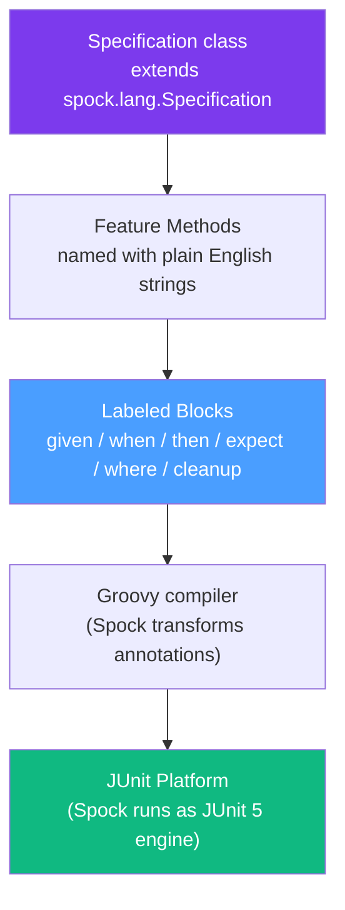

# 🎵 Spock Framework

> [!abstract] TL;DR
> Spock is a testing framework written in Groovy that runs on the JVM and integrates seamlessly with Java projects. Its `given/when/then` block structure produces exceptionally readable specs, its `where:` block enables concise data-driven testing, and its built-in mocking (`Mock()`, `Stub()`, `Spy()`) competes directly with Mockito. Spock's distinguishing feature is that tests read like English specifications, not code.

## Intuition — analogy FIRST
Spock is like writing a **formal specification document** that also runs as a test. Imagine writing: "Given a cart with 3 items, when the user checks out, then an order is created with status PENDING and the cart is cleared." In JUnit, this narrative lives only in comments. In Spock, the `given:`, `when:`, `then:` labels ARE the structure of the test — the framework enforces them, and test reports display them verbatim. The test IS the specification.

---

## How It Works



---

## Key Concepts / Details

### Setup

```xml
<!-- pom.xml -->
<dependency>
    <groupId>org.spockframework</groupId>
    <artifactId>spock-core</artifactId>
    <version>2.4-M4-groovy-4.0</version>
    <scope>test</scope>
</dependency>
<!-- Groovy for compiling Spock specs -->
<dependency>
    <groupId>org.apache.groovy</groupId>
    <artifactId>groovy</artifactId>
    <version>4.0.x</version>
    <scope>test</scope>
</dependency>
<!-- For Spring Boot integration -->
<dependency>
    <groupId>org.spockframework</groupId>
    <artifactId>spock-spring</artifactId>
    <version>2.4-M4-groovy-4.0</version>
    <scope>test</scope>
</dependency>
```

```groovy
// Maven Groovy compiler plugin to compile .groovy in test/groovy
// Build plugin: gmavenplus-plugin or groovy-eclipse-compiler
```

### Specification Structure

```groovy
import spock.lang.*

class OrderServiceSpec extends Specification {

    // Shared fixtures (declared at class level)
    OrderRepository orderRepository = Mock()
    EmailService emailService = Mock()
    OrderService orderService = new OrderService(orderRepository, emailService)

    // setup() — runs before each feature method (like @BeforeEach)
    def setup() {
        // initialize common state
    }

    // setupSpec() — runs once before all features (like @BeforeAll)
    def setupSpec() {
        // expensive one-time setup
    }

    // cleanup() — runs after each feature method
    def cleanup() {
        // release resources
    }

    // cleanupSpec() — runs once after all features
    def cleanupSpec() { }
}
```

### Feature Methods: `given/when/then`

```groovy
class OrderServiceSpec extends Specification {

    OrderRepository orderRepository = Mock()
    OrderService orderService = new OrderService(orderRepository)

    def "should create order with PENDING status"() {
        given: "a valid order request"
        def request = new CreateOrderRequest("item-1", 2, 99.99)
        def savedOrder = new Order(id: 1L, status: "PENDING", total: 99.99)
        orderRepository.save(_ as Order) >> savedOrder  // stubbing

        when: "the order service creates the order"
        def result = orderService.create(request)

        then: "an order is returned with PENDING status"
        result.id == 1L
        result.status == "PENDING"
        result.total == 99.99
        1 * orderRepository.save(_ as Order)  // verify called once
    }

    def "should throw exception when total is negative"() {
        given:
        def request = new CreateOrderRequest("item-1", 2, -5.0)

        when:
        orderService.create(request)

        then:
        thrown(IllegalArgumentException)
        // OR: with message
        def ex = thrown(IllegalArgumentException)
        ex.message == "Total must be positive"
    }
}
```

### `expect` Block — Single-Line Truth Assertions

```groovy
def "Math.max works for positive numbers"() {
    expect: "the larger value is returned"
    Math.max(3, 5) == 5
    Math.max(-1, 0) == 0
    Math.max(10, 10) == 10
}

// expect is also used with where (data-driven without when/then)
def "addition is commutative"() {
    expect: "a + b == b + a"
    a + b == b + a

    where:
    a | b
    1 | 2
    3 | 5
    -1 | 1
}
```

### Data-Driven Tests with `where:` Block

This is where Spock truly shines over JUnit's `@ParameterizedTest`:

```groovy
@Unroll  // creates a separate test entry per row in the report
def "classify age: #name is #expectedCategory"() {
    expect:
    AgeClassifier.classify(age) == expectedCategory

    where:
    name    | age | expectedCategory
    "Alice" | 25  | "ADULT"
    "Bob"   | 17  | "MINOR"
    "Carol" | 65  | "SENIOR"
    "Dave"  | 0   | "INFANT"
}

// The #name, #age in the method name become values from the table
// Test report shows: "classify age: Alice is ADULT", "classify age: Bob is MINOR", etc.
```

```groovy
// Using pipe | for single variable or >> for derived values
def "square root of #number is approximately #root"() {
    expect:
    Math.sqrt(number) == root

    where:
    number || root
    1      || 1.0
    4      || 2.0
    9      || 3.0
    16     || 4.0
}

// Derived values using Groovy expressions
def "discount is applied correctly"() {
    given:
    def cart = new Cart(items: items)

    expect:
    cart.total() == expectedTotal

    where:
    items                           | discount | expectedTotal
    [new Item(price: 100)] | 0.10   | 90.0
    [new Item(price: 50)]  | 0.0    | 50.0
    [new Item(price: 200)] | 0.20   | 160.0
}
```

### Spock Mocking: `Mock()`, `Stub()`, `Spy()`

Spock has its own mocking system — no Mockito required:

```groovy
class PaymentServiceSpec extends Specification {

    // Mock — full mock with interaction verification
    PaymentGateway gateway = Mock()

    // Stub — only returns values, no interaction verification
    PricingService pricing = Stub()

    // Spy — wraps real object, real methods by default
    AuditService auditService = Spy(new AuditServiceImpl())

    def "payment is processed through gateway"() {
        given:
        pricing.getPrice("item-1") >> 99.99  // Stub returns value

        when:
        paymentService.charge("item-1", 1)

        then:
        // Interaction-based verification
        1 * gateway.charge(99.99)   // exactly once, exact argument
        0 * gateway.refund(_)       // never called
    }
}
```

### Interaction-Based Testing (Spock's Mocking Syntax)

Spock's interaction syntax is significantly more readable than Mockito's `verify()`:

```groovy
then:
// Cardinality _ argument syntax
1 * service.send("user@example.com")    // exactly once
2 * service.send(_)                      // exactly twice, any argument
(1..3) * service.send(_)                // between 1 and 3 times
_ * service.log(_)                       // any number of times (including 0)
0 * service.error(_)                     // never called

// Argument matching
1 * repo.save(_ as Order)               // any Order instance
1 * repo.save({ it.total > 0 })         // Order with positive total
1 * repo.findById(42L)                  // exact value

// Stubbing in interaction
1 * gateway.charge(_) >> "TXN-12345"    // stub and verify in one line

// Exception from mock
1 * service.process(_) >> { throw new ServiceException("failed") }
```

### Combined Stubbing and Verification

```groovy
def "should retry on transient failure"() {
    given:
    def order = new Order(id: 1L, total: 100.0)

    when:
    paymentService.processWithRetry(order)

    then:
    // Fail twice, succeed on third attempt
    2 * gateway.charge(_) >> { throw new TransientException() }
    1 * gateway.charge(_) >> "TXN-999"

    and:
    0 * _._  // no other interactions on any mock (strict verification)
}
```

### Using Spock with Spring Boot

```groovy
import org.springframework.boot.test.context.SpringBootTest
import org.spockframework.spring.SpringBean
import spock.lang.Specification

@SpringBootTest
class OrderControllerIntegrationSpec extends Specification {

    @Autowired
    MockMvc mockMvc

    @SpringBean  // replaces a Spring bean with a Spock mock
    OrderService orderService = Mock()

    def "GET /orders/{id} returns 200 for existing order"() {
        given:
        def order = new OrderDto(id: 42L, status: "PENDING", total: 99.99)
        orderService.findById(42L) >> Optional.of(order)

        when:
        def result = mockMvc.perform(get("/orders/42"))

        then:
        result.andExpect(status().isOk())
              .andExpect(jsonPath('$.id').value(42))
              .andExpect(jsonPath('$.status').value("PENDING"))
    }

    def "GET /orders/{id} returns 404 for missing order"() {
        given:
        orderService.findById(99L) >> Optional.empty()

        when:
        def result = mockMvc.perform(get("/orders/99"))

        then:
        result.andExpect(status().isNotFound())
    }
}
```

### `@Subject` — Clarity on What's Being Tested

```groovy
class OrderServiceSpec extends Specification {

    @Subject  // marks the system under test — improves reports
    OrderService orderService = new OrderService(Mock(OrderRepository))

    def "feature method..."() { /* ... */ }
}
```

### Spock vs JUnit 5 + Mockito

| Feature | Spock | JUnit 5 + Mockito |
|---------|-------|-------------------|
| Language | Groovy (JVM) | Java |
| Readability | Excellent (labeled blocks) | Good |
| Data-driven | `where:` table (elegant) | `@ParameterizedTest` + `@MethodSource` |
| Mocking | Built-in (`Mock()`, `Stub()`, `Spy()`) | Mockito (separate library) |
| Interaction verification | `1 * mock.method(arg)` (in `then:`) | `verify(mock).method(arg)` |
| Exception testing | `thrown(ExceptionType)` in `then:` | `assertThrows(ExceptionType, () -> ...)` |
| Spring integration | `spock-spring` + `@SpringBean` | `@SpringBootTest` + `@MockBean` |
| IDE support | Good (IntelliJ) | Excellent (all IDEs) |
| Groovy learning curve | Moderate | None (pure Java) |
| CI/Build | Requires Groovy compiler | Simpler |
| Community size | Smaller | Larger |

**Choose Spock when:**
- Your team is comfortable with Groovy
- You're writing many data-driven tests (the `where:` table is significantly more readable)
- Spec-style test names improve communication with non-developers

**Choose JUnit 5 + Mockito when:**
- Your team is Java-only and learning Groovy has a cost
- You want maximum IDE support and tooling
- You're working in a Spring Boot project with an established JUnit convention

---

## Real-World Notes
- Spock is especially popular in Grails (Groovy web framework) projects and was historically common in Gradle build scripts
- Spock 2.x runs on the JUnit 5 platform, so CI systems that run JUnit 5 tests run Spock with zero additional configuration
- The `@Unroll` annotation is deprecated in Spock 2.2+ — all feature methods with `where:` blocks are automatically unrolled

---

## Common Pitfalls
- Stubbing interactions after the `when:` block — stubs (`>>`) must be in the `given:` block or at the start of `then:`; putting them after `when:` means they apply too late
- Forgetting that Spock interaction verification happens at the end of the `then:` block — no need to call `verify()` manually
- Returning `null` from a `Mock()` by default — unlike Mockito's `RETURNS_DEFAULTS`, unspecified Spock mock interactions return `null` for objects, `0` for numbers. This can cause NPEs in tests if not expected.
- Mixing Spock mocks and Mockito mocks in the same test — possible but confusing; pick one

---

## Related Concepts
- [[JUnit5_Advanced]] — JUnit 5 as the runner for Spock; comparison point
- [[Mockito_Advanced]] — Mockito's equivalent mocking approach
- [[Cucumber_BDD]] — another BDD-style approach, but in Java with Gherkin

---

## Review Questions
1. What is the purpose of each labeled block in Spock: `given`, `when`, `then`, `expect`, `where`, `cleanup`?
2. How does Spock's `where:` block differ from JUnit 5's `@CsvSource`? Write the same data-driven test in both.
3. Explain Spock's cardinality syntax: `1 * mock.method(arg)`. What does `_ * mock.method(_)` mean?
4. What is the difference between `Mock()`, `Stub()`, and `Spy()` in Spock?
5. How would you use `@SpringBean` in a Spock specification to replace a production Spring bean?
6. When would you recommend Spock over JUnit 5 + Mockito for a team already using Java?

## Sources
- Spock Framework documentation: https://spockframework.org/spock/docs/
- Spock GitHub: https://github.com/spockframework/spock
- "Java Testing with Spock" by Konstantinos Kapelonis (Manning)

#java #testing #spock #groovy #bdd #intermediate
