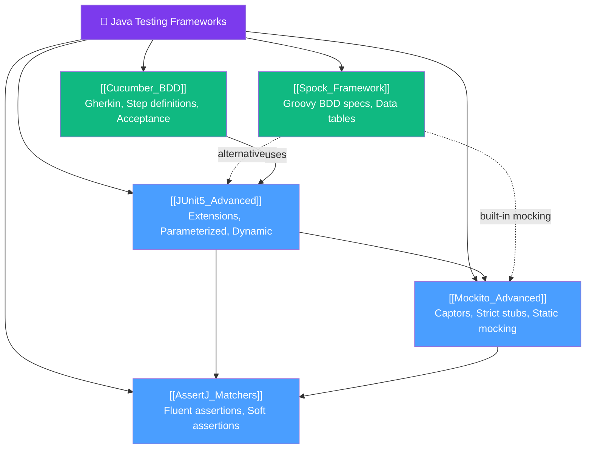
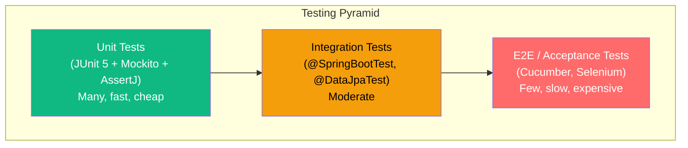

# 🗺️ Java Testing Frameworks — Map of Content

> [!abstract] What This Section Covers
> This section covers the professional Java testing ecosystem in depth. Beyond basic JUnit and Mockito, you'll learn the advanced features that make tests expressive, maintainable, and powerful: JUnit 5's extension model and parameterized tests, Mockito's argument captors and strict stubs, AssertJ's fluent assertions, Spock's BDD-style specification testing in Groovy, and Cucumber for business-readable acceptance tests. Mastering these tools is the difference between test code that merely checks correctness and test code that serves as living documentation.

## Concept Map

## Learning Path
1. [[JUnit5_Advanced]] — master JUnit 5's extension model, parameterized tests, and lifecycle before all else
2. [[Mockito_Advanced]] — argument captors, strict stubs, and final/static mocking are daily tools
3. [[AssertJ_Matchers]] — replace all JUnit assertions with AssertJ for dramatically better error messages
4. [[Spock_Framework]] — learn Spock as an alternative test style; excellent for data-driven tests
5. [[Cucumber_BDD]] — learn BDD and acceptance testing with Gherkin when working with business stakeholders

## All Notes at a Glance
| Note | Difficulty | What You'll Learn |
|------|------------|-------------------|
| [[JUnit5_Advanced]] | Intermediate | Extension model, `@MethodSource`, `@TestFactory`, `@Nested`, parallel execution |
| [[Mockito_Advanced]] | Intermediate | `ArgumentCaptor`, deep stubs, `mockito-inline`, spy partial mocking |
| [[AssertJ_Matchers]] | Beginner | Fluent assertions, collection/exception/string assertions, soft assertions |
| [[Spock_Framework]] | Intermediate | Given/when/then, where-blocks, Spock mocking, Spring integration |
| [[Cucumber_BDD]] | Intermediate | Gherkin syntax, step definitions, DataTable, Spring integration, hooks |

## Key Questions This Section Answers
- How do I write a JUnit 5 extension that injects custom objects into test methods?
- What is `ArgumentCaptor` and when should I use it over `verify()` with matchers?
- How does `usingRecursiveComparison()` in AssertJ compare to equals-based assertions?
- When should I choose Spock over JUnit 5 + Mockito?
- How do I wire Cucumber with Spring Boot and run acceptance tests in CI?
- What are the anti-patterns in Cucumber/Gherkin that make tests brittle?

## Testing Pyramid Reminder

## Related Sections
- [[_MOC_Java_Master|↑ Java Master MOC]]

#java #MOC #testing
